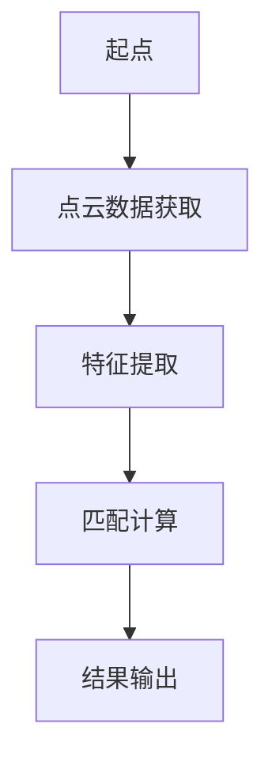
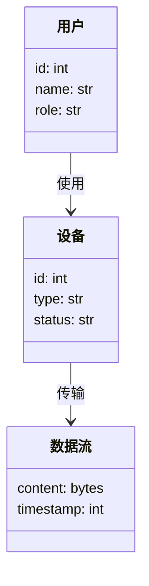
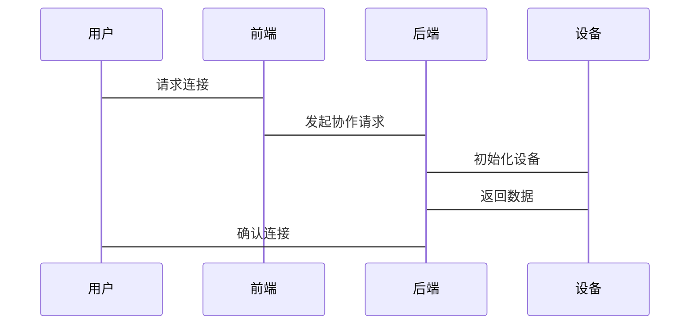

                 


# 《企业估值中的AR工业远程协作系统评估》

---

## 关键词：
- 增强现实（AR）
- 工业远程协作
- 系统评估
- 算法原理
- 系统架构

---

## 摘要：
本文深入探讨了AR工业远程协作系统在企业估值中的应用与评估方法。通过分析系统的背景、核心概念、算法原理、系统架构及实际案例，本文为读者提供了从理论到实践的全面解读，帮助企业更好地理解和应用AR技术，提升工业协作效率和企业估值。

---

# 第1章: AR工业远程协作系统概述

## 1.1 AR技术的起源与发展
### 1.1.1 增强现实技术的基本概念
增强现实（Augmented Reality, AR）是一种通过计算机技术将虚拟信息叠加到真实环境中的技术，使用户能够在现实世界中看到数字信息。AR的核心在于虚实结合，通过摄像头、传感器和显示设备实现。

### 1.1.2 AR技术在工业领域的应用现状
工业领域是AR技术的重要应用领域。从设备维护到生产协作，AR正在改变工业生产的方式。例如，AR设备可以帮助工人快速定位设备故障，提高维修效率。

### 1.1.3 工业远程协作的定义与特点
工业远程协作是指通过AR技术，实现不同地点的人员协同工作。其特点是实时性、互动性和多设备协同。

---

## 1.2 工业远程协作的核心问题
### 1.2.1 工业协作中的问题背景
工业生产中，设备分布广泛，技术人员难以快速到达现场。远程协作可以有效解决这一问题。

### 1.2.2 远程协作的核心挑战
- **延迟问题**：网络延迟会影响协作体验。
- **设备兼容性**：不同设备间的协作需要兼容性支持。
- **数据安全**：远程协作中的数据传输需要高度安全。

### 1.2.3 AR技术在协作中的作用
AR通过提供实时的三维信息，帮助协作人员更好地理解和解决问题。

---

## 1.3 AR工业远程协作系统的边界与外延
### 1.3.1 系统的边界定义
AR工业远程协作系统仅限于提供协作工具和环境，不涉及企业的具体业务流程。

### 1.3.2 系统的外延与扩展
系统可以通过扩展功能模块，如数据分析、预测维护等，进一步提升企业价值。

### 1.3.3 系统与相关技术的关系
AR系统与其他技术（如物联网、云计算）密切相关，共同构建工业4.0的生态系统。

---

## 1.4 本章小结
本章介绍了AR技术的基本概念、在工业领域的应用现状以及工业远程协作的核心问题。通过分析系统的边界和外延，读者可以更好地理解AR工业远程协作系统的作用和价值。

---

# 第2章: AR工业远程协作系统的核心概念与联系

## 2.1 核心概念原理
### 2.1.1 虚实结合的协作机制
AR系统通过将虚拟信息叠加到真实环境中，帮助协作人员更好地理解问题。

### 2.1.2 实时互动的系统特性
系统能够实时响应用户的操作，确保协作的流畅性。

### 2.1.3 多设备协同的工作模式
系统支持多种设备，如手机、平板和AR头盔，确保协作的灵活性。

---

## 2.2 核心概念属性对比
### 2.2.1 系统功能对比表格
| 功能模块       | 描述                                         | 优缺点                              |
|----------------|----------------------------------------------|-------------------------------------|
| 点云处理       | 处理三维空间数据，实现精确匹配               | 高计算需求，但精度高               |
| 实时渲染       | 瞬时显示数据，提升用户体验                   | 带宽需求高，但用户体验好           |
| 多设备协同     | 支持多种设备，确保协作灵活性                 | 系统复杂度高，但灵活性强           |

---

## 2.3 ER实体关系图
```mermaid
er
  actor: 用户
  system: AR协作系统
  device: 终端设备
  data: 数据流
  relation: 用户通过设备与系统交互，数据流在系统和设备间流动
```

---

## 2.4 本章小结
本章详细阐述了AR工业远程协作系统的核心概念，包括虚实结合的协作机制、实时互动的系统特性和多设备协同的工作模式。通过功能对比和ER实体关系图，读者可以更好地理解系统的核心要素。

---

# 第3章: AR工业远程协作系统的算法原理

## 3.1 点云处理算法
### 3.1.1 点云匹配算法
点云匹配算法用于将现实环境中的三维点云数据与虚拟模型匹配，确保虚实结合的准确性。

#### 算法流程：
1. 点云数据获取。
2. 特征提取。
3. 匹配计算。
4. 结果输出。



### 3.1.2 点云匹配的数学模型
点云匹配的目标函数如下：
$$ \text{目标函数} = \sum_{i=1}^{n} (x_i - y_i)^2 $$

---

## 3.2 实时渲染算法
### 3.2.1 基于OpenGL的渲染流程
实时渲染是AR系统的重要组成部分，用于将虚拟信息叠加到真实环境中。

#### 代码实现：
```python
import OpenGL.GL as gl

def render():
    gl.glClearColor(0.0, 0.0, 0.0, 1.0)
    gl.glClear(gl.GL_COLOR_BUFFER_BIT | gl.GL_DEPTH_BUFFER_BIT)
```

---

## 3.3 本章小结
本章详细讲解了AR工业远程协作系统的算法原理，包括点云处理算法和实时渲染算法。通过数学模型和代码实现，读者可以更好地理解算法的实现细节。

---

# 第4章: AR工业远程协作系统的数据建模与交互设计

## 4.1 系统功能设计
### 4.1.1 领域模型类图


### 4.1.2 功能模块设计
系统功能模块包括用户管理、设备管理、数据流处理和协作管理。

---

## 4.2 系统架构设计
### 4.2.1 系统架构图


---

## 4.3 系统交互设计
### 4.3.1 系统交互序列图


---

## 4.4 本章小结
本章通过领域模型类图、系统架构图和交互序列图，详细展示了AR工业远程协作系统的数据建模与交互设计。

---

# 第5章: 项目实战——AR工业远程协作系统实现

## 5.1 环境安装与配置
### 5.1.1 开发环境安装
安装必要的开发工具，如Python、OpenGL库、AR开发框架等。

### 5.1.2 依赖管理
使用虚拟环境管理依赖，确保开发环境的一致性。

---

## 5.2 核心代码实现
### 5.2.1 点云处理代码
```python
import numpy as np

def point_cloud_matching(real_points, virtual_points):
    # 特征提取
    features_real = np.mean(real_points, axis=0)
    features_virtual = np.mean(virtual_points, axis=0)
    # 匹配计算
    distance = np.linalg.norm(features_real - features_virtual)
    return distance
```

### 5.2.2 实时渲染代码
```python
import OpenGL.GL as gl

def render():
    gl.glClearColor(0.0, 0.0, 0.0, 1.0)
    gl.glClear(gl.GL_COLOR_BUFFER_BIT | gl.GL_DEPTH_BUFFER_BIT)
    # 绘制虚拟模型
    gl.glColor3f(1.0, 0.0, 0.0)
    gl.glBegin(gl.GL_LINES)
    # 点云数据绘制
    for point in points:
        gl.glVertex3fv(point)
    gl.glEnd()
```

---

## 5.3 案例分析与解读
### 5.3.1 案例背景
某制造企业希望通过AR系统实现远程设备维护。

### 5.3.2 系统实现
通过点云处理和实时渲染，系统能够快速定位设备故障，提供维修指导。

### 5.3.3 实际效果
系统显著提高了设备维护效率，减少了维修成本。

---

## 5.4 本章小结
本章通过实际项目案例，展示了AR工业远程协作系统的实现过程和实际效果。

---

# 第6章: 最佳实践与系统优化

## 6.1 系统优化建议
### 6.1.1 性能优化
优化点云处理算法，减少计算延迟。

### 6.1.2 安全性提升
采用加密通信，确保数据传输安全。

### 6.1.3 可扩展性设计
设计模块化架构，便于功能扩展。

---

## 6.2 本章小结
本章总结了AR工业远程协作系统的最佳实践，包括性能优化、安全性提升和可扩展性设计。

---

## 总结
本文全面介绍了AR工业远程协作系统的背景、核心概念、算法原理、系统架构及实际应用。通过理论分析和实践案例，读者可以更好地理解和应用AR技术，提升工业协作效率和企业估值。

---

## 作者：
AI天才研究院/AI Genius Institute  
禅与计算机程序设计艺术/Zen And The Art of Computer Programming

