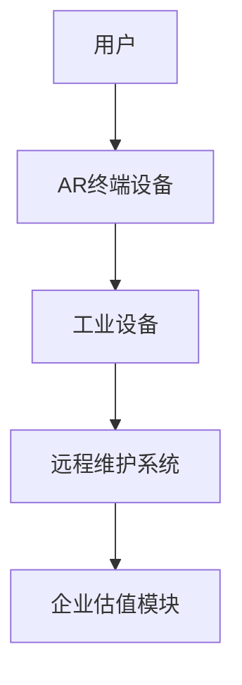
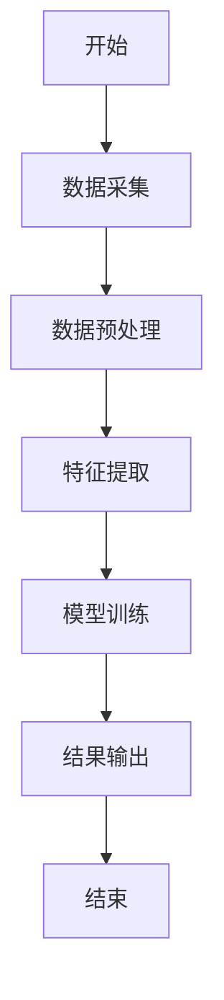
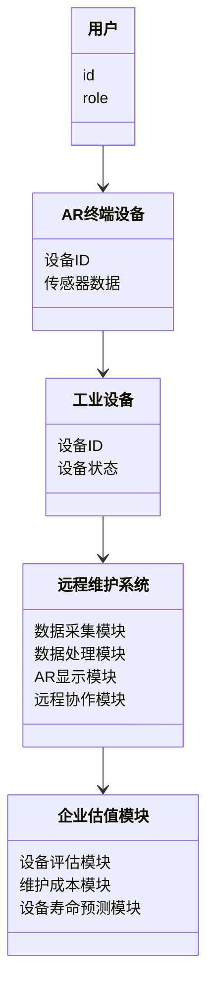
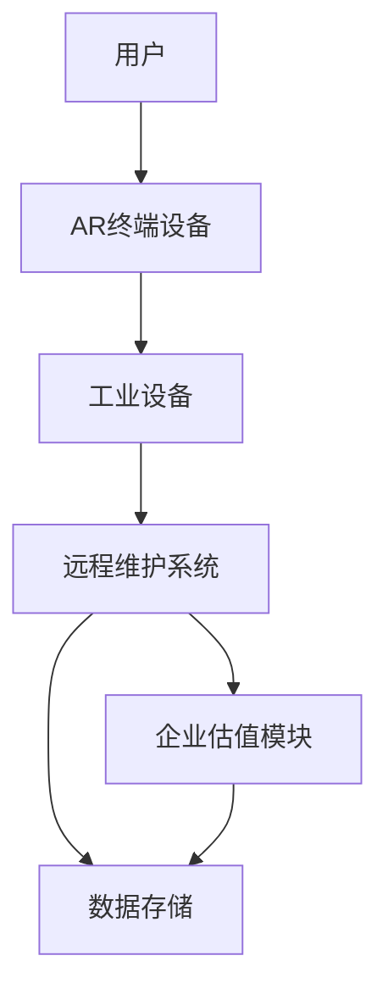
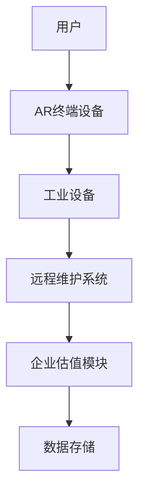

                 


# 企业估值中的AR工业远程维护系统评估

## 关键词：
AR技术、工业远程维护、企业估值、系统评估、增强现实

## 摘要：
本文将详细探讨增强现实（AR）技术在工业远程维护系统中的应用，特别是在企业估值中的评估方法。通过分析AR技术的核心原理、系统架构、算法实现及其在工业远程维护中的具体应用，本文旨在为企业提供一种基于AR技术的高效解决方案，以优化工业设备的远程维护和企业估值流程。文章将从背景介绍、核心概念、算法原理、系统分析与架构设计、项目实战到最佳实践等方面进行详细阐述，最后总结AR技术在该领域的潜力和未来发展方向。

---

# 第一部分: 企业估值中的AR工业远程维护系统概述

## 第1章: AR工业远程维护系统背景与问题背景

### 1.1 AR技术在工业远程维护中的应用背景

#### 1.1.1 工业远程维护的传统方法与局限性
传统的工业远程维护方法通常依赖于现场工程师或技术人员进行设备检查和维护。这种方法不仅耗时，且成本较高，尤其是在偏远地区或复杂工业环境中，人员的到达和操作效率受到限制。此外，传统方法难以实现对设备状态的实时监控和精准诊断，导致维护效率低下，维护成本居高不下。

#### 1.1.2 增强现实技术的核心优势
增强现实（AR）技术通过将虚拟信息叠加到真实环境中，为工业远程维护提供了新的解决方案。AR技术能够实时显示设备的三维模型、故障点定位、维修步骤等信息，帮助维护人员快速理解设备状态并进行精准操作。此外，AR技术还可以实现远程协作，专家可以通过AR界面实时指导现场人员完成复杂任务，从而提高维护效率并降低维护成本。

#### 1.1.3 企业估值中的AR技术应用潜力
在企业估值过程中，AR技术可以用于评估工业设备的实时状态、预测设备寿命、分析设备性能对整体企业价值的影响。通过AR技术，企业可以更准确地评估设备的健康状况，从而为估值提供更可靠的数据支持。

### 1.2 问题背景与问题描述

#### 1.2.1 工业设备远程维护的痛点
工业设备的远程维护面临以下主要问题：
- **设备状态实时监控不足**：传统方法难以实现对设备运行状态的实时监控。
- **维护效率低下**：现场工程师需要花费大量时间进行设备检查和故障诊断。
- **维护成本高昂**：频繁的现场维护和专家派遣增加了企业的运营成本。
- **数据孤岛问题**：设备数据分散，难以形成统一的评估体系。

#### 1.2.2 企业估值中的关键挑战
企业在估值过程中面临以下关键挑战：
- **设备状态评估不准确**：缺乏实时数据支持，导致估值结果偏差。
- **设备寿命预测困难**：传统方法难以精确预测设备的剩余寿命。
- **维护成本难以量化**：无法准确评估设备维护对企业整体成本的影响。

#### 1.2.3 AR技术如何解决这些问题
AR技术可以通过以下方式解决上述问题：
- **实时数据叠加**：通过AR技术，设备的实时状态数据可以叠加到设备模型中，帮助维护人员快速识别故障点。
- **远程协作**：专家可以通过AR界面实时指导现场人员完成复杂任务，提高维护效率。
- **数据整合与分析**：AR技术可以将设备数据与企业估值模型相结合，提供更准确的估值支持。

### 1.3 问题解决与边界定义

#### 1.3.1 AR技术在工业远程维护中的解决方案
AR技术在工业远程维护中的解决方案包括：
- **实时设备监控**：通过AR技术实时显示设备的运行状态和故障信息。
- **远程协作**：专家通过AR界面远程指导现场维护人员完成设备维修。
- **数据整合与分析**：将设备数据与企业估值模型结合，提供更准确的估值支持。

#### 1.3.2 系统的边界与外延
系统的边界包括：
- **设备端**：设备传感器数据的采集和传输。
- **用户端**：现场维护人员和远程专家通过AR设备进行操作。
- **企业端**：企业估值系统和数据分析平台。

系统的外延包括：
- **扩展功能**：设备预测性维护、维护成本优化、设备寿命预测等。
- **数据服务**：与企业的ERP、CRM等系统集成，提供更全面的估值支持。

#### 1.3.3 核心概念与系统组成要素
系统组成要素包括：
- **AR终端设备**：用于现场维护人员和远程专家的设备，如AR眼镜、平板电脑等。
- **工业设备**：需要进行远程维护的设备，如机械臂、生产线设备等。
- **远程维护系统**：用于数据传输、设备监控和远程协作的系统。
- **企业估值模块**：用于设备状态评估、设备寿命预测和企业估值的模块。

### 1.4 本章小结
本章主要介绍了AR技术在工业远程维护中的应用背景、问题背景以及解决方案。通过分析工业远程维护和企业估值中的痛点，提出了AR技术的核心优势和系统组成要素，为后续章节的详细分析奠定了基础。

---

## 第2章: AR工业远程维护系统的核心概念与联系

### 2.1 核心概念原理

#### 2.1.1 增强现实技术的实现原理
AR技术的实现主要依赖于以下几个关键步骤：
1. **数据采集**：通过设备传感器采集设备的实时数据，如温度、振动、压力等。
2. **数据处理**：对采集到的数据进行预处理和特征提取，生成设备的健康状态指标。
3. **AR显示**：将设备的健康状态指标叠加到设备模型中，通过AR终端设备进行显示。

#### 2.1.2 工业远程维护系统的功能模块
工业远程维护系统的功能模块包括：
- **数据采集模块**：负责采集设备的实时数据。
- **数据处理模块**：对数据进行预处理和特征提取。
- **AR显示模块**：将处理后的数据叠加到设备模型中，通过AR终端设备进行显示。
- **远程协作模块**：支持专家与现场人员的远程协作。

#### 2.1.3 系统评估的关键指标
系统评估的关键指标包括：
- **设备状态评估的准确性**：设备健康状态的评估是否准确。
- **维护效率提升幅度**：AR技术是否显著提高了维护效率。
- **维护成本降低幅度**：AR技术是否显著降低了维护成本。

### 2.2 核心概念属性特征对比

#### 2.2.1 AR技术与传统远程维护技术的对比
| 特性                | AR技术                     | 传统远程维护技术       |
|---------------------|---------------------------|-----------------------|
| 数据可视化          | 高度可视化                 | 依赖文本或图表         |
| 维护效率            | 高                          | 低                    |
| 成本                 | 较低                       | 较高                  |
| 实时性              | 高                          | 低                    |
| 精准性              | 高                          | 低                    |

#### 2.2.2 工业设备评估中的关键属性分析
工业设备评估中的关键属性包括：
- **设备类型**：设备的类型决定了维护的复杂性和所需的技术。
- **设备状态**：设备的健康状态直接影响维护的频率和成本。
- **设备寿命**：设备的剩余寿命是企业估值的重要依据。

#### 2.2.3 系统评估的多维度特征
系统评估的多维度特征包括：
- **技术维度**：AR技术的实现难度、设备兼容性等。
- **业务维度**：设备状态评估的准确性、维护效率提升幅度等。
- **经济维度**：维护成本降低幅度、投资回报周期等。

### 2.3 实体关系图架构



### 2.4 本章小结
本章详细分析了AR技术在工业远程维护系统中的核心概念与联系，通过对比AR技术与传统技术的优劣，明确了系统评估的关键指标和多维度特征。通过实体关系图的展示，进一步明确了系统各组成部分之间的关系。

---

## 第3章: AR工业远程维护系统的算法原理

### 3.1 算法原理概述

#### 3.1.1 基于AR的工业设备状态评估算法
基于AR的工业设备状态评估算法主要包括以下几个步骤：
1. **数据采集**：通过设备传感器采集设备的实时数据。
2. **数据预处理**：对采集到的数据进行去噪和归一化处理。
3. **特征提取**：从预处理后的数据中提取关键特征，如设备振动频率、温度变化等。
4. **模型训练**：利用机器学习算法（如支持向量机、随机森林）对特征进行训练，生成设备健康状态评估模型。
5. **结果输出**：通过AR终端设备将设备健康状态评估结果叠加到设备模型中，供维护人员查看。

#### 3.1.2 系统性能评估的数学模型
系统性能评估的数学模型可以表示为：
$$
\text{系统性能} = f(\text{设备状态}, \text{维护效率}, \text{维护成本})
$$
其中，$f$ 表示系统性能评估函数，$\text{设备状态}$ 表示设备的健康状态，$\text{维护效率}$ 表示维护的效率，$\text{维护成本}$ 表示维护的成本。

#### 3.1.3 算法实现的关键步骤
算法实现的关键步骤包括：
1. **数据预处理**：对设备传感器数据进行去噪和归一化处理。
2. **特征提取**：从预处理后的数据中提取关键特征。
3. **模型训练**：利用机器学习算法对特征进行训练，生成设备健康状态评估模型。
4. **结果输出**：将评估结果通过AR终端设备进行显示。

### 3.2 算法流程图



### 3.3 算法实现代码示例

```python
import numpy as np
from sklearn.svm import SVC

# 数据预处理
def preprocess(data):
    # 去噪处理
    processed_data = data.dropna()
    # 归一化处理
    normalized_data = (processed_data - processed_data.mean()) / processed_data.std()
    return normalized_data

# 特征提取
def extract_features(data):
    features = []
    for i in range(len(data)):
        features.append([data[i][0], data[i][1]])
    return features

# 模型训练
def train_model(features, labels):
    model = SVC()
    model.fit(features, labels)
    return model

# 算法实现
def ar_system_assessment(data, labels):
    processed_data = preprocess(data)
    features = extract_features(processed_data)
    model = train_model(features, labels)
    return model
```

### 3.4 本章小结
本章详细介绍了基于AR的工业设备状态评估算法的实现原理和关键步骤，通过算法流程图和代码示例，展示了如何通过AR技术实现设备健康状态的评估。同时，通过数学模型的建立，明确了系统性能评估的关键因素。

---

# 第四部分: 系统分析与架构设计

## 第4章: 系统分析与架构设计

### 4.1 问题场景介绍
本系统主要用于工业设备的远程维护和企业估值，解决传统方法中存在的设备状态监控不足、维护效率低下、维护成本高昂等问题。

### 4.2 系统功能设计

#### 4.2.1 领域模型图


### 4.3 系统架构设计

#### 4.3.1 系统架构图


### 4.4 系统接口设计

#### 4.4.1 接口描述
- **数据采集接口**：负责采集设备的实时数据。
- **数据处理接口**：负责对数据进行预处理和特征提取。
- **AR显示接口**：负责将设备状态信息叠加到设备模型中。
- **远程协作接口**：负责专家与现场人员的远程协作。

### 4.5 系统交互设计

#### 4.5.1 交互流程图


### 4.6 本章小结
本章详细分析了系统分析与架构设计，通过领域模型图和系统架构图展示了系统各组成部分之间的关系。通过接口设计和交互流程图，明确了系统实现的关键步骤和交互流程。

---

## 第5章: 项目实战

### 5.1 环境安装与配置

#### 5.1.1 系统环境要求
- **操作系统**：Windows 10或更高版本，macOS 10.15或更高版本，Linux（支持的发行版）。
- **硬件要求**：AR终端设备（如AR眼镜、平板电脑等），工业设备传感器。
- **软件要求**：Python 3.8或更高版本，相关库（如NumPy、scikit-learn）。

#### 5.1.2 开发工具安装
- **Python安装**：通过官方网站下载并安装Python。
- **库安装**：使用pip安装NumPy和scikit-learn库。

### 5.2 系统核心功能实现

#### 5.2.1 数据采集模块实现
```python
import serial

# 串口配置
ser = serial.Serial('COM3', 9600)

def read_data():
    while True:
        if ser.in_waiting > 0:
            data = ser.readline().decode().strip()
            return data
```

#### 5.2.2 数据处理模块实现
```python
import numpy as np

def preprocess(data):
    # 去噪处理
    processed_data = np.array(data.split(',')).astype(float)
    # 归一化处理
    normalized_data = (processed_data - processed_data.mean()) / processed_data.std()
    return normalized_data
```

#### 5.2.3 模型训练模块实现
```python
from sklearn.svm import SVC

def train_model(features, labels):
    model = SVC()
    model.fit(features, labels)
    return model
```

#### 5.2.4 AR显示模块实现
```python
import cv2

def ar_display(model, features):
    # 通过模型预测设备状态
    prediction = model.predict(features)
    # 将预测结果叠加到设备模型中
    cv2.putText(image, str(prediction), (10, 30), cv2.FONT_HERSHEY_SIMPLEX, 1, (0, 255, 0), 2)
    cv2.imshow('AR Display', image)
    cv2.waitKey(0)
    cv2.destroyAllWindows()
```

### 5.3 代码应用解读与分析

#### 5.3.1 代码解读
- **数据采集模块**：通过串口读取设备传感器数据。
- **数据处理模块**：对数据进行去噪和归一化处理。
- **模型训练模块**：利用支持向量机算法对特征进行训练，生成设备健康状态评估模型。
- **AR显示模块**：将设备状态评估结果叠加到设备模型中，通过AR终端设备进行显示。

#### 5.3.2 代码实现效果
通过上述代码实现，可以将设备的健康状态评估结果实时显示在设备模型中，帮助维护人员快速识别设备故障点并进行精准维护。

### 5.4 实际案例分析与详细讲解

#### 5.4.1 案例背景
某制造企业需要对生产线上的设备进行远程维护和估值。通过AR工业远程维护系统，企业可以实时监控设备状态，快速诊断设备故障，并通过远程协作完成设备维护。

#### 5.4.2 案例实施步骤
1. **数据采集**：通过设备传感器采集设备的实时数据。
2. **数据处理**：对数据进行去噪和归一化处理。
3. **模型训练**：利用机器学习算法对特征进行训练，生成设备健康状态评估模型。
4. **AR显示**：将设备状态评估结果叠加到设备模型中，通过AR终端设备进行显示。
5. **远程协作**：专家通过AR界面远程指导现场人员完成设备维修。
6. **企业估值**：通过企业估值模块对设备状态进行评估，提供准确的企业估值支持。

#### 5.4.3 案例分析结果
通过上述步骤，企业可以显著提高设备维护效率，降低维护成本，并提高设备状态评估的准确性。

### 5.5 本章小结
本章通过项目实战的方式，详细介绍了AR工业远程维护系统的实现过程。通过代码示例和案例分析，展示了如何通过AR技术实现设备健康状态的实时监控和精准评估，为企业估值提供了可靠的数据支持。

---

## 第6章: 最佳实践与注意事项

### 6.1 最佳实践

#### 6.1.1 系统设计中的最佳实践
- **模块化设计**：系统各模块应设计为独立的组件，便于维护和扩展。
- **数据安全**：确保系统数据的安全性，防止数据泄露和篡改。
- **用户体验优化**：通过优化AR界面设计，提高用户体验。

#### 6.1.2 开发中的注意事项
- **兼容性测试**：确保系统在不同设备和操作系统上的兼容性。
- **性能优化**：通过优化算法和代码，提高系统的运行效率。
- **错误处理**：设计完善的错误处理机制，确保系统的稳定性。

### 6.2 小结
通过本文的详细分析，我们可以看到AR技术在工业远程维护系统中的巨大潜力。通过模块化设计、数据安全和用户体验优化，可以进一步提高系统的可靠性和可用性。同时，开发中的注意事项，如兼容性测试和性能优化，也是确保系统成功实施的重要保障。

### 6.3 注意事项

#### 6.3.1 系统维护
- **定期更新**：系统应定期更新，以应对新的技术挑战和设备需求。
- **数据备份**：确保系统数据的备份和恢复，防止数据丢失。

#### 6.3.2 人员培训
- **培训需求**：系统上线前，应对相关人员进行培训，确保其能够熟练使用系统。
- **技术支持**：提供技术支持，解决系统使用中的问题。

### 6.4 拓展阅读
- **相关技术**：深入学习增强现实技术的实现原理和应用领域。
- **行业案例**：研究其他企业在工业远程维护中的成功案例，借鉴其经验教训。

---

## 第7章: 结论与未来展望

### 7.1 结论
通过本文的详细分析，我们可以看到AR技术在工业远程维护系统中的巨大潜力。通过实时设备监控、远程协作和企业估值模块的结合，可以显著提高设备维护效率，降低维护成本，并提高企业估值的准确性。

### 7.2 未来展望
未来，随着AR技术的不断发展和工业4.0的深入推进，AR技术在工业远程维护系统中的应用将更加广泛和深入。通过与人工智能、物联网等技术的结合，可以进一步提高系统的智能化水平，为企业提供更高效、更精准的远程维护和估值服务。

---

## 作者信息

作者：AI天才研究院/AI Genius Institute & 禅与计算机程序设计艺术/Zen And The Art of Computer Programming

---

以上是《企业估值中的AR工业远程维护系统评估》的详细目录大纲和文章内容。如需进一步调整或补充，请随时告知！

