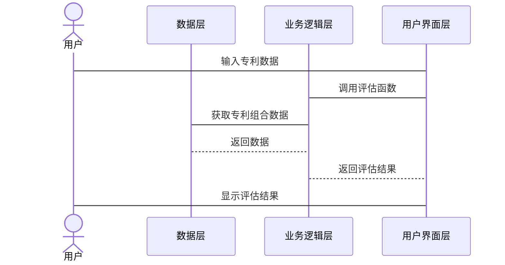

                 


# 企业估值中的专利组合价值评估

> 关键词：企业估值，专利组合，价值评估，技术分析，经济模型，系统架构

> 摘要：本文深入探讨了专利组合在企业估值中的重要性，分析了专利组合的特征、评估方法，并通过数学模型和系统架构的设计，展示了如何将专利组合的价值评估应用于实际的企业估值中。文章结合了定性和定量分析，提供了详细的算法原理和项目实战案例，帮助读者全面理解专利组合价值评估的核心内容。

---

# 第一部分：企业估值中的专利组合价值评估基础

## 第1章：专利与企业估值基础

### 1.1 专利的基本概念

#### 1.1.1 专利的定义与特征

专利是法律保护的知识产权，授予发明者在一定期限内独占其发明的权利。其主要特征包括：

- **独占性**：在专利保护期内，未经授权，他人不得使用、销售或制造该发明。
- **地域性**：专利的保护范围限于申请的国家或地区。
- **时间性**：专利的有效期通常为20年（发明专利）或10-15年（实用新型专利）。

#### 1.1.2 专利在企业中的作用

专利不仅是技术保护的工具，更是企业竞争力的体现。其主要作用包括：

- **技术保护**：防止竞争对手模仿核心技术。
- **市场垄断**：通过专利壁垒，占据市场优势。
- **资产增值**：专利是企业无形资产的重要组成部分，可提升企业价值。

#### 1.1.3 专利与企业价值的关系

专利的价值直接影响企业的市场地位和盈利能力。例如，拥有核心专利的企业可能在谈判中占据优势，或通过技术授权获得额外收益。

### 1.2 企业估值的基本概念

#### 1.2.1 企业估值的定义与方法

企业估值是对企业整体价值的评估，常用方法包括：

- **收益法**：基于未来现金流的折现值。
- **市场法**：与类似企业的交易价格进行比较。
- **成本法**：基于重置成本或历史成本。

#### 1.2.2 专利在企业估值中的重要性

专利作为企业的无形资产，直接影响其市场竞争力和盈利能力。例如，一项关键专利可能使企业的产品更具市场吸引力，从而提升企业估值。

#### 1.2.3 专利组合的定义与特点

专利组合是指一组相关的专利，通常围绕同一技术领域或产品线展开。其特点包括：

- **技术相关性**：专利之间具有技术关联性，形成协同效应。
- **法律多样性**：覆盖不同的法律区域，增强保护力度。
- **战略协同性**：专利组合的布局与企业战略目标一致。

### 1.3 专利组合价值评估的背景与意义

#### 1.3.1 专利组合的概念与内涵

专利组合是多个专利的集合，通常用于防御性或进攻性策略。例如，防御性组合用于应对诉讼，而进攻性组合用于主动维权。

#### 1.3.2 专利组合在企业估值中的作用

专利组合通过技术协同和法律保护，增强企业技术壁垒，提升市场竞争力，从而影响企业估值。

#### 1.3.3 专利组合价值评估的现状与挑战

尽管专利组合的价值评估受到重视，但其复杂性较高，涉及技术、法律和经济等多个维度，评估难度较大。

### 1.4 本章小结

本章介绍了专利的基本概念、企业估值的基本方法以及专利组合的定义与特点，为后续的价值评估打下基础。

---

## 第2章：专利组合价值评估的核心概念

### 2.1 专利组合的特征与分类

#### 2.1.1 专利组合的特征分析

专利组合的特征包括技术相关性、法律多样性、战略协同性和经济互补性。

#### 2.1.2 专利组合的分类

专利组合可根据不同的标准进行分类，例如：

- **技术领域**：同一技术领域的专利组合。
- **法律区域**：覆盖不同国家或地区的专利组合。
- **战略目标**：防御性或进攻性专利组合。

### 2.2 专利组合价值评估的关键要素

#### 2.2.1 专利的技术价值

技术价值取决于专利的技术创新性和市场应用潜力。例如，一项具有广泛应用前景的发明专利具有较高的技术价值。

#### 2.2.2 专利的法律价值

法律价值涉及专利的有效性、保护范围和法律风险。例如，无效专利或保护范围狭窄的专利法律价值较低。

#### 2.2.3 专利的经济价值

经济价值包括专利的市场收益能力。例如，能够带来持续经济收益的专利具有较高的经济价值。

### 2.3 专利组合与企业估值的关系

#### 2.3.1 专利组合对企业价值的影响

专利组合通过提升企业的技术壁垒和市场竞争力，直接影响企业估值。

#### 2.3.2 专利组合在企业估值中的权重

专利组合的权重取决于企业的技术密集度和市场竞争环境。例如，高科技企业中专利组合的权重较高。

### 2.4 核心概念对比表

| **核心概念** | **专利组合** | **单一专利** |
|--------------|---------------|---------------|
| **价值评估** | 综合评估 | 单独评估 |
| **技术关联性** | 高 | 低或无 |
| **法律风险** | 分散风险 | 集中风险 |

### 2.5 本章小结

本章详细分析了专利组合的特征、分类及其价值评估的关键要素，并探讨了专利组合与企业估值的关系。

---

## 第3章：专利组合价值评估的定性与定量分析

### 3.1 定性分析

#### 3.1.1 专利技术评估

评估专利的技术创新性和市场应用潜力。例如，评估某项专利的技术是否具有前瞻性。

#### 3.1.2 专利法律评估

评估专利的法律有效性、保护范围和潜在风险。例如，评估专利的保护范围是否覆盖主要市场。

### 3.2 定量分析

#### 3.2.1 专利经济模型

基于经济指标（如收入、利润）建立数学模型。例如，使用收益法评估专利组合的经济价值。

#### 3.2.2 市场分析

分析市场需求、竞争环境和市场趋势。例如，评估某项专利在市场中的竞争优势。

### 3.3 综合评估方法

结合定性和定量分析，采用加权评分法或层次分析法（AHP）进行综合评估。例如，使用AHP模型确定各因素的权重。

---

## 第4章：数学模型与算法原理

### 4.1 层次分析法（AHP）原理

层次分析法是一种常用的决策分析方法，适用于多因素决策问题。其基本步骤包括：

1. 构建层次结构模型。
2. 确定各因素的权重。
3. 计算综合评分。

### 4.2 专利组合价值评估的数学模型

综合考虑技术、法律和经济因素，构建专利组合价值评估模型：

$$ V = w_t \cdot T + w_l \cdot L + w_e \cdot E $$

其中，$V$为专利组合价值，$w_t$、$w_l$、$w_e$为各因素的权重，$T$、$L$、$E$分别为技术价值、法律价值和经济价值。

### 4.3 算法实现

使用Python实现AHP模型：

```python
import numpy as np

# 定义比较矩阵
matrix = np.array([
    [1, 3, 2],
    [1/3, 1, 2],
    [1/2, 1/2, 1]
])

# 计算特征向量
eigenvalues, eigenvectors = np.linalg.eig(matrix)
weights = eigenvectors[:, 0] / eigenvectors[:, 0].sum()

print(weights)
```

---

## 第5章：系统分析与架构设计

### 5.1 问题场景介绍

企业需要评估其专利组合的价值，以支持企业估值。

### 5.2 系统功能设计

设计一个专利组合价值评估系统，包括数据输入、评估计算和结果展示三个模块。

### 5.3 系统架构设计

采用分层架构，包括数据层、业务逻辑层和用户界面层。

### 5.4 系统交互设计

使用Mermaid序列图描述用户与系统之间的交互流程。



---

## 第6章：项目实战

### 6.1 环境搭建

安装必要的Python库，如numpy和pandas。

### 6.2 核心代码实现

实现专利组合价值评估的核心算法。

### 6.3 案例分析

以某高科技企业为例，分析其专利组合的价值。

---

## 第7章：总结与展望

### 7.1 最佳实践 tips

- 结合定性和定量分析，制定合理的评估策略。
- 定期更新专利组合，适应市场变化。

### 7.2 小结

本文系统地介绍了专利组合价值评估的方法和实现，为企业的专利管理和估值提供了理论支持和实践指导。

### 7.3 注意事项

- 数据的准确性和完整性直接影响评估结果。
- 结合企业的实际情况，灵活调整评估模型。

### 7.4 拓展阅读

推荐相关书籍和文献，供读者深入研究。

---

# 作者：AI天才研究院/AI Genius Institute & 禅与计算机程序设计艺术 /Zen And The Art of Computer Programming

