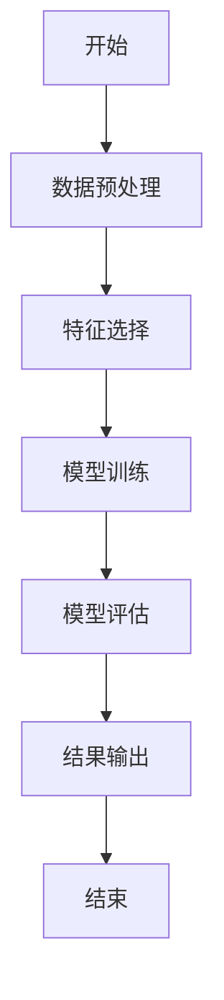
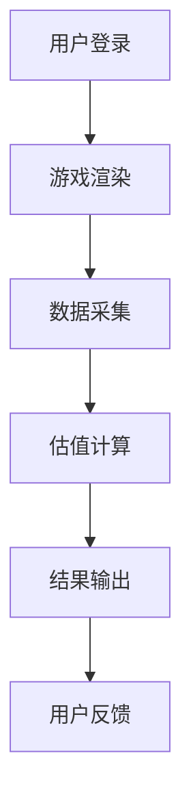
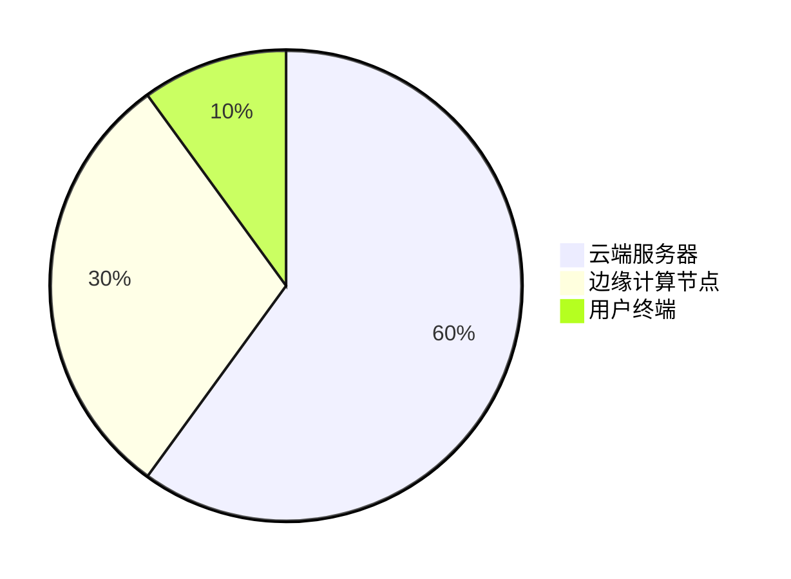
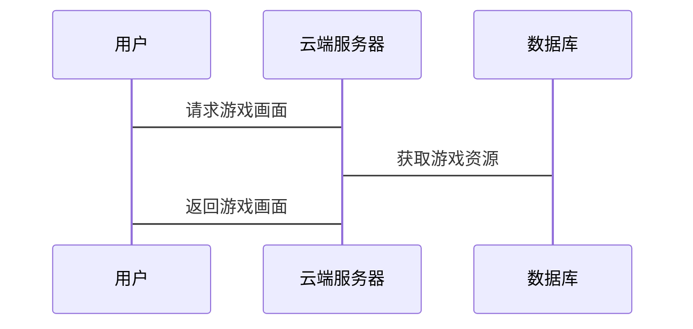

                 


# 企业估值中的云游戏技术应用评估

---

## 关键词：
企业估值、云游戏技术、技术评估、云游戏、估值模型

---

## 摘要：
本文将深入探讨云游戏技术在企业估值中的应用，从技术原理到实际评估模型，分析云游戏技术如何影响企业估值，并为企业提供一种基于云游戏技术的估值新思路。通过详细的算法原理、系统架构设计和实际案例分析，本文旨在为企业估值提供一种更加智能化和高效化的解决方案。

---

# 第1章 云游戏技术与企业估值概述

## 1.1 云游戏技术的起源与发展

### 1.1.1 云游戏技术的定义
云游戏技术是一种基于云计算和流媒体技术的新型游戏技术，其核心是将游戏的渲染和计算过程迁移到云端服务器，通过网络将游戏画面实时传输到终端设备（如手机、PC、平板等），从而实现无需下载游戏包即可进行高质量游戏体验的技术。

### 1.1.2 云游戏技术的核心特点
- **云端计算**：游戏逻辑和图形渲染在云端服务器完成，终端设备仅负责接收和显示画面。
- **低延迟**：通过高效的网络传输和边缘计算技术，确保游戏体验的流畅性。
- **跨平台兼容性**：支持多种终端设备，用户可以在不同设备上无缝切换游戏体验。
- **按需付费**：用户只需为实际使用的游戏时间付费，无需一次性购买游戏。

### 1.1.3 云游戏技术与传统游戏技术的区别
| 特性            | 传统游戏技术                | 云游戏技术                |
|-----------------|-----------------------------|---------------------------|
| 计算资源        | 依赖终端设备性能            | 依赖云端服务器性能        |
| 网络需求        | 较低，仅需本地网络           | 较高，依赖于高速稳定的网络 |
| 存储需求        | 需要本地存储游戏文件        | 无需本地存储，仅需缓存画面 |
| 用户体验优化    | 受终端设备性能限制          | 通过云端优化，提升用户体验 |

---

## 1.2 企业估值的基本概念

### 1.2.1 企业估值的定义
企业估值是指通过对企业的财务状况、市场地位、业务模式、未来盈利能力等因素进行综合评估，确定企业市场价值的过程。

### 1.2.2 企业估值的核心方法
- **资产基础法**：基于企业资产的账面价值进行评估。
- **收益法**：基于企业未来现金流的折现值进行评估。
- **市场法**：基于同类企业的市场交易价格进行评估。

### 1.2.3 云游戏技术与企业估值的联系
云游戏技术作为一种新兴的技术形态，其商业模式、市场前景和盈利潜力直接影响企业的估值。通过引入云游戏技术，企业可以优化成本结构、提升用户体验和市场竞争力，从而影响企业的估值结果。

---

## 1.3 云游戏技术在企业估值中的应用背景

### 1.3.1 云游戏技术对企业估值的影响
- **成本优化**：云游戏技术可以通过共享计算资源降低企业的资本支出（CAPEX）和运营支出（OPEX）。
- **收入增长**：云游戏技术的普及可以扩大用户基数，为企业带来更多的收入来源。
- **技术创新**：云游戏技术的核心技术创新可以提升企业的技术竞争力，增强市场地位。

### 1.3.2 云游戏技术在企业估值中的优势
- **实时数据支持**：通过云端实时数据，企业可以更精准地评估用户的活跃度和付费意愿。
- **动态调整能力**：云游戏技术可以根据市场反馈动态调整游戏内容和运营策略，从而优化估值模型。
- **跨平台兼容性**：云游戏技术可以覆盖更多的用户群体，提升企业的市场渗透率。

### 1.3.3 云游戏技术在企业估值中的挑战
- **网络延迟问题**：网络延迟可能影响用户体验，进而影响企业的估值结果。
- **技术成熟度**：云游戏技术尚处于发展阶段，其稳定性、可靠性和安全性需要进一步验证。
- **政策监管**：云游戏技术的应用可能受到各地政策法规的限制，影响企业的估值。

---

## 1.4 本章小结

本章从云游戏技术的起源和发展入手，详细介绍了云游戏技术的核心特点及其与传统游戏技术的区别。随后，阐述了企业估值的基本概念和核心方法，并分析了云游戏技术在企业估值中的应用背景及其影响。通过本章的介绍，读者可以初步理解云游戏技术与企业估值之间的联系，为后续章节的深入分析奠定基础。

---

# 第2章 云游戏技术的核心原理

## 2.1 云游戏技术的实现原理

### 2.1.1 云游戏的运行环境
云游戏的运行环境主要由以下几部分组成：
- **云端服务器**：负责游戏的渲染、计算和逻辑处理。
- **边缘计算节点**：用于降低网络延迟，提升用户体验。
- **用户终端**：负责接收游戏画面并进行本地渲染。

### 2.1.2 云游戏的渲染技术
云游戏的渲染技术主要包括：
- **GPU虚拟化技术**：允许多个虚拟GPU实例在单台物理服务器上运行，提高资源利用率。
- **流式渲染技术**：将游戏画面以视频流的形式传输到用户终端。

### 2.1.3 云游戏的网络传输机制
云游戏的网络传输机制主要包括：
- **低延迟传输**：通过优化网络协议和使用边缘计算技术，降低游戏画面的传输延迟。
- **带宽优化**：通过压缩技术和智能编码算法，减少网络带宽的占用。

---

## 2.2 企业估值的核心模型

### 2.2.1 企业估值的常用模型
- **DCF模型（Discounted Cash Flow Model）**：基于企业未来现金流的折现值进行评估。
- **EV/Sales模型**：基于企业价值与销售收入的比值进行评估。
- **EV/EBITDA模型**：基于企业价值与息税折旧及摊销前利润的比值进行评估。

### 2.2.2 企业估值的关键指标
- **市盈率（P/E Ratio）**：市价与每股收益的比值。
- **市净率（P/B Ratio）**：市价与每股净资产的比值。
- **市销率（P/S Ratio）**：市价与每股销售收入的比值。

### 2.2.3 企业估值的数学模型
企业价值（EV）的计算公式如下：
$$ EV = \text{企业未来现金流的现值} $$

---

## 2.3 云游戏技术与企业估值的关联

### 2.3.1 云游戏技术对企业估值的影响
- **成本优化**：云游戏技术可以通过共享计算资源降低企业的资本支出和运营支出。
- **收入增长**：云游戏技术的普及可以扩大用户基数，为企业带来更多的收入来源。
- **技术创新**：云游戏技术的核心技术创新可以提升企业的技术竞争力，增强市场地位。

### 2.3.2 云游戏技术在企业估值中的应用案例
- **案例一**：某云游戏平台通过引入边缘计算技术，显著降低了网络延迟，提升了用户体验，从而提高了企业的估值。
- **案例二**：某游戏公司通过云游戏技术优化了其业务模式，实现了按需付费，提升了企业的收入和利润，从而提高了企业的估值。

### 2.3.3 云游戏技术与企业估值的未来趋势
- **技术融合**：云游戏技术将与人工智能、大数据等技术深度融合，进一步提升企业的估值能力。
- **市场扩展**：随着5G网络的普及，云游戏技术的应用场景将进一步扩展，为企业估值提供更多可能性。
- **政策支持**：政府将加大对云游戏技术的支持力度，推动云游戏技术的广泛应用。

---

## 2.4 本章小结

本章深入分析了云游戏技术的核心原理，包括其运行环境、渲染技术和网络传输机制。随后，介绍了企业估值的核心模型和关键指标，并详细探讨了云游戏技术与企业估值之间的关联。通过本章的分析，读者可以进一步理解云游戏技术在企业估值中的重要作用。

---

# 第3章 云游戏技术评估算法的数学模型

## 3.1 云游戏技术评估的数学模型

### 3.1.1 云游戏技术评估的线性回归模型
线性回归模型是一种常用的统计模型，可以用于预测企业的估值。其基本公式如下：
$$ \hat{y} = a + bx $$
其中，$\hat{y}$ 是预测的估值，$x$ 是自变量（如销售收入），$a$ 是截距，$b$ 是回归系数。

### 3.1.2 云游戏技术评估的决策树模型
决策树是一种基于树状结构的分类和回归模型，可以用于企业估值的分类问题。其基本结构如下：
- 根节点：企业的核心指标（如销售收入、净利润率）。
- 内部节点：企业的次要指标（如市场占有率、研发投入）。
- 叶节点：企业的最终估值。

### 3.1.3 云游戏技术评估的随机森林模型
随机森林模型是一种基于决策树的集成学习方法，可以用于企业估值的预测。其基本原理如下：
1. 随机抽取部分数据集，生成多个决策树。
2. 对所有决策树进行投票或平均，得到最终的预测结果。

---

## 3.2 云游戏技术评估算法的流程图



---

## 3.3 云游戏技术评估算法的Python实现

```python
import numpy as np
from sklearn import tree

# 示例数据集
X = np.array([[1, 2], [3, 4], [5, 6], [7, 8]])
y = np.array([10, 20, 30, 40])

# 创建决策树回归模型
model = tree.DecisionTreeRegressor()

# 训练模型
model.fit(X, y)

# 预测结果
predicted = model.predict([[9, 10]])
print(predicted)
```

---

## 3.4 云游戏技术评估算法的数学公式

云游戏技术评估的数学公式如下：
$$ \text{企业估值} = f(\text{销售收入}, \text{净利润率}, \text{研发投入}, \text{市场占有率}) $$

其中，$f$ 是一个复杂的函数，可以通过机器学习算法进行建模和优化。

---

## 3.5 本章小结

本章详细讲解了云游戏技术评估的数学模型，包括线性回归模型、决策树模型和随机森林模型。通过流程图和Python代码示例，展示了算法的实现过程。同时，通过数学公式进一步阐述了云游戏技术评估的核心原理，为后续章节的系统架构设计和项目实战奠定了基础。

---

# 第4章 云游戏技术与企业估值的系统架构设计

## 4.1 问题场景介绍

云游戏技术的应用需要构建一个高效的云端计算平台，支持大量用户的并发访问和实时游戏体验。同时，企业估值需要基于实时数据和动态调整的模型，对企业的价值进行准确评估。

---

## 4.2 系统功能设计

### 4.2.1 系统功能模块
- **用户认证模块**：负责用户的登录和权限管理。
- **游戏渲染模块**：负责游戏的云端渲染和画面传输。
- **数据采集模块**：负责采集用户行为数据和游戏运行数据。
- **估值计算模块**：基于采集的数据，计算企业的实时估值。

### 4.2.2 系统功能流程



---

## 4.3 系统架构设计

### 4.3.1 系统架构图



---

## 4.4 系统接口设计

### 4.4.1 用户认证接口
```python
def authenticate(username, password):
    # 实现用户认证逻辑
    pass
```

### 4.4.2 游戏渲染接口
```python
def render_game(graphics_api):
    # 实现游戏渲染逻辑
    pass
```

---

## 4.5 系统交互流程

### 4.5.1 系统交互图



---

## 4.6 本章小结

本章从系统架构的角度，详细设计了云游戏技术与企业估值的系统架构。通过功能模块、架构图和交互图的展示，读者可以清晰地理解系统的整体结构和运行流程。

---

# 第5章 云游戏技术评估的项目实战

## 5.1 环境安装

### 5.1.1 安装Python环境
```bash
python --version
pip install numpy scikit-learn
```

### 5.1.2 安装云游戏开发环境
```bash
# 示例：安装NVIDIA GPU驱动和CUDA工具链
sudo apt-get install nvidia-cuda-toolkit
```

---

## 5.2 系统核心实现

### 5.2.1 云游戏渲染模块实现
```python
import numpy as np
import matplotlib.pyplot as plt

def render_game():
    # 示例：生成游戏画面
    x = np.linspace(0, 2*np.pi, 100)
    y = np.sin(x)
    plt.plot(x, y)
    plt.show()
```

### 5.2.2 企业估值计算模块实现
```python
def calculate_valuation(revenue, net_profit, r

