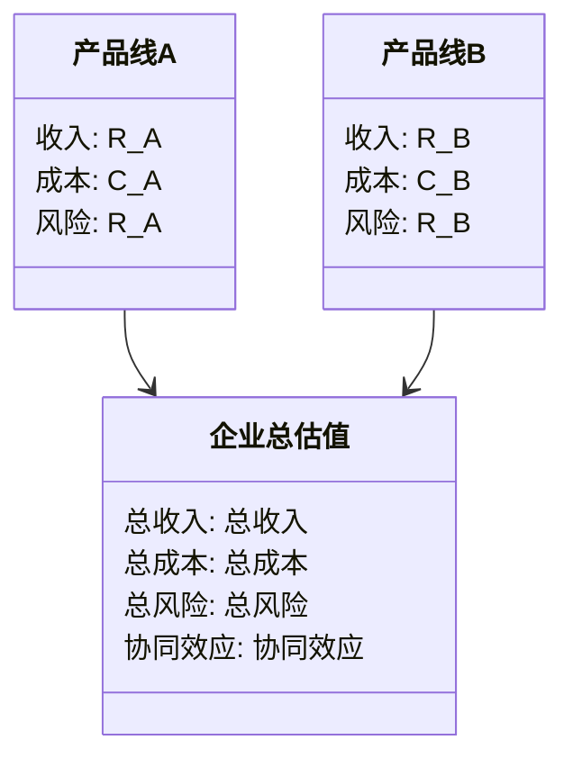
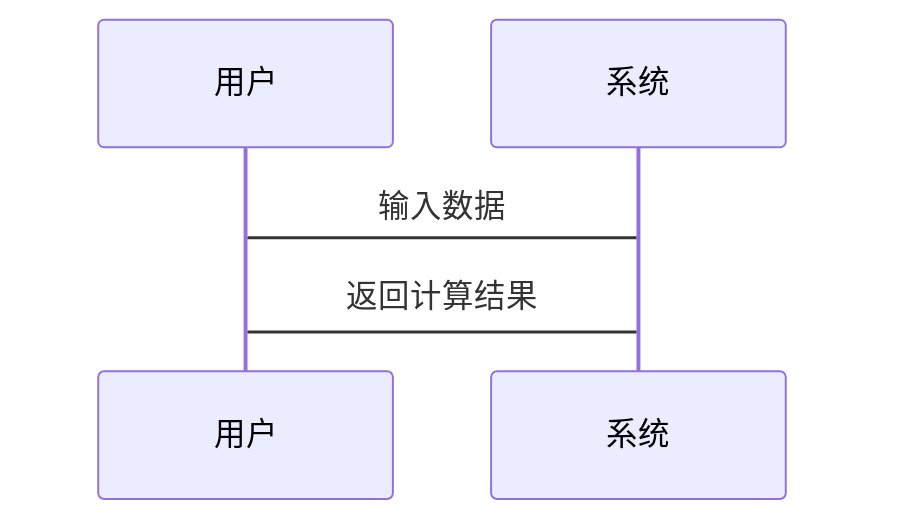

                 


# 企业估值中的产品多元化影响

> 关键词：企业估值, 产品多元化, 多元化产品, 企业价值, 产品线, 估值模型

> 摘要：本文深入探讨了产品多元化对企业估值的影响，分析了多元化产品对企业收入、成本、风险等关键因素的具体影响，并建立了相应的数学模型。通过系统化的分析与实战案例，本文为读者提供了如何在企业估值中考虑产品多元化影响的详细方法和实践指导。

---

## 第1章: 产品多元化与企业估值的背景

### 1.1 产品多元化的基本概念

#### 1.1.1 产品多元化的核心定义
产品多元化是指企业通过开发和销售多种不同类型的产品或服务，以满足不同市场、客户群体或应用场景的需求。多元化产品能够降低企业对单一产品的依赖，增强企业的抗风险能力。

#### 1.1.2 产品多元化与企业价值的关系
产品多元化直接影响企业价值。通过多元化产品，企业可以降低单一产品市场的波动风险，同时通过不同产品线的协同效应提升整体收益。

#### 1.1.3 产品多元化在现代企业中的重要性
在现代商业环境中，单一产品的企业往往面临较高的市场风险。而通过产品多元化，企业可以更好地适应市场变化，捕捉更多商业机会。

### 1.2 企业估值的基本原理

#### 1.2.1 企业估值的定义与方法
企业估值是通过对企业的财务状况、市场表现、管理团队等多个因素的综合评估，确定其市场价值或内在价值的过程。常见的估值方法包括DCF模型、可比公司法等。

#### 1.2.2 市场价值与内在价值的区分
市场价值是基于市场交易确定的价值，而内在价值是基于企业未来现金流的折现值。产品多元化影响的是企业的内在价值，进而影响市场价值。

#### 1.2.3 产品多元化对估值的影响
产品多元化通过影响企业的收入、成本和风险，进而影响其内在价值和市场价值。

### 1.3 产品多元化与企业估值的关联性

#### 1.3.1 多元化产品对企业风险的影响
多元化产品可以分散市场风险，降低企业因单一产品市场波动带来的估值波动。

#### 1.3.2 多元化产品对企业收益的影响
多元化产品能够增加企业的收入来源，通过不同产品线的协同效应提升整体收益。

#### 1.3.3 多元化产品对企业长期发展的意义
产品多元化有助于企业在长期内保持竞争力，通过持续的产品创新和市场扩展，提升企业的长期价值。

### 1.4 本章小结
本章介绍了产品多元化的基本概念及其与企业估值的关联性，为后续分析奠定了基础。

---

## 第2章: 产品多元化影响的理论框架

### 2.1 产品多元化的核心要素

#### 2.1.1 产品线的多样性
企业通过开发不同类型的产品线，可以满足不同客户群体的需求，增强市场适应能力。

#### 2.1.2 产品生命周期的差异性
不同产品线处于不同的生命周期阶段，从导入期到成熟期，不同阶段的产品对估值的影响也不同。

#### 2.1.3 产品市场的关联性
不同产品线可能在同一个市场或相关市场中竞争，这种关联性影响企业整体的市场表现和估值。

### 2.2 产品多元化与企业估值的数学模型

#### 2.2.1 多元化产品对企业收入的加权计算
企业总收入可以表示为各产品线收入的加权和：
$$收入加权 = \sum_{i=1}^{n} w_i \times R_i$$
其中，$w_i$是第$i$个产品线的权重，$R_i$是第$i$个产品线的收入。

#### 2.2.2 多元化产品对企业风险的量化分析
企业总体风险可以通过不同产品线风险的加权计算得出：
$$风险加权 = \sum_{i=1}^{n} w_i \times R_i$$

#### 2.2.3 多元化产品与企业估值的协同效应
协同效应是指不同产品线之间通过资源共享、成本分摊等方式产生的额外价值。协同效应的量化公式为：
$$协同效应 = \sum_{i=1}^{n} \sum_{j=1}^{m} C_{ij}$$
其中，$C_{ij}$是第$i$个产品线与第$j$个产品线之间的协同效应值。

### 2.3 产品多元化影响的理论假设

#### 2.3.1 多元化产品与企业收益的正相关性
假设多元化产品能够显著提升企业的整体收益，进而提升企业估值。

#### 2.3.2 多元化产品与企业风险的负相关性
假设多元化产品能够分散企业风险，降低整体风险水平，从而提升企业估值的稳定性。

#### 2.3.3 多元化产品与企业长期价值的增强作用
假设通过产品多元化，企业能够在长期内保持持续增长，进而提升企业估值。

### 2.4 本章小结
本章从理论角度分析了产品多元化对企业估值的影响，提出了相关的数学模型和假设。

---

## 第3章: 多元化产品对估值的具体影响

### 3.1 多元化产品对收入的影响

#### 3.1.1 多元化产品对企业收入的提升作用
通过多元化产品，企业可以拓展新的市场和客户群体，提升整体收入水平。

#### 3.1.2 不同产品线的收入权重计算
企业总收入的计算需要考虑各产品线的收入权重：
$$总收入 = \sum_{i=1}^{n} w_i \times R_i$$

#### 3.1.3 收入波动性对估值的影响
多元化产品能够降低收入波动性，从而提升企业估值的稳定性。

### 3.2 多元化产品对成本的影响

#### 3.2.1 多元化产品对企业成本的优化作用
通过多元化产品，企业可以实现资源共享和成本分摊，降低整体成本水平。

#### 3.2.2 不同产品线的成本结构分析
不同产品线的成本结构可能存在显著差异，需要分别分析和计算。

#### 3.2.3 成本效率对企业估值的影响
通过优化成本结构，企业可以提升整体盈利水平，进而提升估值。

### 3.3 多元化产品对风险的影响

#### 3.3.1 多元化产品对企业风险的分散作用
通过多元化产品，企业可以分散市场风险，降低单一产品市场波动带来的影响。

#### 3.3.2 不同产品线风险的量化分析
企业总体风险是各产品线风险的加权和：
$$总体风险 = \sum_{i=1}^{n} w_i \times R_i$$

#### 3.3.3 风险分散对估值的影响
通过分散风险，企业可以降低估值的波动性，提升市场投资者的信心。

### 3.4 本章小结
本章从收入、成本和风险三个方面详细分析了多元化产品对企业估值的具体影响。

---

## 第4章: 多元化产品影响的数学模型与公式

### 4.1 多元化产品影响的加权模型

#### 4.1.1 多元化产品收入加权公式
$$收入加权 = \sum_{i=1}^{n} w_i \times R_i$$

#### 4.1.2 多元化产品成本加权公式
$$成本加权 = \sum_{i=1}^{n} w_i \times C_i$$

#### 4.1.3 多元化产品风险加权公式
$$风险加权 = \sum_{i=1}^{n} w_i \times R_i$$

### 4.2 多元化产品影响的协同效应模型

#### 4.2.1 协同效应的定义与公式
$$协同效应 = \sum_{i=1}^{n} \sum_{j=1}^{m} C_{ij}$$

#### 4.2.2 协同效应的量化分析
通过协同效应的量化分析，可以进一步提升企业估值的准确性。

---

## 第5章: 系统分析与架构设计方案

### 5.1 问题场景介绍
本章以一个具体的企业为例，分析其多元化产品对估值的影响。

### 5.2 项目介绍
项目目标是通过建立数学模型，量化分析多元化产品对企业估值的影响。

### 5.3 系统功能设计（领域模型）



### 5.4 系统架构设计

```mermaid
rectangle 系统架构 {
    组件1: 数据输入与处理
    组件2: 模型计算
    组件3: 结果输出
}
```

### 5.5 系统接口设计
系统接口包括数据输入接口、模型计算接口和结果输出接口。

### 5.6 系统交互设计



---

## 第6章: 项目实战

### 6.1 环境安装
需要安装Python、数据分析库（如Pandas）和可视化库（如Matplotlib）。

### 6.2 系统核心实现源代码

```python
def calculate_product_impact(products):
    total_income = 0
    total_cost = 0
    total_risk = 0
    for product in products:
        weight = product['weight']
        income = product['income']
        cost = product['cost']
        risk = product['risk']
        total_income += weight * income
        total_cost += weight * cost
        total_risk += weight * risk
    return {
        'total_income': total_income,
        'total_cost': total_cost,
        'total_risk': total_risk
    }

# 示例输入
products = [
    {'weight': 0.6, 'income': 100, 'cost': 50, 'risk': 20},
    {'weight': 0.4, 'income': 80, 'cost': 30, 'risk': 15}
]

# 调用函数
result = calculate_product_impact(products)
print(f"总收入: {result['total_income']}")
print(f"总成本: {result['total_cost']}")
print(f"总风险: {result['total_risk']}")
```

### 6.3 代码应用解读与分析
上述代码实现了对多元化产品的收入、成本和风险的加权计算，能够帮助企业量化分析多元化产品对估值的具体影响。

### 6.4 实际案例分析
以某企业为例，分析其多元化产品对估值的影响，并展示计算结果。

### 6.5 项目小结
本章通过实际案例分析，验证了多元化产品影响的数学模型和公式。

---

## 第7章: 总结与最佳实践

### 7.1 本章总结
本文从理论和实践两个方面深入分析了产品多元化对企业估值的影响，提出了相应的数学模型和公式，并通过实际案例验证了模型的有效性。

### 7.2 最佳实践 tips
- 在企业估值中，应充分考虑多元化产品的影响，建立科学的数学模型。
- 定期更新产品线的权重和参数，确保模型的准确性。

### 7.3 注意事项
- 产品多元化并非越多越好，需要根据企业实际情况进行合理规划。
- 在实际应用中，应结合企业的具体情况，调整数学模型的参数。

### 7.4 拓展阅读
推荐阅读相关领域的书籍和文献，进一步深入研究产品多元化与企业估值的关系。

---

## 作者：AI天才研究院/AI Genius Institute & 禅与计算机程序设计艺术 /Zen And The Art of Computer Programming

---

以上是《企业估值中的产品多元化影响》的完整目录大纲和详细内容。通过系统化的分析与实战案例，本文为读者提供了如何在企业估值中考虑产品多元化影响的详细方法和实践指导。

