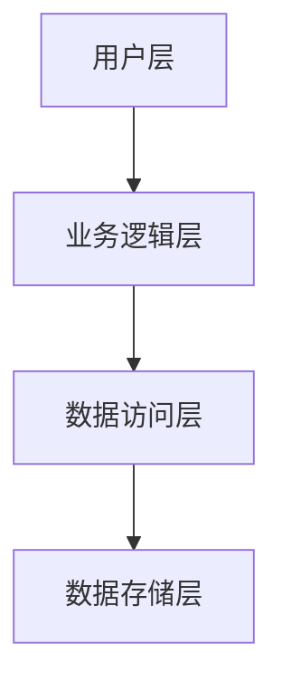
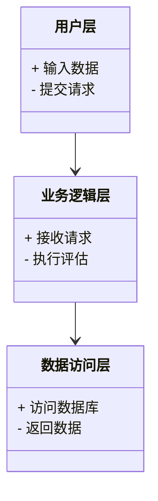

                 

# 企业估值中的人力资本价值评估

> 关键词：企业估值、人力资本、价值评估、评估方法、系统架构

> 摘要：本文详细探讨了人力资本在企业估值中的价值评估方法，从理论基础到实际应用，结合系统架构设计和项目实战，为企业提供全面的评估策略。

---

## 第1章: 人力资本与企业估值的背景介绍

### 1.1 人力资本的基本概念

#### 1.1.1 人力资本的定义
人力资本是指企业员工的知识、技能、经验和创新能力的总和。它不仅包括员工的教育背景，还包括他们在工作中积累的经验和表现。

#### 1.1.2 人力资本的核心要素
- 知识：员工的专业知识和技能。
- 技能：技术能力和软技能。
- 经验：工作年限和经验。
- 创新能力：解决问题和创造新价值的能力。

#### 1.1.3 人力资本与企业价值的关系
人力资本是企业长期竞争优势的核心，直接影响企业的绩效和市场价值。高素质的人力资本能够提高企业效率，降低运营成本，并推动创新，从而增加企业价值。

### 1.2 人力资本在企业中的角色

#### 1.2.1 人力资本对企业绩效的影响
人力资本通过员工的生产力和创新能力直接影响企业的盈利能力和市场地位。

#### 1.2.2 人力资本在企业战略中的地位
人力资本是企业战略的重要组成部分，尤其是在知识经济时代，人才是企业的核心竞争力。

#### 1.2.3 人力资本的动态变化与企业适应性
随着市场环境的变化，人力资本需要不断更新和调整，以确保企业能够适应新的挑战和机遇。

### 1.3 人力资本与传统财务资本的区别

#### 1.3.1 资本的分类与特征对比
- 财务资本：有形资产，如现金、设备、房地产等，价值相对稳定。
- 人力资本：无形资产，依赖于员工的能力和表现，价值波动较大。

#### 1.3.2 人力资本的无形性与流动性
人力资本的无形性使其难以直接量化，且员工可以随时离开企业，导致其流动性较高。

#### 1.3.3 人力资本的可测量性与价值评估的挑战
尽管人力资本难以直接测量，但可以通过员工的绩效、市场薪资水平和行业标准来间接评估其价值。

### 1.4 人力资本价值评估的重要性

#### 1.4.1 企业估值中的传统方法局限性
传统财务估值方法通常忽视了人力资本的价值，尤其是在高科技和知识密集型企业中。

#### 1.4.2 人力资本价值对企业整体价值的影响
高素质的人力资本能够提升企业的创新能力和市场竞争力，从而增加企业整体价值。

#### 1.4.3 人力资本价值评估的现实意义
准确评估人力资本价值有助于企业制定合理的薪酬策略、优化人才管理和提升整体竞争力。

## 1.5 本章小结
本章介绍了人力资本的基本概念、核心要素及其在企业中的角色，分析了人力资本与传统财务资本的区别，并强调了人力资本价值评估的重要性。

---

## 第2章: 人力资本价值评估的核心概念与理论基础

### 2.1 人力资本的经济学理论

#### 2.1.1 人力资本投资理论
人力资本投资理论强调通过教育、培训和经验积累来提升员工的能力和价值。

#### 2.1.2 人力资本回报率（HCROI）的概念
HCROI是指企业投资于员工培训和发展的回报率，通常通过员工绩效提升和成本节约来衡量。

#### 2.1.3 人力资本与经济增长的关系
人力资本是经济增长的重要驱动力，高素质的人力资源能够推动技术创新和产业升级。

### 2.2 人力资本价值评估的理论模型

#### 2.2.1 人力资本定价模型（HCVM）
HCVM通过将人力资本的价值与市场薪资水平、员工绩效和行业标准进行对比，评估其在企业中的贡献。

#### 2.2.2 人力资本价值评估的框架
评估框架包括数据收集、模型选择、权重分配和结果分析等步骤。

#### 2.2.3 人力资本与企业绩效的数学模型
$$ V_{\text{人力}} = \sum_{i=1}^{n} w_i \cdot h_i $$
其中，\( w_i \) 是第 \( i \) 项人力资本的权重，\( h_i \) 是第 \( i \) 项人力资本的评估值。

### 2.3 人力资本与企业价值的数学关系

#### 2.3.1 企业价值的公式表示
$$ V = V_{\text{财务}} + V_{\text{人力}} $$
其中，\( V_{\text{财务}} \) 是企业的财务价值，\( V_{\text{人力}} \) 是人力资本的价值。

#### 2.3.2 人力资本价值的计算公式
$$ V_{\text{人力}} = \sum_{i=1}^{n} w_i \cdot h_i $$
权重 \( w_i \) 反映了各项人力资本对企业价值的相对重要性。

## 2.4 本章小结
本章介绍了人力资本的经济学理论，提出了人力资本价值评估的理论模型，并通过数学公式展示了人力资本与企业价值的关系。

---

## 第3章: 人力资本价值评估的主要方法

### 3.1 成本法

#### 3.1.1 成本法的基本原理
成本法通过计算获取和培养员工的成本，评估其人力资本价值。

#### 3.1.2 人力资本的获取成本计算
包括招聘费用、培训费用和福利支出等。

#### 3.1.3 成本法的优缺点分析
- 优点：计算简单，易于理解。
- 缺点：忽视了员工的市场价值和绩效差异。

### 3.2 市场法

#### 3.2.1 市场法的基本原理
市场法通过比较同类企业的薪资水平，评估人力资本的市场价值。

#### 3.2.2 可比企业分析与对标
选择与企业相似的公司，分析其薪资结构和员工绩效。

#### 3.2.3 市场法的实际应用案例
案例：某科技公司通过分析同行业公司的薪资水平，调整其员工薪酬结构。

### 3.3 收益法

#### 3.3.1 收益法的基本原理
收益法通过评估员工绩效对企业收益的贡献，计算其人力资本价值。

#### 3.3.2 未来现金流的折现计算
$$ V = \sum_{t=1}^{n} \frac{CF_t}{(1 + r)^t} $$
其中，\( CF_t \) 是第 \( t \) 年的人力资本带来的现金流，\( r \) 是折现率。

#### 3.3.3 收益法的数学模型
$$ V = \sum_{t=1}^{n} \frac{CF_t}{(1 + r)^t} $$

### 3.4 综合法

#### 3.4.1 综合法的基本原理
综合法结合成本法、市场法和收益法的优点，通过加权平均计算人力资本价值。

#### 3.4.2 不同方法的权重分配
根据企业特点和目标，确定各方法的权重。

#### 3.4.3 综合法的实际应用案例
案例：某制造企业综合考虑员工的成本、市场价值和绩效，制定合理的薪酬策略。

### 3.5 本章小结
本章介绍了人力资本价值评估的主要方法，包括成本法、市场法、收益法和综合法，并通过案例分析了它们的实际应用。

---

## 第4章: 人力资本价值评估的系统分析与架构设计

### 4.1 系统功能设计

#### 4.1.1 数据采集模块
负责收集员工信息、市场数据和企业绩效数据。

#### 4.1.2 评估模型构建模块
基于数据构建评估模型，选择合适的评估方法。

#### 4.1.3 结果分析与可视化模块
对评估结果进行分析，并以图表形式展示。

### 4.2 系统架构设计

#### 4.2.1 分层架构图

#### 4.2.2 系统功能模块设计

### 4.3 系统接口设计

#### 4.3.1 数据接口
- 输入：员工信息、市场数据。
- 输出：评估结果。

#### 4.3.2 用户接口
- 输入：评估参数。
- 输出：可视化结果。

### 4.4 本章小结
本章设计了人力资本价值评估系统的架构，包括功能模块、系统接口和数据流。

---

## 第5章: 项目实战——企业人力资本价值评估案例

### 5.1 项目背景

#### 5.1.1 项目介绍
某高科技公司希望通过评估人力资本价值，优化其薪酬策略。

### 5.2 数据收集与处理

#### 5.2.1 数据来源
- 内部数据：员工绩效、薪资结构。
- 外部数据：行业薪资水平、市场趋势。

#### 5.2.2 数据清洗
去除无效数据，处理异常值。

### 5.3 系统实现

#### 5.3.1 评估模型选择
采用综合法，结合成本法、市场法和收益法。

#### 5.3.2 权重分配
根据企业特点，确定各方法的权重。

### 5.4 实际案例分析

#### 5.4.1 案例分析
通过综合法计算得出企业人力资本价值，并与市场数据对比。

### 5.5 结果分析

#### 5.5.1 评估结果
人力资本价值为X，与市场数据对比，调整薪酬策略。

### 5.6 本章小结
本章通过实际案例展示了人力资本价值评估的过程和方法，验证了理论模型的可行性。

---

## 第6章: 人力资本价值评估的最佳实践与总结

### 6.1 最佳实践

#### 6.1.1 数据质量
确保数据的准确性和完整性。

#### 6.1.2 方法选择
根据企业特点选择合适的评估方法。

#### 6.1.3 结果应用
将评估结果应用于薪酬设计和人才管理。

### 6.2 小结

#### 6.2.1 核心观点总结
人力资本是企业价值的重要组成部分，科学的评估方法能够帮助企业优化管理。

### 6.3 注意事项

#### 6.3.1 数据偏差
注意数据偏差对企业评估结果的影响。

#### 6.3.2 方法局限性
不同方法各有优缺点，需综合考虑。

### 6.4 未来趋势

#### 6.4.1 技术进步
人工智能和大数据技术将提升人力资本评估的精确性和效率。

#### 6.4.2 全球化影响
全球化背景下，人力资本的流动性增加，评估方法需适应跨国经营需求。

## 作者
作者：AI天才研究院/AI Genius Institute  
合著者：禅与计算机程序设计艺术/Zen And The Art of Computer Programming  

---

通过以上内容，我们系统地探讨了人力资本在企业估值中的价值评估方法，结合理论与实践，为企业提供了全面的评估策略。

