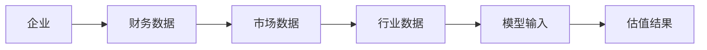
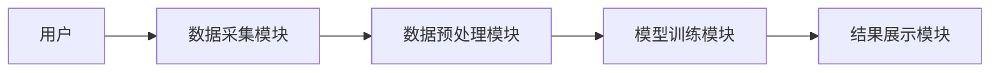
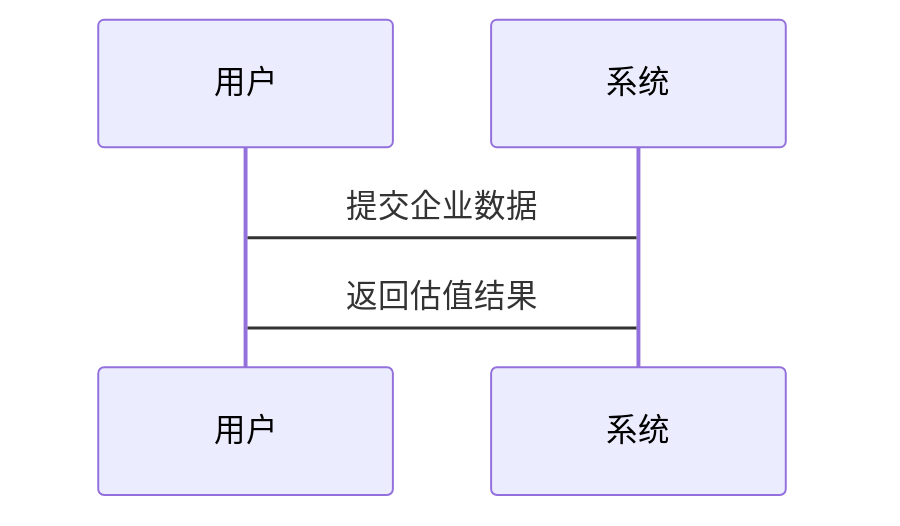

                 


# 企业估值中的人工智能应用价值评估

> 关键词：企业估值、人工智能、机器学习、深度学习、金融应用

> 摘要：本文深入探讨了人工智能在企业估值中的应用价值，分析了传统估值方法的局限性，并详细介绍了基于机器学习和深度学习的新型估值方法。文章从背景、核心概念、算法原理到系统架构进行了全面阐述，并通过实际案例展示了人工智能在企业估值中的优势和挑战。

---

# 第一部分：企业估值与人工智能概述

## 第1章：企业估值的基本概念

### 1.1 企业估值的定义与作用

企业估值是通过对企业的财务状况、市场地位、未来盈利能力等多方面因素的综合评估，确定其市场价值的过程。传统的企业估值方法包括DCF模型、市盈率法、市净率法等，但这些方法在实际应用中存在诸多局限性，如数据依赖性强、主观判断较多、难以处理非结构化数据等。

人工智能的引入为解决这些问题提供了新的思路。通过机器学习算法，企业估值可以更加高效、精准地完成，尤其是在处理大量非结构化数据（如新闻、社交媒体信息）方面具有显著优势。

### 1.2 人工智能在企业估值中的潜力

人工智能技术的发展为金融领域带来了革命性的变化。在企业估值中，人工智能可以用于以下几个方面：

- **数据处理**：整合和分析大量的结构化和非结构化数据，提取关键特征。
- **预测模型**：利用机器学习算法预测企业的未来盈利能力、风险水平等。
- **实时监控**：通过自然语言处理技术实时分析新闻、财报等信息，动态调整估值模型。
- **个性化估值**：根据不同行业、不同企业的特点，定制化估值模型。

### 1.3 企业估值中的关键问题

在企业估值中，关键问题包括：

1. **数据质量**：数据的完整性和准确性直接影响估值结果。
2. **模型选择**：不同算法适用于不同的场景，选择合适的算法至关重要。
3. **实时性**：企业的市场环境和财务状况可能随时变化，需要动态调整估值模型。
4. **可解释性**：复杂的模型可能难以解释其输出结果，影响决策者的信任度。

---

## 第2章：人工智能与企业估值的核心概念

### 2.1 人工智能在企业估值中的原理

人工智能通过以下步骤实现对企业估值的支持：

1. **数据采集**：从财务报表、市场数据、新闻等多渠道获取数据。
2. **数据预处理**：清洗、归一化、特征提取等。
3. **模型训练**：使用机器学习算法训练模型，提取关键特征。
4. **估值预测**：基于训练好的模型，预测企业的市场价值。

### 2.2 企业估值的关键指标与人工智能的结合

企业估值的关键指标包括：

- **财务指标**：如净利润、营业收入、资产负债率等。
- **市场指标**：如市盈率、市净率、行业平均值等。
- **风险指标**：如贝塔系数、波动率等。

人工智能可以通过机器学习算法，将这些指标与企业价值进行关联，建立预测模型。

### 2.3 人工智能在企业估值中的实体关系图



---

## 第3章：人工智能在企业估值中的算法原理

### 3.1 线性回归模型

线性回归是一种简单而有效的回归算法，适用于线性关系的预测。

- **基本原理**：通过最小化预测值与实际值的平方差之和，找到最佳拟合直线。
- **数学模型**：$$ y = \beta_0 + \beta_1 x + \epsilon $$

### 3.2 支持向量机（SVM）

支持向量机适用于非线性分类和回归问题，通过核函数将数据映射到高维空间。

- **数学模型**：$$ y = sign(\sum_{i=1}^n \alpha_i y_i x_i \cdot x + b) $$

### 3.3 随机森林与梯度提升树

随机森林通过集成学习提高模型的准确性和鲁棒性。

- **实现代码**：
  ```python
  from sklearn.ensemble import RandomForestRegressor
  model = RandomForestRegressor(n_estimators=100, random_state=42)
  model.fit(X_train, y_train)
  ```

---

## 第4章：人工智能在企业估值中的系统架构与设计

### 4.1 系统功能需求分析

- **数据采集模块**：从多种数据源获取企业数据。
- **数据预处理模块**：清洗和转换数据。
- **模型训练模块**：训练机器学习模型。
- **结果展示模块**：输出估值结果。

### 4.2 系统架构设计



---

## 4.3 接口和交互设计



---

# 第五部分：企业估值中的人工智能应用价值评估

## 第5章：人工智能在企业估值中的价值评估

### 5.1 价值评估的关键维度

- **准确性**：模型预测的准确率。
- **效率**：处理数据的速度。
- **可解释性**：模型输出的可解释性。

### 5.2 人工智能在企业估值中的优势

- **高效性**：能够快速处理大量数据。
- **准确性**：通过机器学习算法提高预测精度。
- **适应性**：能够动态调整模型以适应市场变化。

### 5.3 人工智能在企业估值中的挑战

- **数据质量**：需要高质量的数据支持。
- **模型选择**：需要选择合适的算法。
- **计算资源**：需要大量的计算资源支持。

---

## 第6章：未来展望与建议

### 6.1 未来发展趋势

- **多模态数据融合**：结合文本、图像等多种数据源。
- **强化学习应用**：通过强化学习优化估值策略。
- **可解释性提升**：开发更透明的模型，提高决策者的信任度。

### 6.2 实践建议

- **数据准备**：确保数据的完整性和准确性。
- **模型选择**：根据具体场景选择合适的算法。
- **持续优化**：定期更新模型以适应市场变化。

---

## 作者信息

作者：AI天才研究院/AI Genius Institute & 禅与计算机程序设计艺术/Zen And The Art of Computer Programming

---

以上是文章的完整大纲和内容概要，您可以根据实际需求进一步扩展和细化每个部分的内容。

