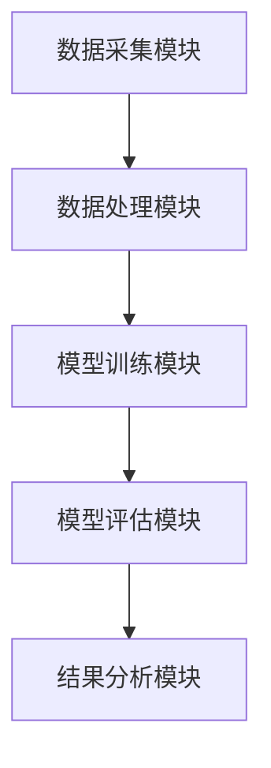
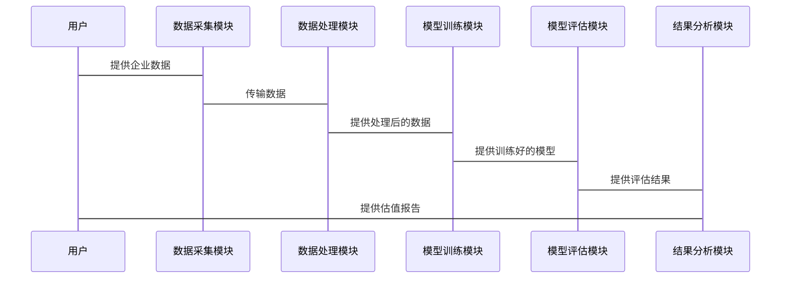

                 


```markdown
# 企业估值中的人工智能芯片设计评估

## 关键词：
- 企业估值
- 人工智能芯片
- 芯片设计评估
- 人工智能技术
- 芯片设计优化

## 摘要：
本文系统地探讨了人工智能芯片设计在企业估值中的应用，从背景介绍、技术原理到实际案例，详细解析了如何利用AI芯片提升企业估值的效率和准确性。通过构建评估模型、优化算法设计以及案例分析，本文展示了AI技术在企业估值中的巨大潜力和实际应用价值。

---

# 第一部分: 企业估值与人工智能芯片设计评估的背景

## 第1章: 企业估值的基本概念

### 1.1 企业估值的定义与方法
#### 1.1.1 企业估值的基本概念
企业估值是指对企业的整体价值进行评估的过程，通常用于投资决策、兼并与收购、资产定价等领域。传统的企业估值方法主要包括财务指标分析、现金流折现法（DCF）、可比公司分析等。

#### 1.1.2 传统企业估值方法的优缺点
- **优点**：能够提供较为直观的估值结果，适用于简单的企业结构。
- **缺点**：依赖于历史数据和假设，难以捕捉企业的创新能力和未来增长潜力，特别是在科技企业中，传统方法往往低估其价值。

#### 1.1.3 人工智能在企业估值中的潜力
人工智能技术可以通过分析大量的非结构化数据（如文本、图像、语音等），提供更精准的估值结果。特别是在处理复杂的企业结构和创新型企业时，人工智能能够显著提升估值的准确性和效率。

## 第2章: 人工智能芯片设计的基本概念

### 2.1 人工智能芯片的定义与特点
#### 2.1.1 人工智能芯片的定义
人工智能芯片是指专门用于加速人工智能算法计算的硬件，如GPU、TPU等。这些芯片通过并行计算和专用指令集，显著提升了人工智能模型的训练和推理速度。

#### 2.1.2 人工智能芯片的核心特点
- **高性能计算**：通过并行处理能力，显著提升计算速度。
- **能效优化**：专为人工智能设计，能够在较低能耗下完成大量计算。
- **可扩展性**：支持从边缘计算到云计算的多种应用场景。

#### 2.1.3 人工智能芯片与传统芯片的区别
人工智能芯片与传统CPU、GPU的区别主要在于其专用性。AI芯片针对特定的人工智能任务进行了优化，能够更高效地处理矩阵运算、并行计算等任务。

## 第3章: 人工智能芯片设计在企业估值中的应用背景

### 3.1 企业估值中的数据挑战
#### 3.1.1 数据的多样性和复杂性
企业估值过程中需要处理大量的数据，包括财务数据、市场数据、竞争数据等。这些数据往往具有高度的异构性和复杂性，传统的数据处理方法难以高效应对。

#### 3.1.2 数据对估值结果的影响
数据的质量和完整性直接影响估值的准确性。高质量的数据能够提供更可靠的估值结果，而数据缺失或不准确则可能导致估值偏差。

#### 3.1.3 数据处理的技术难点
数据处理过程中面临的主要技术难点包括数据清洗、数据融合、数据挖掘等。特别是在处理非结构化数据时，需要借助自然语言处理（NLP）、计算机视觉等技术。

### 3.2 人工智能芯片设计在企业估值中的优势
#### 3.2.1 提高数据处理效率
人工智能芯片能够快速处理大量数据，显著提高数据处理的效率，缩短估值周期。

#### 3.2.2 增强模型预测准确性
通过使用深度学习模型，人工智能芯片能够捕捉数据中的复杂模式和关联性，提高估值模型的预测准确性。

#### 3.2.3 降低计算成本
人工智能芯片的能效优化设计能够在保证计算性能的同时，降低能源消耗，从而降低计算成本。

---

# 第二部分: 人工智能芯片设计评估的核心模型与算法

## 第4章: 人工智能芯片设计评估模型的构建

### 4.1 评估模型的基本原理
#### 4.1.1 模型输入与输出
- **输入**：企业的财务数据、市场数据、竞争数据等。
- **输出**：企业的估值结果及其不确定性分析。

#### 4.1.2 模型的训练与优化
通过使用深度学习模型（如神经网络、循环神经网络等）对大量数据进行训练，优化模型的参数，提高模型的预测能力。

#### 4.1.3 模型的评估指标
常用的评估指标包括均方误差（MSE）、平均绝对误差（MAE）、R平方值（R²）等。

### 4.2 评估模型的数学公式
#### 4.2.1 模型的数学表达式
一个简单的线性回归模型可以表示为：
$$ y = \beta_0 + \beta_1 x_1 + \beta_2 x_2 + \ldots + \beta_n x_n + \epsilon $$
其中，$y$ 是目标变量，$x_i$ 是自变量，$\beta_i$ 是回归系数，$\epsilon$ 是误差项。

#### 4.2.2 模型的训练过程
模型的训练过程包括数据预处理、模型选择、参数初始化、前向传播、损失计算、反向传播和参数更新等步骤。

#### 4.2.3 模型的评估公式
均方误差（MSE）的公式为：
$$ MSE = \frac{1}{n}\sum_{i=1}^{n}(y_i - \hat{y_i})^2 $$
其中，$y_i$ 是实际值，$\hat{y_i}$ 是预测值，$n$ 是样本数量。

### 4.3 模型的优化与调优
#### 4.3.1 参数调整
通过调整学习率、批量大小等超参数，优化模型的性能。

#### 4.3.2 算法优化
使用优化算法（如Adam、SGD等）来优化模型的训练过程，提高训练效率。

#### 4.3.3 模型压缩与部署
通过模型剪枝、量化等技术，减少模型的大小，降低计算成本，提高部署效率。

## 第5章: 人工智能芯片设计评估的流程与方法

### 5.1 评估流程的步骤
#### 5.1.1 数据准备
包括数据收集、数据清洗、数据预处理等步骤。

#### 5.1.2 模型训练
使用训练数据对模型进行训练，优化模型参数。

#### 5.1.3 模型评估
使用测试数据对模型进行评估，计算评估指标。

#### 5.1.4 结果分析
分析模型的预测结果，识别潜在的问题，并进行结果解读。

---

# 第三部分: 人工智能芯片设计评估的系统架构与设计

## 第6章: 人工智能芯片设计评估的系统架构

### 6.1 系统功能设计
- **数据采集模块**：负责收集企业的财务数据、市场数据等。
- **数据处理模块**：对数据进行清洗、融合和预处理。
- **模型训练模块**：使用人工智能芯片对模型进行训练和优化。
- **模型评估模块**：评估模型的性能，计算评估指标。
- **结果分析模块**：分析模型的预测结果，提供估值报告。

### 6.2 系统架构设计


### 6.3 系统接口设计
- **数据接口**：与企业数据源进行对接，获取必要的数据。
- **模型接口**：与人工智能芯片进行交互，训练和评估模型。
- **报告接口**：生成估值报告，供用户查看和分析。

### 6.4 系统交互流程


---

# 第四部分: 人工智能芯片设计评估的项目实战

## 第7章: 项目实战与案例分析

### 7.1 环境配置
- **硬件配置**：推荐使用高性能的人工智能芯片（如NVIDIA的GPU、Google的TPU等）。
- **软件配置**：安装深度学习框架（如TensorFlow、PyTorch等）和相关工具。

### 7.2 核心代码实现
```python
import numpy as np
import tensorflow as tf

# 数据准备
x_train = ...  # 输入数据
y_train = ...  # 标签数据

# 模型构建
model = tf.keras.Sequential([
    tf.keras.layers.Dense(64, activation='relu'),
    tf.keras.layers.Dense(1, activation='linear')
])

# 模型编译
model.compile(optimizer='adam', loss='mean_squared_error')

# 模型训练
model.fit(x_train, y_train, epochs=100, batch_size=32)

# 模型评估
loss = model.evaluate(x_test, y_test)
print(f"损失函数值为：{loss}")
```

### 7.3 案例分析
通过一个实际案例，详细分析人工智能芯片设计评估的具体应用过程，包括数据准备、模型训练、模型评估和结果解读。

---

# 第五部分: 总结与展望

## 第8章: 总结与未来展望

### 8.1 核心内容总结
总结本书的核心内容，包括企业估值的基本概念、人工智能芯片设计的基本原理、评估模型的构建与优化、系统架构与设计等内容。

### 8.2 未来展望
展望人工智能技术在企业估值中的未来发展方向，包括更高效的数据处理技术、更智能的模型算法、更广泛的应用场景等。

---

# 作者

作者：AI天才研究院/AI Genius Institute & 禅与计算机程序设计艺术 /Zen And The Art of Computer Programming
```

