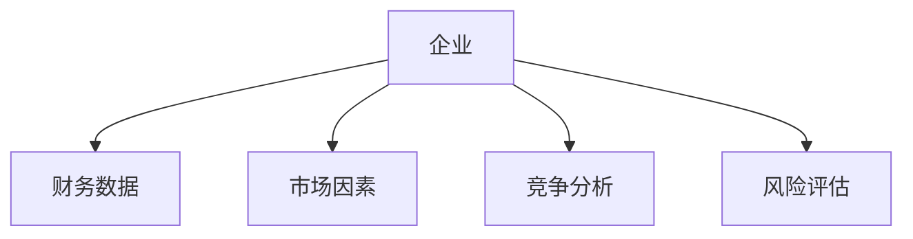
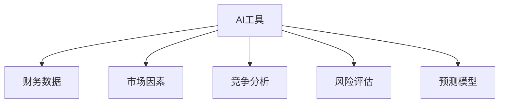
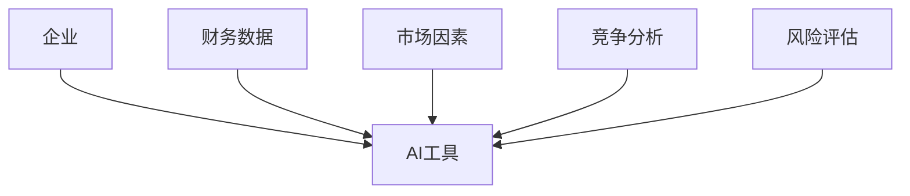
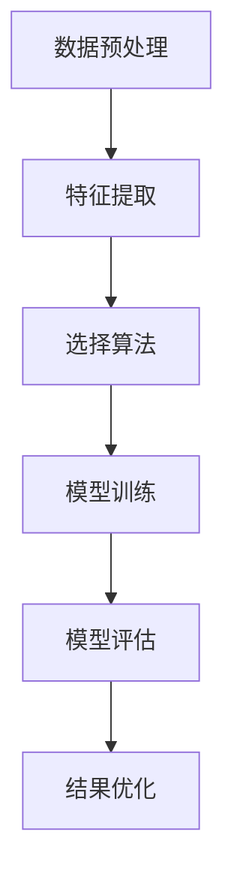
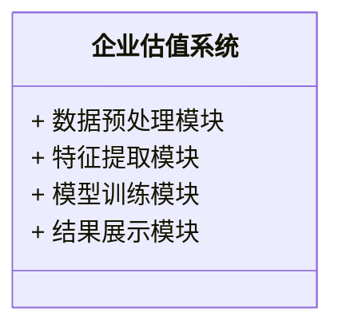
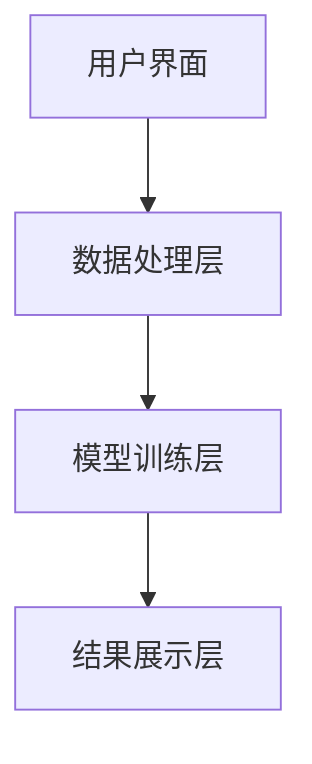
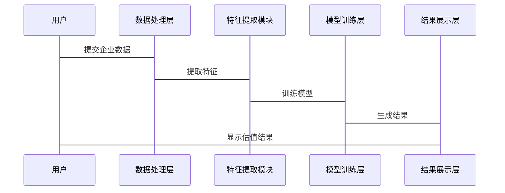

                 


# 企业估值中的人工智能辅助工具

> 关键词：企业估值，人工智能，机器学习，数据分析，投资决策，风险管理

> 摘要：本文探讨了人工智能在企业估值中的应用，从背景、核心概念、算法原理到系统架构，再到项目实战和最佳实践，全面解析人工智能如何提升企业估值的准确性与效率。通过详细的技术分析和案例研究，展示了AI在企业估值中的潜力和优势。

---

# 第1章: 企业估值的基本概念

## 1.1 企业估值的定义与意义

企业估值是指对企业整体价值的评估，通常用于投资决策、收购、融资等场景。准确的估值能够帮助企业做出明智的商业决策，避免潜在风险。传统估值方法依赖财务数据和市场分析，但存在主观性和片面性。

### 1.1.1 企业估值的基本概念
企业估值是评估企业整体价值的过程，包括资产、负债、收入、利润等因素。常见的估值方法包括DCF模型、可比公司分析和 precedent transactions 等。

### 1.1.2 企业估值的重要性
准确的估值有助于投资者和企业在并购、融资、上市等决策中做出合理判断，直接影响企业的财务健康和市场表现。

### 1.1.3 企业估值的主要方法
- **DCF模型**：基于现金流折现，计算企业未来现金流的现值。
- **可比公司分析**：通过比较同行业公司的估值倍数，推断目标企业的价值。
- ** precedent transactions**：参考类似交易的估值，调整至目标企业。

## 1.2 人工智能在企业估值中的作用

人工智能（AI）通过处理大量数据，提供更精准的估值预测。AI能够快速分析市场趋势、财务数据和非结构化信息，帮助投资者做出数据驱动的决策。

### 1.2.1 人工智能的基本概念
人工智能是模拟人类智能的技术，包括机器学习、自然语言处理和计算机视觉等领域。在企业估值中，AI主要用于数据分析和预测。

### 1.2.2 人工智能在企业估值中的应用
AI可以处理非结构化数据，如新闻、社交媒体和行业报告，提取关键信息，增强估值模型的准确性。

### 1.2.3 人工智能的优势与局限性
- **优势**：提高效率，降低人为误差，提供实时更新。
- **局限性**：依赖数据质量，模型可能过拟合，难以解释结果。

## 1.3 企业估值与人工智能的结合方式

AI通过数据驱动的方法优化传统估值模型，提升结果的准确性和效率。

### 1.3.1 数据驱动的估值方法
利用大数据分析，结合传统财务数据和市场信息，构建更全面的估值模型。

### 1.3.2 模型驱动的估值方法
使用机器学习模型，如随机森林和神经网络，预测企业价值。

### 1.3.3 人机协同的估值模式
结合人类专家和AI的优势，进行协同分析，确保结果的准确性和合理性。

## 1.4 本章小结

企业估值是关键的商业决策工具，而人工智能通过数据处理和模型优化，显著提升了估值的效率和准确性。AI的应用使估值更加精准，但也需注意数据质量和模型解释性。

---

# 第2章: 人工智能辅助企业估值的核心概念

## 2.1 人工智能辅助工具的定义

### 2.1.1 工具的定义
AI辅助工具是用于企业估值的软件系统，利用机器学习算法处理数据，生成估值建议。

### 2.1.2 工具的核心功能
- 数据收集与清洗
- 特征提取与分析
- 模型构建与预测
- 结果可视化与报告

### 2.1.3 工具的分类
- 基于规则的工具
- 基于机器学习的工具
- 混合型工具

## 2.2 企业估值的关键要素

### 2.2.1 财务数据
包括收入、利润、资产、负债等，是估值的基础。

### 2.2.2 市场因素
市场趋势、行业竞争、宏观经济指标影响企业的估值。

### 2.2.3 竞争分析
竞争对手的估值和市场地位影响企业的价值。

### 2.2.4 风险评估
企业的经营风险和财务风险影响估值的准确性。

## 2.3 人工智能辅助工具与企业估值的联系

### 2.3.1 数据处理能力
AI工具能够高效处理大量数据，提取关键特征。

### 2.3.2 模型构建能力
利用机器学习算法，构建复杂的预测模型。

### 2.3.3 预测与优化能力
AI工具可以实时更新数据，优化估值模型。

## 2.4 核心概念对比分析

### 2.4.1 传统估值方法与人工智能方法的对比
| 方法        | 数据依赖 | 模型复杂度 | 结果准确性 |
|-------------|----------|------------|-----------|
| 传统方法    | 有限     | 较低       | 中等       |
| AI方法      | 丰富     | 较高       | 高         |

### 2.4.2 不同人工智能模型的优劣势对比
| 模型         | 优势                   | 劣势                   |
|--------------|------------------------|------------------------|
| 线性回归     | 简单，易于解释           | 高维度数据表现差        |
| 随机森林     | 高准确性，处理非线性问题 | 易受噪声影响             |
| 神经网络     | 强大学习能力             | 需大量数据，难解释       |

## 2.5 实体关系图（ER图）分析

### 2.5.1 企业估值的实体关系


### 2.5.2 人工智能工具的实体关系


### 2.5.3 两者的关联关系


---

# 第3章: 人工智能辅助企业估值的算法原理

## 3.1 常见算法概述

### 3.1.1 线性回归
用于预测连续变量，如企业价值。假设变量间线性关系。

### 3.1.2 支持向量机（SVM）
适用于分类和回归，处理非线性数据。

### 3.1.3 随机森林
集成学习方法，适用于高维数据，防止过拟合。

### 3.1.4 神经网络
深度学习模型，处理复杂非线性关系，但需大量数据。

## 3.2 算法选择与优化

### 3.2.1 算法选择的依据
- 数据类型
- 数据量大小
- 计算资源
- 结果可解释性

### 3.2.2 算法优化的策略
- 超参数调优（如学习率、树深度）
- 正则化（如Lasso回归）
- 数据增强

### 3.2.3 超参数调优
使用网格搜索或随机搜索选择最优参数。

## 3.3 算法流程图



## 3.4 算法实现代码示例

### 3.4.1 Python代码实现
```python
import pandas as pd
from sklearn.linear_model import LinearRegression

# 数据预处理
data = pd.read_csv('企业数据.csv')
X = data[['收入', '利润', '资产']]
y = data['估值']

# 模型训练
model = LinearRegression()
model.fit(X, y)

# 预测与评估
预测值 = model.predict(X)
print('预测值:', 预测值)
```

### 3.4.2 算法数学模型

线性回归模型：
$$ y = \beta_0 + \beta_1x_1 + \beta_2x_2 + \dots + \beta_nx_n + \epsilon $$

随机森林模型：
$$ y = \sum_{i=1}^{n} (a_i \cdot x_i) $$

---

# 第4章: 系统分析与架构设计方案

## 4.1 项目场景介绍

一个AI辅助企业估值系统，帮助投资者快速、准确地评估企业价值，支持多种数据源和模型。

## 4.2 系统功能设计

### 4.2.1 领域模型类图


### 4.2.2 系统架构图


### 4.2.3 系统接口设计
- 数据输入接口：接收企业数据和市场数据。
- 模型接口：调用机器学习模型进行预测。
- 结果输出接口：展示估值结果和相关分析。

### 4.2.4 系统交互序列图


---

# 第5章: 项目实战

## 5.1 环境安装

安装Python、Pandas、Scikit-learn等库。

## 5.2 核心代码实现

### 5.2.1 数据预处理
```python
import pandas as pd
data = pd.read_csv('企业数据.csv')
```

### 5.2.2 模型训练
```python
from sklearn.ensemble import RandomForestRegressor
model = RandomForestRegressor()
model.fit(X_train, y_train)
```

## 5.3 案例分析

以某科技公司为例，利用AI工具进行估值，展示预测结果和实际值的对比。

---

# 第6章: 最佳实践与总结

## 6.1 最佳实践 tips

- 数据清洗和特征工程是关键。
- 选择合适的模型和参数。
- 结果解释和验证必不可少。

## 6.2 小结

人工智能显著提升了企业估值的效率和准确性，但需注意数据质量和模型解释性。

## 6.3 注意事项

- 数据来源和质量直接影响结果。
- 模型需定期更新，以适应市场变化。
- 结果需结合行业知识进行调整。

## 6.4 拓展阅读

推荐阅读《机器学习实战》和《企业估值的艺术》。

---

# 作者：AI天才研究院 & 禅与计算机程序设计艺术

感谢您的阅读！如需进一步了解，请关注我们的博客或联系作者。

