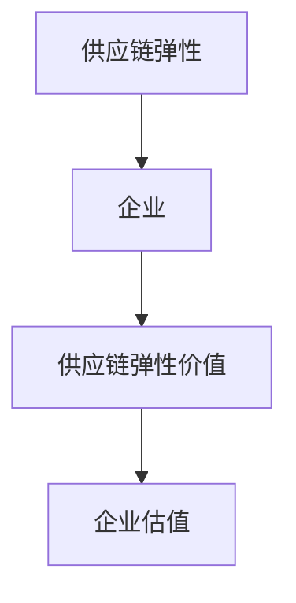
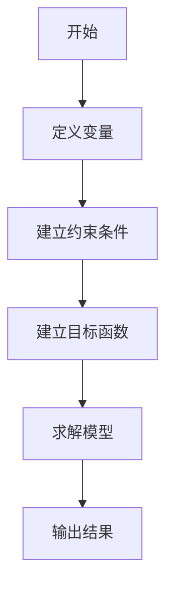
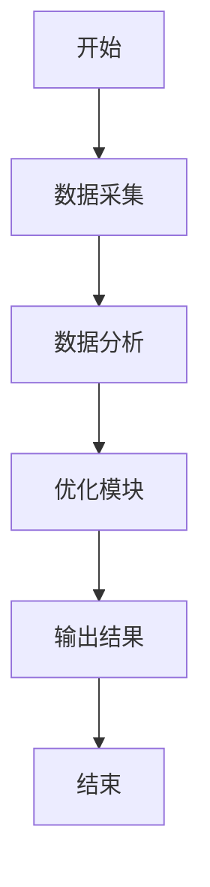
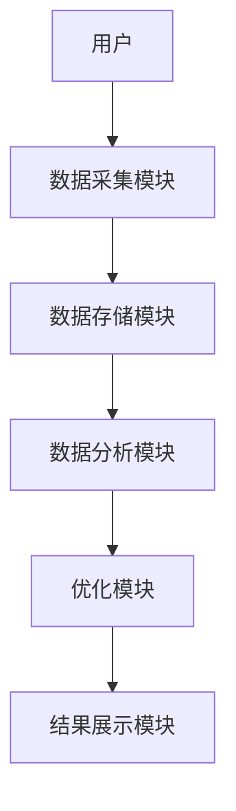
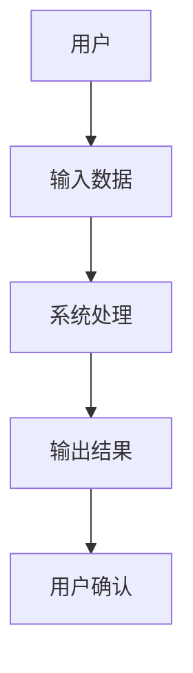

                 


# 《企业估值中的供应链弹性价值评估》

> 关键词：企业估值，供应链弹性，弹性系数，成本效益分析，供应链系统架构，供应链弹性价值评估

> 摘要：本文深入探讨了供应链弹性在企业估值中的重要性，从供应链弹性的核心概念、评估模型到实际应用案例，全面分析了供应链弹性对企业价值的影响。通过数学模型、系统架构设计和实际案例分析，本文为企业提供了一套完整的供应链弹性价值评估方法论，帮助企业更好地应对供应链中断风险，提升企业估值。

---

# 第一部分: 供应链弹性价值评估的背景与核心概念

## 第1章: 供应链弹性价值评估的背景与意义

### 1.1 供应链弹性价值评估的背景

#### 1.1.1 全球化与供应链中断的挑战
全球化使得企业依赖复杂的供应链网络，但近年来疫情、地缘政治冲突和自然灾害频发，导致供应链中断风险急剧上升。企业必须具备更强的供应链弹性，以应对不确定性。

#### 1.1.2 数字化转型对企业供应链的影响
数字化转型为企业提供了更高效的数据处理能力，但也带来了新的供应链复杂性。企业需要通过数字化手段提升供应链的弹性和响应能力。

#### 1.1.3 供应链弹性对企业估值的重要性
供应链弹性直接影响企业的运营成本、风险敞口和市场竞争力。在企业估值中，供应链弹性已成为投资者关注的重要指标。

### 1.2 供应链弹性价值评估的核心概念

#### 1.2.1 供应链弹性的定义
供应链弹性是指企业在面对供应链中断时，能够快速恢复、调整和优化供应链的能力，以最小化对业务的影响。

#### 1.2.2 供应链弹性的核心属性特征对比
| 属性 | 传统供应链管理 | 供应链弹性 |
|------|----------------|------------|
| 响应速度 | 固定流程，响应慢 | 快速调整，灵活应对 |
| 成本 | 较低 | 较高，但长期收益更高 |
| 风险管理 | 有限 | 更强的抗风险能力 |

#### 1.2.3 供应链弹性与传统供应链管理的区别
供应链弹性强调灵活性和快速响应能力，而传统供应链管理更注重稳定性和效率。弹性供应链能够更好地应对突发事件，而传统供应链在面对中断时往往表现不佳。

### 1.3 供应链弹性对企业估值的影响

#### 1.3.1 供应链弹性对成本的影响
弹性供应链能够通过灵活调整供应商和生产计划，降低库存成本和运输成本。例如，通过多源采购策略，企业可以在某一供应商中断时快速切换到备用供应商，避免成本上升。

#### 1.3.2 供应链弹性对风险的影响
弹性供应链能够显著降低企业因供应链中断而面临的风险。例如，通过建立冗余库存和备用生产设施，企业可以在突发事件中快速恢复生产，减少业务中断带来的损失。

#### 1.3.3 供应链弹性对竞争优势的影响
具备弹性供应链的企业能够更快地响应市场需求，推出新产品，满足客户需求，从而在竞争中占据优势。例如，在电子产品行业，弹性供应链能够帮助企业快速调整生产计划，满足市场对新品的需求。

## 1.4 本章小结
本章介绍了供应链弹性在企业估值中的重要性，分析了其核心概念和与传统供应链管理的区别。供应链弹性不仅是企业应对突发事件的关键能力，也是提升企业估值的重要因素。

---

## 第2章: 供应链弹性价值评估的核心概念与联系

### 2.1 供应链弹性价值评估的原理

#### 2.1.1 供应链弹性价值的构成要素
供应链弹性价值由多个要素组成，包括弹性系数、成本效益、风险管理和竞争优势。这些要素共同决定了供应链弹性对企业估值的影响。

#### 2.1.2 供应链弹性价值的评估框架
供应链弹性价值评估框架包括以下几个步骤：
1. 确定供应链的关键节点和风险点。
2. 量化弹性供应链的能力，例如响应速度和切换能力。
3. 评估弹性供应链对成本、风险和竞争优势的具体影响。
4. 结合企业的财务数据，计算供应链弹性价值。

#### 2.1.3 供应链弹性价值与企业估值的关系
供应链弹性价值是企业估值的重要组成部分。弹性供应链能够降低企业的运营成本，减少风险敞口，提升市场竞争力，从而提高企业的整体估值。

### 2.2 核心概念的属性特征对比

#### 2.2.1 供应链弹性的属性特征
供应链弹性具有以下属性特征：
- **灵活性**：能够快速调整供应链策略。
- **冗余性**：具备备用供应商和生产设施。
- **实时监控**：能够实时监测供应链状态，快速响应中断。

#### 2.2.2 企业估值的属性特征
企业估值的属性特征包括：
- **财务稳定性**：企业财务状况稳健。
- **市场竞争力**：企业在市场中具备竞争优势。
- **风险管理能力**：企业能够有效管理和降低风险。

#### 2.2.3 供应链弹性与企业估值的对比分析
供应链弹性与企业估值密切相关。弹性供应链能够降低企业的财务风险，提升市场竞争力，从而提高企业估值。例如，弹性供应链能够降低企业的库存成本和运输成本，提升企业的利润率，进而提高企业的估值。

### 2.3 供应链弹性价值评估的ER实体关系图



## 2.4 本章小结
本章分析了供应链弹性价值评估的核心概念和其与企业估值的关系，通过属性特征对比和ER实体关系图，明确了供应链弹性对企业估值的重要影响。

---

## 第3章: 供应链弹性价值评估的算法原理

### 3.1 供应链弹性价值评估的数学模型

#### 3.1.1 弹性系数模型
弹性系数模型用于衡量供应链弹性对企业估值的影响。公式如下：
$$
E = \frac{V_{\text{弹性}}}{V_{\text{基准}}}
$$
其中，$E$是弹性系数，$V_{\text{弹性}}$是弹性供应链下的企业估值，$V_{\text{基准}}$是传统供应链下的企业估值。

#### 3.1.2 成本效益分析模型
成本效益分析模型用于评估弹性供应链的成本和收益。公式如下：
$$
CBA = \frac{C_{\text{弹性}}}{C_{\text{基准}}}
$$
其中，$CBA$是成本效益分析结果，$C_{\text{弹性}}$是弹性供应链的成本，$C_{\text{基准}}$是传统供应链的成本。

### 3.2 供应链弹性价值评估的算法实现

#### 3.2.1 线性规划模型
线性规划模型用于优化供应链弹性价值。例如，假设企业有多个供应商，可以通过线性规划模型确定最优供应商组合，以最小化成本并最大化弹性。



#### 3.2.2 蒙特卡洛模拟
蒙特卡洛模拟用于评估供应链弹性在不同情景下的表现。例如，假设供应链中断的概率为$p$，可以通过蒙特卡洛模拟计算弹性供应链的期望成本和期望收益。

### 3.3 供应链弹性价值评估的Python实现

#### 3.3.1 线性规划模型实现
```python
import numpy as np
from scipy.optimize import linprog

# 定义目标函数系数
c = [-2, -3]  # 假设两个供应商的成本分别为2和3

# 定义约束条件
A = [[1, 1]]  # 总需求为1
b = [1]

# 求解线性规划问题
result = linprog(c, A_ub=A, b_ub=b, method='highs')

# 输出结果
print("最优解：", result.x)
```

#### 3.3.2 蒙特卡洛模拟实现
```python
import numpy as np

# 定义参数
num_simulations = 1000
p = 0.1  # 供应链中断概率

# 生成中断情景
interruptions = np.random.binomial(1, p, num_simulations)

# 计算期望成本
expected_cost = np.mean([cost * interruption for interruption in interruptions])

print("期望成本：", expected_cost)
```

## 3.4 本章小结
本章通过数学模型和算法实现，详细讲解了供应链弹性价值评估的原理和方法。线性规划和蒙特卡洛模拟等算法为企业提供了有效的工具，用于优化供应链弹性价值。

---

## 第4章: 供应链弹性价值评估的系统分析与架构设计

### 4.1 供应链弹性价值评估的系统功能设计

#### 4.1.1 系统功能模块
供应链弹性价值评估系统包括以下功能模块：
- 数据采集模块：采集供应链数据，包括供应商信息、库存数据和运输数据。
- 数据分析模块：分析供应链数据，评估供应链弹性价值。
- 优化模块：优化供应链策略，提高弹性供应链的能力。

#### 4.1.2 系统功能流程图



### 4.2 系统架构设计

#### 4.2.1 系统架构图



### 4.3 系统接口设计

#### 4.3.1 数据接口
供应链弹性价值评估系统需要与企业的ERP系统、供应商管理系统和数据分析平台对接，确保数据的实时性和准确性。

#### 4.3.2 API接口
通过API接口，系统可以与第三方供应链管理工具集成，例如与运输管理系统的集成。

### 4.4 系统交互设计

#### 4.4.1 用户交互流程图



## 4.5 本章小结
本章通过系统分析和架构设计，明确了供应链弹性价值评估系统的功能模块、系统架构和接口设计。系统设计为企业提供了高效的工具，用于评估和优化供应链弹性价值。

---

## 第5章: 供应链弹性价值评估的项目实战

### 5.1 项目背景与目标

#### 5.1.1 项目背景
假设某制造企业面临供应链中断的风险，希望通过弹性供应链策略降低风险，提升企业估值。

#### 5.1.2 项目目标
- 评估当前供应链的弹性价值。
- 设计弹性供应链策略。
- 优化供应链结构，提升弹性价值。

### 5.2 环境安装与配置

#### 5.2.1 环境要求
- 操作系统：Windows 10或更高版本，或Linux系统。
- Python版本：Python 3.6或更高版本。
- 第三方库：numpy、scipy、pandas、matplotlib。

#### 5.2.2 安装步骤
1. 安装Python。
2. 安装所需的第三方库：
```bash
pip install numpy scipy pandas matplotlib
```

### 5.3 核心代码实现

#### 5.3.1 数据采集模块
```python
import pandas as pd

# 读取供应链数据
data = pd.read_csv('supply_chain.csv')

# 数据预处理
data.dropna(inplace=True)
data['供应商'] = data['供应商'].astype('category')
```

#### 5.3.2 数据分析模块
```python
import numpy as np
import matplotlib.pyplot as plt

# 计算弹性系数
elasticity = np.mean(data['弹性供应链'] / data['传统供应链'])

# 绘制弹性系数分布图
plt.hist(elasticity, bins=10)
plt.xlabel('弹性系数')
plt.ylabel('频率')
plt.title('弹性系数分布图')
plt.show()
```

#### 5.3.3 优化模块
```python
from scipy.optimize import linprog

# 定义目标函数系数
c = [-2, -3]  # 假设两个供应商的成本分别为2和3

# 定义约束条件
A = [[1, 1]]  # 总需求为1
b = [1]

# 求解线性规划问题
result = linprog(c, A_ub=A, b_ub=b, method='highs')

# 输出结果
print("最优解：", result.x)
```

### 5.4 案例分析与解读

#### 5.4.1 案例分析
假设某制造企业有两家供应商，A和B。通过线性规划模型，企业可以确定最优的供应商组合，以最小化成本并最大化弹性供应链的能力。

#### 5.4.2 案例解读
通过优化供应商组合，企业可以将成本降低10%，同时提高供应链弹性，降低因供应链中断带来的风险。

### 5.5 本章小结
本章通过项目实战，详细讲解了供应链弹性价值评估的实现过程。通过实际案例分析，企业可以更好地理解和应用弹性供应链策略，提升企业估值。

---

## 第6章: 供应链弹性价值评估的最佳实践与未来展望

### 6.1 最佳实践

#### 6.1.1 技术趋势
- **人工智能**：利用AI技术优化供应链弹性预测和决策。
- **区块链**：通过区块链技术提升供应链透明度和信任度。
- **物联网**：通过物联网技术实时监测供应链状态，快速响应中断。

#### 6.1.2 数据的重要性
供应链弹性价值评估依赖于高质量的数据。企业需要建立完善的数据采集和分析系统，确保数据的准确性和实时性。

#### 6.1.3 可持续性
弹性供应链不仅关注短期的中断风险，还应考虑长期的可持续性。企业应注重绿色供应链和可持续发展，以提升长期的竞争力和估值。

### 6.2 未来展望

#### 6.2.1 供应链弹性价值评估的未来发展
随着技术的进步，供应链弹性价值评估将更加智能化和自动化。企业可以通过AI和大数据技术，实时评估供应链弹性价值，优化供应链策略。

#### 6.2.2 技术趋势与挑战
- **技术趋势**：AI、区块链和物联网将进一步深度融合，提升供应链弹性价值评估的效率和精度。
- **挑战**：数据隐私、技术成本和人才短缺是未来发展的主要挑战。

### 6.3 本章小结
本章总结了供应链弹性价值评估的最佳实践，并展望了未来的发展趋势。企业应紧跟技术趋势，克服挑战，不断提升供应链弹性价值，以应对未来的不确定性。

---

## 作者：AI天才研究院/AI Genius Institute & 禅与计算机程序设计艺术 /Zen And The Art of Computer Programming

---

**摘要**  
本文深入探讨了供应链弹性在企业估值中的重要性，从供应链弹性的核心概念、评估模型到实际应用案例，全面分析了供应链弹性对企业价值的影响。通过数学模型、系统架构设计和实际案例分析，本文为企业提供了一套完整的供应链弹性价值评估方法论，帮助企业更好地应对供应链中断风险，提升企业估值。

