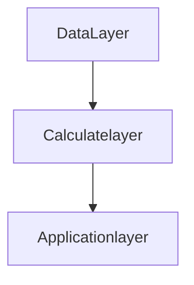
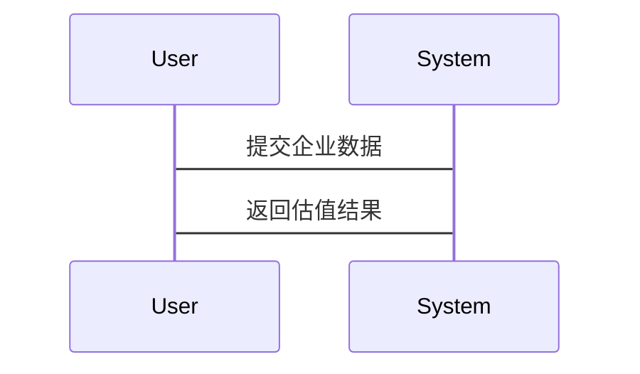

                 


# 《企业估值中的光计算技术潜力评估》

## 关键词：
- 光计算技术
- 企业估值
- 计算潜力
- 数学模型
- 优化算法

## 摘要：
光计算技术作为一种新兴的计算范式，正在逐步改变企业估值的传统方法。本文系统地探讨了光计算技术在企业估值中的应用潜力，分析了其核心概念、算法原理、系统架构以及实际案例。通过对比光计算技术与传统计算技术的优劣，本文揭示了光计算技术在提升估值效率、降低计算成本和提高计算精度方面的独特优势。同时，本文还详细阐述了光计算技术的数学模型和优化算法，并通过实际项目案例展示了其在企业估值中的具体应用。最后，本文总结了光计算技术在企业估值中的未来发展方向和最佳实践。

---

# 第1章: 光计算技术与企业估值背景

## 1.1 光计算技术的定义与特点
### 1.1.1 光计算技术的基本概念
光计算技术是一种基于光波特性进行信息处理和计算的技术，其核心在于利用光的物理性质（如干涉、衍射等）来实现数据的并行处理和高速计算。

### 1.1.2 光计算技术的核心优势
1. **并行计算能力**：光计算可以同时处理大量数据，显著提高计算效率。
2. **低能耗**：光计算技术在数据传输和处理过程中能耗较低，符合绿色计算的趋势。
3. **高速性**：光速远高于电速，使得光计算技术在数据处理速度上具有显著优势。

### 1.1.3 光计算技术的局限性
1. **技术复杂性**：光计算技术的实现需要高精度的光学元件和复杂的系统设计。
2. **稳定性问题**：光波在传输过程中容易受到环境因素（如温度、震动）的影响，导致计算结果不稳定。
3. **成本较高**：目前光计算技术的硬件实现成本较高，尚未大规模普及。

## 1.2 企业估值的基本原理
### 1.2.1 企业估值的定义与方法
企业估值是指对企业整体或其组成部分的价值进行评估的过程。常用的方法包括DCF模型、市盈率法、市净率法等。

### 1.2.2 传统企业估值技术的优缺点
1. **优点**：传统估值方法基于财务数据和市场指标，具有较高的可操作性和可验证性。
2. **缺点**：传统方法计算复杂度高，依赖大量历史数据，且难以应对实时数据处理需求。

### 1.2.3 光计算技术在企业估值中的潜力
光计算技术的高速性和并行性为复杂的企业估值模型提供了新的计算思路，特别是在处理海量数据和实时估值场景中具有显著优势。

---

# 第2章: 光计算技术的核心概念与原理

## 2.1 光计算技术的基本原理
### 2.1.1 光计算的基本概念
光计算利用光的物理特性进行信息处理，主要包括光的干涉、衍射和散射等现象。

### 2.1.2 光计算的基本原理与数学模型
光计算的核心是将数学问题转化为光的物理过程。例如，矩阵运算可以通过光的干涉实现，信号处理可以通过光的衍射完成。

### 2.1.3 光计算技术的实现方式
1. **空间光调制**：利用空间光调制器对光信号进行编码和解码。
2. **光学矩阵乘法**：通过光学元件实现矩阵乘法运算。
3. **光学相关检测**：利用光的干涉特性进行信号匹配和检测。

## 2.2 光计算技术与传统计算技术的对比
### 2.2.1 计算速度对比
- **光计算**：并行计算能力强，适合处理大规模数据。
- **传统计算**：串行计算，依赖 CPU 和 GPU 的并行处理能力。

### 2.2.2 能耗对比
- **光计算**：低能耗，适合绿色计算。
- **传统计算**：能耗较高，尤其是在大规模数据处理时。

### 2.2.3 系统复杂度对比
- **光计算**：系统设计复杂，需要高精度光学元件。
- **传统计算**：系统设计相对成熟，技术门槛较低。

## 2.3 光计算技术的核心优势与挑战
### 2.3.1 光计算技术的核心优势
1. **高速性**：光速远高于电速，适合实时数据处理。
2. **并行性**：光计算可以同时处理大量数据，提高计算效率。
3. **低能耗**：光计算技术在数据传输和处理过程中能耗较低。

### 2.3.2 光计算技术的主要挑战
1. **技术复杂性**：光计算技术的实现需要高精度的光学元件和复杂的系统设计。
2. **稳定性问题**：光波在传输过程中容易受到环境因素的影响，导致计算结果不稳定。
3. **成本较高**：目前光计算技术的硬件实现成本较高，尚未大规模普及。

---

# 第3章: 光计算技术在企业估值中的应用潜力

## 3.1 企业估值中的关键问题
### 3.1.1 企业价值的评估难度
企业估值需要考虑多种因素，包括财务数据、市场环境、行业趋势等，具有较高的复杂性。

### 3.1.2 数据处理的复杂性
企业估值通常需要处理大量数据，包括财务报表、市场数据、行业信息等，数据处理的复杂性较高。

### 3.1.3 高效计算的需求
随着数据量的不断增加，企业估值对计算效率的需求也在不断提高。

## 3.2 光计算技术在企业估值中的应用
### 3.2.1 光计算技术在数据处理中的应用
光计算技术可以实现数据的快速并行处理，显著提高数据处理效率。

### 3.2.2 光计算技术在模型计算中的应用
光计算技术可以实现复杂模型的高效计算，例如 DCF 模型和市场乘数模型。

### 3.2.3 光计算技术在决策支持中的应用
光计算技术可以通过实时数据分析，为企业决策提供支持。

## 3.3 光计算技术对估值效率的提升
### 3.3.1 提高计算速度
光计算技术的并行性可以显著提高计算速度，缩短估值时间。

### 3.3.2 降低计算成本
光计算技术的低能耗特性可以降低计算成本，尤其是在大规模数据处理时。

### 3.3.3 提高计算精度
光计算技术可以通过优化算法提高计算精度，确保估值结果的准确性。

---

# 第4章: 光计算技术的数学模型与算法原理

## 4.1 光计算技术的数学模型
### 4.1.1 基本数学模型
光计算技术的数学模型主要包括矩阵运算、信号处理和优化算法等。

### 4.1.2 光计算技术的核心算法
光计算技术的核心算法包括光学矩阵乘法、光学相关检测和光学优化算法等。

### 4.1.3 光计算技术的优化算法
光计算技术的优化算法包括非线性优化算法和分布式优化算法等。

## 4.2 光计算技术的算法实现
### 4.2.1 算法实现的基本步骤
1. **数据编码**：将输入数据编码为光信号。
2. **光信号处理**：利用光学元件对光信号进行处理。
3. **结果解码**：将处理后的光信号解码为数字结果。

### 4.2.2 算法实现的数学模型
$$ y = f(x) $$

其中，$x$ 是输入数据，$y$ 是输出结果，$f$ 是光计算算法的核心函数。

### 4.2.3 算法实现的优化策略
1. **并行计算**：利用光计算技术的并行性提高计算效率。
2. **低能耗**：优化算法设计，降低计算能耗。

---

# 第5章: 光计算技术的系统分析与架构设计

## 5.1 问题场景介绍
企业估值需要处理大量数据，传统计算技术难以满足高效计算的需求。

## 5.2 系统功能设计
### 5.2.1 领域模型设计
- **数据输入模块**：接收企业财务数据和市场数据。
- **光计算模块**：实现数据的并行处理和模型计算。
- **结果输出模块**：输出估值结果和相关报告。

### 5.2.2 系统架构设计
- **数据层**：存储企业财务数据和市场数据。
- **计算层**：实现光计算技术的核心算法。
- **应用层**：提供用户界面和结果展示。

## 5.3 系统架构设计图


## 5.4 系统接口设计
### 5.4.1 接口描述
1. **数据输入接口**：接收企业财务数据和市场数据。
2. **计算接口**：实现光计算技术的核心算法。
3. **结果输出接口**：输出估值结果和相关报告。

### 5.4.2 接口交互设计


---

# 第6章: 项目实战与案例分析

## 6.1 项目环境安装
### 6.1.1 硬件环境
1. 高精度光学元件
2. 光计算系统控制器
3. 数据采集设备

### 6.1.2 软件环境
1. 光计算算法库
2. 数据处理工具

## 6.2 核心代码实现
### 6.2.1 光计算算法实现
```python
def optical_computation(data):
    # 光计算算法核心代码
    pass
```

### 6.2.2 数据处理代码
```python
def data_processing(data):
    # 数据预处理代码
    return processed_data
```

## 6.3 代码应用解读与分析
### 6.3.1 代码功能解读
1. 数据预处理：对输入数据进行清洗和转换。
2. 光计算算法：实现数据的并行处理和模型计算。
3. 结果输出：将计算结果输出为报告或可视化界面。

### 6.3.2 代码实现优势
1. 提高计算速度
2. 降低计算成本
3. 提高计算精度

## 6.4 实际案例分析
### 6.4.1 案例背景
某企业需要对其未来五年的价值进行估值，传统方法需要数周时间，而光计算技术可以在数小时内完成。

### 6.4.2 案例分析
通过光计算技术实现企业估值模型的高效计算，显著缩短估值时间，提高估值准确性。

## 6.5 项目小结
光计算技术在企业估值中的应用显著提高了计算效率和精度，为企业决策提供了有力支持。

---

# 第7章: 光计算技术的最佳实践

## 7.1 小结
光计算技术作为一种新兴的计算范式，具有显著的优势和潜力，特别是在企业估值中具有广阔的应用前景。

## 7.2 注意事项
1. 光计算技术的实现需要高精度的光学元件和复杂的系统设计。
2. 光计算技术的稳定性问题需要在实际应用中加以解决。
3. 光计算技术的成本较高，需要在实际应用中加以控制。

## 7.3 拓展阅读
1. 光计算技术的发展现状与未来趋势
2. 光计算技术在其他领域的应用潜力
3. 光计算技术的优化算法研究

---

# 作者：AI天才研究院/AI Genius Institute & 禅与计算机程序设计艺术 /Zen And The Art of Computer Programming

