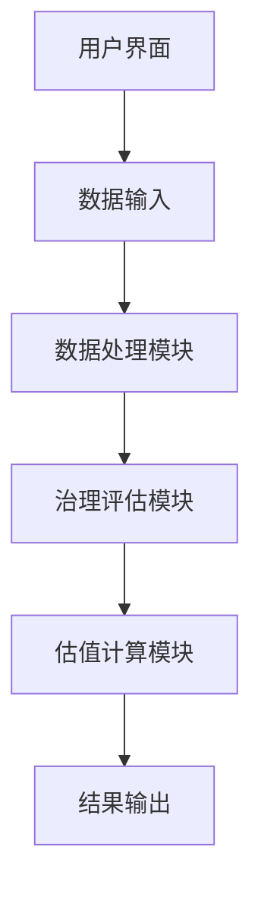

                 

# 《企业估值中的公司治理因素》

## 目录

### 第1章：企业估值与公司治理的背景

#### 1.1 公司治理的基本概念
- 1.1.1 公司治理的定义
- 1.1.2 公司治理的核心要素
- 1.1.3 公司治理与企业价值的关系

#### 1.2 企业估值的基本原理
- 1.2.1 企业估值的定义
- 1.2.2 企业估值的主要方法
- 1.2.3 公司治理在估值中的作用

#### 1.3 公司治理与企业估值的关联
- 1.3.1 公司治理对企业价值的影响
- 1.3.2 公司治理在估值中的重要性
- 1.3.3 公司治理与企业估值的边界与外延

### 第2章：公司治理的核心要素

#### 2.1 董事会结构
- 2.1.1 董事会的组成与职责
- 2.1.2 董事会结构对估值的影响

#### 2.2 管理层治理
- 2.2.1 管理层的职责与权力
- 2.2.2 管理层治理对估值的影响

#### 2.3 股权结构
- 2.3.1 股权结构的类型
- 2.3.2 股权结构对治理的影响

### 第3章：公司治理因素对估值的影响

#### 3.1 公司治理与企业价值的关系
- 3.1.1 公司治理对企业价值的正向影响
- 3.1.2 公司治理对企业价值的负向影响

#### 3.2 公司治理在不同行业中的应用
- 3.2.1 高科技行业的治理因素
- 3.2.2 制造业的治理因素

#### 3.3 公司治理因素的量化分析
- 3.3.1 治理因素的量化指标
- 3.3.2 治理因素对估值的调整方法

### 第4章：公司治理与企业价值的数学模型

#### 4.1 模型概述
- 4.1.1 模型的基本假设
- 4.1.2 模型的输入变量

#### 4.2 模型的构建
- 4.2.1 模型的结构
- 4.2.2 模型的公式推导

#### 4.3 模型的验证与应用
- 4.3.1 模型的验证方法
- 4.3.2 模型的实际应用案例

### 第5章：公司治理对风险的影响

#### 5.1 公司治理与企业风险的关系
- 5.1.1 治理结构与企业风险
- 5.1.2 管理层治理与风险控制

#### 5.2 治理不善带来的风险
- 5.2.1 股权结构不合理的影响
- 5.2.2 董事会治理失效的风险

#### 5.3 风险对估值的影响
- 5.3.1 风险评估在估值中的应用
- 5.3.2 风险调整的数学模型

### 第6章：公司治理系统的架构设计

#### 6.1 系统功能设计
- 6.1.1 系统模块划分
- 6.1.2 系统功能流程

#### 6.2 系统架构设计
- 6.2.1 系统架构图
- 6.2.2 系统组件交互

#### 6.3 系统接口设计
- 6.3.1 输入接口设计
- 6.3.2 输出接口设计

### 第7章：项目实战

#### 7.1 环境安装
- 7.1.1 系统运行环境
- 7.1.2 工具安装与配置

#### 7.2 核心实现
- 7.2.1 数据收集与处理
- 7.2.2 模型实现与优化

#### 7.3 案例分析
- 7.3.1 实际案例选择
- 7.3.2 分析结果解读

### 第8章：总结与展望

#### 8.1 全书总结
- 8.1.1 核心观点回顾
- 8.1.2 重点内容总结

#### 8.2 最佳实践
- 8.2.1 优化公司治理的建议
- 8.2.2 未来研究方向

#### 8.3 注意事项
- 8.3.1 模型应用中的注意事项
- 8.3.2 实际操作中的风险提示

### 附录

#### 附录A：数学公式汇总
- 4.2.2 公司治理数学模型公式

#### 附录B：系统架构图
- 6.2.1 系统架构mermaid图

#### 附录C：参考文献
- 相关文献和资料的引用

### 作者：AI天才研究院/AI Genius Institute & 禅与计算机程序设计艺术 /Zen And The Art of Computer Programming

---

### 详细章节内容

#### 1.1.1 公司治理的定义
公司治理是指通过一系列制度、机制和流程来确保公司高效运作、透明决策和合规经营。它涉及董事会、管理层和股东之间的关系，确保各方利益得到平衡和保护。

#### 1.2.1 企业估值的定义
企业估值是通过对企业未来现金流的折现来确定其价值的过程。常用的估值方法包括DCF模型、相对估值法等。

#### 4.2.2 模型的公式推导
公司治理价值调整模型：
$$ V = V_{DCF} \times (1 + \beta \times GC) $$
其中，V是调整后的估值，V_{DCF}是基于现金流的估值，β是治理因素的敏感系数，GC是治理指数。

#### 6.2.1 系统架构图

---

通过以上目录结构，文章将系统地探讨公司治理如何影响企业估值，从理论到实践，从模型构建到系统设计，为读者提供全面深入的分析和指导。

