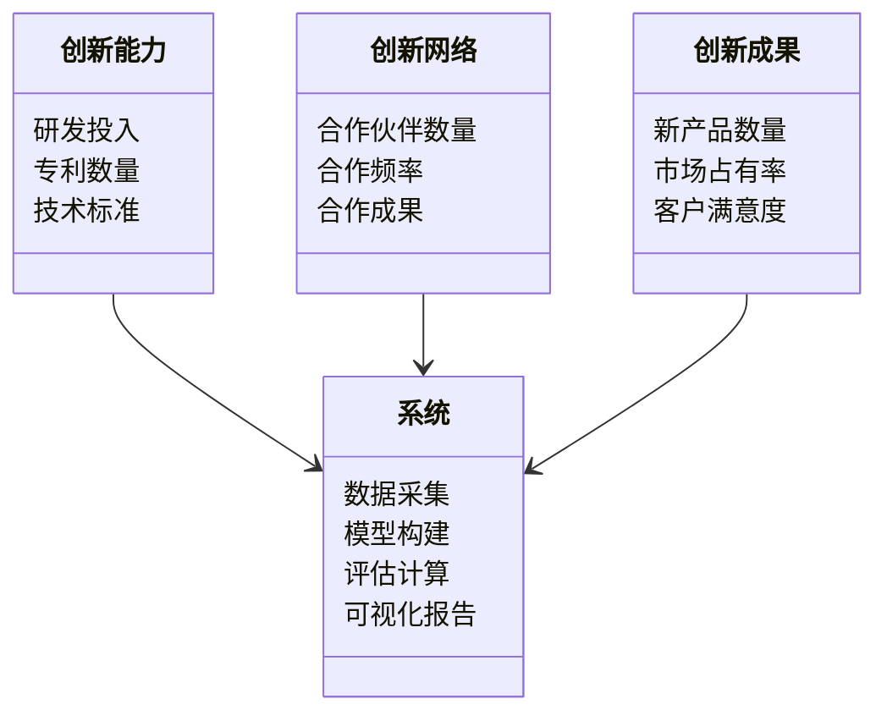
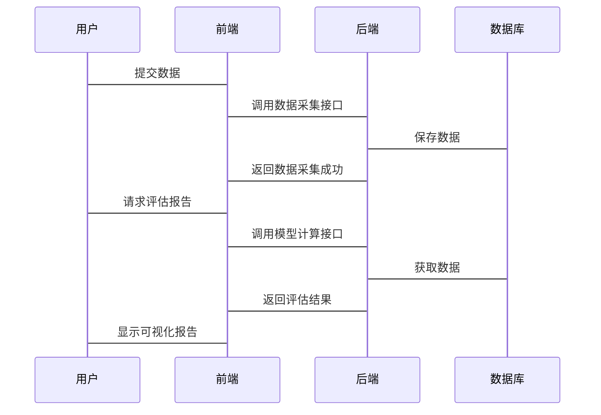

                 


# 企业估值中的创新生态系统价值评估

**关键词**：企业估值、创新生态系统、价值评估、创新资源、协同效应

**摘要**：本文探讨了创新生态系统在企业估值中的重要性，通过分析创新生态系统的核心概念、价值构成、评估方法和系统架构，提出了一套基于创新生态系统的价值评估模型。文章从创新生态系统的背景、核心要素、算法原理、系统设计、项目实战等多个维度展开，详细阐述了创新生态系统对企业价值的影响及其在实际估值中的应用。本文旨在为企业估值提供新的视角和方法，帮助企业在复杂多变的市场环境中更好地评估和优化创新生态系统价值。

---

## 第一章：创新生态系统与企业估值的背景

### 1.1 创新生态系统的基本概念

#### 1.1.1 创新生态系统的定义
创新生态系统（Innovation Ecosystem）是指由企业、研发团队、合作伙伴、技术、数据、人才等要素构成的复杂系统，这些要素通过协同作用，共同推动企业的创新能力、创新成果和创新环境的优化。创新生态系统不仅包括企业的内部创新资源，还涵盖了外部合作伙伴、市场环境和政策支持等因素。

#### 1.1.2 创新生态系统的核心要素
创新生态系统的核心要素可以分为三类：
- **创新主体**：包括企业、研发团队、合作伙伴、客户等。
- **创新资源**：包括技术、数据、资金、人才等。
- **创新环境**：包括政策、市场、文化等因素。

#### 1.1.3 创新生态系统与企业估值的关系
创新生态系统是企业核心竞争力的重要组成部分。通过优化创新生态系统，企业可以提升技术创新能力、加快产品迭代速度、降低创新成本，并在竞争中占据优势地位。因此，创新生态系统的价值直接影响企业的市场价值。

---

### 1.2 企业估值的传统方法与挑战

#### 1.2.1 传统企业估值方法概述
传统的企业估值方法主要包括资产基础法、收益法和市场法。资产基础法基于企业的资产价值进行评估；收益法基于企业的未来现金流折现值进行评估；市场法基于类似企业的市场交易情况进行评估。

#### 1.2.2 传统方法的局限性
传统估值方法主要关注企业的财务数据和市场表现，难以全面反映企业的创新能力、创新资源和创新环境的价值。特别是在科技企业和创新型企业中，创新生态系统对企业价值的影响更为显著，传统方法往往无法准确评估这些因素。

#### 1.2.3 创新生态系统对企业估值的影响
创新生态系统通过优化资源配置、提升协同效应和加速创新进程，显著提升了企业的市场竞争力和长期价值。因此，在企业估值中，必须将创新生态系统作为一个独立的价值评估维度。

---

### 1.3 创新生态系统价值评估的必要性

#### 1.3.1 创新在企业价值中的作用
创新是企业差异化竞争的核心驱动力。通过创新，企业可以推出新产品、优化业务模式、降低成本，并在市场中占据领先地位。

#### 1.3.2 创新生态系统对企业竞争力的影响
创新生态系统通过整合内部资源和外部合作伙伴，形成了强大的协同效应，进一步提升了企业的创新能力。这种协同效应不仅体现在技术层面，还包括组织结构、管理流程和文化氛围等多个方面。

#### 1.3.3 企业估值中的创新生态系统价值评估的现状与趋势
随着科技的快速发展和市场竞争的加剧，创新生态系统在企业估值中的重要性日益凸显。越来越多的企业开始关注如何量化创新生态系统的价值，并将其纳入企业整体价值评估体系。

---

## 第二章：创新生态系统的核心概念与联系

### 2.1 创新生态系统的核心要素

#### 2.1.1 创新主体
创新主体是创新生态系统的核心驱动力。主要包括：
- **企业**：企业是创新的主体，负责制定创新战略、分配资源和管理创新过程。
- **研发团队**：研发团队是创新的核心力量，负责技术开发和产品创新。
- **合作伙伴**：合作伙伴包括供应商、客户、科研机构等，他们在创新过程中提供支持和资源。

#### 2.1.2 创新资源
创新资源是创新生态系统的重要支撑。主要包括：
- **技术资源**：包括专利、技术标准、研发成果等。
- **数据资源**：包括用户数据、市场数据、技术数据等。
- **人才资源**：包括研发人员、技术专家、管理人员等。

#### 2.1.3 创新环境
创新环境是创新生态系统的重要外部因素。主要包括：
- **政策环境**：包括政府政策、法律法规等。
- **市场环境**：包括市场需求、竞争状况等。
- **文化环境**：包括企业文化、创新氛围等。

---

### 2.2 创新生态系统价值的构成

#### 2.2.1 创新能力的价值
创新能力是创新生态系统的核心价值之一。强大的创新能力可以提升企业的技术优势、产品竞争力和市场地位。

#### 2.2.2 创新网络的价值
创新网络通过资源整合和协同效应，显著提升了企业的创新效率。创新网络的价值体现在资源配置效率、知识共享和风险分担等方面。

#### 2.2.3 创新成果的价值
创新成果是创新生态系统的重要产出。包括新产品、新技术、新业务模式等。创新成果的价值可以通过市场表现和财务数据进行量化。

---

### 2.3 创新生态系统与企业估值的关系

#### 2.3.1 创新生态系统对企业价值的影响
创新生态系统通过提升创新能力、优化资源配置和加速创新进程，显著提升了企业的市场竞争力和长期价值。

#### 2.3.2 创新生态系统在企业估值中的权重
在企业估值中，创新生态系统的重要性取决于企业的行业特征和创新战略。对于科技企业来说，创新生态系统是核心价值之一。

#### 2.3.3 创新生态系统价值评估的复杂性
创新生态系统是一个复杂的系统，其价值评估需要考虑多个维度，包括创新能力、创新网络、创新成果等。因此，创新生态系统价值评估的复杂性较高。

---

### 2.4 创新生态系统价值评估的边界与外延

#### 2.4.1 创新生态系统价值评估的边界
创新生态系统价值评估的边界包括：
- **内部边界**：企业的内部创新资源和能力。
- **外部边界**：外部合作伙伴、市场环境等。

#### 2.4.2 创新生态系统价值评估的外延
创新生态系统价值评估的外延包括：
- **技术创新**：技术开发、专利布局等。
- **商业模式创新**：业务模式、市场策略等。
- **组织创新**：组织结构、管理流程等。

#### 2.4.3 创新生态系统与企业其他价值的关系
创新生态系统与其他企业价值（如财务价值、市场价值）密切相关。创新生态系统通过提升企业的核心竞争力，间接影响企业的财务表现和市场价值。

---

## 第三章：创新生态系统价值评估的算法原理

### 3.1 创新生态系统价值评估的数学模型

#### 3.1.1 创新能力的量化模型
创新能力可以通过以下公式进行量化：
$$
V_c = \alpha \cdot C + \beta \cdot R
$$
其中，$C$ 表示创新能力，$R$ 表示创新资源，$\alpha$ 和 $\beta$ 是权重系数。

#### 3.1.2 创新网络的量化模型
创新网络的价值可以通过以下公式进行量化：
$$
V_n = \gamma \cdot S + \delta \cdot T
$$
其中，$S$ 表示协同效应，$T$ 表示创新网络的复杂性，$\gamma$ 和 $\delta$ 是权重系数。

#### 3.1.3 创新成果的量化模型
创新成果的价值可以通过以下公式进行量化：
$$
V_r = \epsilon \cdot P + \zeta \cdot M
$$
其中，$P$ 表示产品竞争力，$M$ 表示市场表现，$\epsilon$ 和 $\zeta$ 是权重系数。

---

### 3.2 创新生态系统价值评估的算法流程

#### 3.2.1 数据采集与处理
创新生态系统价值评估需要采集以下数据：
- 创新能力数据：包括研发投入、专利数量、技术标准等。
- 创新网络数据：包括合作伙伴数量、合作频率、合作成果等。
- 创新成果数据：包括新产品数量、市场占有率、客户满意度等。

#### 3.2.2 模型构建与参数设定
根据上述数学模型，构建创新生态系统价值评估模型，并设定权重系数 $\alpha, \beta, \gamma, \delta, \epsilon, \zeta$。

#### 3.2.3 计算与评估
通过数学公式计算创新生态系统各部分的价值，并综合评估创新生态系统整体价值。

---

### 3.3 创新生态系统价值评估的数学公式

#### 3.3.1 创新能力的评估公式
创新能力的评估公式为：
$$
C = \frac{\sum_{i=1}^{n} w_i \cdot c_i}{\sum_{i=1}^{n} w_i}
$$
其中，$w_i$ 是创新能力指标 $c_i$ 的权重，$n$ 是创新能力指标的数量。

#### 3.3.2 创新网络的评估公式
创新网络的评估公式为：
$$
S = \frac{\sum_{j=1}^{m} v_j \cdot s_j}{\sum_{j=1}^{m} v_j}
$$
其中，$v_j$ 是创新网络指标 $s_j$ 的权重，$m$ 是创新网络指标的数量。

#### 3.3.3 创新成果的评估公式
创新成果的评估公式为：
$$
P = \frac{\sum_{k=1}^{p} t_k \cdot p_k}{\sum_{k=1}^{p} t_k}
$$
其中，$t_k$ 是创新成果指标 $p_k$ 的权重，$p$ 是创新成果指标的数量。

---

## 第四章：系统分析与架构设计

### 4.1 问题场景介绍
创新生态系统价值评估是一个复杂的过程，需要结合企业的内部数据和外部环境进行综合分析。为了实现这一目标，我们需要构建一个创新生态系统价值评估系统，该系统能够帮助企业量化创新生态系统各部分的价值，并提供可视化报告。

---

### 4.2 项目介绍

#### 4.2.1 项目目标
本项目的目标是构建一个创新生态系统价值评估系统，实现对企业创新生态系统各部分价值的量化评估，并提供可视化报告。

#### 4.2.2 项目范围
本项目的研究范围包括：
- 创新能力评估
- 创新网络评估
- 创新成果评估
- 系统架构设计
- 项目实战与案例分析

---

### 4.3 系统功能设计

#### 4.3.1 领域模型
以下是创新生态系统价值评估系统的领域模型：



---

### 4.4 系统架构设计

#### 4.4.1 系统架构
以下是创新生态系统价值评估系统的架构图：


---

### 4.5 系统接口设计

#### 4.5.1 系统接口
系统接口主要通过 REST API 提供服务，包括：
- 数据采集接口
- 模型计算接口
- 报告生成接口

#### 4.5.2 系统交互
以下是系统交互的序列图：



---

## 第五章：项目实战

### 5.1 环境安装

#### 5.1.1 安装Python
安装Python 3.x版本，建议使用Anaconda。

#### 5.1.2 安装依赖库
安装以下依赖库：
- `numpy`
- `pandas`
- `scikit-learn`
- `matplotlib`

命令：
```
pip install numpy pandas scikit-learn matplotlib
```

---

### 5.2 核心实现

#### 5.2.1 创新能力评估代码
以下是创新能力评估的代码示例：

```python
import numpy as np
import pandas as pd

# 定义创新能力评估函数
def calculate创新能力(研发投资, 专利数量, 技术标准):
    # 设置权重
    w_research = 0.4
    w_patent = 0.3
    w_standard = 0.3
    # 计算创新能力
    总能力 = w_research * 研发投资 + w_patent * 专利数量 + w_standard * 技术标准
    return 总能力

# 示例数据
研发投资 = 100
专利数量 = 20
技术标准 = 10

# 调用函数
创新能力 = calculate创新能力(研发投资, 专利数量, 技术标准)
print("创新能力 =", 创新能力)
```

---

#### 5.2.2 创新网络评估代码
以下是创新网络评估的代码示例：

```python
import numpy as np
import pandas as pd

# 定义创新网络评估函数
def calculate创新网络(合作伙伴数量, 合作频率, 合作成果):
    # 设置权重
    w_partners = 0.4
    w_frequency = 0.3
    w_results = 0.3
    # 计算创新网络价值
    总价值 = w_partners * 合作伙伴数量 + w_frequency * 合作频率 + w_results * 合作成果
    return 总价值

# 示例数据
合作伙伴数量 = 15
合作频率 = 5
合作成果 = 3

# 调用函数
创新网络价值 = calculate创新网络(合作伙伴数量, 合作频率, 合作成果)
print("创新网络价值 =", 创新网络价值)
```

---

### 5.3 代码应用解读与分析

#### 5.3.1 创新能力评估代码解读
上述代码通过给定的研发投资、专利数量和技术标准，计算企业的创新能力。权重系数可以根据实际情况进行调整。

#### 5.3.2 创新网络评估代码解读
上述代码通过给定的合作伙伴数量、合作频率和合作成果，计算企业的创新网络价值。权重系数可以根据实际情况进行调整。

---

### 5.4 实际案例分析

#### 5.4.1 案例背景
某科技公司计划评估其创新生态系统价值。公司研发投入为100万元，专利数量为20项，技术标准为10项。合作伙伴数量为15家，合作频率为5次/年，合作成果为3项。

#### 5.4.2 评估结果
创新能力评估结果为：
$$
V_c = 0.4 \times 100 + 0.3 \times 20 + 0.3 \times 10 = 55
$$

创新网络评估结果为：
$$
V_n = 0.4 \times 15 + 0.3 \times 5 + 0.3 \times 3 = 7.5
$$

创新生态系统整体价值为：
$$
V = V_c + V_n = 55 + 7.5 = 62.5
$$

---

## 第六章：最佳实践与注意事项

### 6.1 最佳实践

#### 6.1.1 数据质量
创新生态系统价值评估依赖于高质量的数据。建议企业在数据采集过程中，确保数据的准确性和完整性。

#### 6.1.2 方法选择
根据企业的实际情况，选择合适的创新生态系统价值评估方法。对于科技企业，建议采用基于创新能力、创新网络和创新成果的综合评估模型。

#### 6.1.3 持续优化
创新生态系统是一个动态系统，需要持续优化和调整。企业应定期评估创新生态系统价值，并根据评估结果优化创新战略。

---

### 6.2 注意事项

#### 6.2.1 数据隐私
在创新生态系统价值评估过程中，需要注意数据隐私和安全问题，确保企业敏感数据不被泄露。

#### 6.2.2 方法适用性
创新生态系统价值评估方法具有一定的局限性。企业应根据实际情况，合理调整评估模型和权重系数。

#### 6.2.3 团队协作
创新生态系统价值评估需要多部门协作。企业应建立跨部门的协作机制，确保评估工作的顺利进行。

---

## 第七章：总结与展望

### 7.1 本章总结
本文从创新生态系统的核心概念、价值构成、评估方法和系统架构等多个维度，详细探讨了创新生态系统在企业估值中的重要性。通过构建创新生态系统价值评估模型，本文为企业提供了一种新的估值视角和方法。

### 7.2 未来展望
未来的研究可以进一步深化创新生态系统价值评估的理论和实践。例如，可以研究创新生态系统与企业财务表现的关系，探索创新生态系统动态评估模型，以及研究创新生态系统在不同行业中的应用。

---

## 作者：AI天才研究院/AI Genius Institute & 禅与计算机程序设计艺术/Zen And The Art of Computer Programming

