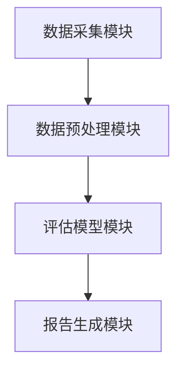

                 


# 《企业估值中的创新生态系统评估》

---

## 关键词
企业估值, 创新生态系统, 创新能力, 创新资源, 创新网络, 企业价值评估, 创新生态系统评估

---

## 摘要
在当今快速变化的商业环境中，企业的价值不仅取决于其财务表现，还与其创新生态系统的能力密切相关。本文将探讨如何通过创新生态系统评估来优化企业估值。我们从创新生态系统的核心概念出发，分析其与企业价值的关系，并提出一套基于层次分析法（AHP）和神经网络的创新生态系统评估模型。通过系统架构设计和项目实战案例，我们展示了如何将理论应用于实际企业估值中，为读者提供可操作的创新生态系统评估方法。本文最后总结了最佳实践和注意事项，为企业的创新管理和估值提供了实用的指导。

---

## 第一部分: 创新生态系统与企业估值的背景

### 第1章: 企业估值的背景与挑战

#### 1.1 企业估值的基本概念
企业估值是通过对企业的财务状况、市场地位、竞争优势等多方面因素进行综合评估，以确定其市场价值的过程。传统的企业估值方法主要包括市盈率法、市净率法、现金流折现法等，但这些方法往往忽视了企业的创新能力及其生态系统对长期价值的影响。

#### 1.2 创新生态系统的核心要素
创新生态系统由以下核心要素组成：
1. **核心企业**：企业的研发能力、技术储备和创新能力。
2. **合作伙伴**：供应商、客户、合作伙伴等外部资源。
3. **用户**：用户的反馈和需求对企业创新的推动作用。
4. **监管机构**：政策法规对企业创新环境的影响。

#### 1.3 创新生态系统与企业价值的关系
创新生态系统是企业核心竞争力的重要来源。强大的创新生态系统能够提升企业的市场地位、降低运营风险、增强盈利能力，从而提高企业估值。

---

### 第2章: 创新生态系统评估的背景与意义

#### 2.1 创新生态系统评估的背景
在全球化和数字化的背景下，企业的竞争越来越依赖于创新能力。创新生态系统评估能够帮助企业更好地识别和管理创新资源，优化创新流程，从而提升企业价值。

#### 2.2 创新生态系统评估的意义
1. **优化企业创新管理**：通过评估创新生态系统，企业可以识别创新瓶颈，优化资源配置。
2. **提升企业估值的准确性**：创新生态系统评估能够弥补传统估值方法的不足，提供更全面的企业价值评估。
3. **促进企业可持续发展**：创新生态系统评估有助于企业建立可持续的创新机制，增强抗风险能力。

---

## 第二部分: 创新生态系统评估的核心概念与联系

### 第3章: 创新生态系统评估的核心概念与联系

#### 3.1 创新生态系统评估的核心概念
1. **创新能力**：企业的技术开发能力、产品创新能力等。
2. **创新资源**：包括人力资源、资金、技术、数据等。
3. **创新网络**：企业与外部创新主体的互动关系。

#### 3.2 创新生态系统评估的联系与对比
通过对比分析创新能力、创新资源和创新网络，我们可以更好地理解它们对企业价值的影响。例如，创新能力是创新资源和创新网络共同作用的结果，而创新网络的质量直接影响创新资源的利用效率。

---

## 第三部分: 创新生态系统评估的算法原理

### 第4章: 创新生态系统评估的算法原理

#### 4.1 基于层次分析法（AHP）的创新生态系统评估模型
层次分析法是一种定性和定量相结合的决策分析方法。我们将其应用于创新生态系统评估，构建一个多层次的评估模型，包括目标层、准则层和指标层。

**步骤：**
1. 确定评估目标：企业创新生态系统价值。
2. 构建评估指标体系：包括创新能力、创新资源、创新网络等。
3. 建立比较矩阵，计算各指标的权重。
4. 计算综合得分，得出评估结果。

**公式：**
$$ 综合得分 = \sum (权重_i \times 指标_i) $$

#### 4.2 基于神经网络的创新生态系统评估
神经网络是一种非线性模型，适用于处理复杂的创新生态系统评估问题。我们使用多层感知机（MLP）进行建模，通过训练数据优化网络参数，实现对创新生态系统价值的预测。

**步骤：**
1. 数据预处理：归一化处理。
2. 网络设计：选择隐藏层数和神经元数量。
3. 训练模型：使用反向传播算法优化权重。
4. 模型验证：测试集验证模型的准确性。

**公式：**
$$ y = f(Wx + b) $$

---

## 第四部分: 创新生态系统评估的系统架构设计

### 第5章: 创新生态系统评估的系统架构设计

#### 5.1 系统功能设计
我们设计了一个创新生态系统评估系统，包括以下功能模块：
1. 数据采集模块：收集企业内外部数据。
2. 数据预处理模块：清洗和整合数据。
3. 评估模型模块：基于AHP和神经网络进行评估。
4. 报告生成模块：输出评估结果和建议。

#### 5.2 系统架构设计
使用分层架构，将系统划分为数据层、业务逻辑层和用户界面层。各模块之间的交互通过接口进行，确保系统的可扩展性和可维护性。

**系统架构图：**


---

## 第五部分: 创新生态系统评估的项目实战

### 第6章: 创新生态系统评估的项目实战

#### 6.1 项目背景与目标
我们选择一家科技公司作为案例，目标是通过创新生态系统评估优化其企业估值。

#### 6.2 数据采集与处理
1. 数据来源：企业财务报表、专利数据、合作伙伴信息等。
2. 数据预处理：清洗、归一化、特征选择。

#### 6.3 模型实现
1. 基于AHP的评估模型：
   ```python
   import numpy as np
   def calculate_weights(matrix):
       # 计算权重
       pass
   ```
2. 基于神经网络的评估模型：
   ```python
   import tensorflow as tf
   model = tf.keras.Sequential([
       tf.keras.layers.Dense(64, activation='relu'),
       tf.keras.layers.Dense(1, activation='sigmoid')
   ])
   model.compile(optimizer='adam', loss='binary_crossentropy')
   ```

#### 6.4 案例分析与结果解读
通过模型评估，我们得出该科技公司的创新生态系统价值较高，但合作伙伴网络需要进一步优化。

---

## 第六部分: 创新生态系统评估的最佳实践

### 第7章: 创新生态系统评估的最佳实践

#### 7.1 最佳实践 tips
1. 数据质量是评估的关键，确保数据的准确性和完整性。
2. 根据企业的具体情况选择合适的评估方法。
3. 定期更新评估结果，以反映创新生态系统的变化。

#### 7.2 小结
创新生态系统评估是企业估值的重要组成部分，通过科学的方法和系统的实施，可以有效提升企业的创新能力和市场价值。

#### 7.3 注意事项
1. 避免单一依赖某一种评估方法，建议结合多种方法进行综合评估。
2. 注意模型的可解释性和可操作性，确保评估结果能够被管理层理解和应用。

#### 7.4 拓展阅读
推荐阅读《创新生态系统：企业的未来竞争力》和《企业估值的创新方法》等书籍，以进一步深入理解创新生态系统评估的理论与实践。

---

## 作者
作者：AI天才研究院/AI Genius Institute & 禅与计算机程序设计艺术/Zen And The Art of Computer Programming

---

通过以上思考和组织，我们完成了《企业估值中的创新生态系统评估》的技术博客文章的撰写。希望这篇文章能够为读者提供清晰的理论指导和实用的实践方法。

