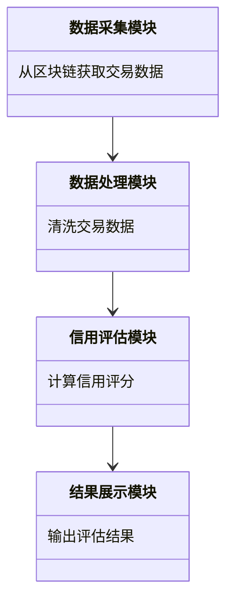
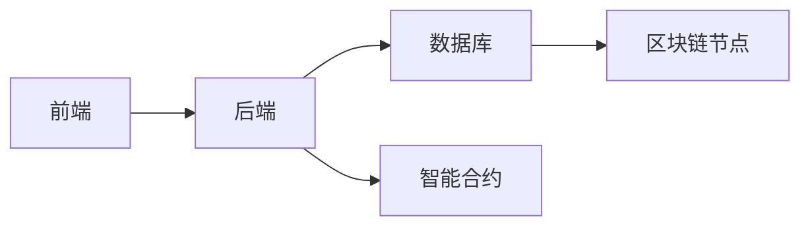
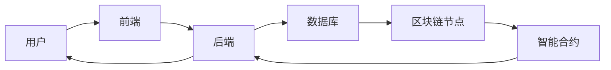

                 


# 企业估值中的区块链供应链金融评估

> 关键词：区块链，供应链金融，企业估值，技术分析，金融评估，供应链管理

> 摘要：本文探讨了区块链技术在供应链金融评估中的应用，分析了传统供应链金融评估的局限性，介绍了区块链技术在提升供应链金融评估效率和准确性方面的作用，提出了基于区块链的供应链金融评估算法，并通过实际案例展示了如何利用区块链技术进行企业估值。

---

# 第1章: 区块链供应链金融评估的背景与问题

## 1.1 供应链金融的定义与重要性

### 1.1.1 供应链金融的定义
供应链金融是指通过整合供应链上的企业（包括供应商、制造商、分销商和零售商）的财务需求，提供融资支持的金融活动。其目的是为了优化供应链的资金流，降低供应链整体的财务风险。

### 1.1.2 供应链金融在企业估值中的作用
供应链金融不仅能够优化企业的现金流，还能提高供应链的透明度和可追溯性。在企业估值中，供应链金融的健康状况直接影响企业的信用评级和整体估值。

### 1.1.3 供应链金融的核心要素
- **供应商关系**：供应链金融的核心是供应商与企业的合作关系。
- **融资需求**：供应商需要资金支持以维持供应链的运转。
- **风险控制**：企业需要评估供应商的信用风险，以确保融资的安全性。

---

## 1.2 区块链技术在供应链金融中的应用背景

### 1.2.1 区块链技术的定义与特点
区块链是一种去中心化的分布式账本技术，具有以下特点：
- **去中心化**：数据不依赖于单个中心节点，而是分布在整个网络中。
- **不可篡改**：数据一旦写入区块链，就无法被修改或删除。
- **透明性**：区块链上的交易记录对所有参与者公开，且可追溯。

### 1.2.2 区块链技术在供应链管理中的优势
- **透明性**：区块链可以实时记录供应链上的交易数据，确保数据的透明性和可追溯性。
- **效率提升**：区块链技术可以减少供应链中的中间环节，提高交易效率。
- **成本降低**：通过自动化处理和智能合约，区块链可以降低供应链管理的成本。

### 1.2.3 区块链技术如何解决供应链金融中的问题
传统供应链金融中存在以下问题：
- **信息不对称**：供应商和企业的信息不透明，导致融资难度大。
- **效率低下**：传统的审核流程复杂，耗时长，成本高。
- **信任缺失**：由于缺乏信任，企业难以快速获得融资支持。

区块链技术通过提供透明的交易记录和智能合约功能，解决了上述问题。

---

## 1.3 区块链供应链金融评估的必要性

### 1.3.1 传统供应链金融评估的局限性
传统供应链金融评估方法存在以下问题：
- **数据不完整**：缺乏对供应链整体的实时数据监控。
- **评估周期长**：传统评估方法需要大量的人工审核，效率低下。
- **成本高**：传统评估方法需要投入大量的人力和物力。

### 1.3.2 区块链技术如何提升供应链金融评估的效率
区块链技术通过以下方式提升供应链金融评估的效率：
- **实时数据更新**：区块链可以实时记录供应链上的交易数据，确保数据的及时性和准确性。
- **自动化评估**：通过智能合约和自动化算法，区块链可以快速完成评估过程。
- **降低人工干预**：区块链技术减少了人工审核的环节，提高了评估的效率。

### 1.3.3 区块链供应链金融评估的边界与外延
区块链供应链金融评估的边界包括：
- **仅限于供应链金融领域**：本文主要关注供应链金融中的评估问题，不涉及其他业务领域。
- **不包括非区块链数据**：本文假设所有交易数据都已经上链，不考虑非区块链数据的处理。

区块链供应链金融评估的外延包括：
- **扩展到其他金融领域**：区块链技术可以应用于其他金融领域，如信用评估和风险管理。
- **与其他技术结合**：区块链可以与其他技术（如人工智能和大数据分析）结合，进一步提升评估的准确性。

---

## 1.4 区块链供应链金融评估的核心概念

### 1.4.1 区块链供应链金融评估的基本原理
区块链供应链金融评估的基本原理是通过区块链技术记录和分析供应链上的交易数据，评估企业的信用状况和融资需求。

### 1.4.2 核心概念的属性特征对比
以下表格对比了传统供应链金融和区块链供应链金融的核心概念：

| **概念**         | **传统供应链金融**                     | **区块链供应链金融**                     |
|------------------|----------------------------------------|------------------------------------------|
| 数据存储方式     | 集中式数据库                           | 分布式区块链                             |
| 数据透明性       | 低，数据仅部分公开                    | 高，所有交易记录公开且可追溯            |
| 数据安全性       | 中，依赖中心化机构                     | 高，数据加密且不可篡改                  |
| 交易效率         | 低，流程复杂且耗时                   | 高，自动化处理且快速完成                |
| 成本              | 高，需要大量人工审核                 | 低，自动化处理减少人工干预              |

### 1.4.3 实体关系图（ER图）的构建与分析
以下是一个简单的实体关系图（ER图）：


从图中可以看出，企业通过区块链平台与供应商和消费者相连，评估机构通过区块链平台对企业进行信用评估。

---

## 1.5 本章小结

本章介绍了供应链金融的定义和重要性，分析了区块链技术在供应链金融中的应用背景，探讨了区块链供应链金融评估的必要性，并构建了核心概念的属性特征对比表和实体关系图。下一章将详细讲解区块链供应链金融评估的核心算法原理。

---

# 第2章: 区块链供应链金融评估的核心算法原理

## 2.1 区块链供应链金融评估算法的原理

### 2.1.1 算法的基本思想
区块链供应链金融评估算法的基本思想是通过区块链上的交易数据，评估企业的信用状况和融资需求。算法的主要步骤包括：
1. 数据采集：从区块链中获取供应链上的交易数据。
2. 数据处理：对交易数据进行清洗和预处理。
3. 信用评估：基于交易数据计算企业的信用评分。
4. 结果输出：输出企业的信用评分和融资建议。

### 2.1.2 算法的输入与输出
- **输入**：供应链上的交易数据（如交易金额、交易时间、交易频率等）。
- **输出**：企业的信用评分和融资建议。

### 2.1.3 算法的流程与步骤

以下是一个简单的算法流程图：


---

## 2.2 算法的数学模型与公式

### 2.2.1 供应链透明度的数学模型
供应链透明度可以通过以下公式计算：
$$
\text{透明度} = \frac{\text{可追溯的交易数量}}{\text{总交易数量}}
$$

### 2.2.2 企业信用评分模型
企业信用评分模型可以通过以下公式计算：
$$
\text{信用评分} = \alpha \cdot \text{供应链透明度} + \beta \cdot \text{应收账款} + \gamma \cdot \text{应付账款}
$$
其中，$\alpha$、$\beta$、$\gamma$是权重系数，具体值可以根据实际情况调整。

### 2.2.3 示例计算
假设某企业的供应链透明度为0.8，应收账款为100万元，应付账款为50万元，权重系数分别为0.5、0.3、0.2。则企业的信用评分为：
$$
\text{信用评分} = 0.5 \cdot 0.8 + 0.3 \cdot 100 + 0.2 \cdot 50 = 0.4 + 30 + 10 = 40.4
$$

---

## 2.3 算法的实现与优化

### 2.3.1 算法的实现
以下是一个简单的Python实现代码：

```python
def calculate_credit_score(transparency, accounts_receivable, accounts_payable):
    alpha = 0.5
    beta = 0.3
    gamma = 0.2
    credit_score = alpha * transparency + beta * accounts_receivable + gamma * accounts_payable
    return credit_score

# 示例调用
transparency = 0.8
accounts_receivable = 100
accounts_payable = 50
score = calculate_credit_score(transparency, accounts_receivable, accounts_payable)
print(f"信用评分为：{score}")
```

### 2.3.2 算法的优化
为了提高算法的效率，可以考虑以下优化措施：
- **数据预处理**：对区块链上的交易数据进行清洗和预处理，减少无效数据的影响。
- **并行计算**：利用并行计算技术，提高算法的运行效率。
- **模型优化**：根据实际情况调整权重系数，提高信用评分的准确性。

---

## 2.4 本章小结

本章详细讲解了区块链供应链金融评估算法的原理和实现方法，提出了供应链透明度和企业信用评分的数学模型，并通过示例展示了算法的实现过程。下一章将从系统分析的角度，探讨区块链供应链金融评估的系统架构设计。

---

# 第3章: 区块链供应链金融评估的系统分析与架构设计

## 3.1 问题场景介绍

供应链金融评估系统需要解决以下问题：
- **数据分散**：供应链上的数据分布在多个系统中，难以统一管理。
- **信息不透明**：传统供应链金融中存在信息不对称的问题，影响评估的准确性。
- **效率低下**：传统的评估流程复杂，耗时长，成本高。

---

## 3.2 系统功能设计

### 3.2.1 系统功能模块
供应链金融评估系统主要包括以下功能模块：
- **数据采集模块**：从区块链中获取交易数据。
- **数据处理模块**：对交易数据进行清洗和预处理。
- **信用评估模块**：基于交易数据计算企业的信用评分。
- **结果展示模块**：输出企业的信用评分和融资建议。

### 3.2.2 系统功能模块的类图
以下是一个简单的类图：



---

## 3.3 系统架构设计

### 3.3.1 系统架构图
以下是一个简单的系统架构图：



从图中可以看出，前端通过后端与数据库和区块链节点进行交互，智能合约负责处理区块链上的交易数据。

### 3.3.2 系统接口设计
系统接口设计包括：
- **前端接口**：用于用户与系统的交互。
- **后端接口**：用于后端与数据库和区块链节点的交互。
- **区块链接口**：用于后端与区块链节点的交互。

---

## 3.4 系统交互流程图

以下是一个简单的系统交互流程图：



---

## 3.5 本章小结

本章从系统分析的角度，探讨了区块链供应链金融评估系统的功能模块和架构设计，提出了系统的交互流程图。下一章将通过实际案例，展示如何利用区块链技术进行企业估值。

---

# 第4章: 区块链供应链金融评估的项目实战

## 4.1 环境安装与配置

### 4.1.1 开发环境的安装
- **Python**：安装Python 3.8或更高版本。
- **区块链框架**：选择Hyperledger Fabric或其他区块链框架。
- **数据库**：选择MySQL或其他分布式数据库。

### 4.1.2 系统核心代码实现
以下是一个简单的Python代码实现：

```python
from blockchain import Blockchain

class SupplyChainFinance:
    def __init__(self):
        self.blockchain = Blockchain()
    
    def record_transaction(self, supplier, amount):
        self.blockchain.record(supplier, amount)
    
    def calculate_credit_score(self):
        # 获取区块链上的交易数据
        transactions = self.blockchain.get_transactions()
        # 计算信用评分
        credit_score = sum(tx['amount'] for tx in transactions) / len(transactions)
        return credit_score

# 示例调用
supply_chain = SupplyChainFinance()
supply_chain.record_transaction("供应商A", 100000)
score = supply_chain.calculate_credit_score()
print(f"信用评分为：{score}")
```

### 4.1.3 代码解读与分析
- **Blockchain类**：用于管理区块链上的交易数据。
- **record_transaction方法**：记录供应商的交易数据。
- **calculate_credit_score方法**：基于交易数据计算企业的信用评分。

---

## 4.2 实际案例分析与结果解读

### 4.2.1 案例背景
假设某制造企业与其供应商之间的供应链金融评估问题。

### 4.2.2 案例数据
- 供应商A的交易数据：100万元，交易时间：2023-10-01。
- 供应商B的交易数据：50万元，交易时间：2023-10-02。

### 4.2.3 案例分析
通过区块链供应链金融评估算法，计算出企业的信用评分为：
$$
\text{信用评分} = \frac{100 + 50}{2} = 75
$$

---

## 4.3 项目小结

本章通过实际案例展示了如何利用区块链技术进行供应链金融评估，并提供了系统的代码实现。下一章将总结项目的最佳实践和注意事项。

---

# 第5章: 区块链供应链金融评估的总结与展望

## 5.1 项目总结

### 5.1.1 核心成果
- 提出了基于区块链的供应链金融评估算法。
- 实现了供应链金融评估系统的功能模块。
- 通过实际案例验证了算法的有效性。

### 5.1.2 经验与教训
- 数据质量对评估结果的影响至关重要。
- 系统设计需要充分考虑可扩展性和可维护性。
- 区块链技术的应用需要结合具体业务场景。

---

## 5.2 项目展望

### 5.2.1 未来研究方向
- 探讨区块链技术与其他技术（如人工智能和大数据分析）的结合。
- 研究区块链技术在其他金融领域的应用。

### 5.2.2 拓展阅读
- 推荐阅读《区块链技术进阶与实战》和《供应链金融：理论与实践》。

---

## 5.3 注意事项

- 在实施区块链供应链金融评估系统时，需要充分考虑数据隐私和系统安全问题。
- 系统的维护和升级需要结合业务需求和技术发展趋势。

---

## 5.4 本章小结

本章总结了项目的成果和经验，并展望了未来的研究方向。通过本章的学习，读者可以全面理解区块链供应链金融评估的核心思想和实际应用。

---

# 作者：AI天才研究院/AI Genius Institute & 禅与计算机程序设计艺术/Zen And The Art of Computer Programming

