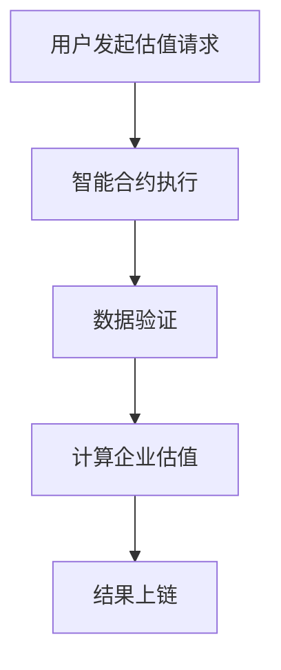
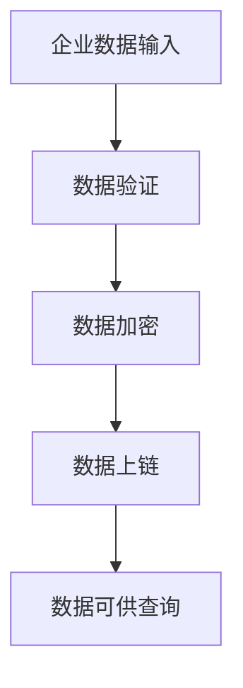
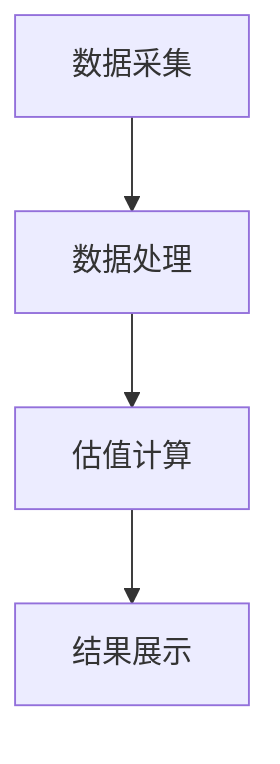

                 


# 企业估值中的区块链去中心化金融平台评估

> **关键词**：区块链、企业估值、DeFi、智能合约、去中心化金融、金融平台评估  
> 
> **摘要**：本文深入探讨了区块链技术在企业估值中的应用，特别是通过去中心化金融（DeFi）平台进行企业价值评估的创新方法。通过分析区块链的去中心化特性、智能合约的执行机制以及DeFi平台的核心功能，本文提出了一种基于区块链技术的企业估值模型，并结合实际案例进行了详细分析。文章内容涵盖从理论基础到实际应用的完整链条，旨在为企业估值提供一种更加透明、高效和安全的解决方案。

---

## 第一章：企业估值与DeFi的概述

### 1.1 什么是去中心化金融（DeFi）

去中心化金融（Decentralized Finance，简称DeFi）是指基于区块链技术构建的金融生态系统，通过智能合约实现金融活动的去中心化。DeFi的核心目标是去除传统金融体系中的中间人，降低交易成本，提高金融活动的透明度和效率。

**关键概念**：
- **区块链**：分布式账本技术，确保数据的透明性和不可篡改性。
- **智能合约**：自动执行的程序，根据预设条件触发金融活动。

### 1.2 企业估值的传统方法与挑战

传统企业估值方法包括资产基础法、收益法和市场法，但存在以下问题：
1. 数据获取难度大，尤其是中小企业。
2. 估值过程缺乏透明性，容易受到人为干预。
3. 评估结果难以实时更新。

### 1.3 区块链技术如何解决企业估值问题

区块链技术的特性：
1. **去中心化**：消除信息不对称，提高数据的可信度。
2. **不可篡改性**：确保企业数据的真实性和完整性。
3. **透明性**：所有交易记录在区块链上公开可查。

**核心优势**：
- 提供实时、透明的企业数据，便于估值模型的构建。
- 通过智能合约自动执行估值逻辑，减少人为干预。

### 1.4 本文的目标与结构

本文旨在通过区块链技术构建一个去中心化的企业估值平台，利用智能合约实现企业估值的自动化和透明化。文章结构如下：
- 第二章：DeFi的核心机制与技术原理。
- 第三章：区块链技术在企业估值中的具体应用。
- 第四章：基于DeFi的企业估值模型设计。
- 第五章：智能合约在企业估值中的实现与优化。
- 第六章：系统架构设计与实现。
- 第七章：项目实战与案例分析。
- 第八章：总结与展望。

---

## 第二章：DeFi的核心机制与技术原理

### 2.1 DeFi的核心机制

DeFi的核心机制包括：
1. **智能合约**：自动执行金融协议。
2. **代币经济**：通过代币实现价值的转移和分配。
3. **链上数据**：所有交易记录在区块链上，确保数据的真实性和不可篡改性。

### 2.2 智能合约的工作原理

智能合约是一种运行在区块链上的自动执行程序，其核心流程如下：



**代码实现**：
```solidity
// 智能合约代码示例
contract EnterpriseValuation {
    function evaluate(bytes memory data) public returns (uint) {
        // 解析输入数据
        bytes memory parsedData = parse(data);
        // 执行估值逻辑
        uint value = calculateValue(parsedData);
        return value;
    }
}
```

### 2.3 代币经济在DeFi中的应用

DeFi平台通常使用代币作为激励机制，例如：
1. **治理代币**：用于平台治理的决策。
2. **收益代币**：用户通过提供流动性获得收益。

### 2.4 区块链的去中心化特性

区块链的去中心化特性确保了数据的安全性和可靠性，避免了传统金融体系中的单点故障问题。

---

## 第三章：区块链技术在企业估值中的应用

### 3.1 区块链技术的核心优势

1. **数据透明性**：所有企业数据均记录在区块链上，可供所有参与者查阅。
2. **不可篡改性**：区块链上的数据一旦上链，无法被修改。
3. **去中心化信任**：通过区块链技术建立信任，减少企业估值中的信息不对称。

### 3.2 基于区块链的企业估值数据存储

企业估值所需的数据包括：
- 企业财务数据（如收入、利润、资产负债表）。
- 市场数据（如行业指数、竞争对手信息）。
- 其他相关数据（如企业专利、法律纠纷等）。

**数据存储流程**：



### 3.3 区块链上的数据查询与分析

通过智能合约实现数据的查询与分析，确保数据的安全性和准确性。

**代码实现**：
```solidity
function getData(bytes memory key) public returns (bytes memory) {
    return retrieveData(key);
}
```

---

## 第四章：基于DeFi的企业估值模型设计

### 4.1 传统企业估值方法的局限性

传统方法依赖于人工数据收集和分析，存在以下问题：
1. 数据获取成本高。
2. 数据可能存在偏差。
3. 估值过程缺乏透明性。

### 4.2 基于DeFi的创新估值模型

本文提出一种基于区块链的估值模型，包括以下步骤：
1. 数据获取：从区块链上获取企业的实时数据。
2. 数据分析：通过智能合约进行数据清洗和分析。
3. 估值计算：根据分析结果计算企业价值。
4. 结果输出：将估值结果上链存储。

**数学模型**：
企业价值（EV）= 净利润 × 市盈率（P/E）

$$ EV = \text{净利润} \times \text{P/E} $$

### 4.3 模型的优化与改进

通过引入更多的数据维度（如市场趋势、行业指数等），进一步提高估值的准确性。

---

## 第五章：智能合约在企业估值中的实现与优化

### 5.1 智能合约的设计

智能合约的设计需要考虑以下几点：
1. 数据输入格式：企业数据的结构化处理。
2. 逻辑实现：估值模型的自动化执行。
3. 安全性：防止合约漏洞被利用。

**代码实现**：
```solidity
function evaluateEnterprise(bytes memory input) public returns (uint) {
    // 解析输入数据
    uint revenue = parseRevenue(input);
    uint profit = parseProfit(input);
    // 计算市盈率
    uint peRatio = getPERatio(revenue, profit);
    // 计算企业价值
    uint ev = revenue * peRatio;
    return ev;
}
```

### 5.2 智能合约的验证与测试

通过单元测试和集成测试确保智能合约的正确性和安全性。

---

## 第六章：系统架构设计与实现

### 6.1 系统架构设计

系统架构包括以下几个模块：
1. 数据采集模块：负责从区块链上获取企业数据。
2. 数据处理模块：对数据进行清洗和分析。
3. 估值计算模块：基于智能合约计算企业价值。
4. 结果展示模块：将估值结果展示给用户。

**系统架构图**：



### 6.2 系统接口设计

系统接口包括：
1. 数据查询接口：获取企业的实时数据。
2. 估值计算接口：调用智能合约进行估值。
3. 结果展示接口：显示估值结果。

---

## 第七章：项目实战与案例分析

### 7.1 环境搭建

1. 安装区块链开发环境（如Solidity、Ganache）。
2. 安装智能合约开发工具（如Remix）。

### 7.2 代码实现

```solidity
// 智能合约代码示例
contract EnterpriseValuation {
    function evaluate(bytes memory data) public returns (uint) {
        // 数据解析
        uint revenue = parseData(data, 0);
        uint profit = parseData(data, 1);
        // 计算市盈率
        uint peRatio = revenue / profit;
        // 计算企业价值
        uint ev = revenue * peRatio;
        return ev;
    }
}
```

### 7.3 实际案例分析

以一家中小型企业为例，通过区块链去中心化金融平台进行估值，详细分析整个流程。

---

## 第八章：总结与展望

### 8.1 核心要点回顾

- 区块链技术为企业估值提供了透明、高效和安全的解决方案。
- 智能合约的应用实现了估值过程的自动化和去中心化。
- DeFi平台的去中心化特性减少了信息不对称，提高了估值的准确性。

### 8.2 最佳实践与注意事项

- 数据准确性是企业估值的关键，确保输入数据的可靠性。
- 智能合约的安全性至关重要，需进行充分的测试和验证。
- 企业估值模型需要根据实际情况进行调整和优化。

### 8.3 未来展望

随着区块链技术的不断发展，企业估值将更加智能化和自动化。未来的研究方向包括：
1. 提高智能合约的执行效率。
2. 引入更多数据维度，优化估值模型。
3. 探索区块链技术在其他金融领域的应用。

---

## 作者：AI天才研究院/AI Genius Institute & 禅与计算机程序设计艺术 /Zen And The Art of Computer Programming

---

**声明**：本文内容来源于AI天才研究院的研究成果，未经授权不得转载。

