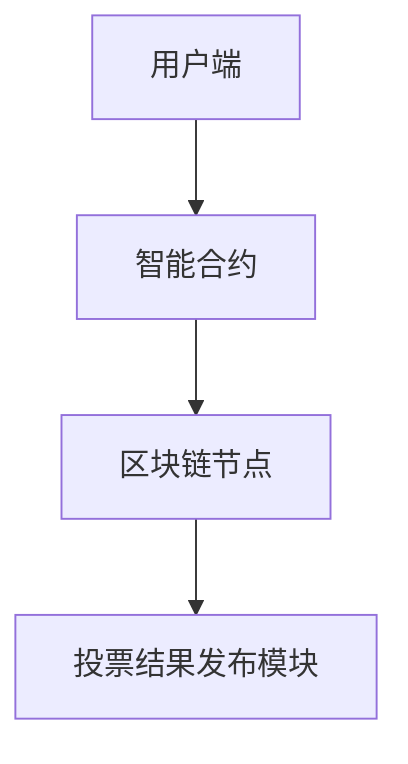

                 


# 企业估值中的区块链数字投票系统评估

> 关键词：区块链、数字投票系统、企业估值、智能合约、分布式系统、去中心化

> 摘要：区块链技术在企业估值中的应用日益广泛，其中数字投票系统作为重要工具之一，通过区块链的特性确保投票的透明性和安全性。本文详细探讨了区块链数字投票系统在企业估值中的作用，分析其技术原理、系统设计、实际应用案例以及未来发展趋势。

---

## 第一部分: 区块链数字投票系统概述

### 第1章: 区块链技术基础

#### 1.1 区块链的基本概念
区块链是一种去中心化的分布式账本技术，通过密码学和共识算法确保数据的安全性和不可篡改性。区块链的核心特性包括去中心化、透明性、不可篡改性和可追溯性。

#### 1.2 数字投票系统的定义
数字投票系统是利用数字技术进行投票的一种方式，通过技术手段确保投票的真实性和有效性。区块链技术为数字投票系统提供了更高的安全性和透明性。

#### 1.3 区块链在数字投票系统中的应用
区块链技术可以确保投票数据的完整性和不可篡改性，通过智能合约实现自动化的投票计票和结果发布。

---

### 第2章: 企业估值与数字投票系统

#### 2.1 企业估值的基本概念
企业估值是通过对企业的财务状况、市场表现、管理团队等因素进行综合评估，确定其市场价值的过程。数字投票系统在企业估值中可以用于股东投票、管理决策等方面。

#### 2.2 区块链数字投票系统在企业估值中的作用
区块链数字投票系统可以提高企业估值的透明性和公平性，确保投票过程的不可篡改性，从而提升企业治理的效率和信任度。

---

## 第二部分: 区块链数字投票系统的原理与技术

### 第3章: 区块链数字投票系统的技术原理

#### 3.1 区块链的去中心化特性
区块链的去中心化特性确保了投票数据的安全性和不可篡改性，避免了中心化系统可能存在的单点故障和数据篡改风险。

#### 3.2 数字投票系统的实现原理
数字投票系统通过区块链技术实现投票数据的记录和验证，利用智能合约自动执行投票计票和结果发布。

#### 3.3 智能合约在数字投票系统中的应用
智能合约是区块链上的自动执行程序，用于实现投票的发起、投票记录的保存和结果的计算。智能合约的执行过程是透明且不可篡改的。

---

### 第4章: 区块链数字投票系统的算法原理

#### 4.1 投票算法的基本原理
投票算法是数字投票系统的核心，用于对投票数据进行处理和计算。常见的投票算法包括加权投票、多数投票等。

#### 4.2 加权投票算法的数学模型
加权投票算法是一种常见的投票机制，通过给每个投票者分配不同的权重来计算最终的投票结果。数学模型如下：

$$ \text{总权重} = \sum_{i=1}^{n} w_i $$
$$ \text{得票权重} = \sum_{i=1}^{n} (w_i \times v_i) $$
$$ \text{最终得票} = \frac{\text{得票权重}}{\text{总权重}} $$

其中，\( w_i \) 是投票者的权重，\( v_i \) 是投票者的投票结果。

#### 4.3 智能合约的实现流程
智能合约的实现流程包括投票发起、投票记录、投票计票和结果发布四个阶段。通过智能合约可以实现投票过程的自动化和不可篡改性。

---

## 第三部分: 系统分析与架构设计

### 第5章: 系统分析与需求设计

#### 5.1 问题场景介绍
企业估值过程中，股东投票是重要的决策环节。传统的投票系统可能存在数据篡改、投票过程不透明等问题，而区块链数字投票系统可以有效解决这些问题。

#### 5.2 项目介绍
本项目旨在设计并实现一个基于区块链的数字投票系统，用于企业估值中的股东投票和管理决策。

#### 5.3 系统功能设计
系统功能包括投票发起、投票记录、投票计票和结果发布四个模块。

#### 5.4 系统架构设计
系统架构采用分布式架构，通过区块链节点实现数据的分布式存储和同步。

---

### 第6章: 系统架构设计

#### 6.1 系统组件与交互流程
系统组件包括用户端、智能合约、区块链节点和投票结果发布模块。用户通过智能合约发起投票，区块链节点负责数据的存储和同步，投票结果通过智能合约自动计算并发布。

#### 6.2 系统功能模块设计
系统功能模块包括投票发起模块、投票记录模块、投票计票模块和结果发布模块。

#### 6.3 系统架构图


---

## 第四部分: 项目实战

### 第7章: 项目环境搭建

#### 7.1 开发环境配置
开发环境包括区块链平台（如以太坊）、智能合约开发工具（如Solidity）、区块链节点客户端等。

#### 7.2 核心代码实现
以下是智能合约的实现代码（Solidity）：

```solidity
// SPDX-License-Identifier: MIT
pragma solidity ^0.8.0;

contract VotingSystem {
    mapping(address => uint) public votes;

    function vote(address voter, uint weight) public {
        votes[voter] = weight;
    }

    function getVotes(address voter) public view returns (uint) {
        return votes[voter];
    }

    function calculateResult() public view returns (uint) {
        uint totalWeight = 0;
        uint result = 0;
        for (uint i = 0; i < 10; i++) {
            address voter = address(i);
            totalWeight += votes[voter];
            result += votes[voter] * i;
        }
        return result / totalWeight;
    }
}
```

---

### 第8章: 项目实战与案例分析

#### 8.1 系统实现案例
以下是基于上述智能合约的实现案例：

1. **投票发起**：系统管理员通过智能合约发起投票请求。
2. **投票记录**：用户通过智能合约记录自己的投票。
3. **投票计票**：智能合约自动计算投票结果。
4. **结果发布**：投票结果通过智能合约自动发布。

#### 8.2 案例分析
以某企业估值中的股东投票为例，系统通过智能合约实现了投票的发起、记录、计票和结果发布，确保了投票过程的透明性和不可篡改性。

---

## 第五部分: 总结与展望

### 第9章: 总结与最佳实践

#### 9.1 最佳实践
1. 在企业估值中使用区块链数字投票系统可以提高投票的透明性和安全性。
2. 智能合约的自动执行功能可以有效减少人为干预，确保投票过程的公正性。
3. 在实际应用中，需要考虑系统的扩展性和可维护性。

#### 9.2 小结
通过区块链数字投票系统可以有效解决企业估值中的投票问题，提高企业的治理效率和信任度。

---

### 第10章: 未来展望

#### 10.1 区块链技术的未来发展
区块链技术在企业估值中的应用前景广阔，随着技术的不断进步，区块链数字投票系统将更加智能化和自动化。

#### 10.2 数字投票系统的发展趋势
数字投票系统将更加注重用户体验和系统的安全性，未来可能会出现更多创新的投票机制和应用场景。

---

## 作者：AI天才研究院 & 禅与计算机程序设计艺术

---

**注**：上述目录和内容仅为示例，实际撰写时需要根据具体需求和实际应用场景进行调整和补充。

