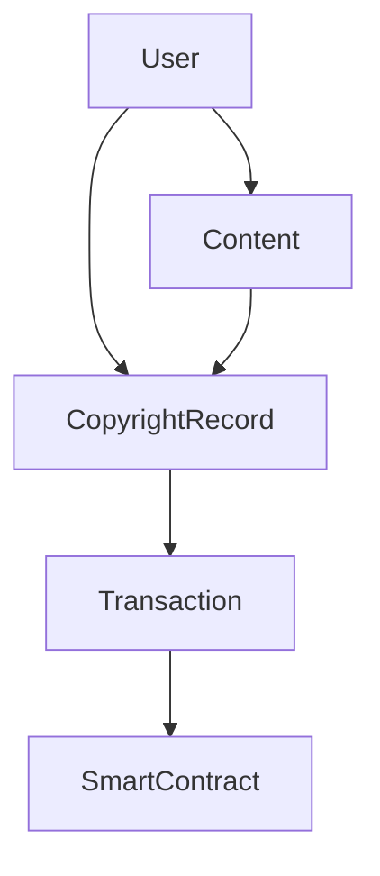

                 


# 区块链数字版权管理平台评估

> 关键词：区块链、数字版权管理、企业估值、智能合约、分布式账本

> 摘要：区块链技术在数字版权管理中的应用为企业估值提供了新的视角。本文通过分析区块链数字版权管理平台的核心技术、系统架构和实际案例，探讨如何评估这些平台对企业价值的影响。

---

## 第1章 数字版权管理的背景与问题

### 1.1 数字版权管理的背景

随着数字化时代的到来，数字内容的创作和分发变得前所未有的普遍。从音乐、视频到软件代码，数字版权管理（Digital Rights Management, DRM）的重要性日益凸显。然而，数字内容的易复制性和全球化的传播也带来了新的挑战：如何有效地保护创作者的版权，同时确保合法用户的权益？

区块链技术的出现为解决这些问题提供了新的可能性。区块链的去中心化特性、不可篡改的特性以及智能合约的应用，使得数字版权管理更加高效和透明。

### 1.2 数字版权管理的核心问题

数字版权管理面临的主要问题包括：

1. **版权确权困难**：数字内容可以轻松复制和传播，导致创作者的权益难以得到有效保护。
2. **侵权行为难以追踪**：侵权行为往往难以追踪和追责。
3. **交易透明性不足**：数字内容的交易过程缺乏透明度，容易出现中间商截留收益的情况。
4. **缺乏信任机制**：各方参与者之间的信任缺失，导致交易成本增加。

区块链技术通过提供去中心化、不可篡改的记录，解决了上述问题，为数字版权管理提供了新的解决方案。

### 1.3 区块链技术如何解决数字版权问题

区块链通过以下方式解决了数字版权管理中的关键问题：

1. **不可篡改的记录**：区块链的分布式账本确保了每一次内容创作、授权和交易记录的不可篡改性。
2. **智能合约自动执行**：通过智能合约，可以在区块链上自动执行版权授权和收益分配，减少中间环节。
3. **去中心化身份认证**：区块链支持去中心化的身份认证，确保创作者和用户的身份真实性。

---

## 第2章 区块链技术的基本原理

### 2.1 区块链的定义与特点

区块链是一种去中心化的分布式账本技术，具有以下特点：

1. **去中心化**：数据存储在多个节点上，不存在单点故障。
2. **不可篡改**：一旦数据被写入区块链，就无法被修改或删除。
3. **透明性**：区块链上的交易对所有参与者透明，但隐私信息可以加密。
4. **共识机制**：通过共识机制确保所有节点的数据一致性。

### 2.2 区块链的核心技术

区块链的核心技术包括：

1. **分布式账本**：所有交易记录在一个共享的账本中，确保数据一致性。
2. **共识机制**：如工作量证明（PoW）、权益证明（PoS）等，确保数据的真实性和一致性。
3. **智能合约**：一种自动执行的代码，可以根据预设条件自动执行交易。

### 2.3 区块链的分类与应用场景

区块链主要分为公链、私链和联盟链。公链如比特币、以太坊，私链用于企业内部，联盟链用于特定行业。在数字版权管理中，联盟链通常更适合，因为它可以在保证部分隐私的同时，实现高效的合作。

---

## 第3章 区块链在数字版权管理中的应用

### 3.1 数字版权管理的痛点分析

传统的数字版权管理存在以下痛点：

1. **版权确权难**：缺乏有效的技术手段证明内容的创作时间和归属。
2. **侵权难以追踪**：侵权行为难以快速定位和追责。
3. **收益分配复杂**：创作者、分销商、平台之间的收益分配常常不透明。

### 3.2 区块链在数字版权管理中的优势

区块链技术为数字版权管理带来了以下优势：

1. **不可篡改的记录**：确保内容的创作时间和归属明确。
2. **透明的交易记录**：所有交易记录在区块链上，透明且不可篡改。
3. **智能合约自动执行**：通过智能合约自动执行版权授权和收益分配，减少人为干预。

### 3.3 区块链数字版权管理的典型应用场景

区块链在数字版权管理中的典型应用场景包括：

1. **音乐版权管理**：通过区块链记录音乐作品的创作和授权信息，确保创作者的权益。
2. **软件版权管理**：通过区块链确保证件代码的原创性和归属。
3. **数字艺术品交易**：通过区块链实现数字艺术品的溯源和确权，支持NFT（非同质化代币）交易。

---

## 第4章 区块链数字版权管理平台的系统架构

### 4.1 系统功能模块划分

区块链数字版权管理平台通常包括以下功能模块：

1. **用户模块**：用户注册、登录、个人信息管理。
2. **内容管理模块**：内容上传、存储、分类。
3. **版权登记与确权模块**：通过区块链进行版权登记，确保证明的不可篡改性。
4. **交易与分发模块**：支持数字内容的交易和分发，通过智能合约自动执行收益分配。
5. **监测与维权模块**：实时监测侵权行为，提供维权支持。

### 4.2 系统架构设计

区块链数字版权管理平台的架构设计通常包括以下层次：

1. **用户层**：用户通过Web或移动端与平台交互。
2. **业务逻辑层**：处理用户的请求，调用智能合约。
3. **区块链层**：存储交易记录和版权信息，确保数据不可篡改。
4. **数据库层**：存储平台的元数据和用户信息。

### 4.3 实体关系与数据流设计

以下是数字版权管理平台的实体关系图：



---

## 第5章 区块链数字版权管理平台的项目实战

### 5.1 项目背景与目标

本项目旨在开发一个基于区块链的数字版权管理平台，用于管理音乐、视频等数字内容的版权信息。目标包括：

1. 实现版权登记与确权。
2. 提供透明的交易记录。
3. 支持智能合约自动执行收益分配。

### 5.2 系统功能设计

系统的功能设计包括：

1. **用户注册与登录**：用户可以通过邮箱或社交账号注册。
2. **内容上传**：用户上传数字内容，并填写相关信息。
3. **版权登记**：通过区块链进行版权登记，生成唯一的哈希值。
4. **内容分发**：用户可以通过平台分发内容，收益通过智能合约自动分配。

### 5.3 系统实现

以下是平台的核心代码实现：

```python
# 智能合约部署
contract = """
    pragma solidity ^0.5.0;

    contract CopyrightContract {
        address payable public creator;
        bytes32 public contentHash;

        constructor(address payable _creator, bytes32 _contentHash) public {
            creator = _creator;
            contentHash = _contentHash;
        }

        function withdraw() public {
            msg.sender.transfer(address(this).balance);
        }
    }
"""

# 部署合约
contract_address = deploy_contract(contract)
```

### 5.4 项目总结

通过本项目的实践，我们验证了区块链技术在数字版权管理中的可行性。区块链的不可篡改性和智能合约的应用，使得数字版权管理更加高效和透明。

---

## 第6章 总结与展望

### 6.1 总结

区块链技术为数字版权管理提供了新的解决方案。通过区块链，我们可以实现版权的不可篡改记录、智能合约自动执行收益分配，以及透明的交易记录。这些特性使得数字版权管理更加高效和安全。

### 6.2 展望

未来，区块链技术将进一步与数字版权管理结合，推动数字内容产业的升级。NFT（非同质化代币）的应用将为数字艺术品、音乐等版权管理带来新的可能性。同时，随着技术的发展，区块链的隐私保护和可扩展性问题也将得到进一步解决。

---

作者：AI天才研究院/AI Genius Institute & 禅与计算机程序设计艺术 /Zen And The Art of Computer Programming

---

这篇文章系统地介绍了区块链技术在数字版权管理中的应用，分析了其对企业估值的影响，并通过实际案例展示了区块链数字版权管理平台的实现。

