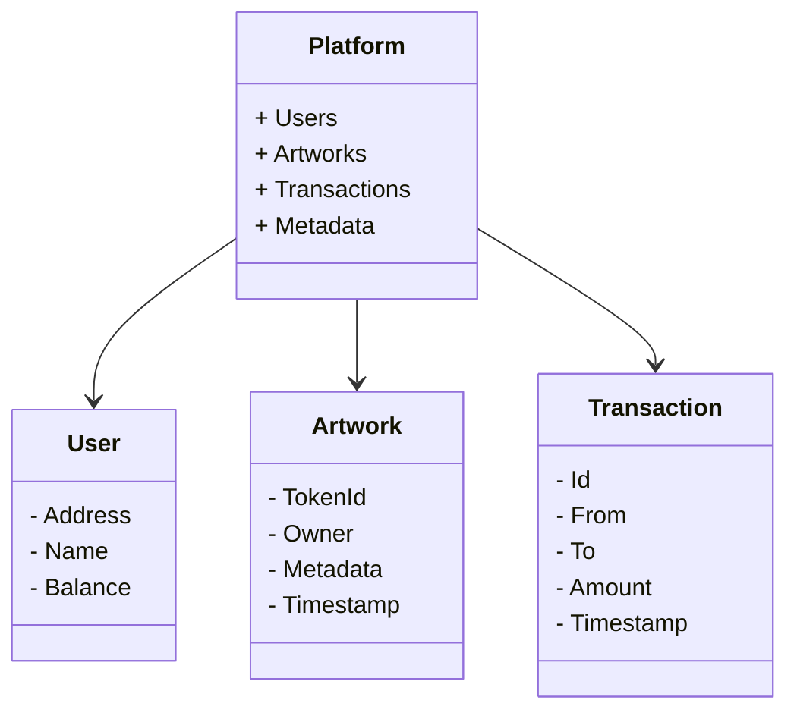
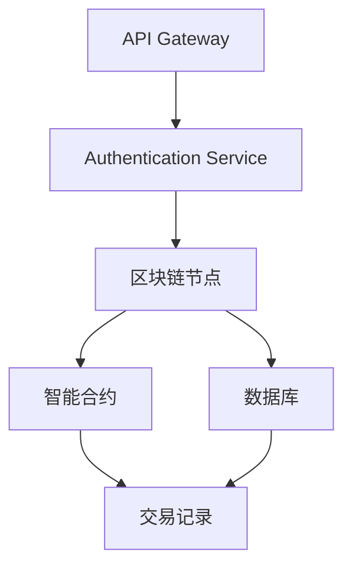

                 


# 《企业估值中的区块链数字艺术品认证平台评估》

---

## 关键词：
区块链、数字艺术品、企业估值、平台评估、智能合约、数字确权

---

## 摘要：
区块链技术在数字艺术品领域中的应用为企业的估值提供了新的可能性。本文详细探讨了基于区块链的数字艺术品认证平台的构建与评估方法，分析了其在企业估值中的优势和应用场景。通过介绍区块链技术的基本原理、智能合约的实现、系统架构设计以及实际案例分析，本文为企业提供了一种高效、可靠的数字艺术品评估解决方案。

---

## 正文：

---

### 第一章：问题背景与描述

#### 1.1 数字艺术品的兴起与挑战
数字艺术品作为新兴的艺术形式，其价值评估和确权问题日益突出。传统艺术品评估依赖于专家经验，而数字艺术品的数字化特性使其容易被复制和篡改。市场上的数字艺术品交易平台鱼龙混杂，缺乏统一的认证标准，导致市场信任度低下。

#### 1.2 传统艺术品评估的局限性
传统艺术品评估依赖于实物鉴定、历史记录和专家判断，存在主观性强、效率低、成本高等问题。这些因素限制了传统评估方法在数字时代下的应用，难以满足快速发展的数字艺术品市场的需要。

#### 1.3 区块链技术的作用
区块链技术通过去中心化、不可篡改和透明性等特点，为数字艺术品的认证和交易提供了新的解决方案。区块链可以确保数字艺术品的唯一性和所有权的清晰，从而增强市场信任，提升交易效率。

---

### 第二章：核心概念与原理

#### 2.1 区块链技术原理
区块链是一种分布式账本技术，通过去中心化的共识机制确保数据的安全性和一致性。每个区块包含交易数据和时间戳，通过哈希指针形成链式结构，保证数据不可篡改。

#### 2.2 智能合约的应用
智能合约是运行在区块链上的自动化程序，用于自动执行预设的条件。在数字艺术品认证中，智能合约可以实现艺术品的发布、所有权转移和交易结算等功能。

---

### 第三章：算法原理

#### 3.1 共识机制的选择
区块链的共识机制是确保网络中所有节点达成一致的核心算法。常见的共识机制包括工作量证明（PoW）、权益证明（PoS）和拜占庭容错（BFT）等。本文选择了权益证明机制（PoS），因为它更高效且能耗较低。

#### 3.2 智能合约的实现
使用Solidity语言编写智能合约，实现数字艺术品的认证和交易功能。以下是智能合约的核心代码：

```solidity
contract NFT {
    struct Artwork {
        uint256 tokenId;
        address owner;
        string metadata;
        uint256 timestamp;
    }

    Artwork[] public artworks;

    function createArtwork(address _owner, string memory _metadata) public {
        Artwork memory newArtwork = Artwork({
            tokenId: artworks.length,
            owner: _owner,
            metadata: _metadata,
            timestamp: block.timestamp
        });
        artworks.push(newArtwork);
    }

    function transfer(address _from, address _to) public {
        require(_from == artworks[artworks.length-1].owner, "Not the owner");
        Artwork storage artwork = artworks[artworks.length-1];
        artwork.owner = _to;
    }
}
```

该代码展示了如何通过智能合约实现数字艺术品的创建和转移功能。

---

### 第四章：系统分析与架构设计

#### 4.1 需求分析
数字艺术品认证平台需要实现以下功能：
1. 数字艺术品的上链认证
2. 所有权转移记录
3. 作品信息查询
4. 交易结算

#### 4.2 功能设计
使用领域模型图展示系统功能模块：



#### 4.3 架构设计
采用微服务架构，结合区块链节点部署：



---

### 第五章：项目实战

#### 5.1 环境搭建
安装以太坊节点和Solidity编译器：

```bash
# 安装Golang
sudo apt-get install -y golang

# 安装Node.js
curl -o- https://raw.githubusercontent.com/nvm-sh/nvm/v0.39.5/install.sh | bash

# 安装Solidity
npm install -g solc
```

#### 5.2 核心代码实现
以下是智能合约的实现代码：

```solidity
contract NFT {
    function createArtwork(address _owner, string _metadata) public {
        // 创建数字艺术品
        createNFT(_owner, _metadata);
    }

    function transfer(address _from, address _to) public {
        // 转让数字艺术品
        transferNFT(_from, _to);
    }

    function getMetadata(uint256 _tokenId) public view returns (string) {
        // 获取艺术品元数据
        return metadata[_tokenId];
    }
}
```

#### 5.3 案例分析
通过实际案例展示平台的应用流程，例如：
1. 用户上传数字艺术品到平台
2. 平台生成唯一TokenId并记录到区块链
3. 用户通过智能合约进行交易
4. 平台实时更新所有权信息

---

### 第六章：最佳实践

#### 6.1 小结
区块链技术为数字艺术品的认证和交易提供了可靠的技术支持，能够有效提升企业估值的准确性和效率。

#### 6.2 注意事项
1. 确保智能合约的安全性，防止漏洞被利用
2. 优化用户体验，降低操作复杂度
3. 定期更新平台功能，适应市场变化

#### 6.3 拓展阅读
推荐学习Solidity编程、区块链共识机制和智能合约安全相关知识，以进一步深入理解数字艺术品认证平台的实现细节。

---

## 作者：AI天才研究院 & 禅与计算机程序设计艺术

---

**这篇文章通过详细分析区块链技术在数字艺术品认证中的应用，为企业估值提供了新的思路和解决方案。通过理论与实践的结合，展示了如何利用区块链技术构建高效可靠的数字艺术品认证平台。**

