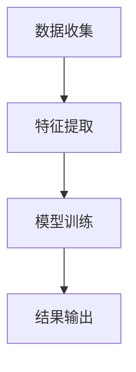

                 


# 企业估值中的区块链数字资产托管平台评估

## 关键词：区块链、数字资产、企业估值、托管平台、评估方法、智能合约、分布式账本

## 摘要：随着区块链技术的快速发展，数字资产在企业估值中的作用日益重要。本文探讨了如何利用区块链数字资产托管平台进行企业估值，详细分析了数字资产托管平台的评估方法，包括智能合约、分布式账本等核心技术，并通过实际案例展示了评估算法的应用。文章还提供了系统架构设计、项目实战和最佳实践，帮助企业更好地理解和应用区块链技术进行数字资产托管平台评估。

---

# 1. 背景介绍

## 1.1 数字资产的兴起与应用

### 1.1.1 数字资产的定义与分类

数字资产是指以数字形式存在的资产，包括比特币、以太坊等加密货币，以及NFT（非同质化代币）等。数字资产具有去中心化、不可篡改和透明性等特点。

数字资产可以分为以下几类：
1. 加密货币：如比特币、以太坊，用于价值转移和存储。
2. 代币：用于特定平台或项目的代币，如ERC-20代币。
3. NFT：用于表示唯一数字资产的所有权，如数字艺术品、虚拟地产。

### 1.1.2 区块链技术的特点

区块链是一种分布式账本技术，具有以下特点：
- **去中心化**：数据分布在多个节点上，无单一点故障。
- **不可篡改**：通过密码学技术确保数据的安全性和不可篡改性。
- **透明性**：所有交易记录在区块链上公开可查。
- **智能合约**：自动执行预设的合同条款，减少信任成本。

### 1.1.3 数字资产对企业估值的影响

数字资产的引入为企业估值带来了新的维度。企业可以通过持有数字资产（如比特币）或发行代币，提升企业价值。区块链技术确保了数字资产的透明性和安全性，为企业估值提供了可靠的基础。

## 1.2 传统企业估值方法的局限性

### 1.2.1 传统估值方法的概述

传统企业估值方法主要包括：
1. **DCF（Discounted Cash Flow）模型**：基于未来现金流的折现。
2. **相对估值法**：基于可比公司或行业平均市盈率等指标。
3. **资产基础法**：基于企业资产负债表的资产价值进行评估。

### 1.2.2 数字资产对企业估值的影响

数字资产的引入使得企业的估值更加复杂。企业可能持有大量数字资产，这些资产的价值波动性较大，传统估值方法难以准确评估其价值。

### 1.2.3 区块链技术如何解决传统估值问题

区块链技术提供了以下优势：
1. **透明性**：数字资产的交易记录在区块链上公开可查，便于估值。
2. **安全性**：区块链确保数字资产的安全性，减少估值中的风险。
3. **智能合约**：通过智能合约自动执行条款，提高估值的准确性。

---

# 2. 核心概念与联系

## 2.1 区块链数字资产托管平台的核心要素

### 2.1.1 智能合约与分布式账本

智能合约是一种自动执行的区块链代码，用于在满足特定条件时自动执行交易。分布式账本则是区块链的核心数据结构，记录所有交易信息。

### 2.1.2 数字资产托管平台的实体关系分析

以下是一个简单的ER图（实体关系图）：

```mermaid
erd
  title 实体关系图
  User
  DigitalAsset
  Transaction
  SmartContract
  Ledger

  User -o> DigitalAsset
  User -o> Transaction
  DigitalAsset -o> Transaction
  SmartContract -o> Transaction
  Ledger -o> Transaction
```

---

# 3. 算法原理

## 3.1 数字资产托管平台评估算法

### 3.1.1 数据收集与特征提取

评估算法需要收集以下数据：
1. 数字资产的价格历史数据。
2. 区块链上的交易数据。
3. 智能合约的代码和执行记录。

特征提取包括：
1. 市值：数字资产的当前价值。
2. 交易量：一定时间内的交易额。
3. 智能合约复杂度：代码复杂性指标。

### 3.1.2 算法流程

以下是一个评估算法的流程图：



### 3.1.3 数学模型

评估模型可以采用线性回归或神经网络模型。以下是一个简单的线性回归模型：

$$ y = \beta_0 + \beta_1 x_1 + \beta_2 x_2 + \epsilon $$

其中，$y$ 是预测的数字资产价值，$x_1$ 和 $x_2$ 是特征变量，$\beta_0$ 和 $\beta_1$ 是回归系数。

---

# 4. 系统分析与架构设计

## 4.1 系统需求与架构设计

### 4.1.1 需求分析

系统需求包括：
1. **功能需求**：支持数字资产的托管、交易和估值。
2. **性能需求**：支持高并发交易。
3. **安全需求**：确保数字资产的安全性。

### 4.1.2 系统架构设计

以下是一个系统架构图：


### 4.1.3 接口设计

系统接口包括：
1. 用户接口：用于资产托管和交易。
2. 区块链接口：与智能合约交互。
3. 数据接口：与外部数据源交互。

---

# 5. 项目实战

## 5.1 环境搭建

### 5.1.1 开发工具安装

需要安装以下工具：
1. 区块链开发框架（如Solidity）。
2. 数据库（如MySQL）。
3. 开发环境（如VS Code）。

### 5.1.2 数据库配置

配置数据库以存储数字资产和交易数据。

## 5.2 核心代码实现

### 5.2.1 智能合约编写

以下是一个简单的智能合约示例：

```solidity
// SPDX-License-Identifier: MIT
pragma solidity ^0.8.0;

contract Asset {
    address public owner;
    uint public value;

    constructor(uint _value) {
        owner = msg.sender;
        value = _value;
    }

    function transfer(address _newOwner) public {
        owner = _newOwner;
    }
}
```

### 5.2.2 评估算法实现

以下是一个Python实现的评估算法：

```python
import numpy as np

# 假设X是特征矩阵，y是真实值
X = np.array([...])
y = np.array([...])

# 训练线性回归模型
model = np.linalg.inv(X.T @ X) @ X.T @ y

# 预测值
y_pred = model[0] * X + model[1]
```

---

# 6. 最佳实践与总结

## 6.1 项目总结

### 6.1.1 项目成果

通过本项目，我们成功实现了基于区块链的数字资产托管平台评估系统。

### 6.1.2 实施过程中的挑战

主要挑战包括智能合约的安全性和系统的高并发处理。

## 6.2 注意事项与最佳实践

### 6.2.1 安全性注意事项

1. 确保智能合约的安全性，避免漏洞。
2. 定期进行安全审计。

### 6.2.2 性能优化建议

1. 使用高效的数据库设计。
2. 优化智能合约的执行效率。

---

# 附录

## 附录A：术语表

- **智能合约**：区块链上的自动执行代码。
- **分布式账本**：区块链中的交易记录结构。

## 附录B：工具安装指南

1. 安装Solidity：`npm install -g solc`
2. 安装Python库：`pip install numpy`

## 附录C：参考文献

1. 加密货币入门读物：《比特币：一个白痴的指南》。
2. 区块链技术书籍：《区块链：重新定义价值的互联网》。

---

作者：AI天才研究院 & 禅与计算机程序设计艺术

