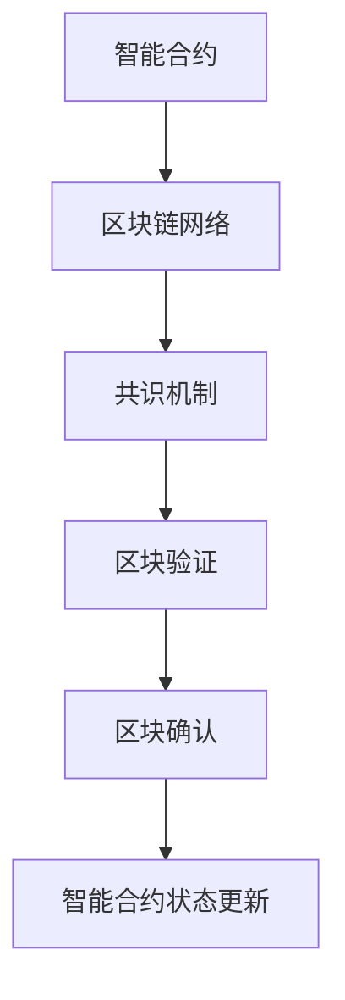
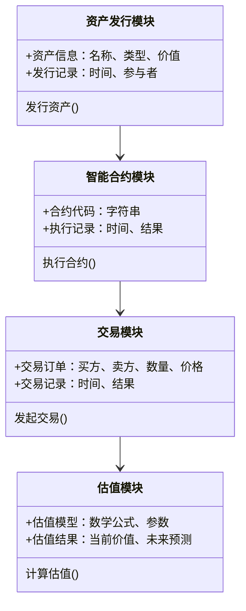

                 


# 《企业估值中的区块链数字资产证券化平台评估》

## 关键词：区块链，数字资产，企业估值，智能合约，共识机制，数字证券化

## 摘要：  
本文探讨了区块链技术在企业估值中的应用，特别是数字资产证券化平台的评估方法。通过分析区块链的核心原理、智能合约的实现、共识机制的应用，以及数字资产证券化的系统架构设计，本文提出了基于区块链技术的企业估值模型，结合实际案例分析，展示了如何通过数字资产证券化平台提升企业估值的效率与准确性。

---

## 第一部分：区块链与数字资产证券化的背景与概念

### 第1章：区块链与数字资产证券化的背景与概念

#### 1.1 企业估值中的传统金融工具与挑战

##### 1.1.1 传统企业估值方法的局限性
传统的企业估值方法依赖于财务报表分析、市场比较法和DCF模型等。然而，这些方法存在以下局限性：
- 数据依赖性强，容易受到财务造假的影响。
- 估值结果受主观假设的影响较大。
- 无法实时反映企业的动态变化。

##### 1.1.2 传统金融工具在企业估值中的应用
传统金融工具如股票、债券等，虽然在企业融资和估值中起着重要作用，但存在以下问题：
- 流动性不足，难以快速实现价值转换。
- 交易中间环节多，成本较高。
- 缺乏透明性，信息不对称问题严重。

##### 1.1.3 传统估值方法的边界与外延
传统估值方法的边界在于其依赖的历史数据和假设条件。其外延主要体现在对企业的未来预期和市场环境的预测上，但这些预测往往缺乏精确性。

#### 1.2 区块链技术的兴起与应用

##### 1.2.1 区块链技术的核心概念与特点
区块链是一种去中心化的分布式账本技术，具有以下特点：
- 去中心化：无需依赖中心机构，数据分布存储。
- 不可篡改：通过密码学技术确保数据的安全性和不可篡改性。
- 可追溯性：每笔交易都可以被追溯，增强了透明性。

##### 1.2.2 区块链在金融领域的应用现状
区块链在金融领域的应用主要集中在以下几个方面：
- 数字支付：如比特币、以太坊等。
- 智能合约：通过区块链实现自动化的合同履行。
- 资产证券化：将传统资产转化为数字资产，提升流动性和透明性。

##### 1.2.3 区块链技术的边界与外延
区块链技术的边界在于其技术实现的局限性，如性能瓶颈和隐私保护问题。其外延则体现在与人工智能、大数据等技术的结合应用上。

#### 1.3 数字资产证券化的定义与特点

##### 1.3.1 数字资产证券化的定义
数字资产证券化是指将传统资产（如股权、债权等）转化为数字形式，并利用区块链技术进行发行、交易和管理的过程。

##### 1.3.2 数字资产证券化的核心要素与属性
数字资产证券化的核心要素包括：
- 数字化：资产以数字形式存在。
- 证券化：资产经过结构化设计，便于分割和流转。
- 区块链技术：利用区块链实现去中心化和可追溯性。

##### 1.3.3 数字资产证券化的边界与外延
数字资产证券化的边界在于其技术实现和监管合规性，其外延则体现在与人工智能、大数据等技术的结合，以及在不同资产类别中的应用扩展。

#### 1.4 本章小结
本章从企业估值的传统方法出发，分析了传统方法的局限性，介绍了区块链技术的核心概念和特点，最后提出了数字资产证券化的定义和特点。这为后续章节的分析奠定了基础。

---

## 第二部分：区块链数字资产证券化的核心概念与原理

### 第2章：区块链数字资产证券化的核心概念

#### 2.1 数字资产证券化的核心要素

##### 2.1.1 数字资产的定义与分类
数字资产可以分为以下几类：
- 原生数字资产：如比特币、以太坊等。
- 代币化资产：将传统资产转化为数字代币形式。

##### 2.1.2 证券化的定义与流程
证券化是指将非流动性资产转化为可交易的证券。数字资产证券化流程包括：
1. 资产发行：将资产转化为数字代币。
2. 登记：在区块链上记录代币的发行信息。
3. 交易：通过区块链平台进行代币的买卖。

##### 2.1.3 区块链技术在数字资产证券化中的作用
区块链技术在数字资产证券化中的作用包括：
- 提供去中心化的发行和交易平台。
- 确保资产的安全性和透明性。

#### 2.2 区块链技术的核心原理

##### 2.2.1 分布式账本的实现原理
分布式账本通过多个节点共同维护一个账本，确保数据的完整性和一致性。

##### 2.2.2 智能合约的工作机制
智能合约是基于区块链的自动化程序，用于自动执行合同条款。

##### 2.2.3 共识机制的原理与应用
共识机制（如PoW、PoS）用于确保区块链网络中的节点达成一致。

#### 2.3 数字资产证券化的系统架构

##### 2.3.1 系统架构的核心模块
数字资产证券化平台的核心模块包括：
- 资产发行模块：负责资产的发行和登记。
- 智能合约模块：用于自动执行合同条款。
- 交易模块：处理数字资产的买卖交易。

##### 2.3.2 模块之间的关系与交互
模块之间的交互主要通过智能合约和区块链网络进行，确保数据的一致性和安全性。

##### 2.3.3 系统架构的边界与外延
系统架构的边界在于其功能模块的实现，其外延则体现在与其他系统的集成和扩展。

#### 2.4 本章小结
本章详细介绍了数字资产证券化的核心要素和区块链技术的核心原理，分析了系统架构的设计和模块之间的关系。

---

### 第3章：智能合约与共识机制

#### 3.1 智能合约的原理与实现

##### 3.1.1 智能合约的定义与特点
智能合约是基于区块链的自动化程序，具有以下特点：
- 自动执行：无需人工干预。
- 不可篡改：代码一旦部署，无法修改。

##### 3.1.2 智能合约的执行流程
智能合约的执行流程包括：
1. 合约部署：将合约代码部署到区块链网络。
2. 合约调用：通过交易触发合约的执行。
3. 合约状态更新：根据合约逻辑更新区块链上的状态。

##### 3.1.3 智能合约的数学模型与公式
智能合约的状态可以用以下公式表示：
$$
\text{状态} = f(\text{输入}, \text{当前状态})
$$
其中，$f$ 是合约的逻辑函数，$\text{输入}$ 是触发合约的输入参数，$\text{当前状态}$ 是合约的当前状态。

##### 3.1.4 智能合约的实现示例
以下是一个简单的智能合约实现示例（以Solidity为例）：
```solidity
pragma solidity ^0.8.0;

contract MyContract {
    uint public balance;

    function deposit(uint amount) public {
        balance += amount;
    }

    function withdraw(uint amount) public {
        balance -= amount;
    }
}
```

#### 3.2 共识机制的原理与实现

##### 3.2.1 共识机制的定义与分类
共识机制是区块链网络中用于达成一致的机制，常见的共识机制包括：
- 工作量证明（PoW）
- 权益证明（PoS）
- 拜占庭容错（BFT）

##### 3.2.2 共识机制的核心算法
以PoW为例，其核心算法包括：
1. 难度调整：根据网络哈希率调整挖矿难度。
2. 验证：矿工通过计算满足特定条件的哈希值来验证区块。

##### 3.2.3 共识机制的数学模型与公式
PoW的数学模型可以表示为：
$$
\text{难度} = \frac{1}{\text{目标哈希值}}
$$

##### 3.2.4 共识机制的实现示例
以下是一个简单的PoW实现示例：
```python
import hashlib

def compute_hash(prefix, nonce):
    return hashlib.sha256((prefix + str(nonce)).encode()).hexdigest()

def find_nonce(prefix, difficulty):
    target = '0' * difficulty
    nonce = 0
    while True:
        hash_str = compute_hash(prefix, nonce)
        if hash_str.startswith(target):
            return nonce
        nonce += 1

prefix = 'block_header_123'
difficulty = 4
nonce = find_nonce(prefix, difficulty)
print(nonce)
```

#### 3.3 智能合约与共识机制的交互流程

##### 3.3.1 智能合约与共识机制的交互关系
智能合约通过区块链网络中的共识机制确保其执行结果的一致性和可靠性。

##### 3.3.2 交互流程的mermaid图


#### 3.4 本章小结
本章详细介绍了智能合约和共识机制的原理与实现，分析了它们在数字资产证券化平台中的交互流程。

---

### 第4章：数字资产证券化平台的数学模型与算法实现

#### 4.1 数字资产价值评估模型

##### 4.1.1 价值评估模型的定义与特点
数字资产的价值评估模型用于预测资产的未来价值，具有以下特点：
- 数据驱动：基于历史交易数据和市场信息。
- 动态调整：能够根据市场变化实时更新评估结果。

##### 4.1.2 价值评估模型的数学公式
数字资产的价值评估模型可以表示为：
$$
V(t) = \alpha \cdot P(t) + \beta \cdot Q(t) + \gamma \cdot R(t)
$$
其中，$V(t)$ 是资产在时间 $t$ 的价值，$P(t)$ 是价格，$Q(t)$ 是交易量，$R(t)$ 是市场情绪指数，$\alpha$、$\beta$、$\gamma$ 是权重系数。

##### 4.1.3 价值评估模型的实现步骤
1. 数据收集：收集历史交易数据和市场信息。
2. 数据预处理：对数据进行清洗和标准化处理。
3. 模型训练：利用机器学习算法训练价值评估模型。
4. 模型验证：通过历史数据验证模型的准确性。

##### 4.1.4 价值评估模型的实现示例
以下是一个简单的价值评估模型实现示例：
```python
import pandas as pd
from sklearn.linear_model import LinearRegression

# 数据加载
data = pd.read_csv('asset_data.csv')

# 数据预处理
X = data[['price', 'volume', 'sentiment']]
y = data['value']

# 模型训练
model = LinearRegression()
model.fit(X, y)

# 模型预测
new_data = pd.DataFrame({'price': [100], 'volume': [500], 'sentiment': [0.8]})
predicted_value = model.predict(new_data)
print(predicted_value)
```

#### 4.2 平台交易的数学模型

##### 4.2.1 交易模型的定义与特点
交易模型用于模拟数字资产的交易过程，具有以下特点：
- 真实性：能够准确反映市场的交易行为。
- 可扩展性：能够处理大规模的交易数据。

##### 4.2.2 交易模型的数学公式
数字资产的交易模型可以表示为：
$$
\text{交易量} = \lambda \cdot e^{-\lambda t}
$$
其中，$\lambda$ 是交易速率，$t$ 是时间。

##### 4.2.3 交易模型的实现步骤
1. 数据收集：收集交易数据和市场信息。
2. 数据预处理：对数据进行清洗和标准化处理。
3. 模型训练：利用统计学方法训练交易模型。
4. 模型验证：通过历史数据验证模型的准确性。

##### 4.2.4 交易模型的实现示例
以下是一个简单的交易模型实现示例：
```python
import numpy as np
from scipy.stats import poisson

# 参数设置
lambda_ = 2
t = 5

# 交易量预测
predicted_volume = poisson.pmf(t, lambda_)
print(predicted_volume)
```

#### 4.3 数学模型的实现与优化

##### 4.3.1 数学模型的实现步骤
1. 确定模型目标：明确模型的输入和输出。
2. 数据收集与预处理：收集相关数据并进行清洗和标准化。
3. 模型训练：选择合适的算法并进行训练。
4. 模型验证：通过测试数据验证模型的准确性。
5. 模型优化：根据验证结果优化模型参数。

##### 4.3.2 数学模型的优化方法
常用的优化方法包括：
- 参数调整：通过调整模型参数优化模型性能。
- 算法选择：选择更适合数据的算法。
- 数据增强：通过增加数据量提高模型的泛化能力。

##### 4.3.3 数学模型的优化结果与分析
通过优化模型参数和算法选择，可以显著提高模型的预测准确性和效率。

#### 4.4 本章小结
本章详细介绍了数字资产证券化平台的数学模型与算法实现，分析了价值评估模型和交易模型的实现步骤和优化方法。

---

## 第三部分：数字资产证券化平台的系统分析与架构设计

### 第5章：系统分析与架构设计

#### 5.1 问题场景介绍

##### 5.1.1 问题背景
传统企业估值方法存在数据依赖性强、估值结果主观性高、交易成本高等问题。

##### 5.1.2 问题描述
如何利用区块链技术实现数字资产证券化，提升企业估值的效率与准确性。

##### 5.1.3 问题解决
通过区块链技术实现数字资产证券化，构建一个去中心化的估值平台，降低交易成本，提高估值效率。

#### 5.2 项目介绍

##### 5.2.1 项目背景
本项目旨在利用区块链技术构建一个数字资产证券化平台，实现企业估值的数字化和自动化。

##### 5.2.2 项目目标
- 提供数字资产的发行和交易服务。
- 实现智能合约的自动执行。
- 提供实时的企业估值服务。

##### 5.2.3 项目范围
- 平台设计：包括资产发行、交易、估值等功能模块。
- 技术实现：基于区块链技术的智能合约和共识机制。
- 用户界面：提供友好的用户操作界面。

#### 5.3 系统功能设计

##### 5.3.1 领域模型设计
领域模型设计包括以下核心模块：
- 资产发行模块：负责数字资产的发行和登记。
- 智能合约模块：用于自动执行合同条款。
- 交易模块：处理数字资产的买卖交易。
- 估值模块：提供实时的企业估值服务。

##### 5.3.2 领域模型的 mermaid 类图


##### 5.3.3 系统架构设计
系统架构设计采用分层架构，包括数据层、业务逻辑层和应用层。

##### 5.3.4 系统架构的 mermaid 架构图


##### 5.3.5 系统接口设计
系统接口设计包括：
- 资产发行接口：用于数字资产的发行和登记。
- 智能合约接口：用于智能合约的部署和执行。
- 交易接口：用于数字资产的买卖交易。
- 估值接口：用于实时计算企业的估值。

##### 5.3.6 系统交互设计
系统交互设计包括用户发起资产发行、智能合约执行、交易完成和估值结果返回等流程。

#### 5.4 本章小结
本章从问题场景出发，介绍了项目的背景和目标，详细设计了系统的功能模块和架构设计，为后续的实现提供了指导。

---

## 第四部分：数字资产证券化平台的项目实战

### 第6章：项目实战

#### 6.1 环境安装与配置

##### 6.1.1 环境要求
- 操作系统：Windows/Mac/Linux
- 区块链平台：以太坊、Hyperledger等
- 开发工具：Solidity、Geth、Remix等

##### 6.1.2 安装步骤
1. 安装区块链平台：以太坊、Hyperledger等。
2. 安装开发工具：Solidity、Geth、Remix等。
3. 配置环境变量：设置区块链节点的IP地址和端口。

#### 6.2 系统核心实现

##### 6.2.1 资产发行模块实现
资产发行模块实现包括：
- 资产信息的录入和验证。
- 资产的发行和登记。

##### 6.2.2 智能合约实现
智能合约实现包括：
- 合约的编写和部署。
- 合约的调用和执行。

##### 6.2.3 交易模块实现
交易模块实现包括：
- 交易订单的生成和提交。
- 交易的确认和结算。

##### 6.2.4 估值模块实现
估值模块实现包括：
- 估值模型的实现和优化。
- 估值结果的展示和分析。

#### 6.3 代码实现与解读

##### 6.3.1 智能合约代码实现
以下是一个简单的智能合约实现示例（以Solidity为例）：
```solidity
pragma solidity ^0.8.0;

contract AssetToken {
    string public name;
    string public symbol;
    uint256 public totalSupply;

    constructor(string memory _name, string memory _symbol) {
        name = _name;
        symbol = _symbol;
        totalSupply = 0;
    }

    function mint(address to, uint256 amount) public {
        totalSupply += amount;
        // Transfer tokens
        _transfer(msg.sender, to, amount);
    }

    function burn(address from, uint256 amount) public {
        require(balanceOf(from) >= amount, "Balance not sufficient");
        totalSupply -= amount;
        // Transfer tokens
        _transfer(from, address(0), amount);
    }

    function balanceOf(address account) public view returns (uint256) {
        return _balanceOf[account];
    }

    mapping(address => uint256) private _balanceOf;
}
```

##### 6.3.2 估值模型代码实现
以下是一个简单的估值模型实现示例（以Python为例）：
```python
import pandas as pd
from sklearn.linear_model import LinearRegression

# 数据加载
data = pd.read_csv('asset_data.csv')

# 数据预处理
X = data[['price', 'volume', 'sentiment']]
y = data['value']

# 模型训练
model = LinearRegression()
model.fit(X, y)

# 模型预测
new_data = pd.DataFrame({'price': [100], 'volume': [500], 'sentiment': [0.8]})
predicted_value = model.predict(new_data)
print(predicted_value)
```

#### 6.4 案例分析与详细解读

##### 6.4.1 实际案例分析
以下是一个数字资产证券化平台的实际案例分析：
- 案例背景：某企业希望将其股权转化为数字代币进行融资。
- 实施步骤：资产发行、智能合约部署、代币交易、估值计算。

##### 6.4.2 详细解读
1. 资产发行：企业将股权转化为数字代币，并在区块链上进行发行和登记。
2. 智能合约部署：部署智能合约用于自动执行代币的发行和转让。
3. 代币交易：投资者通过平台进行代币的买卖交易。
4. 估值计算：平台根据历史交易数据和市场信息实时计算企业的估值。

#### 6.5 项目小结
本章通过实际案例分析，详细解读了数字资产证券化平台的实现过程，展示了如何通过区块链技术提升企业估值的效率与准确性。

---

## 第五部分：数字资产证券化平台的最佳实践与拓展

### 第7章：最佳实践与拓展

#### 7.1 最佳实践 tips

##### 7.1.1 技术实现
- 选择合适的区块链平台和智能合约语言。
- 确保系统的安全性和可扩展性。

##### 7.1.2 项目管理
- 制定详细的项目计划和时间表。
- 确保团队成员的协作与沟通。

##### 7.1.3 风险管理
- 识别潜在风险并制定应对策略。
- 定期进行风险评估和优化。

#### 7.2 小结
通过最佳实践，可以有效提升数字资产证券化平台的实施效率和系统性能。

#### 7.3 注意事项
- 确保系统的合规性，符合相关法律法规。
- 加强系统的安全防护，防止黑客攻击。

#### 7.4 拓展阅读
- 区块链技术的最新发展与应用。
- 数字资产证券化的相关政策与监管框架。

---

## 作者信息

作者：AI天才研究院/AI Genius Institute & 禅与计算机程序设计艺术 /Zen And The Art of Computer Programming

---

**注意：** 以上内容仅为示例，实际撰写时需要根据具体需求和实际数据进行调整和优化。

