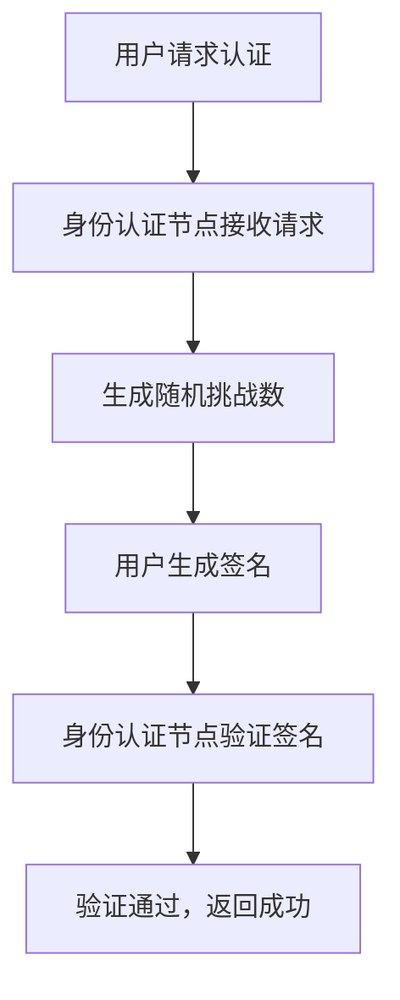
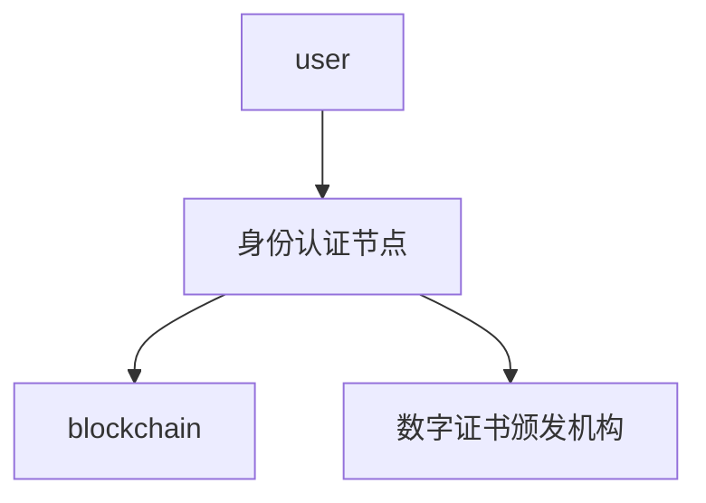
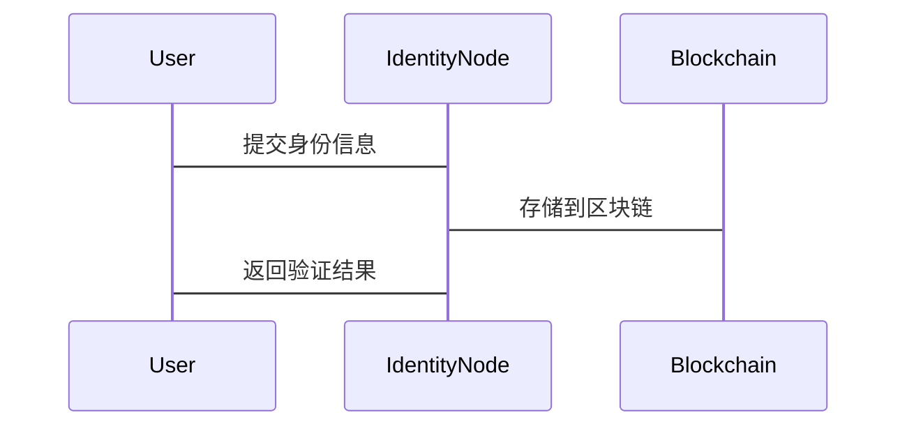

                 


# 企业估值中的区块链数字身份认证系统评估

> 关键词：企业估值，区块链，数字身份认证，系统评估，身份验证，安全性

> 摘要：本文探讨了区块链技术在数字身份认证系统中的应用，特别是在企业估值中的重要性。通过分析区块链数字身份认证的核心概念、算法原理、系统架构以及实际项目案例，本文详细阐述了如何评估和优化区块链数字身份认证系统，以提升企业估值的准确性和安全性。

---

## 第1章 区块链与数字身份认证概述

### 1.1 区块链技术的基本概念

#### 1.1.1 区块链的定义与特点
区块链是一种去中心化的分布式账本技术，通过密码学和共识机制确保数据的安全性和不可篡改性。其特点包括去中心化、透明性、不可篡改性和匿名性。

#### 1.1.2 区块链的核心技术原理
区块链的核心技术包括去中心化账本、共识机制（如POW、POS、BFT）、加密算法（如哈希函数）和智能合约。

#### 1.1.3 区块链在企业估值中的应用背景
区块链技术在企业估值中的应用主要体现在提升数据透明度、减少数据篡改风险和优化资产评估流程。

---

### 1.2 数字身份认证的定义与特点

#### 1.2.1 数字身份认证的定义
数字身份认证是指通过数字技术验证用户身份的真实性，通常涉及密码学和身份标识。

#### 1.2.2 数字身份认证的核心要素
数字身份认证的核心要素包括身份标识、身份验证、授权和访问控制。

#### 1.2.3 数字身份认证与传统身份认证的区别
数字身份认证相比传统方式具有更高的安全性、便捷性和去中心化特性。

---

### 1.3 区块链数字身份认证的结合与优势

#### 1.3.1 区块链与数字身份认证的结合方式
区块链通过去中心化和加密技术，为数字身份认证提供了更高的安全性和不可篡改性。

#### 1.3.2 区块链数字身份认证的优势
区块链数字身份认证的优势包括数据不可篡改、去中心化、隐私保护和高效性。

#### 1.3.3 区块链数字身份认证在企业估值中的应用前景
通过区块链技术，企业估值中的身份认证更加安全可靠，评估数据更加透明和准确。

---

## 第2章 区块链数字身份认证系统的核心概念

### 2.1 区块链数字身份认证系统的组成

#### 2.1.1 用户身份信息
用户身份信息包括姓名、身份证号、邮箱等，通过哈希函数加密存储在区块链上。

#### 2.1.2 数字证书
数字证书由权威机构颁发，包含用户身份信息和公钥，用于验证用户身份。

#### 2.1.3 区块链账本
区块链账本记录了所有数字身份认证相关的交易和数据，确保数据的透明性和不可篡改性。

#### 2.1.4 身份认证节点
身份认证节点负责验证用户的数字身份信息，并维护区块链账本。

---

### 2.2 区块链数字身份认证系统的属性

#### 2.2.1 唯一性
每个用户的数字身份信息在全球范围内唯一。

#### 2.2.2 不可篡改性
区块链技术确保数字身份信息一旦写入，无法被篡改。

#### 2.2.3 可追溯性
区块链上的交易记录可以追溯，便于审计和验证。

#### 2.2.4 隐私保护
通过零知识证明等技术，保护用户的隐私不被泄露。

---

### 2.3 区块链数字身份认证系统的ER实体关系图

```mermaid
erDiagram
    user_identity[user身份信息] o-|{创建}| certificate[数字证书]
    user_identity {创建}o-| certificate[数字证书]
    certificate {存储}o-| blockchain[区块链账本]
    certificate {验证}o-| authentication_node[身份认证节点]
```

---

## 第3章 区块链数字身份认证系统的算法原理

### 3.1 区块链共识机制

#### 3.1.1 共识机制的定义
共识机制是区块链节点达成一致的算法，确保账本的一致性和正确性。

#### 3.1.2 常见的共识算法
- **工作量证明（POW）**：通过计算哈希函数找到特定值的节点获得记账权。
- **权益证明（POS）**：根据节点持有的代币数量分配记账权。
- **拜占庭容错（BFT）**：通过投票机制达成共识。

---

### 3.2 数字签名算法

#### 3.2.1 数字签名的原理
数字签名通过公钥加密技术，确保数据的完整性和真实性。

#### 3.2.2 常见的数字签名算法
- **RSA算法**：基于大整数分解的公钥加密算法。
- **ECC算法**：基于椭圆曲线的公钥加密算法，安全性更高且计算效率更高。

---

### 3.3 区块链数字身份认证系统的流程图



---

## 第4章 区块链数字身份认证系统的系统架构设计

### 4.1 系统功能设计

#### 4.1.1 用户身份信息管理
- 用户注册
- 用户信息加密存储
- 用户信息查询

#### 4.1.2 数字证书管理
- 数字证书生成
- 数字证书颁发
- 数字证书验证

#### 4.1.3 区块链账本管理
- 交易记录上链
- 数据查询与验证
- 账本同步

#### 4.1.4 身份认证节点管理
- 节点加入与退出
- 节点权限管理
- 节点状态监控

---

### 4.2 系统架构设计



---

### 4.3 系统接口设计

#### 4.3.1 用户接口
- 用户身份信息提交接口
- 数字证书申请接口
- 身份验证接口

#### 4.3.2 节点接口
- 交易提交接口
- 区块链查询接口
- 节点状态接口

---

### 4.4 系统交互流程



---

## 第5章 区块链数字身份认证系统的项目实战

### 5.1 环境搭建

#### 5.1.1 安装区块链框架
- 安装以太坊节点（Geth）
- 配置区块链网络参数

#### 5.1.2 安装数字签名库
- 安装RSA或ECC加密库
- 配置开发环境（如Python、Node.js）

---

### 5.2 核心实现

#### 5.2.1 区块链节点实现
```python
from web3 import Web3

w3 = Web3(Web3.HTTPProvider("http://localhost:8545"))
```

#### 5.2.2 数字签名实现
```python
from cryptography.hazmat.primitives.asymmetric import padding
from cryptography.hazmat.primitives.asymmetric.rsa import *
from cryptography.hazmat.primitives.asymmetric.types import *
from cryptography.hazmat.primitives import hashes

private_key = rsa.generate_private_key(
    public_exponent=65537,
    key_size=2048
)
public_key = private_key.public_key()
```

---

### 5.3 项目小结

通过实际项目案例，展示了区块链数字身份认证系统的实现过程，包括环境搭建、核心代码实现和系统测试。

---

## 第6章 最佳实践与总结

### 6.1 小结

区块链数字身份认证系统在企业估值中的应用，通过提高数据安全性和透明度，显著提升了评估的准确性和可信度。

---

### 6.2 注意事项

- 确保系统的去中心化特性
- 保护用户隐私
- 定期更新和维护系统

---

### 6.3 拓展阅读

- 《区块链技术与应用》
- 《数字身份认证系统设计与实现》
- 《共识机制的原理与应用》

---

## 作者

作者：AI天才研究院/AI Genius Institute & 禅与计算机程序设计艺术/Zen And The Art of Computer Programming

---

以上内容为《企业估值中的区块链数字身份认证系统评估》的技术博客文章大纲和核心内容。如需进一步扩展或调整，请随时告知。

