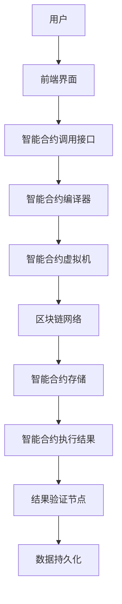
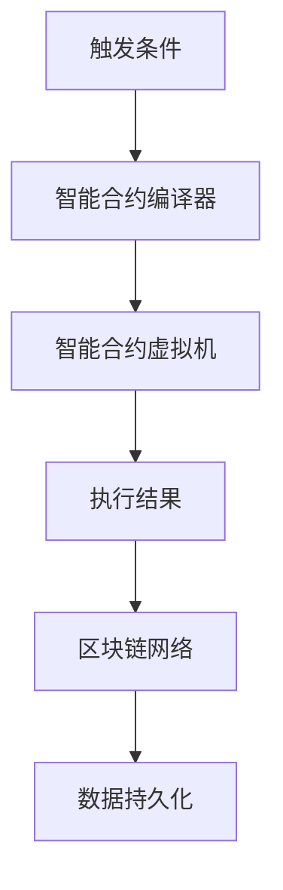
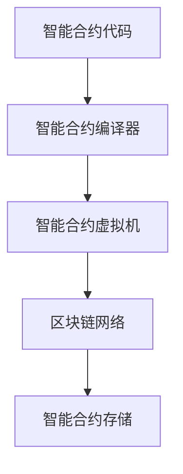
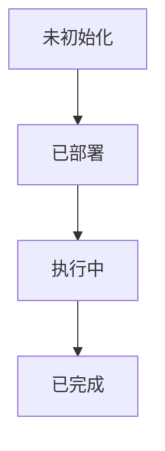
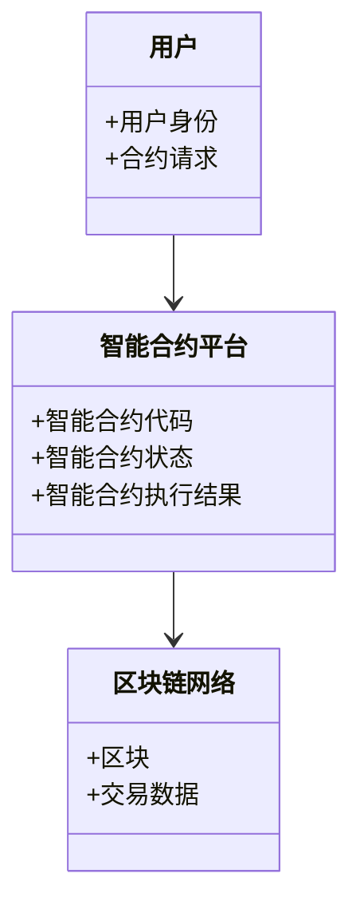
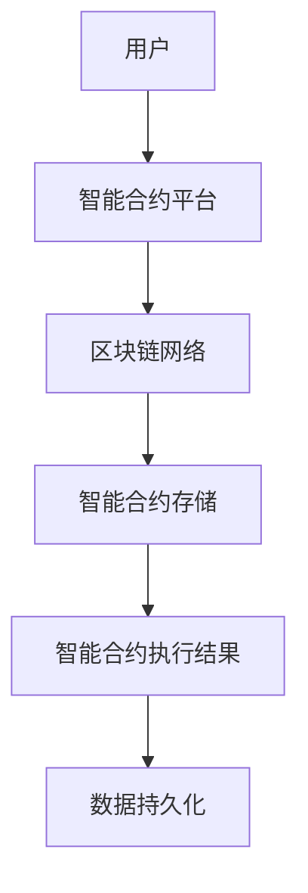

                 


# 企业估值中的区块链智能合约平台评估

**关键词**：区块链、智能合约、企业估值、平台评估、技术分析

**摘要**：  
区块链技术的快速发展为企业估值领域带来了新的可能性。区块链智能合约平台作为一种创新的技术解决方案，能够提高企业估值的透明度、安全性和效率。本文将从区块链智能合约平台的核心概念、技术原理、评估指标、算法实现以及实际应用等方面，全面分析其在企业估值中的作用，并提出一套系统的评估方法。通过结合实际案例，本文将深入探讨如何利用区块链智能合约平台提升企业估值的准确性和可信度。

---

# 第一部分：区块链智能合约平台的背景与核心概念

## 第1章：区块链与智能合约的背景与发展

### 1.1 区块链技术的背景与发展

区块链技术自2008年比特币白皮书发布以来，经历了从数字货币到企业级应用的快速发展。区块链的去中心化、不可篡改和透明性等特点，使其在多个领域得到了广泛应用。企业估值作为商业活动中的核心环节，对数据的准确性和透明度有极高的要求，而区块链技术恰好能够满足这一需求。

#### 1.1.1 区块链的基本概念与特点

区块链是一种分布式账本技术，通过密码学和共识机制确保数据的安全性和一致性。以下是区块链的主要特点：

- **去中心化**：数据不依赖于单一中心节点，而是分布在网络中的多个节点上。
- **不可篡改**：一旦数据被写入区块链，除非通过共识机制，否则无法修改。
- **透明性**：区块链上的数据对所有参与者公开，但只有授权方才能访问敏感信息。
- **可追溯性**：每个交易都可以追溯到原始来源，便于审计和追踪。

#### 1.1.2 区块链在企业估值中的应用前景

企业估值通常涉及大量的财务数据、市场信息和合同条款。传统的企业估值过程可能存在数据不透明、信息不对称和人为干预等问题。区块链技术的应用可以有效解决这些问题，提升企业估值的准确性和可信度。

例如，区块链可以用于记录企业的财务数据、合同履行情况以及资产状态，确保数据的真实性和完整性。此外，区块链还可以通过智能合约自动执行合同条款，减少人为干预的风险。

#### 1.1.3 智能合约的起源与演变

智能合约的概念最早由尼克·萨博（Nick Szabo）在1994年提出，是一种基于区块链的自动执行合同。智能合约通过预设的代码逻辑，在区块链上自动执行合同条款，无需依赖传统的中介机构。随着区块链技术的发展，智能合约的应用场景不断扩大，逐渐从金融领域扩展到企业估值、供应链管理等多个领域。

---

### 1.2 智能合约平台的核心概念

智能合约平台是区块链技术的重要组成部分，它通过提供一个去中心化的环境，支持智能合约的编写、部署和执行。以下是智能合约平台的核心概念：

#### 1.2.1 智能合约的定义与基本原理

智能合约是一种基于区块链的自动执行程序，能够根据预设的条件自动执行相应的操作。与传统合约不同，智能合约的执行过程完全由区块链网络中的节点共同验证和执行，无需依赖第三方机构。

智能合约的基本原理可以分为以下几个步骤：

1. **合约部署**：将智能合约代码部署到区块链网络中。
2. **合约触发**：当满足预设的条件时，智能合约自动执行。
3. **合约执行**：智能合约根据逻辑执行相应的操作，并将结果记录在区块链上。
4. **结果验证**：区块链节点对合约执行的结果进行验证，确保其符合预期。

#### 1.2.2 智能合约与传统合约的对比分析

以下是智能合约与传统合约的主要区别：

| **对比维度** | **智能合约** | **传统合约** |
|--------------|--------------|--------------|
| **执行方式** | 自动执行     | 人工执行     |
| **信任机制** | 基于区块链   | 基于法律     |
| **透明性**   | 高           | 低           |
| **效率**     | 高           | 低           |
| **成本**     | 低           | 高           |

通过对比可以看出，智能合约在透明性、效率和成本方面具有明显优势。

#### 1.2.3 区块链智能合约平台的生态系统

智能合约平台的生态系统包括以下几个部分：

- **开发工具**：用于编写、调试和部署智能合约的工具。
- **区块链网络**：提供去中心化的执行环境。
- **节点与矿工**：负责验证和执行智能合约的节点。
- **智能合约库**：提供丰富的智能合约模板和示例。

---

## 第2章：区块链智能合约平台的架构与核心要素

### 2.1 智能合约平台的架构分析

智能合约平台的架构设计是决定其性能和功能的关键。以下是智能合约平台的主要架构模块：

#### 2.1.1 平台的功能模块划分

- **智能合约编译器**：将智能合约代码编译为区块链可执行的指令。
- **合约执行环境**：提供智能合约运行的虚拟机环境。
- **合约存储与管理**：管理和存储智能合约的代码及执行记录。
- **合约调用接口**：提供API接口，允许外部系统调用智能合约。

#### 2.1.2 平台的分层架构设计

以下是智能合约平台的分层架构设计：



通过分层架构设计，智能合约平台能够实现高效的模块化管理，确保系统的可扩展性和可维护性。

#### 2.1.3 各模块之间的交互关系

以下是各模块之间的交互关系：

- **用户**通过**前端界面**提交智能合约的调用请求。
- **前端界面**通过**智能合约调用接口**与后端系统进行通信。
- **智能合约调用接口**将请求转发给**智能合约编译器**。
- **智能合约编译器**将代码编译为区块链可执行的指令，并提交给**智能合约虚拟机**。
- **智能合约虚拟机**执行指令，并将结果提交给**区块链网络**。
- **区块链网络**将结果存储在**智能合约存储**中，并返回给用户。

---

### 2.2 智能合约的核心要素与属性

智能合约的核心要素包括以下几点：

#### 2.2.1 合约的状态与操作

智能合约的状态是其执行过程中的关键因素。以下是智能合约的主要状态：

- **未初始化**：智能合约尚未部署到区块链网络。
- **已部署**：智能合约已成功部署，并可以接受外部调用。
- **执行中**：智能合约正在根据预设的条件执行相应的操作。
- **已完成**：智能合约的执行过程已结束，结果已记录在区块链上。

智能合约的操作包括以下几种：

- **部署**：将智能合约部署到区块链网络。
- **调用**：根据预设的条件触发智能合约的执行。
- **终止**：智能合约执行完成或因异常终止。

#### 2.2.2 合约的触发条件与执行逻辑

智能合约的触发条件是其执行的关键驱动因素。以下是常见的触发条件：

- **时间触发**：根据预设的时间自动执行。
- **事件触发**：根据特定事件的发生自动执行。
- **条件触发**：根据预设的条件满足后自动执行。

智能合约的执行逻辑是根据触发条件编写的代码逻辑。以下是智能合约的执行流程：



通过上述流程，智能合约能够在区块链网络上自动执行相应的操作。

---

### 2.3 区块链平台的共识机制与数据结构

#### 2.3.1 共识机制的种类与特点

区块链的共识机制是确保数据一致性的关键。以下是常见的共识机制：

- **工作量证明（PoW）**：通过计算哈希值来验证区块的有效性。
- **权益证明（PoS）**：根据节点持有的代币数量来决定其权重。
- ** delegated 权益证明（DPoS）**：通过选举产生记账节点。
- **拜占庭容错（BFT）**：通过投票机制达成共识。

#### 2.3.2 区块链中的数据结构

区块链中的数据结构主要包括以下几种：

- **区块**：存储交易数据和区块头信息。
- **链表**：将区块按时间顺序链接起来，形成区块链。
- ** Merkel树**：用于存储交易数据的哈希值，确保数据的完整性和一致性。

#### 2.3.3 智能合约的存储与执行环境

智能合约的存储与执行环境是区块链网络中的重要组成部分。以下是智能合约的存储与执行环境的结构：



通过上述结构，智能合约可以在区块链网络上高效地存储和执行。

---

## 第3章：区块链智能合约平台的评估指标与模型

### 3.1 评估指标的分类与选择

智能合约平台的评估指标是衡量其性能和功能的关键。以下是智能合约平台的主要评估指标：

#### 3.1.1 技术指标

- **性能**：智能合约的执行速度和吞吐量。
- **安全性**：智能合约的安全性，防止漏洞和攻击。
- **可扩展性**：智能合约平台的可扩展性，支持大规模应用。

#### 3.1.2 业务指标

- **适用性**：智能合约平台是否适用于特定业务场景。
- **可维护性**：智能合约平台的可维护性和可升级性。
- **成本**：智能合约平台的开发和运维成本。

#### 3.1.3 综合评估指标

- **综合评分**：根据技术指标和业务指标的综合得分。

---

### 3.2 智能合约平台评估模型的构建

智能合约平台评估模型的构建是确保评估结果准确性的关键。以下是智能合约平台评估模型的主要步骤：

#### 3.2.1 模型的输入与输出

- **输入**：智能合约平台的技术指标和业务指标。
- **输出**：智能合约平台的综合评分。

#### 3.2.2 模型的评估方法与流程

- **数据收集**：收集智能合约平台的技术指标和业务指标。
- **数据处理**：对数据进行清洗和标准化处理。
- **模型训练**：通过机器学习算法训练评估模型。
- **模型验证**：通过实际案例验证模型的准确性。

#### 3.2.3 模型的验证与优化

- **验证**：通过实际案例验证模型的准确性。
- **优化**：根据验证结果优化模型的参数和结构。

---

### 3.3 评估模型的数学表达与公式推导

智能合约平台评估模型的数学表达式如下：

$$
\text{综合评分} = \sum_{i=1}^{n} w_i \cdot x_i
$$

其中，\( w_i \) 是第 \( i \) 个指标的权重，\( x_i \) 是第 \( i \) 个指标的得分。

---

## 第4章：智能合约平台的算法实现与优化

### 4.1 智能合约的执行算法

智能合约的执行算法是确保智能合约高效执行的关键。以下是智能合约的执行算法：

#### 4.1.1 合约执行的流程与步骤

- **部署**：将智能合约部署到区块链网络。
- **触发**：根据预设的条件触发智能合约的执行。
- **执行**：智能合约根据逻辑自动执行相应的操作。
- **验证**：区块链节点对执行结果进行验证。

#### 4.1.2 合约状态的转换与管理

智能合约的状态转换可以通过状态机模型来表示。以下是智能合约的状态机模型：



---

### 4.2 区块链共识算法的优化

区块链共识算法的优化是提高智能合约平台性能的关键。以下是常见的区块链共识算法优化方法：

#### 4.2.1 常见共识算法的优缺点对比

以下是常见共识算法的优缺点对比：

| **共识算法** | **优点**               | **缺点**               |
|--------------|-----------------------|-----------------------|
| PoW          | 安全性高               | 能耗高                 |
| PoS          | 能耗低                 | 安全性较低             |
| DPoS         | 能耗低                 | 中心化风险较高         |
| BFT          | 高效性                 | 容错性较低             |

#### 4.2.2 基于BFT的优化算法

基于BFT的优化算法可以通过以下步骤实现：

1. **节点选举**：通过选举机制选出一部分节点作为记账节点。
2. **区块生成**：记账节点生成区块并提交给其他节点验证。
3. **区块验证**：其他节点对区块进行验证，并将验证结果提交给记账节点。
4. **区块确认**：记账节点确认区块后，区块正式加入区块链。

---

## 第5章：智能合约平台的系统分析与架构设计

### 5.1 问题场景介绍

企业估值中的智能合约平台需要解决以下问题：

- **数据不透明**：传统企业估值过程中的数据可能存在不透明和篡改的风险。
- **效率低下**：传统企业估值过程中的信息传递和审核效率低下。
- **成本高昂**：传统企业估值过程中的中介成本高昂。

---

### 5.2 项目介绍

本项目旨在通过区块链智能合约平台提升企业估值的透明度、效率和成本。以下是项目的总体目标：

- **目标**：提供一个去中心化的智能合约平台，支持企业估值数据的自动记录和验证。

---

### 5.3 系统功能设计

#### 5.3.1 领域模型的 mermaid 类图

以下是智能合约平台的领域模型类图：



---

### 5.4 系统架构设计

#### 5.4.1 系统架构的 mermaid 架构图

以下是智能合约平台的系统架构图：



---

### 5.5 系统接口设计

智能合约平台的系统接口设计如下：

- **智能合约平台 API**：提供智能合约的部署、调用和查询接口。
- **区块链网络 API**：提供区块链网络的节点管理和数据查询接口。

---

### 5.6 系统交互的 mermaid 序列图

以下是智能合约平台的系统交互序列图：


---

## 第6章：智能合约平台的项目实战

### 6.1 环境安装

智能合约平台的开发环境包括以下工具：

- **Solidity**：智能合约编程语言。
- **Geth**：以太坊节点客户端。
- **Truffle**：智能合约开发框架。

---

### 6.2 系统核心实现

以下是智能合约平台的核心代码实现：

```python
class SmartContract:
    def __init__(self, code):
        self.code = code
        self.state = "未初始化"
    
    def deploy(self):
        self.state = "已部署"
        return True
    
    def execute(self, trigger_condition):
        if self.state == "已部署":
            if trigger_condition:
                self.state = "执行中"
                # 执行智能合约逻辑
                print("智能合约已执行")
                self.state = "已完成"
                return True
            else:
                return False
        else:
            return False
```

---

### 6.3 案例分析

以下是智能合约平台在企业估值中的实际案例：

#### 6.3.1 案例背景

某企业需要对其资产进行估值，希望通过智能合约平台实现数据的自动记录和验证。

#### 6.3.2 案例实现

1. **部署智能合约**：将企业的资产数据记录到智能合约中。
2. **触发智能合约**：当资产数据发生变化时，智能合约自动执行。
3. **执行智能合约**：智能合约根据预设的逻辑自动更新资产数据。

#### 6.3.3 案例结果

通过智能合约平台，企业的资产数据实现了自动记录和验证，提升了企业估值的透明度和效率。

---

## 第7章：总结与展望

### 7.1 本章小结

本文全面分析了区块链智能合约平台在企业估值中的应用，提出了智能合约平台的评估指标和模型，并通过实际案例验证了其可行性。

### 7.2 未来展望

随着区块链技术的不断发展，智能合约平台在企业估值中的应用前景广阔。未来，可以通过优化共识算法和提升智能合约的安全性，进一步提升智能合约平台的性能和功能。

---

**作者**：AI天才研究院/AI Genius Institute & 禅与计算机程序设计艺术/Zen And The Art of Computer Programming

