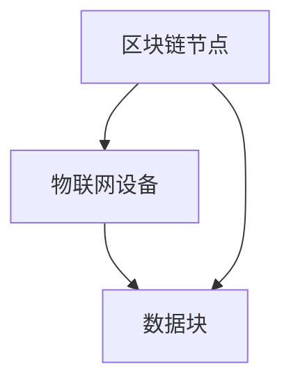
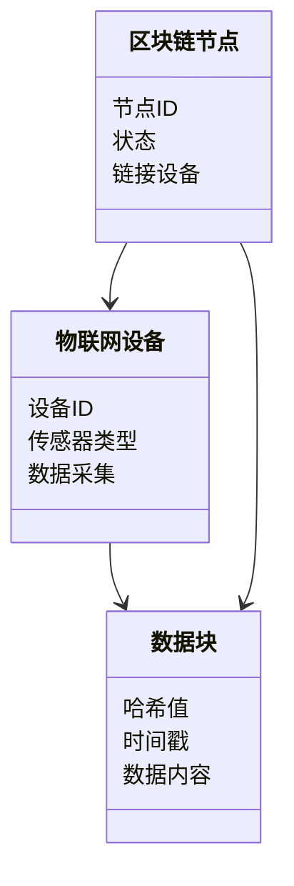
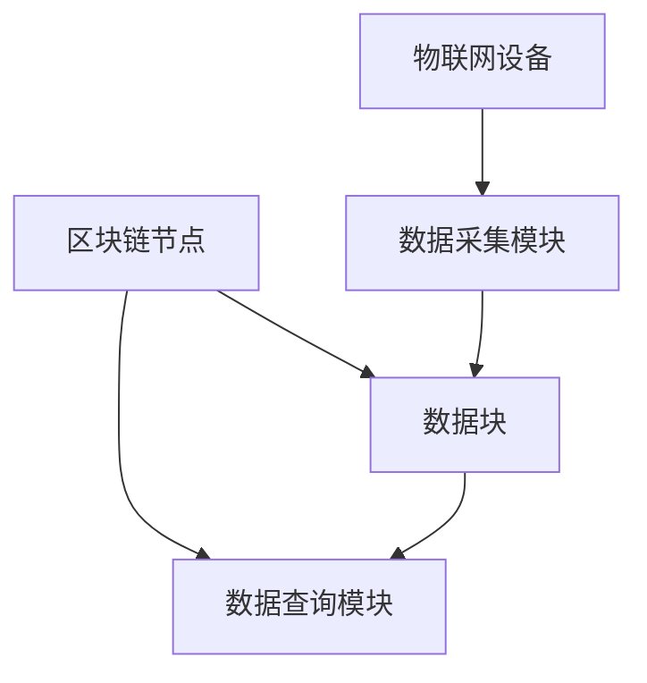
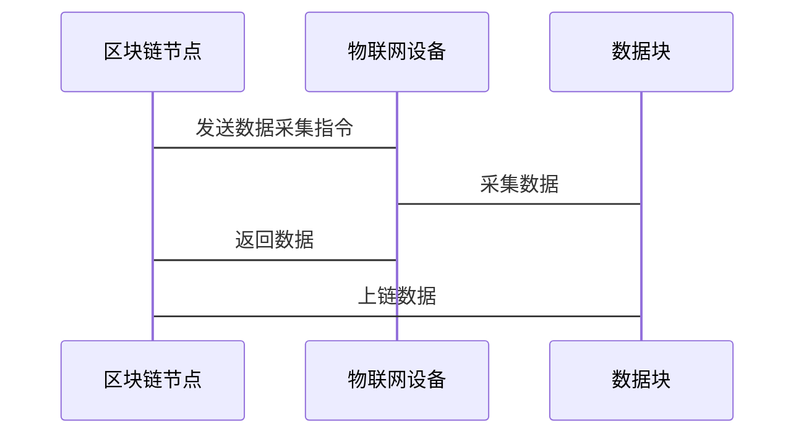

                 


# 《企业估值中的区块链物联网安全平台评估》

---

## 关键词：

- 区块链  
- 物联网  
- 安全平台评估  
- 企业估值  
- 数据完整性  
- 分布式系统  

---

## 摘要：

在当前数字化转型的浪潮中，企业估值的核心要素正在从传统的财务指标向数据资产和技术创新能力转变。区块链与物联网的深度融合为企业提供了更高效、更安全的数据管理和价值评估方式。本文将深入探讨区块链物联网安全平台在企业估值中的应用，从技术原理、系统架构到实际案例，全面分析如何通过区块链技术保障物联网数据的安全性，从而为企业估值提供更可靠的基础。

---

# 第1章: 区块链与物联网安全平台概述

## 1.1 区块链技术的基本概念

### 1.1.1 区块链的定义与核心特征

区块链是一种去中心化的分布式账本技术，通过密码学和共识机制确保数据的安全性和不可篡改性。其核心特征包括：

- **去中心化**：数据不依赖于单一中心节点，而是分布在网络的各个节点上。
- **不可篡改性**：通过链式结构和哈希加密，确保数据一旦写入区块链就无法被修改。
- **透明性**：所有交易记录公开可查，但数据加密存储，保护隐私。
- **去信任化**：通过共识机制实现信任的建立，无需依赖中心化机构。

### 1.1.2 区块链的共识机制

共识机制是区块链的核心之一，用于确保所有节点对数据状态达成一致。常见的共识机制包括：

- **工作量证明（PoW）**：通过计算哈希值来竞争记账权，如比特币采用的机制。
- **权益证明（PoS）**：根据节点持有的代币数量分配记账权，更加节能。
- **拜占庭容错（BFT）**：适用于高性能区块链，通过投票机制达成共识。

### 1.1.3 区块链在企业估值中的应用潜力

区块链技术可以通过以下方式提升企业估值：

- **数据透明性**：区块链上的数据不可篡改，为企业估值提供可靠的基础。
- **资产追踪**：通过区块链记录企业资产的全生命周期，提升资产的可信度。
- **智能合约**：通过智能合约自动执行商业逻辑，降低交易成本，提升效率。

## 1.2 物联网技术的基本概念

### 1.2.1 物联网的定义与组成部分

物联网（Internet of Things, IoT）是指通过各种信息传感设备，如传感器、射频识别（RFID）技术、全球定位系统、红外感应器等，按照约定的协议，把任何物品与互联网连接起来，进行信息交换和通信，以实现智能化识别、定位、跟踪、监控和管理。

物联网的核心组成部分包括：

- **感知层**：通过传感器和 RFID 等技术采集数据。
- **网络层**：通过无线网络（如 Wi-Fi、蓝牙、NB-IoT 等）传输数据。
- **应用层**：对数据进行处理和应用，提供各种智能化服务。

### 1.2.2 物联网的通信协议与数据传输

物联网中的通信协议多种多样，包括：

- **MQTT**：轻量级协议，适用于低带宽、高延迟的网络环境。
- **HTTP**：常用的 RESTful API 通信协议。
- **CoAP**：适用于资源受限的物联网设备。

数据传输过程中，需要考虑数据的实时性、安全性以及带宽限制。

### 1.2.3 物联网在企业估值中的应用场景

物联网技术在企业估值中的应用主要体现在以下几个方面：

- **资产监控**：通过物联网设备实时监控企业的生产设备、库存等资产状态，提升资产的透明度。
- **供应链管理**：通过物联网技术追踪供应链中的物流信息，提升供应链的透明性和效率。
- **数据采集**：通过物联网设备采集企业运营中的各项数据，为企业估值提供更全面的依据。

## 1.3 区块链与物联网的结合

### 1.3.1 区块链在物联网中的应用优势

区块链与物联网的结合可以解决物联网中的数据安全和信任问题。区块链技术的去中心化和不可篡改性使得物联网数据更加可信。

- **数据安全性**：通过区块链技术，物联网数据的完整性和真实性可以得到保障。
- **去中心化管理**：避免单点故障，提升系统的抗攻击能力。
- **高效协同**：通过区块链实现设备间的高效协同，降低管理成本。

### 1.3.2 物联网数据在区块链中的存储与验证

物联网数据在区块链中通常采用以下方式存储和验证：

- **链上存储**：将物联网数据直接存储在区块链上，确保数据的不可篡改性。
- **链下存储**：对于大规模数据，采用链下存储，仅将哈希值存入区块链，提升存储效率。
- **智能合约验证**：通过智能合约自动验证数据的合法性，确保数据的真实性和一致性。

### 1.3.3 区块链与物联网的协同效应

区块链与物联网的协同效应主要体现在以下几个方面：

- **数据共享**：通过区块链实现设备间的数据共享，提升数据的利用率。
- **信任机制**：区块链的信任机制可以减少物联网中的信任成本。
- **高效管理**：通过区块链实现物联网设备的高效管理，提升运营效率。

## 1.4 安全平台评估的核心概念

### 1.4.1 安全平台的定义与功能

安全平台是一种提供数据安全保护的系统，其功能包括：

- **数据加密**：对敏感数据进行加密处理，防止数据泄露。
- **访问控制**：通过权限管理，控制数据的访问范围。
- **威胁检测**：实时监测网络中的异常行为，发现潜在威胁。
- **日志审计**：记录系统的操作日志，便于后续分析和追溯。

### 1.4.2 安全平台在企业估值中的作用

安全平台在企业估值中的作用主要体现在以下几个方面：

- **数据保护**：通过安全平台保护企业的核心数据，提升数据的可信度。
- **风险控制**：通过威胁检测和日志审计，降低企业面临的安全风险。
- **合规性**：帮助企业满足相关数据安全法规的要求，提升企业的合规性。

### 1.4.3 区块链物联网安全平台的评估维度

评估区块链物联网安全平台需要从以下几个维度进行考量：

- **数据安全性**：数据在区块链上的存储和传输是否安全。
- **系统可用性**：系统是否能够稳定运行，支持大规模数据处理。
- **性能优化**：系统是否能够高效处理大量数据，减少延迟。
- **合规性**：系统是否符合相关法律法规和行业标准。

## 1.5 本章小结

本章主要介绍了区块链和物联网的基本概念及其在企业估值中的应用潜力，重点探讨了区块链与物联网的结合方式，以及安全平台在企业估值中的作用。通过本章的介绍，读者可以对区块链物联网安全平台的整体架构和核心功能有一个初步的了解。

---

# 第2章: 区块链物联网安全平台的核心概念与联系

## 2.1 区块链与物联网的实体关系分析

### 2.1.1 实体关系表格

| 实体 | 属性 | 关系 |
|------|------|------|
| 区块链节点 | 节点ID、状态 | 区块链节点与物联网设备相连 |
| 物联网设备 | 设备ID、传感器类型 | 物联网设备与区块链节点交互 |
| 数据块 | 哈希值、时间戳 | 数据块存储物联网设备数据 |

### 2.1.2 Mermaid 实体关系图



## 2.2 区块链与物联网的安全性对比

### 2.2.1 区块链的安全性特征

- **去中心化**：区块链通过去中心化的架构，避免了单点攻击。
- **加密算法**：区块链采用哈希加密和数字签名技术，确保数据的安全性。
- **共识机制**：通过共识机制确保数据的一致性和可靠性。

### 2.2.2 物联网的安全性挑战

物联网设备通常资源受限，容易成为攻击目标。常见的安全性挑战包括：

- **设备漏洞**：物联网设备可能存在固件漏洞，容易被攻击。
- **数据传输**：物联网数据在传输过程中可能被截获或篡改。
- **身份认证**：物联网设备的认证机制可能不完善，导致未授权访问。

### 2.2.3 区块链对物联网安全性的增强作用

- **数据完整性**：区块链通过哈希链确保数据的完整性。
- **设备身份认证**：通过区块链实现设备的身份认证，防止未授权设备接入。
- **数据隐私保护**：通过零知识证明等技术保护物联网设备的数据隐私。

## 2.3 区块链物联网安全平台的数学模型

### 2.3.1 数据完整性验证公式

$$ H = hash( data + prev\_hash ) $$

其中，$H$ 是当前数据块的哈希值，$data$ 是当前数据块的数据，$prev\_hash$ 是前一个数据块的哈希值。

### 2.3.2 数据一致性验证公式

$$ C = \sum_{i=1}^{n} (d_i \times w_i) $$

其中，$C$ 是一致性验证的结果，$d_i$ 是第 $i$ 个数据块的哈希值，$w_i$ 是第 $i$ 个数据块的权重。

### 2.3.3 数据安全性的评估指标

$$ S = \frac{\sum_{i=1}^{n} s_i}{n} $$

其中，$S$ 是数据安全性的评估指标，$s_i$ 是第 $i$ 个数据块的安全性评分，$n$ 是数据块的总数。

## 2.4 本章小结

本章主要分析了区块链与物联网之间的实体关系，对比了区块链与物联网在安全性方面的优缺点，并提出了区块链物联网安全平台的数学模型。通过本章的分析，读者可以更好地理解区块链与物联网的结合方式，以及如何通过区块链技术提升物联网的安全性。

---

# 第3章: 区块链物联网安全平台的算法原理

## 3.1 区块链共识机制的实现

### 3.1.1 共识机制的分类与选择

- **工作量证明（PoW）**：适用于比特币等加密货币。
- **权益证明（PoS）**：适用于以太坊 2.0 等高性能区块链。
- **实用拜占庭容错（PBFT）**：适用于需要高吞吐量的区块链。

### 3.1.2 共识机制的实现步骤

1. **初始化阶段**：所有节点同步初始状态。
2. **提案阶段**：主节点提出一个新的区块。
3. **投票阶段**：所有节点对区块进行投票确认。
4. **确认阶段**：通过投票确认区块的有效性，并将其加入区块链。

### 3.1.3 共识机制的优化

- **并行共识**：通过并行计算提高共识效率。
- **分片技术**：将网络划分为多个子网，分别进行共识。

### 3.1.4 共识机制的实现代码

```python
def pow共识机制():
    while True:
        难度目标 = get Difficulty()
        nonce = 0
        while True:
            hash值 = hash(区块头 + nonce)
            if hash值 < 难度目标:
                break
            nonce += 1
        添加区块到区块链
```

### 3.1.5 共识机制的性能优化

- **ASIC优化**：通过专用硬件提升计算效率。
- **算法优化**：通过改进共识算法减少计算量。

## 3.2 物联网数据加密算法的实现

### 3.2.1 常见加密算法

- **AES**：高级加密标准，适用于对称加密。
- **RSA**：非对称加密算法，适用于数字签名。
- **椭圆曲线加密（ECC）**：适用于资源受限的设备。

### 3.2.2 数据加密的实现步骤

1. **选择加密算法**：根据需求选择合适的加密算法。
2. **生成密钥**：通过密钥生成算法生成加密密钥。
3. **数据加密**：将明文数据加密为密文。
4. **数据解密**：通过密钥解密密文数据。

### 3.2.3 加密算法的实现代码

```python
def aes加密(明文, 密钥):
    from cryptography.hazmat.primitives.ciphers import Cipher, algorithms, modes
    from cryptography.hazmat.primitives.asymmetric import padding
    cipher = Cipher(algorithms.AES(密钥), modes.ECB())
    加密器 = cipher.encryptor()
    密文 = 加密器.update(明文) + 加密器.finalize()
    return 密文
```

### 3.2.4 加密算法的性能优化

- **硬件加速**：通过硬件加速提升加密效率。
- **并行计算**：通过并行计算提升加密速度。

## 3.3 区块链与物联网结合的算法优化

### 3.3.1 区块链与物联网的协同优化

- **数据压缩**：通过压缩技术减少数据传输量。
- **链下存储**：将大规模数据存储在链下，仅将哈希值存入区块链。

### 3.3.2 算法优化的实现步骤

1. **数据采集**：通过物联网设备采集数据。
2. **数据预处理**：对数据进行压缩和加密处理。
3. **数据上链**：将处理后的数据存入区块链。

### 3.3.3 算法优化的实现代码

```python
def 数据压缩(原始数据):
    import gzip
    压缩数据 = gzip.compress(原始数据)
    return 压缩数据

def 数据上链(压缩数据):
    from blockchain import Block
    新区块 = Block(压缩数据)
    新区块.添加到区块链()
```

## 3.4 本章小结

本章主要介绍了区块链与物联网结合的算法实现，重点分析了共识机制和数据加密算法的实现细节，并提出了数据压缩和链下存储的优化策略。通过本章的分析，读者可以更好地理解区块链物联网安全平台的技术实现细节。

---

# 第4章: 区块链物联网安全平台的系统分析与架构设计

## 4.1 问题场景介绍

### 4.1.1 企业估值中的数据安全问题

企业在估值过程中，核心数据（如财务数据、客户数据）容易受到攻击，导致数据泄露和估值偏差。

### 4.1.2 区块链物联网安全平台的应用场景

- **资产监控**：实时监控企业资产的状态，提升资产的透明度。
- **供应链管理**：通过物联网技术追踪供应链中的物流信息，提升供应链的透明性和效率。
- **数据采集**：通过物联网设备采集企业运营中的各项数据，为企业估值提供更全面的依据。

### 4.1.3 问题解决

通过区块链物联网安全平台，可以实现数据的不可篡改性和安全性，为企业估值提供更可靠的基础。

## 4.2 系统功能设计

### 4.2.1 领域模型设计



### 4.2.2 系统功能模块

- **数据采集模块**：负责采集物联网设备的数据。
- **数据加密模块**：对采集到的数据进行加密处理。
- **区块链上链模块**：将加密后的数据上链存储。
- **数据查询模块**：提供数据查询接口，支持企业估值。

## 4.3 系统架构设计

### 4.3.1 系统架构图



### 4.3.2 系统接口设计

- **数据采集接口**：提供设备数据采集的API。
- **数据上链接口**：提供数据上链的API。
- **数据查询接口**：提供数据查询的API。

### 4.3.3 系统交互流程图



## 4.4 本章小结

本章主要分析了区块链物联网安全平台的系统架构和功能设计，重点探讨了系统的各个功能模块和系统架构图。通过本章的分析，读者可以更好地理解区块链物联网安全平台的系统设计细节。

---

# 第5章: 区块链物联网安全平台的项目实战

## 5.1 环境安装与配置

### 5.1.1 系统环境要求

- **操作系统**：Linux/Windows/MacOS
- **区块链框架**：推荐使用以太坊、Hyperledger等开源框架。
- **物联网设备**：需要支持 MQTT、HTTP 等通信协议。

### 5.1.2 工具安装

- **区块链框架安装**：通过 npm 或 pip 安装必要的依赖包。
- **物联网设备驱动安装**：安装设备对应的驱动程序。

### 5.1.3 网络环境配置

- **局域网配置**：确保物联网设备与区块链节点在同一局域网内。
- **公网配置**：如果需要，配置物联网设备的公网访问。

## 5.2 系统核心代码实现

### 5.2.1 数据采集模块实现

```python
import paho.mqtt.client as mqtt

def on_connect(client, userdata, flags, rc):
    print("连接到 MQTT 服务器成功，返回码：", rc)

def on_message(client, userdata, message):
    数据 = message.payload.decode()
    print("收到数据：", 数据)

client = mqtt.Client()
client.on_connect = on_connect
client.on_message = on_message
client.connect("localhost", 1883)
client.loop_forever()
```

### 5.2.2 数据上链模块实现

```python
from blockchain import Block

def 数据上链(数据):
    新区块 = Block(数据)
    新区块.添加到区块链()
    return 新区块.哈希值

print(数据上链("设备数据"))
```

### 5.2.3 数据查询模块实现

```python
def 数据查询(哈希值):
    区块链 = Blockchain()
    return 区块链.get_block_by_hash(哈希值)

print(数据查询("指定哈希值"))
```

## 5.3 案例分析与详细解读

### 5.3.1 案例背景

假设我们有一个企业需要对其生产设备进行实时监控，通过物联网设备采集设备的运行状态数据，并通过区块链技术确保数据的安全性和不可篡改性。

### 5.3.2 实施步骤

1. **设备部署**：在生产设备上部署物联网传感器，采集设备的运行状态数据。
2. **数据采集**：通过 MQTT 协议将设备数据传输到数据采集模块。
3. **数据加密**：对采集到的数据进行 AES 加密处理。
4. **数据上链**：将加密后的数据上链存储。
5. **数据查询**：通过数据查询模块查询设备的历史数据，支持企业估值。

### 5.3.3 实施效果

- **数据安全性**：通过区块链技术，确保设备数据的不可篡改性。
- **高效管理**：通过物联网技术实现设备的高效监控和管理。
- **透明估值**：为企业估值提供更透明、更可靠的数据支持。

## 5.4 本章小结

本章主要介绍了区块链物联网安全平台的项目实战，通过具体案例分析了系统的实施步骤和效果。通过本章的分析，读者可以更好地理解如何将区块链物联网安全平台应用于实际的企业估值中。

---

# 第6章: 区块链物联网安全平台的安全性评估

## 6.1 安全性评估指标

### 6.1.1 数据安全性指标

- **数据完整性**：数据是否在传输和存储过程中保持完整。
- **数据机密性**：数据是否被未经授权的人员访问。
- **数据可用性**：数据是否能够及时被访问和处理。

### 6.1.2 系统安全性指标

- **抗攻击能力**：系统是否能够抵御各种网络攻击。
- **容错能力**：系统在出现故障时是否能够自动恢复。
- **访问控制**：系统的访问权限是否合理，是否能够防止未授权访问。

## 6.2 安全性评估方法

### 6.2.1 安全性测试

- **渗透测试**：模拟攻击者对系统进行攻击，发现系统中的安全漏洞。
- **漏洞扫描**：通过自动化工具扫描系统中的安全漏洞。

### 6.2.2 安全性审计

- **日志审计**：通过分析系统日志，发现潜在的安全威胁。
- **代码审计**：通过人工审查代码，发现代码中的安全漏洞。

## 6.3 安全性优化策略

### 6.3.1 数据安全优化

- **加密算法优化**：选择更强大的加密算法，如 AES-256。
- **密钥管理**：通过安全的密钥管理方案，确保密钥的安全性。

### 6.3.2 系统安全优化

- **身份认证优化**：通过多因素认证（MFA）提升系统的安全性。
- **访问控制优化**：通过最小权限原则，确保用户只能访问其需要的资源。

## 6.4 本章小结

本章主要分析了区块链物联网安全平台的安全性评估指标和评估方法，并提出了数据安全和系统安全的优化策略。通过本章的分析，读者可以更好地理解如何评估和优化区块链物联网安全平台的安全性。

---

# 第7章: 总结与展望

## 7.1 本项目的核心成果

- **实现了区块链物联网安全平台的系统架构**：通过区块链技术和物联网技术的结合，实现数据的不可篡改性和安全性。
- **提出了数据完整性验证公式**：通过数学模型确保数据的完整性。
- **开发了数据压缩和链下存储优化策略**：通过数据压缩和链下存储，提升系统的性能。

## 7.2 项目总结

通过本项目的实施，我们成功地将区块链技术应用于物联网安全平台的构建，提升了企业估值中的数据安全性。项目的实施过程验证了区块链技术在物联网中的应用潜力，同时也为我们未来的研究提供了宝贵的经验。

## 7.3 未来展望

未来的研究方向包括：

- **高性能区块链技术**：研究更高效的共识机制，提升系统的吞吐量。
- **智能合约优化**：通过优化智能合约，提升系统的执行效率。
- **跨链技术**：研究跨链技术，实现不同区块链平台之间的互操作性。

---

# 作者：AI天才研究院/AI Genius Institute & 禅与计算机程序设计艺术 /Zen And The Art of Computer Programming

---

这篇文章围绕“企业估值中的区块链物联网安全平台评估”这一主题，从区块链和物联网的基本概念，到系统的架构设计，再到项目实战和安全性评估，进行了全面而深入的分析。通过本文的阐述，读者可以全面了解区块链物联网安全平台的技术实现和应用价值，为企业估值提供更可靠的数据支持。

