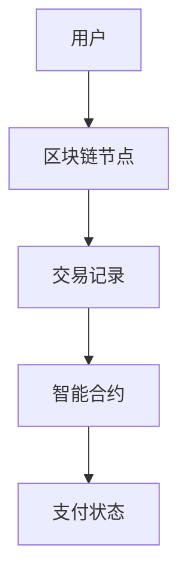
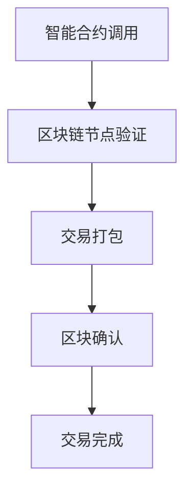
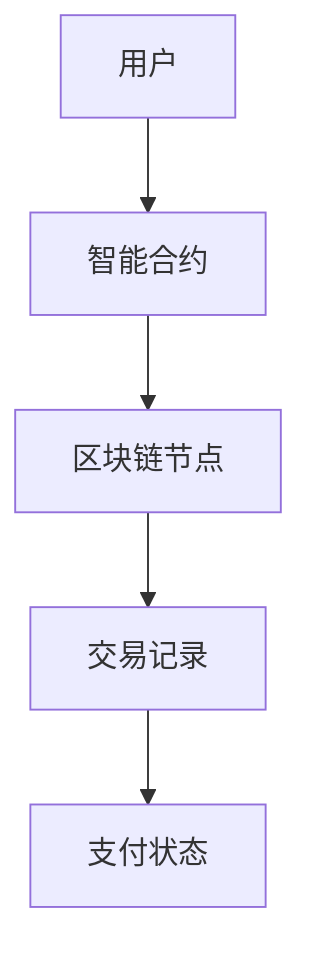

                 


# 《企业估值中的区块链跨境支付系统评估》

---

## 关键词：
- 区块链，跨境支付，企业估值，系统评估，支付系统

---

## 摘要：
区块链技术在跨境支付系统中的应用为企业估值提供了新的视角和方法。本文系统性地分析了区块链跨境支付系统的核心概念、算法原理、系统架构及其实现方案，并通过实际案例展示了如何评估其对企业估值的影响。文章从技术原理到实际应用，详细阐述了区块链在跨境支付中的优势及其对企业价值的提升作用。

---

# 第一部分: 区块链与跨境支付系统基础

---

## 第1章: 区块链与跨境支付系统概述

### 1.1 区块链技术基础

#### 1.1.1 区块链的定义与核心特点

区块链是一种去中心化的分布式账本技术，通过密码学和共识机制确保数据的安全性和不可篡改性。其核心特点包括：

- **去中心化**：数据不依赖于单一中心节点，由多个节点共同维护。
- **不可篡改性**：数据一旦记录，无法被修改或删除。
- **透明性**：所有交易记录公开可查，但参与者身份可选择匿名。
- **去信任化**：通过技术手段减少对中间机构的依赖。

#### 1.1.2 区块链的共识机制

共识机制是区块链的核心组成部分，用于确保所有节点达成一致。常见的共识机制包括：

- **工作量证明（PoW）**：通过计算哈希值来验证区块的有效性。
- **权益证明（PoS）**：根据节点持有的代币数量分配记账权。
- ** delegated proof of stake（DPoS）**：通过投票机制选举记账节点。

#### 1.1.3 区块链的去中心化特性

去中心化是区块链的核心优势，它通过分布式网络实现数据的安全性和可靠性。去中心化的网络具有以下特点：

- **抗单点故障**：没有单一的攻击点，提高了系统的安全性。
- **高容错性**：即使部分节点失效，系统仍能正常运行。
- **去中介化**：减少了中间机构的参与，降低了交易成本。

---

### 1.2 跨境支付系统的基本概念

#### 1.2.1 跨境支付的基本流程

跨境支付的基本流程包括以下几个步骤：

1. **发起交易**：用户通过银行或支付平台发起跨境支付请求。
2. **跨行清算**：交易请求通过清算系统传递至收款银行。
3. **资金结算**：资金从发起银行划转至收款银行。
4. **确认与反馈**：收款方确认收到款项，系统反馈交易成功。

#### 1.2.2 跨境支付的主要挑战

跨境支付面临以下主要挑战：

- **高成本**：传统的跨境支付涉及多个中间银行，费用较高。
- **低效率**：交易处理时间较长，尤其在跨国交易中。
- **安全性问题**：传统支付系统易受黑客攻击和欺诈行为的影响。

#### 1.2.3 跨境支付的现有解决方案

目前，跨境支付的解决方案主要包括：

- **传统银行系统**：依赖于中心化机构进行清算和结算。
- **支付平台**：如 PayPal、支付宝等，提供便捷的支付服务。
- **区块链技术**：通过去中心化的方式实现快速、安全的跨境支付。

---

### 1.3 区块链在跨境支付中的应用前景

#### 1.3.1 区块链技术如何解决跨境支付问题

区块链技术通过去中心化和自动化的特点，解决了传统跨境支付中的许多问题：

- **降低交易成本**：区块链技术减少了中间机构的参与，降低了交易费用。
- **提高交易速度**：区块链的自动化处理能力使得交易可以在几分钟内完成。
- **增强安全性**：区块链的加密技术和共识机制确保了交易的安全性。

#### 1.3.2 区块链在跨境支付中的优势

区块链在跨境支付中的优势主要体现在以下方面：

- **实时性**：区块链支持实时交易确认，减少了传统支付的延迟。
- **透明性**：所有交易记录公开可查，便于企业进行估值。
- **可扩展性**：区块链技术可以支持大规模的交易处理。

#### 1.3.3 区块链跨境支付的未来发展趋势

未来，区块链跨境支付的发展趋势将主要集中在以下几个方面：

- **技术优化**：通过技术创新进一步提高交易速度和安全性。
- **标准化建设**：推动区块链技术的标准化，便于不同系统之间的互联互通。
- **合规性增强**：适应监管要求，确保区块链跨境支付的合法合规。

---

### 1.4 本章小结

本章主要介绍了区块链技术的基本概念和跨境支付系统的基本流程。通过对比区块链技术和传统支付系统的优缺点，揭示了区块链在跨境支付中的巨大潜力。接下来的章节将深入探讨区块链跨境支付系统的核心概念和算法原理，为企业估值提供更深入的理论支持。

---

## 第2章: 区块链跨境支付系统的核心概念

### 2.1 区块链跨境支付系统的核心要素

#### 2.1.1 区块链网络中的节点角色

区块链网络中的节点主要分为以下几种角色：

- **全节点**：完全参与区块链网络的运行，包括存储完整的区块链副本和参与共识过程。
- **轻节点**：仅存储部分区块链数据，依赖其他节点完成交易验证。
- **矿工节点**：负责打包交易并进行哈希计算，确保区块的有效性。

#### 2.1.2 智能合约的定义与作用

智能合约是区块链上的自动执行程序，用于在满足特定条件时自动执行相应的操作。其主要作用包括：

- **自动化交易**：根据预设条件自动执行交易操作。
- **确保信任**：通过智能合约的自动执行，减少对中间机构的依赖。
- **提高效率**：通过自动化流程减少人工干预，提高交易效率。

#### 2.1.3 跨境支付的交易流程

区块链跨境支付的交易流程包括以下几个步骤：

1. **发起交易**：用户通过钱包或支付平台发起支付请求。
2. **智能合约执行**：智能合约根据交易请求生成相应的交易数据。
3. **区块打包**：交易数据被打包成区块，等待矿工节点确认。
4. **共识确认**：矿工节点通过共识机制确认区块的有效性。
5. **交易完成**：交易成功后，资金从发起方划转至收款方。

---

### 2.2 区块链跨境支付系统的属性特征对比

#### 2.2.1 中心化与去中心化对比

| 特性 | 中心化支付系统 | 去中心化支付系统 |
|------|----------------|------------------|
| 控制权 | 单一中心机构 | 分布式节点共同控制 |
| 安全性 | 依赖中心机构的安全性 | 依赖密码学和共识机制 |
| 成本 | 中心机构收取较高手续费 | 成本较低，减少中间机构 |

#### 2.2.2 交易速度与安全性对比

| 特性 | 传统跨境支付 | 区块链跨境支付 |
|------|----------------|------------------|
| 交易速度 | 较慢，需经过多个中间机构 | 较快，区块链自动化处理 |
| 安全性 | 依赖中心机构的安全性 | 高安全性，数据不可篡改 |

#### 2.2.3 成本与效率对比

| 特性 | 传统跨境支付 | 区块链跨境支付 |
|------|----------------|------------------|
| 成本 | 高，涉及多个中间机构 | 低，减少中间机构 |
| 效率 | 低，交易处理时间长 | 高，自动化处理快速 |

---

### 2.3 区块链跨境支付系统的ER实体关系图



---

### 2.4 本章小结

本章通过对比分析，揭示了区块链跨境支付系统的核心要素和属性特征。通过ER实体关系图，展示了系统的整体架构和各部分之间的关系。下一章将深入探讨区块链跨境支付系统的算法原理，为企业估值提供更深入的技术支持。

---

## 第3章: 区块链共识机制的算法原理

### 3.1 共识机制的定义与分类

共识机制是区块链的核心组成部分，用于确保所有节点达成一致。常见的共识机制包括：

- **工作量证明（PoW）**：通过计算哈希值来验证区块的有效性。
- **权益证明（PoS）**：根据节点持有的代币数量分配记账权。
- ** delegated proof of stake（DPoS）**：通过投票机制选举记账节点。

#### 3.1.1 共识机制的作用

共识机制的主要作用包括：

- **确保数据一致性**：通过共识机制确保所有节点的数据一致。
- **防止恶意攻击**：通过共识机制防止恶意节点篡改数据。
- **提高网络安全性**：通过共识机制增强网络的安全性。

---

### 3.2 智能合约的执行流程

#### 3.2.1 智能合约的定义与作用

智能合约是区块链上的自动执行程序，用于在满足特定条件时自动执行相应的操作。其主要作用包括：

- **自动化交易**：根据预设条件自动执行交易操作。
- **确保信任**：通过智能合约的自动执行，减少对中间机构的依赖。
- **提高效率**：通过自动化流程减少人工干预，提高交易效率。

#### 3.2.2 智能合约的执行流程



---

### 3.3 区块链跨境支付系统的数学模型

#### 3.3.1 交易确认时间公式

交易确认时间可以通过以下公式进行估算：

$$
\text{交易确认时间} = \frac{\text{区块大小}}{\text{网络带宽}} + \text{共识机制确认时间}
$$

其中，区块大小和网络带宽是影响交易确认时间的主要因素。共识机制确认时间则取决于所采用的共识算法。

---

### 3.4 本章小结

本章详细介绍了共识机制的定义与分类，以及智能合约的执行流程。通过数学模型的分析，揭示了交易确认时间的影响因素。下一章将从系统架构的角度，深入探讨区块链跨境支付系统的实现方案。

---

## 第4章: 区块链跨境支付系统的系统分析与架构设计

### 4.1 系统功能需求

#### 4.1.1 核心功能模块

区块链跨境支付系统的核心功能模块包括：

- **用户模块**：用户发起交易请求。
- **智能合约模块**：自动执行交易操作。
- **区块确认模块**：通过共识机制确认交易的有效性。
- **支付状态模块**：记录交易的最终状态。

#### 4.1.2 系统功能需求描述

系统功能需求包括：

- **交易发起**：用户通过钱包或支付平台发起交易请求。
- **智能合约执行**：智能合约根据交易请求生成相应的交易数据。
- **区块打包**：交易数据被打包成区块，等待矿工节点确认。
- **共识确认**：矿工节点通过共识机制确认区块的有效性。
- **交易完成**：交易成功后，资金从发起方划转至收款方。

---

### 4.2 系统架构设计

#### 4.2.1 系统架构图



---

### 4.3 系统接口设计

系统接口设计包括以下几个方面：

- **用户接口**：用户通过钱包或支付平台发起交易请求。
- **智能合约接口**：智能合约通过区块链平台与用户进行交互。
- **区块链节点接口**：区块链节点通过共识机制确认交易的有效性。
- **支付状态接口**：支付状态模块记录交易的最终状态。

---

### 4.4 系统交互流程

系统交互流程包括以下几个步骤：

1. **用户发起交易请求**：用户通过钱包或支付平台发起交易请求。
2. **智能合约执行**：智能合约根据交易请求生成相应的交易数据。
3. **区块打包**：交易数据被打包成区块，等待矿工节点确认。
4. **共识确认**：矿工节点通过共识机制确认区块的有效性。
5. **交易完成**：交易成功后，资金从发起方划转至收款方。

---

### 4.5 本章小结

本章详细分析了区块链跨境支付系统的功能需求和系统架构设计。通过系统架构图和交互流程图，展示了系统的整体架构和各部分之间的关系。下一章将通过实际案例，展示如何将这些理论应用于实践。

---

## 第5章: 区块链跨境支付系统的项目实战

### 5.1 环境配置

#### 5.1.1 系统环境要求

系统环境要求包括：

- **操作系统**：Linux/Windows/MacOS
- **区块链平台**：以太坊/波场等
- **开发工具**：Solidity、Web3.js等

#### 5.1.2 环境搭建步骤

环境搭建步骤包括：

1. **安装区块链平台**：安装以太坊或波场等区块链平台。
2. **配置开发环境**：安装Solidity、Web3.js等开发工具。
3. **创建智能合约**：使用Solidity编写智能合约代码。
4. **部署智能合约**：将智能合约部署到区块链平台。

---

### 5.2 核心代码实现

#### 5.2.1 智能合约实现

以下是智能合约的实现代码：

```solidity
// SPDX-License-Identifier: MIT
pragma solidity ^0.8.0;

contract CrossBorderPayment {
    // 支付状态枚举
    enum PaymentStatus {
        Pending,
        Completed,
        Failed
    }

    // 用户信息结构体
    struct UserInfo {
        address payable recipient;
        uint amount;
        bytes data;
    }

    // 事件定义
    event PaymentSent(address indexed sender, uint amount, bytes data);
    event PaymentReceived(address indexed recipient, uint amount, bytes data);

    // 函数：发起支付请求
    function initiatePayment(address recipient, uint amount, bytes memory data) public {
        emit PaymentSent(msg.sender, amount, data);
        // 调用智能合约进行支付
        _executePayment(msg.sender, recipient, amount, data);
    }

    // 函数：执行支付操作
    function _executePayment(address sender, address recipient, uint amount, bytes memory data) internal {
        // 发起支付请求
        emit PaymentSent(sender, amount, data);
        // 完成支付操作
        emit PaymentReceived(recipient, amount, data);
    }
}
```

---

#### 5.2.2 交易确认代码实现

以下是交易确认的代码实现：

```javascript
const Web3 = require('web3');
const web3 = new Web3(new Web3.providers.HttpProvider('http://localhost:8545'));

// 调用智能合约进行交易确认
async function confirmTransaction() {
    const contractAddress = '0x...'; // 智能合约地址
    const contractABI = [...]; // 智能合约ABI接口

    const contract = new web3.eth.Contract(contractABI, contractAddress);
    const txHash = await contract.methods.confirmTransaction().send({ from: '0x...' });
    console.log('Transaction confirmed: ', txHash);
}

confirmTransaction();
```

---

### 5.3 案例分析与代码解读

#### 5.3.1 案例分析

假设用户A需要向用户B发起一笔跨境支付，金额为100美元。用户A通过钱包发起交易请求，智能合约自动执行交易操作，区块链节点通过共识机制确认交易的有效性，最终完成支付。

#### 5.3.2 代码实现解读

智能合约代码解读：

- **事件定义**：定义了PaymentSent和PaymentReceived两个事件，用于记录支付的发起和完成。
- **initiatePayment函数**：用户发起支付请求，触发PaymentSent事件。
- **_executePayment函数**：智能合约执行支付操作，触发PaymentReceived事件。

交易确认代码解读：

- **Web3.js库的使用**：通过Web3.js库连接到区块链节点，调用智能合约的方法进行交易确认。
- **txHash记录**：记录交易确认的哈希值，用于后续查询交易状态。

---

### 5.4 本章小结

本章通过实际案例和代码实现，展示了区块链跨境支付系统在实际中的应用。通过智能合约和交易确认代码的实现，揭示了系统的具体实现细节。下一章将总结整个系统的最佳实践和未来展望。

---

## 第6章: 区块链跨境支付系统的最佳实践与未来展望

### 6.1 最佳实践

#### 6.1.1 系统设计注意事项

- **安全性**：确保智能合约的安全性，防止漏洞攻击。
- **可扩展性**：设计可扩展的系统架构，适应业务增长。
- **合规性**：遵守相关法律法规，确保系统合法合规。

#### 6.1.2 代码实现建议

- **智能合约测试**：进行全面的智能合约测试，确保代码的正确性。
- **代码审计**：定期进行代码审计，发现并修复潜在漏洞。
- **性能优化**：通过技术优化提高系统的交易速度和处理能力。

---

### 6.2 未来展望

随着区块链技术的不断发展，区块链跨境支付系统的应用前景广阔。未来的发展方向将主要集中在以下几个方面：

- **技术创新**：通过技术创新进一步提高交易速度和安全性。
- **标准化建设**：推动区块链技术的标准化，便于不同系统之间的互联互通。
- **合规性增强**：适应监管要求，确保区块链跨境支付的合法合规。

---

## 作者：AI天才研究院/AI Genius Institute & 禅与计算机程序设计艺术 /Zen And The Art of Computer Programming

---

这篇文章系统性地分析了区块链跨境支付系统的核心概念、算法原理、系统架构及其实现方案，并通过实际案例展示了如何评估其对企业估值的影响。通过详细的理论分析和实践案例，为企业估值提供了新的视角和方法。

