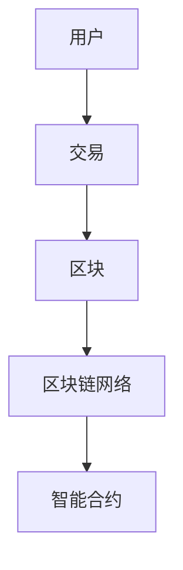
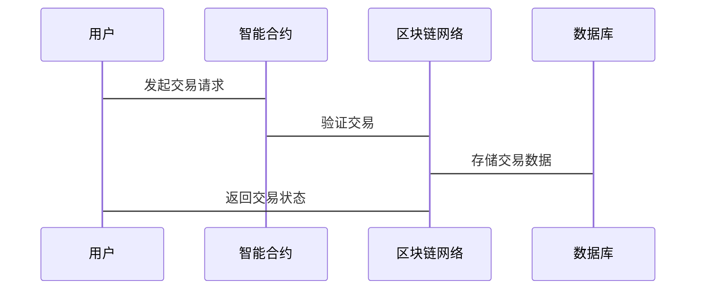

                 


# 《企业估值中的区块链跨境支付结算平台评估》

## 关键词：
- 企业估值
- 区块链技术
- 跨境支付结算
- 智能合约
- 金融创新

## 摘要：
随着全球经济的日益全球化，跨境支付结算已成为企业估值中一个关键因素。区块链技术作为一种革新性的技术手段，正在改变传统的跨境支付结算方式，提高效率、降低成本并增强安全性。本文深入分析区块链在跨境支付结算中的应用，探讨其对企业估值的影响，并提出基于区块链的跨境支付结算平台评估方法。通过详细的技术分析、系统设计和实际案例，本文旨在为企业估值提供新的视角和实用的评估框架。

---

# 第一部分: 背景介绍

# 第1章: 企业估值与区块链跨境支付结算平台概述

## 1.1 跨境支付结算的现状与痛点
### 1.1.1 跨境支付结算的传统模式
传统的跨境支付结算涉及多个中间银行，过程复杂且耗时长，费用高昂。交易确认时间通常需要几天，且存在汇率波动和双重支付风险。

### 1.1.2 跨境支付结算的痛点与挑战
- 交易时间长：传统跨境支付需要3-5个工作日。
- 成本高：每笔交易费用可能高达交易金额的3%-5%。
- 中间银行依赖：依赖多个中间银行，存在信任风险。
- 汇率风险：交易过程中汇率波动可能导致损失。

### 1.1.3 区块链技术如何解决这些问题
区块链通过去中心化、智能合约和分布式账本技术，实现了跨境支付的实时清算，降低了交易成本，提高了透明度和安全性。

## 1.2 区块链技术的基本概念
### 1.2.1 区块链的定义与核心原理
区块链是一种去中心化的分布式账本技术，通过密码学和共识算法确保数据的安全性和一致性。

### 1.2.2 区块链的核心要素与特点
- 分布式账本：数据分散存储在多个节点，确保数据的高可用性。
- 共识机制：如PoW、PoS，确保所有节点达成一致。
- 智能合约：自动执行预设的合同条款，减少人为干预。

### 1.2.3 区块链在金融领域的应用潜力
区块链在支付、清算、结算、证券交易等领域具有广泛应用潜力，尤其在跨境支付中表现出显著优势。

## 1.3 区块链跨境支付结算平台的定义
### 1.3.1 平台的定义与核心功能
区块链跨境支付结算平台是一个基于区块链技术的去中心化平台，支持多种货币的跨境支付、清算和结算，具有实时性、低成本和高安全性的特点。

### 1.3.2 平台的边界与外延
平台不仅包括支付功能，还涉及智能合约的执行、交易记录的存储和交易状态的查询。

### 1.3.3 平台的架构与组成部分
平台通常由前端用户界面、后端服务层、区块链节点和数据库组成。

## 1.4 本章小结
本章介绍了跨境支付结算的传统模式和痛点，阐述了区块链技术的基本概念和优势，定义了区块链跨境支付结算平台及其架构，为后续章节奠定了基础。

---

# 第二部分: 核心概念与联系

# 第2章: 区块链技术的核心原理

## 2.1 区块链的核心原理
### 2.1.1 哈希函数与区块结构
哈希函数用于将数据转换为固定长度的哈希值，确保数据的完整性和唯一性。区块由区块头和交易数据组成，区块头包含哈希指针、时间戳和 nonce 等字段。

### 2.1.2 共识机制（如PoW、PoS）
- 工作量证明（PoW）：通过计算找到特定哈希值来获得记账权。
- 权益证明（PoS）：根据持币数量或质押金额来分配记账权。

### 2.1.3 加密算法与数字签名
加密算法如RSA和椭圆曲线加密用于保护数据的机密性，数字签名用于验证交易发起方的身份。

## 2.2 区块链在跨境支付中的应用
### 2.2.1 跨境支付的区块链流程
发起方通过智能合约发起交易，区块链网络验证交易合法性，完成交易后通知收款方。

### 2.2.2 智能合约的实现与作用
智能合约是基于区块链的自动执行程序，用于自动执行支付、清算和结算操作。

### 2.2.3 区块链如何提升支付效率
区块链通过去中心化和自动化流程，实现了跨境支付的实时清算，减少了中间环节和时间成本。

## 2.3 区块链技术的核心属性对比
### 2.3.1 不同区块链技术的对比表格
| 特性 | 比特币（PoW） | 以太坊（PoS） | Hyperledger Fabric |
|------|----------------|----------------|----------------------|
| 共识机制 | PoW            | PoS            | 可选（默认为PBFT）  |
| 交易速度 | 每秒约7笔       | 每秒约13笔      | 高性能               |
| 可扩展性 | 低             | 中等            | 高                   |
| 适合场景 | 货币发行         | 智能合约         | 企业级应用           |

### 2.3.2 区块链技术的ER实体关系图


---

# 第3章: 区块链跨境支付结算平台的系统架构

## 3.1 系统功能设计
### 3.1.1 平台的功能模块划分
- 用户模块：用户注册、登录和交易发起。
- 交易模块：交易确认、智能合约执行和交易状态查询。
- 区块链模块：区块生成、共识机制和交易验证。
- 数据库模块：交易记录存储和查询。

### 3.1.2 每个功能模块的实现逻辑
- 用户模块：用户通过身份验证后，发起交易请求。
- 交易模块：智能合约根据交易请求生成交易订单，区块链网络验证交易合法性。
- 区块链模块：通过共识机制确认交易，生成新区块并广播给所有节点。
- 数据库模块：存储交易数据，支持快速查询。

### 3.1.3 功能模块的交互流程
1. 用户发起交易请求。
2. 智能合约生成交易订单。
3. 区块链网络验证交易。
4. 交易确认后，用户收到交易成功通知。

## 3.2 系统架构设计
### 3.2.1 平台的分层架构设计
- 前端层：用户界面，处理用户请求。
- 服务层：处理交易请求和智能合约执行。
- 区块链层：区块链节点，处理区块生成和交易验证。
- 数据库层：存储交易数据，支持快速查询。

### 3.2.2 每层的职责与功能
- 前端层：接收用户请求，展示交易状态。
- 服务层：解析交易请求，调用智能合约。
- 区块链层：验证交易合法性，生成新区块。
- 数据库层：存储交易数据，支持查询。

### 3.2.3 架构设计的优缺点分析
- 优点：模块化设计，便于维护和扩展。
- 缺点：跨链操作复杂，可能影响性能。

## 3.3 系统接口设计
### 3.3.1 平台的接口类型
- 发起交易接口：`POST /api/transaction/initiate`
- 查询交易状态接口：`GET /api/transaction/status`

### 3.3.2 每个接口的交互流程
- 发起交易接口：
  1. 用户提交交易请求。
  2. 服务层调用智能合约。
  3. 区块链网络验证交易。
  4. 返回交易成功或失败的结果。
- 查询交易状态接口：
  1. 用户提交交易ID。
  2. 数据库查询交易状态。
  3. 返回交易状态信息。

### 3.3.3 接口设计的优缺点分析
- 优点：接口标准化，便于集成和维护。
- 缺点：接口过多可能导致系统复杂性增加。

## 3.4 系统交互流程图


---

# 第三部分: 项目实战

# 第4章: 项目实现与案例分析

## 4.1 项目环境搭建
### 4.1.1 安装以太坊环境
```bash
# 安装以太坊
npm install -g ethereumjs-testrpc
```

### 4.1.2 智能合约开发
使用Solidity编写智能合约代码，实现跨境支付功能。

```solidity
// SPDX-License-Identifier: MIT
pragma solidity ^0.8.0;

contract CrossBorderPayment {
    event PaymentReceived(address from, address to, uint amount);

    function pay(address to, uint amount) external {
        emit PaymentReceived(msg.sender, to, amount);
        // 实际实现需要考虑跨链操作
    }
}
```

### 4.1.3 平台功能实现
实现交易发起、智能合约执行和交易状态查询功能。

## 4.2 智能合约代码实现
### 4.2.1 智能合约功能分析
智能合约实现跨境支付的逻辑，包括交易发起、金额验证和状态更新。

### 4.2.2 智能合约代码解读
```solidity
function pay(address to, uint amount) external {
    // 验证金额是否为正数
    require(amount > 0, "Amount must be greater than zero");
    // 发放金额到收款方
    (bool sent, bytes memory data) = to.call{value: amount}("");
    require(sent, "Failed to send value");
    emit PaymentReceived(msg.sender, to, amount);
}
```

### 4.2.3 智能合约的优缺点
- 优点：自动执行交易，减少人为干预。
- 缺点：代码复杂，可能存在漏洞。

## 4.3 项目小结
本章通过实际项目展示了区块链跨境支付结算平台的实现过程，包括环境搭建、智能合约开发和平台功能实现。

---

# 第四部分: 最佳实践与总结

# 第5章: 最佳实践与注意事项

## 5.1 最佳实践
### 5.1.1 技术选型
选择适合业务需求的区块链技术，如以太坊适合智能合约开发，Hyperledger Fabric适合企业级应用。

### 5.1.2 安全性保障
确保智能合约代码的安全性，避免漏洞被利用。

### 5.1.3 合规性考虑
遵守相关法律法规，确保跨境支付结算的合法性。

## 5.2 小结
本章总结了区块链跨境支付结算平台的实际应用经验，提出了技术选型和安全性保障的最佳实践。

## 5.3 注意事项
- 确保智能合约代码的正确性。
- 选择合适的区块链技术。
- 遵守相关法律法规。

## 5.4 拓展阅读
建议阅读《区块链技术与应用》和《智能合约开发指南》。

---

# 作者：AI天才研究院 & 禅与计算机程序设计艺术

