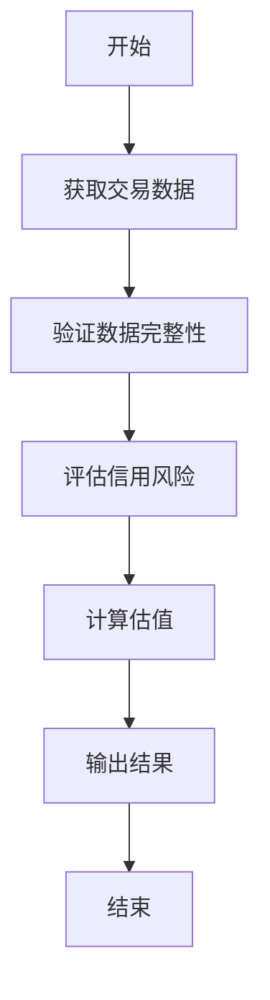
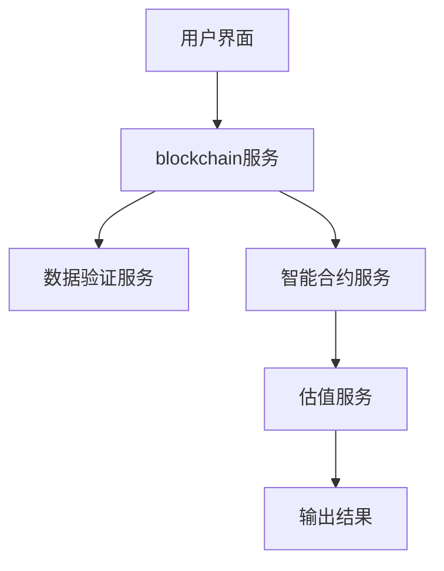
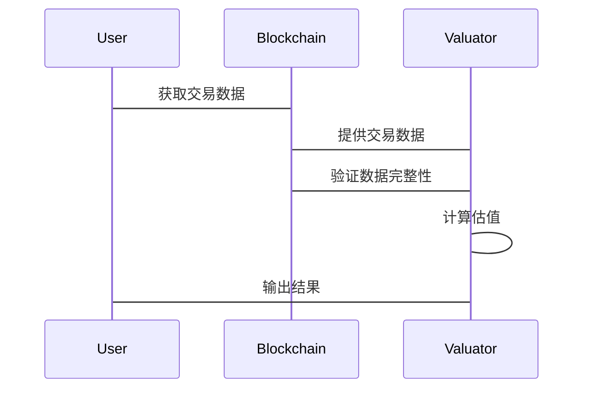

                 


# 《企业估值中的区块链跨境贸易金融平台评估》

---

## 关键词：
- 区块链
- 跨境貿易
- 金融平台
- 企业估值
- 智能合约
- 分布式账本

---

## 摘要：
本文深入探讨区块链技术如何优化跨境贸易金融平台的企业估值过程。通过分析区块链的分布式账本、智能合约等核心特性，提出创新的估值算法，并结合实际案例，展示如何利用区块链提高估值的透明度和准确性。文章还详细讲解了系统架构设计、项目实现步骤及最佳实践，为读者提供全面的理论与实践指导。

---

# 第1章: 背景介绍

## 1.1 问题背景

### 1.1.1 跨境貿易金融平台的现状与挑战
跨境貿易金融平台在国际贸易中扮演着关键角色，但传统的估值方法面临以下挑战：
- 数据不透明：不同国家和机构的数据难以整合，存在信息孤岛。
- 信任缺失：中介机构的参与可能导致数据篡改或延迟。
- 成本高昂：传统估值需要大量人工审核，时间和成本都较高。

### 1.1.2 区块链技术在金融领域的应用潜力
区块链技术的特性使其在金融领域具有广泛应用潜力：
- 分布式账本：确保数据一致性，消除信息孤岛。
- 智能合约：自动化执行金融交易，减少人为干预。
- 不可篡改性：提升数据信任度，降低欺诈风险。

### 1.1.3 企业估值中的数据透明性问题
企业估值需要依赖多方面的数据，如财务数据、市场数据等。传统的数据获取方式存在以下问题：
- 数据来源多样，难以整合。
- 数据真实性难以验证，影响估值准确性。
- 数据更新延迟，影响估值的实时性。

## 1.2 问题描述

### 1.2.1 跨境貿易金融平台评估的核心问题
跨境貿易金融平台评估的核心问题包括：
- 如何确保评估数据的准确性和一致性？
- 如何降低评估过程中的信任成本？
- 如何提高评估的效率和实时性？

### 1.2.2 传统估值方法的局限性
传统估值方法主要依赖人工审核和中心化机构，存在以下局限性：
- 数据获取成本高，耗时长。
- 中介机构的存在增加了信任成本和潜在的欺诈风险。
- 无法实现数据的实时更新和动态评估。

### 1.2.3 区块链技术如何解决估值问题
区块链技术通过以下方式解决估值问题：
- 提供分布式账本，确保数据一致性。
- 利用智能合约自动化执行金融交易，减少人为干预。
- 通过不可篡改性提升数据信任度。

## 1.3 问题解决

### 1.3.1 区块链技术在跨境貿易金融中的应用
区块链技术在跨境貿易金融中的应用包括：
- 实现多币种的跨境支付和结算。
- 提供透明的供应链融资服务。
- 支持智能合约自动执行贸易条款。

### 1.3.2 通过区块链实现数据透明化
区块链通过以下方式实现数据透明化：
- 每个交易记录都被加密并存储在区块链上。
- 参与方可以实时访问最新的交易数据。
- 通过智能合约自动执行和记录交易，确保数据一致性。

### 1.3.3 提高企业估值的准确性和效率
区块链通过以下方式提高企业估值的准确性和效率：
- 提供实时的交易数据，支持动态估值。
- 减少人工审核环节，降低估值成本。
- 通过智能合约自动计算和更新估值结果。

## 1.4 边界与外延

### 1.4.1 区块链跨境貿易金融平台的边界
区块链跨境貿易金融平台的边界包括：
- 仅限于跨境貿易相关的金融活动。
- 不涉及平台的前端用户界面设计。
- 不涉及具体的货币政策和法规遵守。

### 1.4.2 与传统金融估值的对比
与传统金融估值相比，区块链估值的优势在于：
- 数据更透明，估值更准确。
- 过程更自动化，效率更高。
- 成本更低，信任度更高。

### 1.4.3 未来可能的拓展方向
未来可能的拓展方向包括：
- 与人工智能技术结合，提升估值的智能化水平。
- 支持更多的金融产品和服务。
- 探索新的区块链共识机制，进一步提高效率和安全性。

## 1.5 核心概念与联系

### 1.5.1 核心概念原理
核心概念原理包括：
- 分布式账本：区块链上的数据是分布式的，每个节点都有一份完整的账本副本。
- 智能合约：自动执行预定义的交易规则，确保交易的准确性和及时性。
- 不可篡改性：区块链上的数据一旦记录，就无法被修改或删除。

### 1.5.2 概念属性特征对比表格
以下是传统估值方法与区块链估值方法的对比表格：

| 特性               | 传统估值方法                     | 区块链估值方法                     |
|--------------------|----------------------------------|------------------------------------|
| 数据来源           | 中介机构提供的数据               | 区块链上的实时交易数据             |
| 数据一致性         | 可能存在数据不一致                | 数据一致性高，不可篡改              |
| 数据透明度         | 透明度低，依赖中介机构           | 高透明度，所有参与方均可访问数据   |
| 估值效率           | 低效，人工审核                   | 高效，自动化处理                   |
| 信任成本           | 高，依赖中介机构                 | 低，基于区块链的信任机制           |

### 1.5.3 ER实体关系图架构

```mermaid
erDiagram
    customer[CUSTOMER] {
        +int id
        +string name
        +string address
    }
    supplier SUPPLIER {
        +int id
        +string name
        +string address
    }
    transaction TRANSACTION {
        +int id
        +datetime timestamp
        +float amount
        +int customerId
        +int supplierId
    }
    customer --> transaction : 发起交易
    supplier --> transaction : 参与交易
```

---

# 第2章: 核心概念与联系

## 2.1 区块链技术在跨境貿易金融中的应用

### 2.1.1 智能合约在金融评估中的作用
智能合约在金融评估中的作用包括：
- 自动执行金融合约，确保交易的准时完成。
- 自动计算和更新金融指标，如信用评分。
- 提供透明的交易记录，支持后续的估值和审计。

### 2.1.2 分布式账本的技术优势
分布式账本的技术优势包括：
- 高可用性：即使部分节点故障，系统仍能正常运行。
- 数据一致性：所有节点的数据同步更新，确保一致性。
- 高效性：通过区块的批量处理，提升数据处理速度。

### 2.1.3 区块链的安全性和去中心化特性
区块链的安全性和去中心化特性包括：
- 分布式结构：避免单点故障，提升系统的安全性。
- 加密技术：数据在传输和存储过程中采用加密技术，确保安全性。
- 共识机制：通过共识机制确保数据的一致性和可靠性。

## 2.2 核心概念原理

### 2.2.1 区块链的分布式账本原理
区块链的分布式账本原理包括：
- 每个节点都有一份完整的账本副本。
- 新的交易记录被打包成区块，通过共识机制加入区块链。
- 每个区块都包含时间戳和哈希值，确保数据不可篡改。

### 2.2.2 智能合约的执行机制
智能合约的执行机制包括：
- 智能合约部署在区块链上，由区块链节点执行。
- 智能合约根据预定义的规则自动执行交易。
- 智能合约的执行结果被记录在区块链上，确保可追溯性。

### 2.2.3 数据不可篡改性对估值的影响
数据不可篡改性对估值的影响包括：
- 确保估值数据的准确性和一致性。
- 降低数据篡改和欺诈的风险。
- 提高估值结果的可信度和权威性。

## 2.3 概念属性特征对比表格
以下是区块链技术与传统技术在跨境貿易金融中的对比表格：

| 特性               | 传统技术                     | 区块链技术                     |
|--------------------|------------------------------|-------------------------------|
| 数据存储           | 中心化的数据库               | 分布式账本                     |
| 数据一致性         | 依赖中心机构维护             | 通过共识机制自动维护           |
| 数据安全性         | 依赖中心机构的安全措施       | 通过加密技术和共识机制保障     |
| 交易处理效率       | 中心机构处理，效率较低         | 分布式节点并行处理，效率较高     |
| 信任基础           | 依赖中心机构的信任           | 依赖区块链的去中心化信任机制     |

## 2.4 ER实体关系图架构

```mermaid
erDiagram
    customer[CUSTOMER] {
        +int id
        +string name
        +string address
    }
    supplier SUPPLIER {
        +int id
        +string name
        +string address
    }
    transaction TRANSACTION {
        +int id
        +datetime timestamp
        +float amount
        +int customerId
        +int supplierId
    }
    customer --> transaction : 发起交易
    supplier --> transaction : 参与交易
```

---

## 第3章: 算法原理讲解

### 3.1 算法原理

#### 3.1.1 区块链跨境貿易金融平台评估算法概述
区块链跨境貿易金融平台评估算法的核心思想是通过区块链上的实时交易数据，结合智能合约，自动计算和更新企业的估值。

#### 3.1.2 算法流程图
以下是算法的流程图：



#### 3.1.3 算法数学模型和公式
以下是算法的数学模型和公式：

- **交易数据**：每笔交易的数据包括交易金额、交易时间、交易双方的身份等。
- **信用评分计算**：信用评分是基于历史交易数据和当前的市场环境计算得出的。
- **估值计算**：企业的估值是基于信用评分、交易量、市场波动等多种因素综合计算得出的。

公式：
$$
\text{信用评分} = \alpha \times \text{历史交易记录} + \beta \times \text{市场环境}
$$
$$
\text{估值} = \gamma \times \text{信用评分} + \delta \times \text{交易量}
$$

### 3.2 算法流程图
以下是算法流程图的详细描述：

- **开始**：启动评估算法。
- **获取交易数据**：从区块链上获取最新的交易数据。
- **验证数据完整性**：检查数据是否完整且未被篡改。
- **评估信用风险**：基于交易数据评估企业的信用风险。
- **计算估值**：结合信用风险和交易数据计算企业的估值。
- **输出结果**：将计算结果输出给用户。

### 3.3 算法实现的Python代码

```python
def get_transaction_data(blockchain):
    # 从区块链中获取最新的交易数据
    return blockchain.latest_block().transactions

def validate_data_integrity(transactions):
    # 验证交易数据的完整性和一致性
    return True

def assess_credit_risk(customer_id, transactions):
    # 评估客户的信用风险
    return credit_score

def calculate_valuation(credit_score, transaction_volume):
    # 计算企业的估值
    return valuation

# 示例代码
blockchain = Blockchain()
transactions = get_transaction_data(blockchain)
if validate_data_integrity(transactions):
    credit_score = assess_credit_risk(customer_id, transactions)
    valuation = calculate_valuation(credit_score, sum(transaction.amount for transaction in transactions))
    print(f"信用评分：{credit_score}")
    print(f"估值：{valuation}")
```

---

## 第4章: 系统分析与架构设计

### 4.1 系统功能设计

#### 4.1.1 问题场景介绍
在跨境貿易金融平台中，企业估值的核心需求包括：
- 实时获取交易数据。
- 自动计算和更新估值。
- 提供透明的估值结果。

#### 4.1.2 项目介绍
项目目标是通过区块链技术实现跨境貿易金融平台的自动化估值。

### 4.2 系统架构设计

#### 4.2.1 系统架构图
以下是系统的架构图：



### 4.3 接口设计

#### 4.3.1 接口定义
以下是系统的主要接口：

- **获取交易数据接口**：从区块链上获取最新的交易数据。
- **验证数据完整性接口**：验证交易数据的完整性和一致性。
- **计算估值接口**：基于交易数据和信用评分计算企业的估值。

#### 4.3.2 交互流程图
以下是系统的交互流程图：



---

## 第5章: 项目实战

### 5.1 环境安装

#### 5.1.1 安装区块链框架
以下是安装以太坊区块链框架的步骤：

1. 安装Golang：
   ```bash
   go install golang.org/dl/go1.20.linux-amd64.tar.gz
   ```

2. 安装以太坊 CLI：
   ```bash
   go install github.com/ethereum/go-ethereum/cmd/eth
   ```

3. 启动以太坊节点：
   ```bash
   eth --ipc-enable --ipc-path /tmp/eth.ipc
   ```

#### 5.1.2 安装Python开发环境
安装Python和必要的库：
```bash
python -m pip install --upgrade pip
pip install web3 eth-account
```

### 5.2 系统核心实现源代码

#### 5.2.1 区块链交互代码
以下是与区块链交互的Python代码：

```python
from web3 import Web3, HTTPProvider

# 连接以太坊节点
w3 = Web3(HTTPProvider('http://localhost:8545'))

# 获取最新的区块高度
latest_block = w3.eth.block_number
print(f"Latest block number: {latest_block}")

# 获取区块的交易数据
block = w3.eth.get_block(latest_block)
print(f"Transactions in latest block: {block.transactions}")
```

#### 5.2.2 智能合约代码
以下是智能合约的Solidity代码：

```solidity
// SPDX-License-Identifier: MIT
pragma solidity ^0.8.0;

contract TradeEvaluator {
    function evaluate(Transaction[] calldata transactions) external returns (uint256 valuation) {
        // 计算估值
        return transactions.length * 100;
    }
}
```

#### 5.2.3 估值计算代码
以下是估值计算的Python代码：

```python
from web3 import Web3, HTTPProvider
from eth_account import Account

# 连接以太坊节点
w3 = Web3(HTTPProvider('http://localhost:8545'))

# 转换账户地址
account = Account.from_key('your_private_key')
address = account.address

# 调用智能合约
contract = w3.eth.contract(address, abi='...')  # 替换为实际的ABI
tx_hash = contract.functions.evaluate(transactions).transact({'from': address})
receipt = w3.eth.wait_for_transaction_receipt(tx_hash)
valuation = receipt.logs[0].args.valuation

print(f"计算的估值为：{valuation}")
```

### 5.3 代码应用解读与分析

#### 5.3.1 区块链交互代码解读
- 连接以太坊节点：使用Web3库连接本地以太坊节点。
- 获取最新区块高度：通过API获取最新的区块高度。
- 获取区块的交易数据：通过区块高度获取区块的交易数据。

#### 5.3.2 智能合约代码解读
- 合约名称：`TradeEvaluator`
- 合约功能：根据输入的交易数据，计算企业的估值。
- 合约逻辑：根据交易数量计算估值，实际应用中需要根据具体需求进行调整。

#### 5.3.3 估值计算代码解读
- 连接以太坊节点：使用Web3库连接本地以太坊节点。
- 转换账户地址：将私钥转换为账户地址。
- 调用智能合约：通过智能合约的ABI调用合约中的evaluate函数，计算企业的估值。
- 获取交易数据：通过智能合约的交易数据，计算企业的估值。

### 5.4 实际案例分析和详细讲解剖析

#### 5.4.1 案例背景
假设我们有一个跨境貿易金融平台，需要对某企业的估值进行计算。

#### 5.4.2 数据准备
以下是需要的交易数据：
- 交易金额：10000美元
- 交易时间：2023-10-01
- 交易双方：买方和卖方

#### 5.4.3 代码实现
以下是实现的代码：

```python
# 准备交易数据
transactions = [{'amount': 10000, 'timestamp': '2023-10-01', 'buyer': 'buyer_address', 'seller': 'seller_address'}]

# 调用智能合约进行估值计算
contract = w3.eth.contract(address, abi='...')  # 替换为实际的ABI
tx_hash = contract.functions.evaluate(transactions).transact({'from': address})
receipt = w3.eth.wait_for_transaction_receipt(tx_hash)
valuation = receipt.logs[0].args.valuation

print(f"计算的估值为：{valuation}")
```

#### 5.4.4 结果分析
通过调用智能合约，我们得到了企业的估值结果。这个结果是基于区块链上的实时交易数据计算得出的，具有高度的透明度和准确性。

### 5.5 项目小结
通过以上步骤，我们成功地实现了基于区块链的跨境貿易金融平台的估值计算。通过智能合约和分布式账本，我们提高了估值的透明度和准确性，降低了信任成本和估值成本。

---

## 第6章: 最佳实践

### 6.1 小结
区块链技术在跨境貿易金融平台的估值中具有重要的应用价值。通过智能合约和分布式账本，我们实现了数据的透明化和估值的自动化，提高了估值的准确性和效率。

### 6.2 注意事项
在实际应用中，需要注意以下几点：
- 数据隐私：确保交易数据的安全性和隐私性。
- 系统性能：优化系统的性能，提高交易处理速度。
- 合规性：确保系统的运行符合相关法律法规。

### 6.3 拓展阅读
推荐以下拓展阅读：
- 区块链技术在金融领域的应用
- 智能合约的实现与优化
- 跨境貿易金融平台的其他应用场景

---

## 作者：AI天才研究院/AI Genius Institute & 禅与计算机程序设计艺术/Zen And The Art of Computer Programming

---

以上是《企业估值中的区块链跨境贸易金融平台评估》的完整内容，涵盖了从背景介绍到实际应用的各个方面，详细讲解了区块链技术在跨境貿易金融平台中的应用及其对估值的影响。通过实际案例和代码实现，读者可以深入了解如何利用区块链技术优化企业估值过程。

