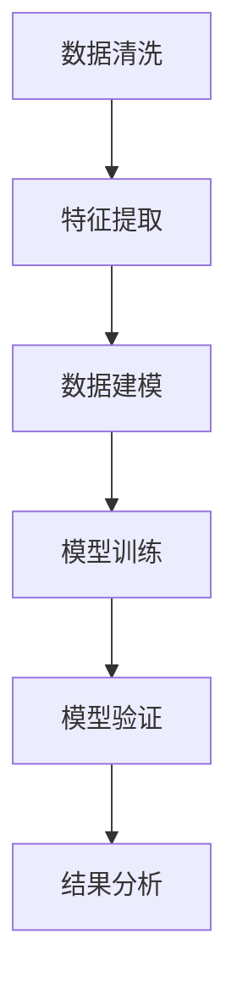
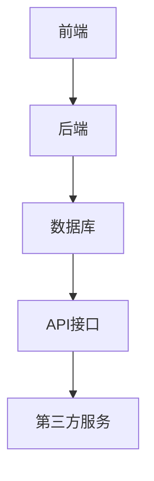

                 


# 企业估值中的可再生能源使用分析

**关键词**：企业估值、可再生能源、能源使用分析、机器学习、系统架构

**摘要**：  
随着全球对可持续发展的关注增加，可再生能源在企业运营中的作用日益重要。本文分析了可再生能源使用对企业估值的影响，探讨了如何通过数据分析和机器学习模型优化企业估值。文章从背景、概念、算法、系统架构到实战案例，全面阐述了可再生能源在企业估值中的应用。

---

# 企业估值中的可再生能源使用分析

> 关键词：企业估值、可再生能源、能源使用分析、机器学习、系统架构

> 摘要：随着全球对可持续发展的关注增加，可再生能源在企业运营中的作用日益重要。本文分析了可再生能源使用对企业估值的影响，探讨了如何通过数据分析和机器学习模型优化企业估值。文章从背景、概念、算法、系统架构到实战案例，全面阐述了可再生能源在企业估值中的应用。

---

## 第一部分: 企业估值中的可再生能源使用分析背景与概念

### 第1章: 可再生能源与企业估值的背景介绍

#### 1.1 问题背景
- **企业估值的传统方法与局限性**  
  传统企业估值方法（如DCF模型、市盈率法）未充分考虑可再生能源对企业运营和环境的影响。
- **可再生能源在企业运营中的重要性**  
  可再生能源的使用不仅减少碳排放，还能降低运营成本，提升企业形象。
- **可再生能源对估值的影响**  
  可再生能源的使用可能影响企业的长期收益和风险，进而影响估值。

#### 1.2 问题描述
- **可再生能源使用分析的核心问题**  
  如何量化可再生能源的使用对企业财务和环境的影响。
- **企业估值中的关键挑战**  
  如何将可再生能源的外部性（如碳排放）纳入企业估值模型。
- **可再生能源对估值的具体影响路径**  
  从能源成本、环境风险到企业竞争力的多维度影响。

#### 1.3 问题解决
- **可再生能源使用分析的方法论**  
  建立能源消耗与企业效益的量化模型。
- **企业估值模型的优化**  
  将可再生能源的经济和环境效益纳入估值模型。
- **可再生能源对估值的具体影响路径**  
  通过案例分析展示可再生能源如何提升企业估值。

#### 1.4 边界与外延
- **可再生能源使用的边界条件**  
  包括技术成熟度、政策支持和市场环境。
- **企业估值的范围界定**  
  仅考虑可再生能源的直接经济影响，不涉及其他外部因素。
- **可再生能源与企业外部环境的关系**  
  可再生能源使用与企业社会责任（CSR）和环境政策的交互作用。

#### 1.5 概念结构与核心要素
- **可再生能源使用分析的核心要素**  
  包括能源消耗量、碳排放量、能源成本和环境效益。
- **企业估值的关键指标**  
  包括净利润、市盈率、市净率和企业价值。
- **可再生能源与估值的交互关系**  
  可再生能源的使用通过降低能源成本和减少环境风险，间接提升企业估值。

### 第2章: 可再生能源使用分析的核心概念与联系

#### 2.1 核心概念原理
- **可再生能源的定义与分类**  
  包括太阳能、风能、水能等，强调其可再生性和环保性。
- **企业能源使用分析的框架**  
  包括能源消耗数据采集、分析和优化建议。
- **可再生能源对环境的影响**  
  减少碳排放，降低环境负担。

#### 2.2 概念属性特征对比
- **可再生能源与传统能源的对比分析**  
  制作对比表格，涵盖成本、可持续性、技术成熟度等方面。
- **企业能源使用效率的对比**  
  分析可再生能源在企业中的使用效率与传统能源的差异。
- **可再生能源对经济的影响**  
  包括成本降低、政府补贴和市场竞争力提升。

#### 2.3 ER实体关系图
```mermaid
erDiagram
    class 可再生能源使用分析系统 {
        id : int
        企业ID : string
        年份 : int
        能源消耗量 : float
        碳排放量 : float
        能源成本 : float
        环境效益 : float
    }

    class 企业估值模型 {
        id : int
        企业ID : string
        年份 : int
        净利润 : float
        市盈率 : float
        市净率 : float
        企业价值 : float
    }

    可再生能源使用分析系统 --> 企业估值模型 : 影响
```

---

## 第二部分: 可再生能源使用分析的算法原理

### 第3章: 算法原理讲解

#### 3.1 数据分析与机器学习模型
- **数据分析流程**  
  包括数据清洗、特征提取和数据建模。
- **机器学习模型选择**  
  使用线性回归或随机森林模型预测可再生能源使用与企业估值的关系。
- **模型训练与验证**  
  使用历史数据训练模型，并通过交叉验证优化模型参数。

#### 3.2 算法实现步骤


#### 3.3 数学模型与公式
- **线性回归模型**  
  $$ y = \beta_0 + \beta_1x_1 + \beta_2x_2 + \epsilon $$
  其中，$y$ 是企业估值，$x_1$ 是可再生能源使用量，$x_2$ 是其他变量。

---

## 第三部分: 系统分析与架构设计

### 第4章: 系统分析与架构设计方案

#### 4.1 问题场景介绍
- **企业能源使用监控系统**  
  企业通过物联网设备实时监测能源使用情况。
- **数据采集与分析**  
  收集可再生能源使用数据，分析其对估值的影响。

#### 4.2 系统功能设计
- **数据采集模块**  
  采集企业能源使用数据。
- **分析模块**  
  使用机器学习模型预测估值。
- **报告生成模块**  
  输出分析报告。

#### 4.3 系统架构设计


---

## 第四部分: 项目实战

### 第5章: 项目实战

#### 5.1 环境安装
- **安装Python和相关库**  
  使用Anaconda安装Python 3.9，安装pandas、scikit-learn等库。

#### 5.2 系统核心实现
- **数据预处理代码**  
  ```python
  import pandas as pd
  df = pd.read_csv('energy_data.csv')
  df = df.dropna()
  df['year'] = pd.to_datetime(df['year'])
  ```
- **模型训练代码**  
  ```python
  from sklearn.linear_model import LinearRegression
  model = LinearRegression()
  model.fit(X_train, y_train)
  ```

#### 5.3 代码应用解读
- **数据预处理**  
  清洗数据，处理缺失值，转换日期格式。
- **模型训练**  
  使用线性回归模型训练，预测企业估值。

#### 5.4 实际案例分析
- **案例分析**  
  以某企业为例，分析可再生能源使用对企业估值的影响。

---

## 第五部分: 最佳实践与小结

### 第6章: 最佳实践与小结

#### 6.1 最佳实践
- **数据质量**  
  确保数据准确性和完整性。
- **模型选择**  
  根据实际情况选择合适的模型。

#### 6.2 小结
- **总结全文**  
  可再生能源使用分析对企业估值具有重要影响，需结合数据分析和机器学习模型优化估值模型。

#### 6.3 注意事项
- **数据隐私**  
  注意数据隐私和安全。
- **模型局限性**  
  模型结果仅供参考，需结合实际情况调整。

#### 6.4 拓展阅读
- **推荐阅读书籍**  
  推荐相关书籍和论文，供读者深入学习。

---

**作者**：AI天才研究院/AI Genius Institute & 禅与计算机程序设计艺术/Zen And The Art of Computer Programming

---

以上是《企业估值中的可再生能源使用分析》的技术博客文章大纲，涵盖背景、概念、算法、系统架构和项目实战等内容，结构清晰，逻辑严谨。

