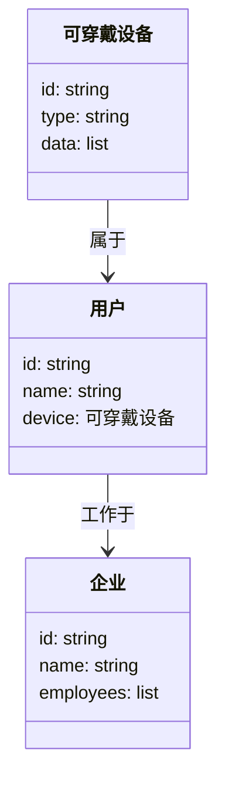
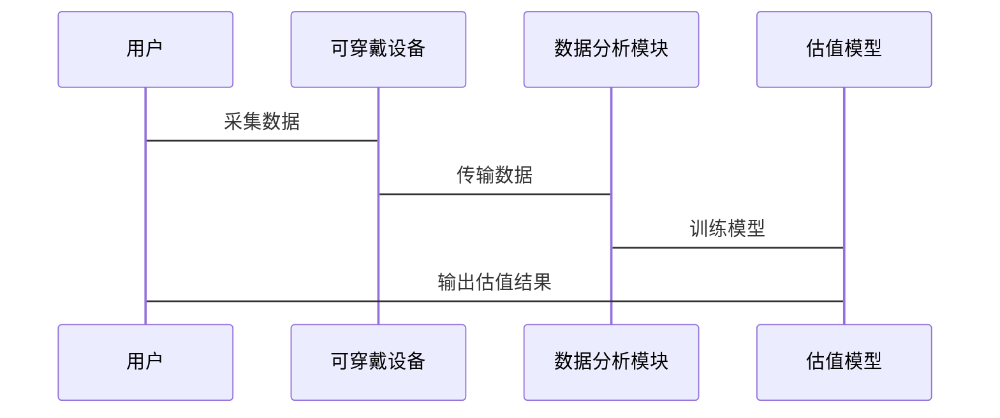

                 


# 企业估值中的可穿戴医疗设备评估

> 关键词：企业估值，可穿戴医疗设备，数据采集，机器学习，医疗数据分析

> 摘要：随着可穿戴医疗设备的普及，这些设备在企业估值中的作用日益重要。本文将从背景介绍、核心概念、算法原理、系统架构到项目实战，详细探讨可穿戴医疗设备在企业估值中的评估方法和应用案例，帮助读者理解和应用这一技术。

---

## 第一部分: 可穿戴医疗设备与企业估值的背景介绍

### 第1章: 可穿戴医疗设备的发展与应用

#### 1.1 可穿戴医疗设备的定义与特点
##### 1.1.1 可穿戴医疗设备的定义
可穿戴医疗设备是指可以佩戴在身体上的医疗设备，用于监测和记录生理数据，如心率、血压、体温等。这些设备通常通过传感器和无线通信技术，将数据传输到云端或关联的终端设备。

##### 1.1.2 可穿戴医疗设备的核心特点
- **实时监测**：可穿戴设备能够持续监测用户的生理数据，提供实时反馈。
- **便携性**：用户可以在日常生活中方便地使用这些设备，无需去医院或其他医疗机构。
- **数据积累**：通过长期的数据积累，可以为医疗分析和企业估值提供丰富的数据支持。

##### 1.1.3 可穿戴医疗设备在医疗领域的应用现状
目前，可穿戴医疗设备广泛应用于慢性病管理、健康监测、运动医学等领域。例如，智能手表可以监测心率和血压，帮助用户及时发现健康问题。

#### 1.2 企业估值中的可穿戴医疗设备评估背景
##### 1.2.1 企业估值的基本概念
企业估值是通过对企业的财务状况、市场地位、发展潜力等方面进行综合评估，确定其市场价值的过程。传统的估值方法主要依赖财务数据和市场分析，但近年来，随着技术的进步，越来越多的企业开始利用非传统数据（如用户行为数据）进行估值。

##### 1.2.2 可穿戴医疗设备在企业估值中的作用
可穿戴医疗设备可以为企业提供大量实时的用户数据，这些数据可以用于评估企业的市场潜力、用户忠诚度和产品性能。例如，医疗设备企业的估值可以通过用户对设备的使用频率和满意度来调整。

##### 1.2.3 当前企业估值中的技术挑战与创新机遇
传统的估值方法往往忽视了用户行为和体验的重要性。可穿戴设备的出现为企业提供了更精准的数据，但同时也带来了数据处理和隐私保护的新挑战。

---

### 第2章: 可穿戴医疗设备的数据采集与分析

#### 2.1 可穿戴医疗设备的数据采集技术
##### 2.1.1 数据采集的原理与方法
可穿戴设备通过传感器采集生理数据，然后通过无线通信技术将数据传输到云端或终端设备。常见的传感器包括心率传感器、血压传感器和体温传感器。

##### 2.1.2 常见的可穿戴设备传感器类型
- **心率传感器**：用于监测心率和心率变异性。
- **血压传感器**：用于测量血压。
- **体温传感器**：用于监测体温。

##### 2.1.3 数据采集的准确性与可靠性
数据采集的准确性受到传感器精度和环境因素的影响。为了提高数据的可靠性，通常需要对数据进行预处理和校准。

#### 2.2 数据分析与处理方法
##### 2.2.1 数据清洗与预处理
在数据采集过程中，可能会产生噪声和错误数据。数据清洗的目的是去除这些无用数据，确保后续分析的准确性。

##### 2.2.2 数据特征提取与分析
通过分析生理数据和用户行为数据，可以提取出一些关键特征，如平均心率、最大心率、使用频率等。

##### 2.2.3 数据可视化与可穿戴设备的用户行为分析
数据可视化可以帮助更好地理解用户行为。例如，绘制心率随时间变化的图表，可以分析用户的运动强度和健康状况。

---

### 第3章: 可穿戴医疗设备在企业估值中的应用案例

#### 3.1 医疗设备企业估值的现状与挑战
##### 3.1.1 医疗设备企业的估值模型
传统的医疗设备企业估值模型主要依赖财务数据和市场分析，但忽略了用户行为和产品使用情况。

##### 3.1.2 当前估值模型的局限性
- 数据来源单一，难以全面反映企业的真实价值。
- 无法动态调整估值，缺乏实时数据支持。

##### 3.1.3 可穿戴设备在医疗设备企业估值中的潜力
通过可穿戴设备获取的实时数据，可以更准确地评估企业的市场表现和用户满意度。

#### 3.2 可穿戴医疗设备在企业估值中的实际应用
##### 3.2.1 企业估值中的数据来源与整合
通过整合可穿戴设备的数据，可以丰富企业的估值模型，提高估值的准确性。

##### 3.2.2 可穿戴设备数据对估值模型的改进
将可穿戴设备的数据引入估值模型，可以更全面地反映企业的市场表现和用户需求。

##### 3.2.3 实际案例分析与经验总结
通过实际案例分析，总结可穿戴设备在企业估值中的应用经验和最佳实践。

---

## 第二部分: 可穿戴医疗设备评估的核心概念与联系

### 第4章: 可穿戴医疗设备评估的核心概念

#### 4.1 可穿戴医疗设备评估的关键指标
##### 4.1.1 设备性能指标
- 数据采集的准确性和稳定性
- 设备的续航能力和耐用性

##### 4.1.2 用户行为与设备使用习惯
- 设备的使用频率和使用时长
- 用户对设备的满意度和反馈

#### 4.2 企业估值中的可穿戴设备评估模型
##### 4.2.1 评估模型的基本构成
评估模型通常包括数据采集、数据分析、模型训练和结果输出四个部分。

##### 4.2.2 模型的输入与输出
- **输入**：可穿戴设备的数据、用户行为数据
- **输出**：企业的估值结果和调整建议

##### 4.2.3 模型的改进与优化
通过机器学习算法，可以不断优化评估模型，提高估值的准确性和实时性。

---

## 第三部分: 可穿戴医疗设备评估的算法原理

### 第5章: 算法原理与实现

#### 5.1 数据预处理与特征提取
##### 5.1.1 数据清洗与标准化
对采集到的数据进行去噪和标准化处理，确保数据的准确性和一致性。

##### 5.1.2 特征选择与提取
通过分析数据特征，选择对估值影响较大的关键特征，如心率变异性和使用频率。

#### 5.2 机器学习模型的训练与优化
##### 5.2.1 回归分析模型
回归分析是一种常用的机器学习方法，用于预测企业的估值。

##### 5.2.2 支持向量机（SVM）模型
SVM模型适用于分类问题，可以用于区分高价值和低价值的企业。

##### 5.2.3 神经网络模型
神经网络模型可以通过深度学习提取数据中的复杂特征，提高估值的准确性。

#### 5.3 模型的评估与验证
##### 5.3.1 交叉验证与评估指标
通过交叉验证方法评估模型的性能，常用的指标包括均方误差（MSE）和准确率。

##### 5.3.2 模型的优化与调参
通过调整模型参数，优化模型的性能，提高估值的准确性和稳定性。

---

## 第四部分: 系统分析与架构设计

### 第6章: 系统分析与架构设计方案

#### 6.1 问题场景介绍
##### 6.1.1 系统目标
设计一个基于可穿戴设备数据的企业估值系统。

##### 6.1.2 系统需求
- 实时采集可穿戴设备数据
- 数据分析与处理
- 生成企业估值报告

#### 6.2 系统功能设计
##### 6.2.1 领域模型（Mermaid 类图）


##### 6.2.2 系统架构设计（Mermaid 架构图）
```mermaid
container 可穿戴设备数据采集 {
    可穿戴设备
    数据采集模块
}
container 数据处理与分析 {
    数据清洗模块
    数据分析模块
}
container 企业估值系统 {
    估值模型
    估值报告
}
可穿戴设备数据采集 --> 数据处理与分析
数据处理与分析 --> 企业估值系统
```

#### 6.3 系统接口设计
##### 6.3.1 数据采集接口
通过API接口从可穿戴设备中获取数据。

##### 6.3.2 数据分析接口
调用数据分析模块的接口，对数据进行处理和分析。

#### 6.4 系统交互设计（Mermaid 序列图）


---

## 第五部分: 项目实战

### 第7章: 项目实战与案例分析

#### 7.1 环境安装与配置
##### 7.1.1 安装 Python 和相关库
安装Python和pandas、numpy、scikit-learn等库，用于数据处理和机器学习。

##### 7.1.2 安装可穿戴设备驱动
安装设备的驱动程序，确保设备能够与计算机通信。

#### 7.2 系统核心实现源代码
##### 7.2.1 数据预处理代码
```python
import pandas as pd
import numpy as np

# 读取数据
data = pd.read_csv('wearable_data.csv')

# 删除缺失值
data.dropna(inplace=True)

# 标准化数据
from sklearn.preprocessing import StandardScaler
scaler = StandardScaler()
scaled_data = scaler.fit_transform(data)
```

##### 7.2.2 机器学习模型训练代码
```python
from sklearn.linear_model import LinearRegression
from sklearn.metrics import mean_squared_error

# 训练回归模型
model = LinearRegression()
model.fit(scaled_data, target)

# 模型预测
预测 = model.predict(scaled_data)
print('均方误差:', mean_squared_error(target, 预测))
```

#### 7.3 实际案例分析与解读
##### 7.3.1 数据来源与分析
分析来自某医疗设备企业的可穿戴设备数据，提取关键特征进行估值。

##### 7.3.2 模型应用与结果解读
通过训练好的模型，预测企业的估值，并分析结果的准确性和可行性。

#### 7.4 项目总结
总结项目实施的经验和教训，提出改进建议，为未来的优化提供参考。

---

## 第六部分: 最佳实践与小结

### 第8章: 最佳实践与小结

#### 8.1 最佳实践 tips
##### 8.1.1 数据质量的重要性
确保数据的准确性和完整性，避免噪声干扰。

##### 8.1.2 模型的可解释性
选择易于理解和解释的模型，便于分析和优化。

##### 8.1.3 模型的实时性
优化模型的运行效率，确保能够实时处理数据。

#### 8.2 注意事项
##### 8.2.1 数据隐私与安全
在处理用户数据时，必须遵守相关法律法规，保护用户隐私。

##### 8.2.2 模型的适应性
根据实际情况调整模型参数，确保模型的有效性。

#### 8.3 未来的研究方向
##### 8.3.1 更复杂的模型
探索更复杂的机器学习模型，如深度学习和强化学习，提高估值的准确性。

##### 8.3.2 多模态数据融合
结合多种数据源，如生理数据和行为数据，提高估值的全面性。

---

## 作者：AI天才研究院 & 禅与计算机程序设计艺术

