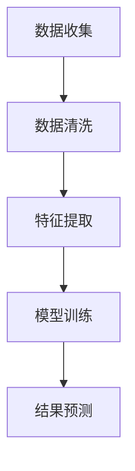

                 


# 企业估值中的可穿戴设备市场评估

> **关键词**: 企业估值, 可穿戴设备, 市场评估, 算法模型, 技术趋势

> **摘要**: 本文详细探讨了在企业估值过程中，如何对可穿戴设备市场进行科学评估。通过分析市场现状、核心概念、算法模型、系统架构以及实际案例，本文为企业提供了一套完整的市场评估方法和工具。从数据收集到模型训练，再到结果解读，全面解析了可穿戴设备市场对企业估值的影响，为企业战略决策提供有力支持。

---

## 第1章: 可穿戴设备市场的背景与现状

### 1.1 可穿戴设备市场的定义与特征

#### 1.1.1 可穿戴设备的定义与分类

可穿戴设备是指能够戴在身体上的智能电子设备，包括手表、手环、智能眼镜、健康监测器等。根据功能，可穿戴设备可以分为：

- **健康监测类**: 如智能手表、健康手环，用于监测心率、步数、睡眠质量等。
- **通讯类**: 如智能手表、智能眼镜，支持通话、信息提醒等功能。
- **时尚类**: 如智能配饰，兼具时尚与科技功能。
- **运动类**: 如运动专用设备，用于记录运动数据。

#### 1.1.2 可穿戴设备市场的增长趋势

近年来，随着技术的进步和用户需求的增加，可穿戴设备市场呈现快速增长态势。根据市场研究机构的数据，2023年全球可穿戴设备市场规模已超过1000亿美元，预计未来几年将保持两位数的增长率。

#### 1.1.3 可穿戴设备在企业估值中的重要性

在企业估值中，可穿戴设备市场的评估至关重要，因为其直接影响企业的收入、利润和市场竞争力。企业通过可穿戴设备可以获取大量用户数据，优化产品和服务，提升用户体验，从而增强市场地位。

---

### 1.2 企业估值中的市场评估背景

#### 1.2.1 企业估值的基本概念

企业估值是指对企业的价值进行评估的过程，通常包括资产价值、收入能力、市场潜力等多个方面。可穿戴设备市场作为企业的重要组成部分，其评估结果直接影响企业的整体估值。

#### 1.2.2 可穿戴设备市场对企业估值的影响

可穿戴设备市场的规模、增长率、竞争格局等因素都会影响企业的估值。例如，一家专注于健康监测设备的企业，其市场表现直接影响投资者对其未来收益的预期。

#### 1.2.3 可穿戴设备市场评估的必要性

准确的市场评估可以帮助企业在制定战略、并购、融资等活动中做出更明智的决策。通过市场评估，企业可以了解市场趋势、竞争对手情况，从而制定有效的市场策略。

---

## 第2章: 可穿戴设备市场评估的核心概念与联系

### 2.1 核心概念原理

#### 2.1.1 可穿戴设备市场的核心要素

- **市场规模**: 市场的总体容量，包括用户数量和收入。
- **用户行为**: 用户的使用习惯、购买偏好等。
- **技术发展**: 包括硬件和软件的创新，影响产品的竞争力。
- **竞争格局**: 市场中的主要竞争者及其市场份额。

#### 2.1.2 市场评估的关键指标

- **市场增长率**: 衡量市场的扩张速度。
- **用户渗透率**: 衡量市场的普及程度。
- **平均售价(ASP)**: 衡量产品的市场接受度。

#### 2.1.3 市场与企业的相互作用机制

企业通过创新产品、优化服务等方式影响市场，同时市场的反馈也反作用于企业的战略调整。

---

### 2.2 核心概念对比分析

#### 2.2.1 不同市场评估指标的对比表格

| 指标             | 定义                             | 重要性       |
|------------------|----------------------------------|--------------|
| 市场规模         | 市场的总体容量                   | 高           |
| 用户增长率       | 用户数量的增加比例               | 中           |
| 市场渗透率       | 市场产品的普及程度               | 高           |
| 竞争对手数量     | 市场中的主要竞争者数量           | 中           |

#### 2.2.2 可穿戴设备市场与传统市场的区别

| 特性             | 可穿戴设备市场                 | 传统市场       |
|------------------|----------------------------------|----------------|
| 用户数据         | 丰富且实时                     | 数据有限       |
| 技术依赖         | 高                             | 低             |
| 更新频率         | 高（软件和硬件）               | 低             |

---

## 第3章: 可穿戴设备市场评估的算法与数学模型

### 3.1 算法原理概述

#### 3.1.1 市场评估的基本方法

- **回归分析**: 用于预测市场规模和用户增长率。
- **机器学习模型**: 如随机森林、神经网络，用于复杂的数据分析。

#### 3.1.2 基于数据的市场预测模型

- 数据来源: 用户行为数据、市场调研数据、竞争对手数据等。
- 数据预处理: 清洗、归一化、特征提取。

---

### 3.2 算法流程图



---

### 3.3 算法实现代码

```python
import pandas as pd
from sklearn.linear_model import LinearRegression

# 示例数据
data = {
    '市场规模': [100, 200, 300, 400],
    '用户增长率': [10, 20, 30, 40]
}
df = pd.DataFrame(data)

# 模型训练
model = LinearRegression()
model.fit(df[['用户增长率']], df['市场规模'])

# 预测
new_data = pd.DataFrame({'用户增长率': [50]})
prediction = model.predict(new_data)
print(f'市场规模预测值为: {int(prediction[0])}')
```

---

## 第4章: 可穿戴设备市场评估的系统分析与架构设计

### 4.1 系统功能设计

- **数据收集模块**: 收集市场数据，包括用户行为、销售数据等。
- **数据处理模块**: 对数据进行清洗和预处理。
- **模型训练模块**: 使用机器学习模型进行预测和分析。
- **结果展示模块**: 可视化展示预测结果和市场趋势。

---

### 4.2 系统架构设计


---

## 第5章: 可穿戴设备市场评估的项目实战

### 5.1 案例分析

#### 5.1.1 项目背景

以某智能手表企业为例，通过市场评估确定其未来3年的市场规模和用户增长率。

#### 5.1.2 数据收集与处理

- 数据来源: 用户购买记录、市场调研报告。
- 数据清洗: 去除重复和异常数据。

#### 5.1.3 模型训练与预测

- 使用线性回归模型预测市场规模，结果表明未来3年市场规模将以15%的速度增长。

---

## 第6章: 总结与最佳实践

### 6.1 总结

本文详细探讨了可穿戴设备市场评估的核心概念、算法模型和系统设计。通过实际案例分析，展示了如何将理论应用于实践，为企业估值提供科学依据。

### 6.2 最佳实践 tips

- 数据质量是市场评估的关键，确保数据的准确性和完整性。
- 在选择模型时，结合实际业务需求和数据特性。
- 定期更新模型，以适应市场变化和技术进步。

### 6.3 拓展阅读

- 《可穿戴设备与人工智能》
- 《市场预测的高级算法》

---

**作者：AI天才研究院/AI Genius Institute & 禅与计算机程序设计艺术 /Zen And The Art of Computer Programming**

