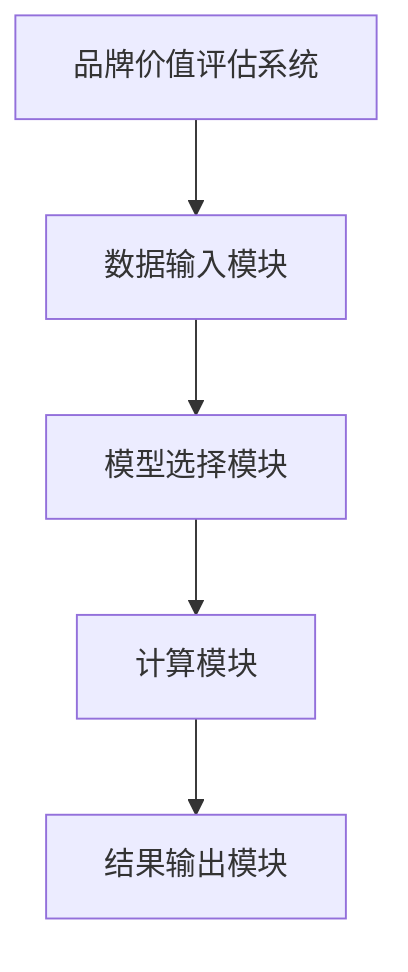
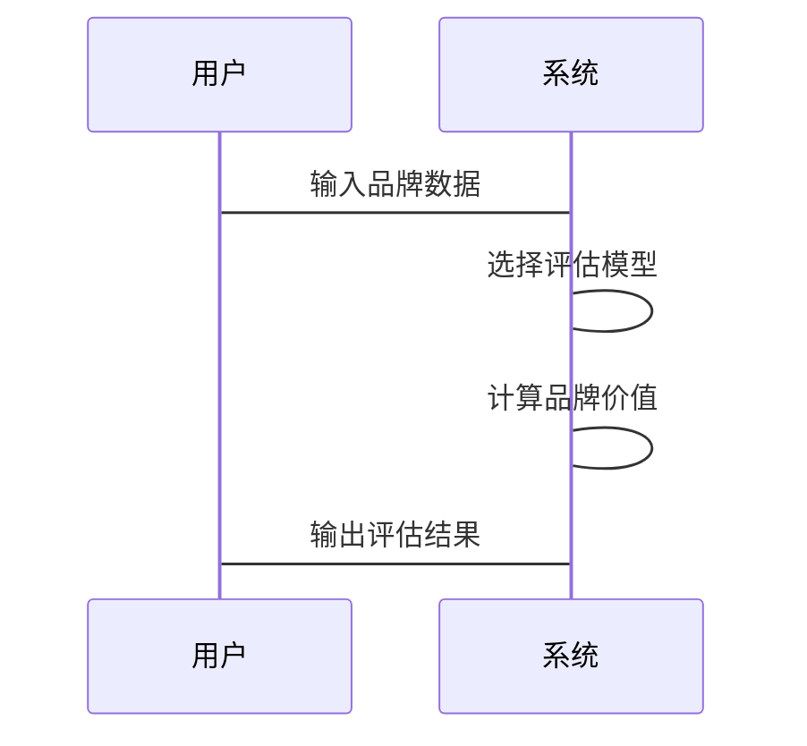

                 

# 企业估值中的品牌价值评估方法

> 关键词：品牌价值评估，企业估值，品牌资产，品牌强度，市场地位

> 摘要：品牌价值是企业整体估值的重要组成部分，本文将深入探讨品牌价值的内涵、评估方法、系统架构设计及实际案例分析，为企业估值提供系统化的解决方案。

---

# 第1章：品牌价值评估的背景与重要性

## 1.1 企业估值中的品牌价值

### 1.1.1 品牌价值的定义与内涵

品牌价值是企业在市场中建立的独特形象、声誉和客户忠诚度的综合体现。它反映了品牌在消费者心中的认知价值和实际市场表现。品牌价值不仅仅是企业的一项无形资产，更是影响企业整体估值的关键因素。

$$
\text{品牌价值} = \text{品牌知名度} \times \text{品牌忠诚度} \times \text{品牌强度}
$$

### 1.1.2 品牌价值在企业估值中的作用

1. **影响企业整体估值**：品牌价值是企业市场价值的重要组成部分，尤其是在无形资产占比高的企业中。
2. **提升企业市场竞争力**：强大的品牌价值能够吸引更多的客户和合作伙伴，增强企业的市场地位。
3. **优化企业融资能力**：高品牌价值的企业更容易获得资本市场的青睐，降低融资成本。

### 1.1.3 品牌价值评估的必要性

1. **企业并购中的定价依据**：品牌价值是企业并购中的重要定价参考。
2. **企业战略决策的支持**：品牌价值评估能够为企业的品牌管理、市场拓展等战略决策提供数据支持。
3. **投资者决策的参考**：投资者通过品牌价值评估可以更准确地判断企业的市场前景和投资风险。

## 1.2 品牌价值评估的背景与现状

### 1.2.1 全球化与品牌经济的发展

随着全球化进程的加快，品牌经济逐渐成为推动经济增长的重要动力。品牌不仅是企业的标识，更是企业核心竞争力的体现。

### 1.2.2 品牌价值评估的国内外研究现状

国内外学者对品牌价值评估进行了广泛的研究，提出了多种评估方法和模型。然而，由于品牌价值的复杂性，目前尚无统一的评估标准。

### 1.2.3 品牌价值评估的挑战与机遇

1. **挑战**：品牌价值受主观因素影响较大，难以量化；不同行业和市场环境下的品牌价值评估方法存在差异。
2. **机遇**：随着大数据和人工智能技术的发展，品牌价值评估的精确性和效率有望得到提升。

---

# 第2章：品牌价值评估的核心概念与联系

## 2.1 品牌价值评估的核心要素

### 2.1.1 品牌知名度与影响力

品牌知名度是衡量品牌价值的重要指标，反映了品牌在市场中的认知程度。高知名度的品牌更容易吸引消费者，从而提升市场价值。

### 2.1.2 品牌忠诚度与客户价值

品牌忠诚度是指消费者对品牌的偏好程度。高忠诚度的客户群体意味着品牌具有稳定的市场需求和较高的客户价值。

### 2.1.3 品牌创新与竞争力

品牌创新是保持品牌竞争力的关键因素。持续的创新能够提升品牌的市场地位和客户满意度。

## 2.2 品牌价值评估的理论基础

### 2.2.1 品牌资产的构成模型

品牌资产主要包括品牌知名度、品牌忠诚度、品牌联想等多个维度。

### 2.2.2 品牌价值的层次结构

品牌价值可以分为核心价值、市场价值和潜在价值三个层次。

### 2.2.3 品牌价值与企业战略的关系

品牌价值是企业制定市场战略的重要依据，直接影响企业的市场拓展和品牌管理策略。

## 2.3 品牌价值评估的核心概念对比

### 2.3.1 品牌价值与企业价值的对比

| 对比维度       | 品牌价值                     | 企业价值                     |
|----------------|------------------------------|------------------------------|
| 定义           | 品牌的市场价值和客户价值     | 企业的整体市场价值           |
| 评估方法       | 溢价法、市场法、收益法       | 资产评估、收益法、市场法     |
| 影响因素       | 品牌知名度、忠诚度等         | 财务表现、资产状况等         |

### 2.3.2 品牌强度与市场地位的对比

| 对比维度       | 品牌强度                     | 市场地位                     |
|----------------|------------------------------|------------------------------|
| 定义           | 品牌在市场中的竞争力         | 企业在市场中的位置           |
| 评估指标       | 市场份额、品牌忠诚度         | 市场份额、行业排名           |
| 影响因素       | 品牌知名度、创新力等         | 行业竞争、政策环境等         |

### 2.3.3 品牌忠诚度与客户满意度的对比

| 对比维度       | 品牌忠诚度                   | 客户满意度                   |
|----------------|------------------------------|------------------------------|
| 定义           | 客户对品牌的情感依赖         | 客户对产品或服务的满意程度   |
| 评估方法       | 通过调查和数据分析         | 通过调查和数据分析         |
| 影响因素       | 品牌形象、客户体验           | 产品质量、服务态度           |

## 2.4 本章小结

---

# 第3章：品牌价值评估的主要方法与模型

## 3.1 品牌价值评估的主要方法

### 3.1.1 溢价法（Surplus Method）

溢价法通过比较有品牌和无品牌产品的价格差异来评估品牌价值。其公式为：

$$
\text{品牌价值} = \text{有品牌产品价格} - \text{无品牌产品价格}
$$

### 3.1.2 市场法（Market Approach）

市场法通过分析市场上相似品牌的交易价格来评估品牌价值。其公式为：

$$
\text{品牌价值} = \text{可比交易价格} \times \text{品牌影响力系数}
$$

### 3.1.3 收益法（Income Approach）

收益法通过预测品牌带来的未来收益，折现后计算品牌价值。其公式为：

$$
\text{品牌价值} = \sum_{t=1}^{n} \frac{\text{未来收益}}{(1 + r)^t}
$$

其中，\( r \) 为折现率，\( n \) 为收益期限。

## 3.2 品牌价值评估的主要模型

### 3.2.1 品牌价值的三要素模型

三要素模型将品牌价值分解为品牌知名度、品牌忠诚度和品牌强度三个要素。

$$
\text{品牌价值} = \text{品牌知名度} \times \text{品牌忠诚度} \times \text{品牌强度}
$$

### 3.2.2 品牌价值的五维度模型

五维度模型包括品牌知名度、品牌忠诚度、品牌创新、品牌声誉和品牌可持续性五个维度。

$$
\text{品牌价值} = \sum_{i=1}^{5} \text{维度权重}_i \times \text{维度得分}_i
$$

### 3.2.3 品牌价值的综合评估模型

综合评估模型结合多种方法，根据具体情况选择合适的评估方法。

$$
\text{综合品牌价值} = \alpha \times \text{溢价法结果} + \beta \times \text{市场法结果} + \gamma \times \text{收益法结果}
$$

其中，\( \alpha + \beta + \gamma = 1 \)。

## 3.3 各种模型的优缺点对比

| 对比维度       | 溢价法                     | 市场法                     | 收益法                     |
|----------------|----------------------------|----------------------------|----------------------------|
| 优点           | 简单易懂，操作性强         | 可参考市场交易数据         | 考虑未来收益，结果更全面   |
| 缺点           | 忽略品牌强度和声誉因素     | 数据获取难度大             | 需要预测未来收益，不确定性高 |
| 适用场景       | 适用于单一产品或服务       | 适用于多个品牌比较           | 适用于长期品牌战略评估     |

## 3.4 本章小结

---

# 第4章：品牌价值评估的系统分析与架构设计

## 4.1 品牌价值评估的系统框架

### 4.1.1 系统目标与范围

系统目标：建立一个综合品牌价值评估模型，能够根据企业提供的数据，输出品牌价值评估结果。

### 4.1.2 系统功能模块划分

1. 数据输入模块：接收企业品牌相关数据。
2. 模型选择模块：根据具体情况选择合适的评估方法。
3. 计算模块：根据选择的模型计算品牌价值。
4. 结果输出模块：输出品牌价值评估报告。

### 4.1.3 系统输入与输出

- **输入**：品牌知名度、品牌忠诚度、品牌创新、品牌声誉等数据。
- **输出**：品牌价值评估结果、品牌强度分析、品牌潜力预测。

## 4.2 系统架构设计

## 4.3 系统接口设计

### 4.3.1 数据接口

- **输入接口**：接收品牌相关数据。
- **输出接口**：输出品牌价值评估结果。

### 4.3.2 用户接口

- **前端界面**：供用户输入数据和查看结果。
- **后端接口**：处理数据和计算。

## 4.4 系统交互设计

## 4.5 本章小结

---

# 第5章：品牌价值评估的实战案例分析

## 5.1 实战背景介绍

以一家科技公司为例，分析其品牌价值评估过程。

## 5.2 数据收集与处理

### 5.2.1 数据收集方法

1. 调查问卷：收集客户对品牌的认知和满意度。
2. 市场数据：收集同类产品的市场数据。
3. 企业内部数据：收集品牌相关的财务数据。

## 5.3 品牌价值评估的实现步骤

### 5.3.1 数据预处理

对收集到的数据进行清洗和标准化处理。

### 5.3.2 选择评估模型

根据实际情况选择合适的评估模型。

### 5.3.3 计算品牌价值

根据选择的模型进行计算，并输出结果。

## 5.4 案例分析与结果解读

### 5.4.1 案例分析

假设某科技公司使用溢价法评估品牌价值：

$$
\text{品牌价值} = 100\text{元} - 50\text{元} = 50\text{元}
$$

### 5.4.2 结果解读

通过溢价法计算得出的品牌价值为50元，说明品牌在市场中的附加价值为50元。

## 5.5 本章小结

---

# 第6章：品牌价值评估的总结与展望

## 6.1 本章总结

品牌价值评估是企业估值的重要组成部分，本文从理论基础、评估方法、系统设计和实战案例四个方面进行了详细探讨。

## 6.2 未来展望

随着大数据和人工智能技术的发展，品牌价值评估的精确性和效率有望进一步提升。未来的研究可以探索更多元化的评估方法和模型，以适应不同行业和市场环境的需求。

---

# 作者：AI天才研究院/AI Genius Institute & 禅与计算机程序设计艺术 /Zen And The Art of Computer Programming

---

以上是《企业估值中的品牌价值评估方法》的技术博客文章的完整目录和内容框架，涵盖了品牌价值评估的各个方面，从理论到实践，从方法到系统设计，提供了详尽的指导和分析。

