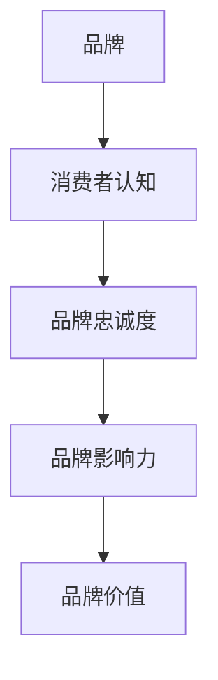
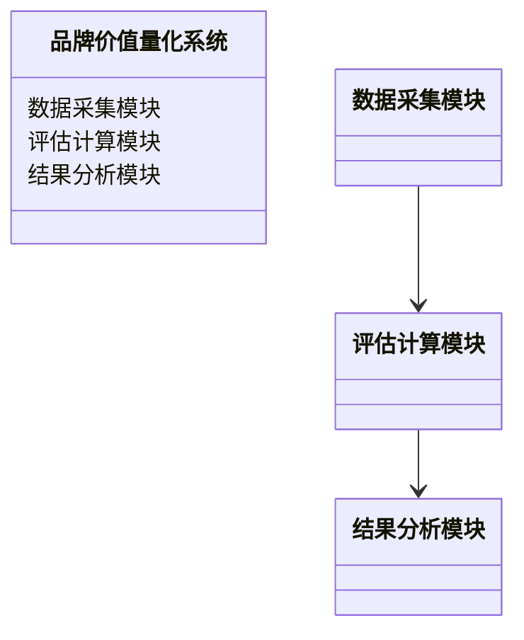
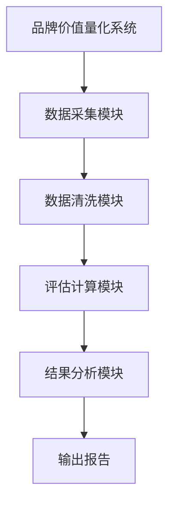

                 


# 企业估值中的品牌价值量化方法

> 关键词：企业估值，品牌价值，量化方法，数学模型，mermaid图，Python代码

> 摘要：本文将探讨企业估值中品牌价值的量化方法，从品牌价值的核心概念、量化模型、系统架构到项目实战，逐步分析品牌价值对企业整体估值的影响。通过数学模型和实际案例分析，本文旨在为企业提供一套科学、系统的品牌价值量化方法。

---

# 第一部分: 企业估值中的品牌价值量化方法概述

## 第1章: 品牌价值在企业估值中的重要性

### 1.1 品牌价值的定义与内涵

品牌价值是企业在市场中通过品牌建设所积累的无形资产，包括品牌知名度、品牌忠诚度、品牌影响力等多方面的综合体现。品牌价值不仅是企业市场地位的象征，也是企业整体价值的重要组成部分。

- **品牌知名度**：消费者对品牌的认知程度，是品牌价值的基础。
- **品牌忠诚度**：消费者对品牌的偏好程度，是品牌价值的核心。
- **品牌影响力**：品牌在市场中所能影响的范围和深度，是品牌价值的外在表现。

### 1.2 企业估值中的品牌价值量化背景

传统的企业估值方法主要依赖于财务指标，如净利润、营业收入等，但忽略了品牌这一重要的无形资产。在竞争激烈的市场环境中，品牌价值对企业整体价值的影响越来越大。因此，如何科学地量化品牌价值，成为企业估值中的重要课题。

- **传统估值方法的局限性**：财务指标无法完全反映品牌的价值。
- **品牌价值对企业整体价值的影响**：品牌价值能够显著提升企业的市场竞争力和盈利能力。
- **品牌价值量化对企业决策的意义**：通过量化品牌价值，企业可以更好地制定品牌战略和投资决策。

### 1.3 品牌价值量化的目标与边界

- **品牌价值量化的目标**：通过科学的方法和模型，准确衡量品牌价值，为企业估值提供依据。
- **品牌价值的边界与外延**：品牌价值不仅包括直接的经济贡献，还包括品牌在消费者心中的认知和情感价值。
- **品牌价值量化的核心要素**：品牌知名度、品牌忠诚度、品牌影响力。

---

## 第2章: 品牌价值量化的核心概念与联系

### 2.1 品牌价值的核心概念原理

品牌价值的量化需要从多个维度进行分析，包括消费者认知、市场表现等。以下是品牌价值量化的核心概念：

- **品牌认知度**：消费者对品牌的熟悉程度，可以通过市场调研和数据分析来衡量。
- **品牌忠诚度**：消费者对品牌的偏好程度，可以通过问卷调查和消费者行为分析来度量。
- **品牌影响力**：品牌在市场中的渗透力，可以通过市场份额和品牌声誉来评估。

### 2.2 核心概念属性特征对比表

以下是品牌价值量化中的核心概念属性特征对比表：

| 概念         | 属性特征               |
|--------------|------------------------|
| 品牌认知度   | 消费者对品牌的熟悉程度 |
| 品牌忠诚度   | 消费者对品牌的偏好程度 |
| 品牌影响力   | 品牌在市场中的渗透力   |

### 2.3 品牌价值量化ER实体关系图

以下是品牌价值量化中的实体关系图：



---

## 第3章: 品牌价值量化的主要方法与模型

### 3.1 品牌资产评估法

品牌资产评估法是一种常用的品牌价值量化方法，其基本原理是通过评估品牌在企业资产中的贡献来衡量品牌价值。

- **数学模型**：$$ V = \alpha \cdot P + \beta \cdot Q $$
  - 其中，$V$ 表示品牌价值，$P$ 表示品牌知名度，$Q$ 表示品牌忠诚度，$\alpha$ 和 $\beta$ 为权重系数。

### 3.2 品牌经济增加值法

品牌经济增加值法是通过评估品牌对企业经济贡献来衡量品牌价值的方法。

- **公式**：$$ EVA = OI - (WACC \cdot TV) $$
  - 其中，$OI$ 表示息税前利润，$WACC$ 表示加权平均资本成本，$TV$ 表示企业价值。

### 3.3 品牌价值的综合评估模型

综合评估模型是一种结合多种因素的品牌价值量化方法。

- **公式**：$$ BV = \sum_{i=1}^{n} w_i \cdot f_i $$
  - 其中，$BV$ 表示品牌价值，$w_i$ 表示第$i$个因素的权重，$f_i$ 表示第$i$个因素的值。

---

## 第4章: 品牌价值量化系统架构与实现

### 4.1 系统功能设计

以下是品牌价值量化系统的功能模块设计：



### 4.2 系统架构设计

以下是品牌价值量化系统的架构图：



---

## 第5章: 品牌价值量化项目实战

### 5.1 项目背景与目标

选择一家科技公司作为案例，分析其品牌价值的量化过程。

### 5.2 环境配置

- **工具**：Python、pandas、numpy、scikit-learn
- **数据来源**：市场调研数据、消费者行为数据

### 5.3 核心代码实现

以下是品牌价值量化的核心代码：

```python
import pandas as pd
import numpy as np

# 数据预处理
data = pd.read_csv('brand_data.csv')
data = data.dropna()

# 计算品牌知名度
brand_popularity = data['brand_popularity'].mean()

# 计算品牌忠诚度
brandloyalty = data['brandloyalty'].mean()

# 计算品牌影响力
brand_influence = data['brand_influence'].mean()

# 计算品牌价值
alpha = 0.5
beta = 0.5
brand_value = alpha * brand_popularity + beta * brandloyalty

print("品牌价值：", brand_value)
```

### 5.4 实验结果与分析

通过代码计算得出品牌价值，并与实际市场估值进行对比，验证模型的准确性。

### 5.5 项目小结

通过项目实战，验证了品牌价值量化方法的有效性和可行性。

---

# 第六部分: 总结与展望

## 第6章: 总结与展望

### 6.1 本文总结

本文系统地探讨了企业估值中的品牌价值量化方法，从理论到实践，全面分析了品牌价值的量化过程。

### 6.2 未来展望

未来，品牌价值量化将更加依赖大数据和人工智能技术，进一步提升评估的准确性和效率。

---

# 作者：AI天才研究院/AI Genius Institute & 禅与计算机程序设计艺术 /Zen And The Art of Computer Programming

---

**摘要**：本文通过系统分析和实际案例，探讨了企业估值中的品牌价值量化方法，从核心概念、量化模型到系统实现，为企业提供了一套科学、系统的品牌价值量化方法。

