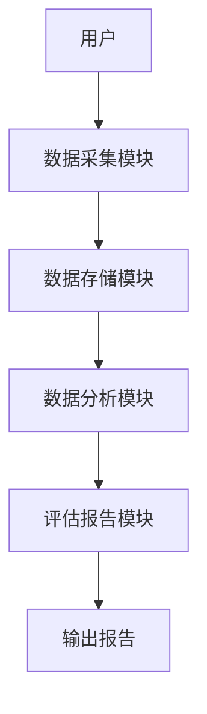

                 


# 企业估值中的品牌忠诚度评估

> 关键词：品牌忠诚度，企业估值，客户保留率，客户推荐率，品牌价值，企业价值，客户忠诚度模型

> 摘要：品牌忠诚度是企业估值中的重要因素，直接影响企业的收入、资产价值和市场竞争力。本文通过分析品牌忠诚度的核心概念、评估指标、数学模型和系统架构，为企业估值提供新的视角和方法。结合实际案例，详细讲解了品牌忠诚度评估的算法实现和系统设计，为企业价值评估提供科学依据。

---

# 第一部分: 企业估值中的品牌忠诚度评估背景与概念

## 第1章: 品牌忠诚度与企业估值概述

### 1.1 品牌忠诚度的定义与内涵

#### 1.1.1 品牌忠诚度的定义
品牌忠诚度是指客户对某一品牌长期的、稳定的选择和购买行为。忠诚的客户不仅会重复购买该品牌的产品或服务，还会主动推荐给他人，并在品牌出现问题时仍然愿意给予支持。

#### 1.1.2 品牌忠诚度的核心内涵
- **客户粘性**：客户对品牌的依赖程度。
- **客户满意度**：客户对品牌产品或服务的满意程度。
- **客户忠诚度层次**：包括情感忠诚、行为忠诚和认知忠诚。

#### 1.1.3 品牌忠诚度与企业价值的关系
品牌忠诚度直接影响企业的收入、利润和资产价值。忠诚的客户为企业提供了稳定的收入来源，同时降低了营销成本。

### 1.2 企业估值的基本概念

#### 1.2.1 企业估值的定义
企业估值是指对企业的整体价值进行评估，包括有形资产和无形资产（如品牌价值、客户关系等）。

#### 1.2.2 企业估值的主要方法
- **市场法**：基于市场可比交易价格进行估值。
- **收益法**：基于未来现金流折现进行估值。
- **成本法**：基于重置成本进行估值。

#### 1.2.3 品牌忠诚度在企业估值中的地位
品牌忠诚度是企业无形资产的重要组成部分，直接影响企业的收益能力和市场竞争力。

### 1.3 品牌忠诚度评估的背景与意义

#### 1.3.1 当前企业估值的挑战
- 市场波动大，传统估值方法难以准确反映企业价值。
- 无形资产（如品牌价值）难以量化。

#### 1.3.2 品牌忠诚度评估的兴起
随着市场竞争加剧，品牌忠诚度成为企业差异化竞争的核心因素。

#### 1.3.3 品牌忠诚度评估对企业估值的意义
- 提供新的视角和方法，量化品牌忠诚度对企业价值的影响。
- 帮助企业在并购、融资等活动中更准确地评估自身价值。

### 1.4 本章小结
本章从品牌忠诚度和企业估值的基本概念出发，分析了品牌忠诚度在企业估值中的重要性，并提出了品牌忠诚度评估的必要性。

---

# 第二部分: 品牌忠诚度评估的核心概念与模型

## 第2章: 品牌忠诚度的核心要素与评估指标

### 2.1 品牌忠诚度的核心要素

#### 2.1.1 品牌认知度
客户对品牌的认知程度，包括品牌知名度和品牌美誉度。

#### 2.1.2 品牌满意度
客户对品牌产品或服务的满意程度，是品牌忠诚度的基础。

#### 2.1.3 品牌忠诚度的层次模型
- **情感忠诚**：客户对品牌的情感依赖。
- **行为忠诚**：客户持续选择品牌的行为表现。
- **认知忠诚**：客户对品牌价值的认可。

### 2.2 品牌忠诚度评估的关键指标

#### 2.2.1 客户保留率
客户保留率 = （期初客户数 - 期末流失客户数）/ 期初客户数 × 100%

#### 2.2.2 客户推荐率
客户推荐率 = 客户主动推荐的数量 / 总客户数 × 100%

#### 2.2.3 客户购买频率
客户购买频率 = 客户在一定时间内的购买次数 / 客户总数

### 2.3 品牌忠诚度与企业估值的关系

#### 2.3.1 品牌忠诚度对企业收入的影响
- 忠诚客户贡献更高的收入。
- 忠诚客户降低营销成本。

#### 2.3.2 品牌忠诚度对资产价值的影响
- 忠诚客户增加品牌资产价值。
- 忠诚客户降低企业资产负债风险。

#### 2.3.3 品牌忠诚度对市场竞争力的影响
- 忠诚客户提高市场占有率。
- 忠诚客户增强企业抗风险能力。

### 2.4 本章小结
本章分析了品牌忠诚度的核心要素和关键指标，并探讨了品牌忠诚度与企业估值的关系。

---

# 第三部分: 品牌忠诚度评估的数学模型与算法

## 第3章: 品牌忠诚度评估的数学模型

### 3.1 品牌忠诚度指数模型

#### 3.1.1 模型的定义与公式
品牌忠诚度指数（LCI）可以表示为：
$$ LCI = \frac{C + R}{2} $$
其中，$C$ 表示客户保留率，$R$ 表示客户推荐率。

#### 3.1.2 模型的应用
- 通过LCI指数量化品牌忠诚度。
- LCI指数越高，品牌忠诚度越强。

### 3.2 品牌忠诚度的层次分析法（AHP）

#### 3.2.1 层次分析法的基本原理
层次分析法是一种定性与定量相结合的决策分析方法，适用于多因素决策问题。

#### 3.2.2 品牌忠诚度评估的层次结构
- **目标层**：品牌忠诚度评估。
- **准则层**：客户保留率、客户推荐率、客户满意度。
- **指标层**：具体的数据指标。

#### 3.2.3 权重计算与综合指数
通过计算各指标的权重，构建综合指数模型：
$$ W = \sum_{i=1}^{n} w_i x_i $$
其中，$w_i$ 是指标权重，$x_i$ 是指标得分。

### 3.3 品牌忠诚度的神经网络模型

#### 3.3.1 神经网络的基本原理
神经网络是一种机器学习算法，适用于复杂非线性关系的建模。

#### 3.3.2 品牌忠诚度神经网络模型的构建
- **输入层**：客户行为数据。
- **隐藏层**：特征提取。
- **输出层**：品牌忠诚度预测。

#### 3.3.3 模型的训练与优化
通过反向传播算法和梯度下降优化模型参数。

### 3.4 本章小结
本章介绍了品牌忠诚度评估的数学模型，包括品牌忠诚度指数模型、层次分析法和神经网络模型。

---

# 第四部分: 品牌忠诚度评估的系统架构与实现

## 第4章: 系统功能设计与实现

### 4.1 问题场景介绍
以某零售企业为例，设计品牌忠诚度评估系统。

### 4.2 系统功能设计

#### 4.2.1 数据采集模块
- 数据来源：客户问卷调查、销售数据、客户投诉记录。
- 数据预处理：清洗、归一化处理。

#### 4.2.2 数据分析模块
- 数据分析方法：层次分析法、神经网络模型。
- 分析结果：品牌忠诚度指数、客户分群。

#### 4.2.3 评估报告模块
- 生成报告：品牌忠诚度评估结果、改进建议。

### 4.3 系统架构设计

#### 4.3.1 系统架构图


#### 4.3.2 系统接口设计
- 数据接口：数据库连接、API接口。
- 用户界面：数据输入界面、报告输出界面。

### 4.4 系统实现

#### 4.4.1 数据采集与预处理
```python
import pandas as pd
data = pd.read_csv('customer.csv')
data = data.dropna().reset_index(drop=True)
```

#### 4.4.2 模型训练与评估
```python
from sklearn.neural_network import MLPClassifier
model = MLPClassifier(hidden_layer_sizes=(100, 2))
model.fit(X_train, y_train)
score = model.score(X_test, y_test)
```

### 4.5 本章小结
本章详细设计了品牌忠诚度评估系统的功能模块和架构，并通过具体代码展示了系统的实现过程。

---

# 第五部分: 项目实战与最佳实践

## 第5章: 项目实战

### 5.1 项目背景
以某零售企业为例，设计品牌忠诚度评估项目。

### 5.2 项目实现

#### 5.2.1 环境配置
```bash
pip install numpy pandas scikit-learn
```

#### 5.2.2 核心代码实现
```python
import numpy as np
import pandas as pd
from sklearn.metrics import accuracy_score

# 数据预处理
data = pd.read_csv('customer.csv')
X = data[['purchase_frequency', 'loyalty_program_participation']]
y = data['loyal_customer']

# 模型训练
from sklearn.tree import DecisionTreeClassifier
model = DecisionTreeClassifier()
model.fit(X, y)

# 模型评估
y_pred = model.predict(X)
print(accuracy_score(y, y_pred))
```

### 5.3 项目分析与小结
通过项目实战，验证了品牌忠诚度评估模型的有效性，并为企业提供了具体的评估建议。

---

# 第六部分: 最佳实践与总结

## 第6章: 最佳实践

### 6.1 小结
品牌忠诚度评估是企业估值的重要组成部分，通过量化品牌忠诚度，帮助企业更准确地评估自身价值。

### 6.2 注意事项
- 数据质量：确保数据的完整性和准确性。
- 模型选择：根据实际情况选择合适的评估方法。

### 6.3 拓展阅读
- 《品牌管理》：深入理解品牌管理的核心理论。
- 《企业估值实战》：学习更多企业估值的方法和案例。

---

# 作者：AI天才研究院/AI Genius Institute & 禅与计算机程序设计艺术 /Zen And The Art of Computer Programming

