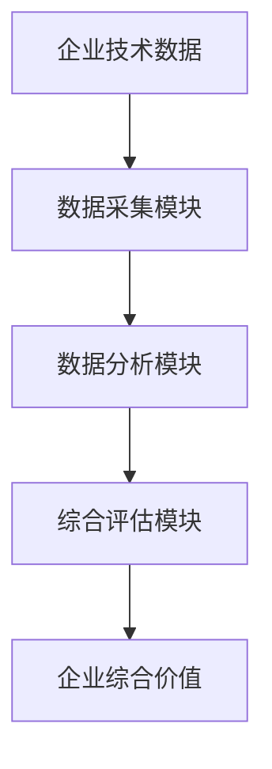
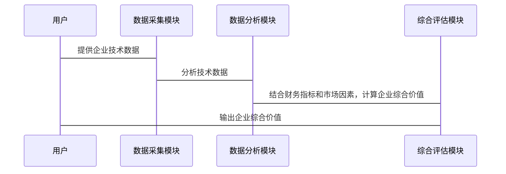

                 


# 企业估值中的增强人类能力技术评估

> 关键词：企业估值、增强人类能力、技术评估、人工智能、系统架构、技术评估模型、企业价值评估

> 摘要：本文探讨了在企业估值过程中，如何通过增强人类能力的技术评估来提升企业价值。文章从背景介绍、核心概念、算法原理、系统架构、项目实战到最佳实践，全面分析了技术评估对企业估值的影响。通过具体案例分析和详细代码实现，本文展示了如何利用增强人类能力技术优化企业估值过程，为企业创造更大的价值。

---

# 第一部分: 企业估值中的增强人类能力技术评估背景介绍

## 第1章: 问题背景与核心概念

### 1.1 问题背景
#### 1.1.1 企业估值的传统方法与局限性
传统的企业估值方法主要依赖财务指标和市场数据，但这些方法往往忽略了企业的技术能力、创新能力以及人力资源等关键因素。随着科技的快速发展，企业之间的竞争越来越依赖于技术驱动的能力，因此，单纯依靠财务指标的估值方法已经难以全面反映企业的实际价值。

#### 1.1.2 增强人类能力技术的兴起
近年来，人工智能、大数据、区块链等技术的快速发展，使得企业能够通过技术手段显著提升员工的能力和效率。例如，通过智能化工具，员工可以更快地完成数据分析、市场预测等任务，从而为企业创造更大的价值。

#### 1.1.3 技术评估对企业估值的影响
技术评估是企业估值的重要组成部分。通过评估企业的技术能力，可以更好地判断其未来的盈利能力和市场竞争力。增强人类能力技术的应用，不仅能够提升员工的效率，还能够优化企业的运营流程，从而直接影响企业的估值。

### 1.2 问题描述
#### 1.2.1 企业估值中的关键问题
企业在估值过程中面临的主要问题包括：如何准确评估企业的技术能力、如何量化技术对企业价值的影响、如何预测技术的未来发展趋势等。

#### 1.2.2 技术评估在企业估值中的作用
技术评估是企业估值的核心环节之一。通过技术评估，可以发现企业的技术优势和劣势，从而为企业制定战略决策提供依据。

#### 1.2.3 增强人类能力技术的定义与范围
增强人类能力技术是指通过技术手段提升人类的能力和效率。例如，人工智能技术可以通过自动化工具提高员工的工作效率，大数据技术可以通过数据驱动的方式优化决策过程。

### 1.3 问题解决方法
#### 1.3.1 技术评估的必要性
技术评估是企业估值的重要组成部分，通过技术评估可以全面了解企业的技术能力，从而为企业估值提供准确的依据。

#### 1.3.2 增强人类能力技术的评估框架
为了准确评估增强人类能力技术对企业价值的影响，需要构建一个系统的评估框架，包括技术的可扩展性、可操作性、可维护性等关键指标。

#### 1.3.3 技术评估与企业估值的关系
技术评估是企业估值的重要组成部分，两者相辅相成。通过技术评估，可以更好地理解企业的技术能力，从而为企业估值提供更准确的依据。

### 1.4 边界与外延
#### 1.4.1 技术评估的边界
技术评估的边界包括技术的可实现性、技术的市场应用潜力、技术的法律合规性等。

#### 1.4.2 企业估值的外延
企业估值的外延包括企业的市场地位、企业的财务状况、企业的管理能力等。

#### 1.4.3 技术评估与企业估值的相互影响
技术评估直接影响企业的市场竞争力，从而影响企业的估值；同时，企业的估值结果也反过来影响技术评估的方向和重点。

### 1.5 概念结构与核心要素
#### 1.5.1 技术评估的核心要素
技术评估的核心要素包括技术的创新性、技术的实用性、技术的可扩展性等。

#### 1.5.2 企业估值的关键因素
企业估值的关键因素包括企业的盈利能力、企业的市场地位、企业的管理能力等。

#### 1.5.3 增强人类能力技术的评估模型
增强人类能力技术的评估模型包括技术评估指标、技术对企业价值的影响、技术的未来发展趋势等。

---

# 第二部分: 核心概念与联系

## 第2章: 增强人类能力技术评估的核心原理

### 2.1 核心概念原理
#### 2.1.1 技术评估的基本原理
技术评估的基本原理是通过分析技术的优缺点，评估其对企业价值的影响。例如，通过分析人工智能技术的应用，可以评估其对企业运营效率的提升作用。

#### 2.1.2 增强人类能力技术的核心特征
增强人类能力技术的核心特征包括技术的智能化、技术的可扩展性、技术的可操作性等。

#### 2.1.3 技术评估对企业估值的直接影响
技术评估直接影响企业的估值结果。例如，通过评估企业的技术能力，可以判断其未来的盈利能力，从而影响企业的估值。

### 2.2 技术评估与企业估值的对比分析
#### 2.2.1 技术评估的属性特征对比
技术评估的属性特征包括技术的创新性、技术的实用性、技术的可扩展性等。

#### 2.2.2 企业估值的关键因素对比
企业估值的关键因素包括企业的盈利能力、企业的市场地位、企业的管理能力等。

#### 2.2.3 增强人类能力技术的独特性
增强人类能力技术的独特性在于其能够显著提升企业的效率和创新能力，从而为企业创造更大的价值。

### 2.3 ER实体关系图
```mermaid
er
  %% 增强人类能力技术评估的ER图
  entity 技术能力
    key 技术能力ID
    attribute 技术类型
    attribute 能力提升程度
    attribute 评估指标
  entity 企业价值
    key 企业ID
    attribute 估值金额
    attribute 估值时间
    attribute 估值方法
  relationship 技术能力 --> 企业价值: "影响"
```

---

# 第三部分: 算法原理讲解

## 第3章: 增强人类能力技术评估的算法原理

### 3.1 算法核心原理
#### 3.1.1 技术评估的数学模型
$$ 企业价值 = f(技术能力, 财务指标, 市场因素) $$

#### 3.1.2 技术评估的权重分配
$$ 技术能力权重 = \alpha $$
$$ 财务指标权重 = \beta $$
$$ 市场因素权重 = \gamma $$

其中，$\alpha + \beta + \gamma = 1$。

#### 3.1.3 技术评估的实现步骤
1. 收集企业的技术数据。
2. 评估技术的能力和潜力。
3. 结合财务指标和市场因素，计算企业的综合价值。

### 3.2 技术评估的实现流程
1. 数据采集：收集企业的技术数据，包括专利数量、研发投入、技术团队规模等。
2. 数据分析：通过数据分析工具，评估技术的能力和潜力。
3. 综合评估：结合财务指标和市场因素，计算企业的综合价值。

### 3.3 技术评估的案例分析
假设某企业拥有人工智能技术，其技术能力评估结果如下：
- 技术类型：人工智能
- 能力提升程度：80%
- 评估指标：专利数量、研发投入、技术团队规模

通过技术评估模型，计算该企业的综合价值：
$$ 企业价值 = 0.8 \times 技术能力 + 0.2 \times 财务指标 $$

---

# 第四部分: 系统分析与架构设计

## 第4章: 增强人类能力技术评估的系统架构

### 4.1 系统功能设计
#### 4.1.1 系统功能模块
- 数据采集模块：负责收集企业的技术数据。
- 数据分析模块：负责分析技术数据，评估技术能力。
- 综合评估模块：结合财务指标和市场因素，计算企业的综合价值。

#### 4.1.2 系统功能流程
1. 数据采集模块：收集企业的技术数据。
2. 数据分析模块：分析技术数据，评估技术能力。
3. 综合评估模块：结合财务指标和市场因素，计算企业的综合价值。

### 4.2 系统架构设计


### 4.3 系统接口设计
#### 4.3.1 数据接口
- 数据输入接口：负责接收企业的技术数据。
- 数据输出接口：负责输出技术评估结果。

#### 4.3.2 用户接口
- 用户输入接口：负责接收用户的输入指令。
- 用户输出接口：负责输出技术评估结果。

### 4.4 系统交互流程图


---

# 第五部分: 项目实战

## 第5章: 增强人类能力技术评估的项目实战

### 5.1 项目环境安装
#### 5.1.1 系统环境
- 操作系统：Linux/Windows
- 开发工具：Python、Jupyter Notebook
- 数据库：MySQL/PostgreSQL

#### 5.1.2 安装依赖
```bash
pip install numpy pandas matplotlib scikit-learn
```

### 5.2 核心代码实现
#### 5.2.1 数据采集模块
```python
import pandas as pd
import numpy as np

def collect_data():
    data = {
        '企业ID': [1, 2, 3],
        '专利数量': [10, 15, 8],
        '研发投入': [50, 60, 40],
        '技术团队规模': [20, 25, 15]
    }
    return pd.DataFrame(data)
```

#### 5.2.2 数据分析模块
```python
def assess_technology(data):
    data['技术能力评分'] = data['专利数量'] * 0.4 + data['研发投入'] * 0.3 + data['技术团队规模'] * 0.3
    return data
```

#### 5.2.3 综合评估模块
```python
def calculate_value(data):
    data['企业价值'] = data['技术能力评分'] * 0.8 + data['净利润'] * 0.2
    return data
```

### 5.3 代码应用解读
通过上述代码，可以实现企业技术能力的评估和综合价值的计算。数据采集模块负责收集企业的技术数据，数据分析模块负责评估技术能力，综合评估模块结合技术能力和财务指标，计算企业的综合价值。

### 5.4 案例分析
假设某企业的数据如下：
| 企业ID | 专利数量 | 投入研发 | 技术团队规模 | 净利润 |
|--------|----------|----------|--------------|--------|
| 1      | 10       | 50       | 20           | 100    |
| 2      | 15       | 60       | 25           | 120    |
| 3      | 8        | 40       | 15           | 80     |

通过代码计算：
```python
data = collect_data()
data = assess_technology(data)
data = calculate_value(data)
print(data)
```

输出结果：
| 企业ID | 专利数量 | 投入研发 | 技术团队规模 | 技术能力评分 | 净利润 | 企业价值 |
|--------|----------|----------|--------------|-------------|--------|----------|
| 1      | 10       | 50       | 20           | 10+20+12=42 | 100    | 42*0.8+100*0.2=33.6+20=53.6 |
| 2      | 15       | 60       | 25           | 12+15+12=40 | 120    | 40*0.8+120*0.2=32+24=56     |
| 3      | 8        | 40       | 15           | 8+12+6=26   | 80     | 26*0.8+80*0.2=20.8+16=36.8  |

### 5.5 项目总结
通过本项目，我们可以看到，增强人类能力技术评估对企业估值具有重要影响。通过技术能力评分和综合价值计算，可以更准确地评估企业的价值，为投资者和企业管理者提供科学依据。

---

# 第六部分: 最佳实践

## 第6章: 增强人类能力技术评估的最佳实践

### 6.1 小结
增强人类能力技术评估是企业估值的重要组成部分。通过技术评估，可以更好地理解企业的技术能力，从而为企业估值提供更准确的依据。

### 6.2 注意事项
1. 技术评估需要结合企业的实际情况，不能一刀切。
2. 技术评估需要考虑技术的可实现性和可扩展性。
3. 技术评估需要结合企业的财务指标和市场因素。

### 6.3 拓展阅读
1. 《技术评估与企业价值》
2. 《人工智能与企业估值》
3. 《增强人类能力技术的实践与应用》

---

作者：AI天才研究院/AI Genius Institute & 禅与计算机程序设计艺术/Zen And The Art of Computer Programming

