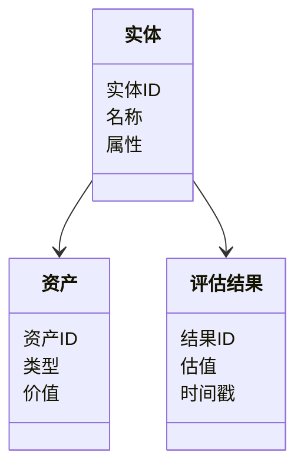
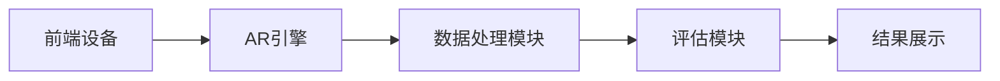
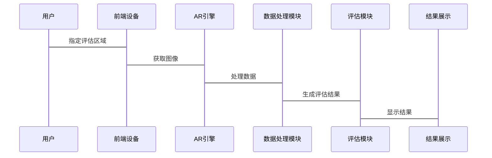

                 


# 企业估值中的增强现实应用评估

> 关键词：企业估值，增强现实，资产评估，数据可视化，AR技术，算法原理

> 摘要：本文探讨了增强现实（AR）技术在企业估值中的应用，详细分析了AR技术的核心概念、算法原理、系统架构，并通过项目实战展示了AR在企业估值中的实际应用。文章还总结了最佳实践和未来趋势，为读者提供了全面的视角。

---

# 第一部分：背景介绍

## 第1章：企业估值与增强现实技术概述

### 1.1 增强现实技术的基本概念

#### 1.1.1 增强现实（AR）的定义与核心特征
增强现实（Augmented Reality，AR）是一种将虚拟信息叠加到真实环境中的技术，通过计算机图形学、传感器技术和交互技术，实现虚拟与现实的无缝融合。AR的核心特征包括实时性、交互性和沉浸性。

#### 1.1.2 企业估值的基本概念与流程
企业估值是评估企业价值的过程，通常包括资产、收入、利润等多方面的分析。传统方法依赖于财务数据和市场分析，而AR技术的引入为估值提供了新的可视化手段。

#### 1.1.3 AR技术在企业估值中的潜在价值
AR技术可以将抽象的财务数据转化为直观的三维模型，帮助分析师更直观地理解企业的资产分布和运营状况。

---

### 1.2 企业估值的现状与挑战

#### 1.2.1 传统企业估值方法的局限性
传统方法依赖于财务报表和市场数据，难以直观展示企业的动态变化和资产分布。

#### 1.2.2 数据可视化在估值中的重要性
数据可视化可以帮助分析师更好地理解复杂的数据关系，但传统工具在三维空间中的展示能力有限。

#### 1.2.3 增强现实技术如何弥补传统估值的不足
AR技术通过将数据叠加到现实场景中，提供了更直观的可视化手段，帮助分析师发现潜在问题和机会。

---

### 1.3 AR技术与企业估值的结合

#### 1.3.1 AR技术如何提升估值效率
AR技术可以实时展示企业的资产分布和财务数据，减少分析师的计算和理解时间。

#### 1.3.2 AR在资产评估中的具体应用
通过AR技术，可以将企业的资产分布、收入来源和成本结构叠加到现实场景中，提供更直观的评估依据。

#### 1.3.3 AR技术对企业估值流程的优化作用
AR技术可以实时更新数据，帮助分析师快速响应市场变化，提升估值的准确性和效率。

---

# 第二部分：核心概念与联系

## 第2章：AR技术在企业估值中的核心概念

### 2.1 AR技术的核心原理

#### 2.1.1 AR技术的核心算法
AR技术依赖于图像识别、特征匹配和坐标变换等算法，通过摄像头捕捉现实场景并叠加虚拟信息。

#### 2.1.2 AR技术与计算机视觉的关系
AR技术基于计算机视觉，通过图像处理和特征提取，实现虚拟信息与现实场景的对齐。

#### 2.1.3 AR技术与传统数据分析的异同
AR技术将数据可视化与现实场景结合，而传统数据分析依赖于表格和图表。

---

### 2.2 AR技术与其他技术的比较

#### 2.2.1 AR与VR的比较
AR将虚拟信息叠加到现实场景中，而VR则完全沉浸于虚拟世界。

#### 2.2.2 AR与大数据分析的比较
AR通过可视化将大数据呈现为直观的三维模型，而大数据分析侧重于数据挖掘和预测。

---

### 2.3 AR技术在企业估值中的实体关系

#### 2.3.1 实体关系模型
企业、资产、评估结果等实体之间的关系可以通过ER图展示。

---

# 第三部分：算法原理讲解

## 第3章：AR技术的核心算法

### 3.1 图像识别与特征匹配

#### 3.1.1 图像识别的实现步骤
1. 图像采集
2. 特征提取
3. 匹配算法
4. 坐标变换

#### 3.1.2 常用的特征匹配算法
- SIFT算法
- SURF算法
- ORB算法

#### 3.1.3 图像匹配的数学模型
$$ I_{real}(x, y) = I_{model}(x', y') $$

---

### 3.2 坐标变换与三维重建

#### 3.2.1 坐标变换的实现步骤
1. 摄像机标定
2. 特征点匹配
3. 位姿估计
4. 三维重建

#### 3.2.2 三维重建的数学公式
$$ X = R \cdot X' + T $$

---

### 3.3 AR技术的实现流程

#### 3.3.1 实现流程图


---

## 第4章：AR技术在企业估值中的算法实现

### 4.1 算法实现步骤

#### 4.1.1 环境安装
- 安装OpenCV
- 安装Numpy

#### 4.1.2 核心代码实现

```python
import numpy as np
import cv2

def ar_image_overlay(real_image, virtual_image, homography):
    # 计算虚拟图像的重叠区域
    h, w = virtual_image.shape[:2]
    # 计算映射后的坐标
    mapped_coords = np.array([[0, 0], [w, 0], [0, h], [w, h]], dtype=np.float32)
    mapped_coords = cv2.perspectiveTransform(mapped_coords, homography)
    # 绘制虚拟图像
    overlay_image = np.zeros((real_image.shape[0], real_image.shape[1], 3), dtype=np.uint8)
    cv2.fillConvexPolygon(overlay_image, mapped_coords.astype(int), (0, 255, 0))
    # 合并图像
    result = cv2.addWeighted(real_image, 0.7, overlay_image, 0.3, 0)
    return result
```

---

### 4.2 算法优化

#### 4.2.1 算法优化策略
- 优化特征匹配算法
- 提高坐标变换的精度
- 优化三维重建的计算效率

---

# 第四部分：系统分析与架构设计

## 第5章：系统架构设计方案

### 5.1 项目介绍

#### 5.1.1 项目背景
本项目旨在利用AR技术提升企业估值的效率和准确性。

---

### 5.2 系统功能设计

#### 5.2.1 功能需求分析
- 实时资产展示
- 数据可视化
- 估值结果生成

#### 5.2.2 领域模型设计


---

### 5.3 系统架构设计

#### 5.3.1 系统架构图


---

### 5.4 系统接口设计

#### 5.4.1 主要接口
- 图像采集接口
- 数据处理接口
- 估值结果接口

---

### 5.5 系统交互设计

#### 5.5.1 交互流程图


---

# 第五部分：项目实战

## 第6章：AR技术在企业估值中的项目实战

### 6.1 环境安装

#### 6.1.1 安装依赖
```bash
pip install numpy opencv-python
```

---

### 6.2 系统核心实现

#### 6.2.1 核心代码实现
```python
def ar_image_overlay(real_image, virtual_image, homography):
    h, w = virtual_image.shape[:2]
    mapped_coords = np.array([[0, 0], [w, 0], [0, h], [w, h]], dtype=np.float32)
    mapped_coords = cv2.perspectiveTransform(mapped_coords, homography)
    overlay_image = np.zeros((real_image.shape[0], real_image.shape[1], 3), dtype=np.uint8)
    cv2.fillConvexPolygon(overlay_image, mapped_coords.astype(int), (0, 255, 0))
    result = cv2.addWeighted(real_image, 0.7, overlay_image, 0.3, 0)
    return result
```

---

### 6.3 案例分析

#### 6.3.1 案例介绍
某制造企业利用AR技术优化资产评估流程，通过实时叠加设备状态和维护成本，显著提高了评估效率。

---

### 6.4 项目小结

#### 6.4.1 实践总结
AR技术在企业估值中的应用显著提升了数据可视化能力，优化了评估流程。

---

# 第六部分：总结与展望

## 第7章：总结与展望

### 7.1 总结

#### 7.1.1 核心内容回顾
AR技术通过实时数据可视化和三维重建，优化了企业估值流程。

#### 7.1.2 技术优势
- 提高估值效率
- 增强数据可理解性
- 优化决策过程

---

### 7.2 未来展望

#### 7.2.1 技术发展趋势
- 结合人工智能技术
- 提升交互体验
- 扩展应用场景

#### 7.2.2 市场前景
AR技术在企业估值中的应用前景广阔，将成为企业数字化转型的重要工具。

---

## 第8章：最佳实践与注意事项

### 8.1 最佳实践

#### 8.1.1 选择合适的AR技术
根据具体需求选择适合的AR技术。

#### 8.1.2 确保数据准确性
保证数据的准确性和完整性。

#### 8.1.3 注重用户体验
设计直观易用的用户界面。

---

### 8.2 注意事项

#### 8.2.1 数据安全
保护企业的敏感数据不被泄露。

#### 8.2.2 技术限制
了解AR技术的局限性，避免过度依赖。

#### 8.2.3 技术更新
及时更新AR技术，保持竞争力。

---

# 作者

**作者：AI天才研究院/AI Genius Institute & 禅与计算机程序设计艺术 /Zen And The Art of Computer Programming**

---

# 结语

本文详细探讨了增强现实技术在企业估值中的应用，通过理论分析、算法实现和项目实战，展示了AR技术在提升估值效率和准确性方面的巨大潜力。希望本文能为读者提供有价值的参考和启发，推动AR技术在企业估值领域的广泛应用。

