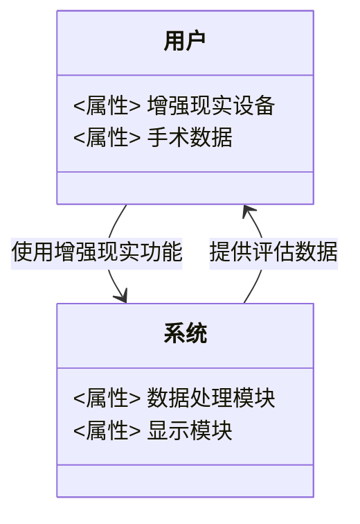
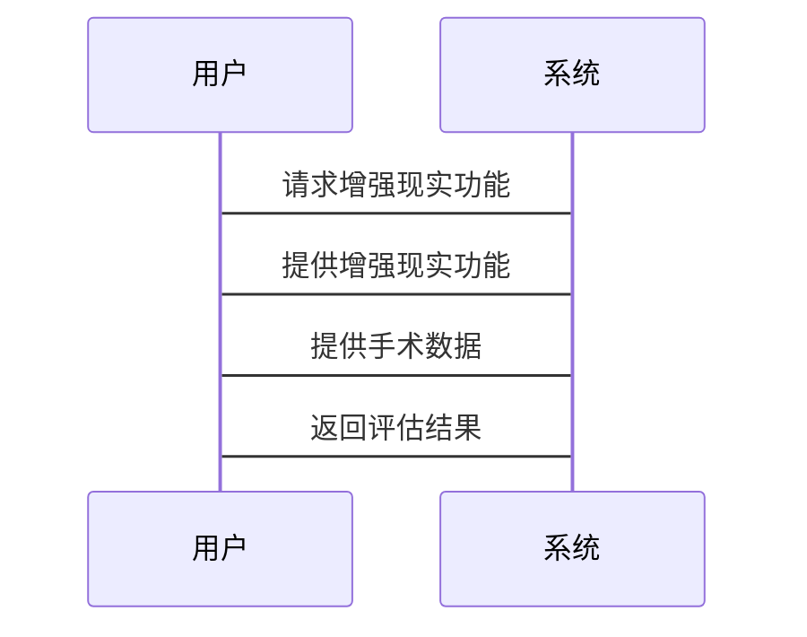

                 


---

# 目录大纲：《企业估值中的增强现实手术辅助评估》

## 第一部分：背景介绍

### 第1章：企业估值与手术辅助评估的背景

#### 1.1 问题背景
- 1.1.1 企业估值的重要性
- 1.1.2 手术评估中的数据获取与分析难点
- 1.1.3 增强现实技术在手术评估中的应用潜力

#### 1.2 问题描述
- 1.2.1 传统企业估值方法的局限性
- 1.2.2 手术评估中的数据获取与分析难点
- 1.2.3 增强现实如何解决这些问题

#### 1.3 问题解决
- 1.3.1 增强现实技术如何提升手术评估的准确性
- 1.3.2 通过实时数据辅助企业估值决策
- 1.3.3 技术整合与流程优化

#### 1.4 边界与外延
- 1.4.1 技术适用的边界条件
- 1.4.2 与其他技术的协同作用
- 1.4.3 应用领域的扩展可能性

#### 1.5 概念结构与核心要素
- 1.5.1 核心概念的构成
- 1.5.2 各要素之间的关系
- 1.5.3 系统整体架构

## 第二部分：核心概念与联系

### 第2章：增强现实与手术辅助评估的核心原理

#### 2.1 核心概念原理
- 2.1.1 增强现实技术的基本原理
- 2.1.2 手术辅助评估的关键要素
- 2.1.3 两者的结合与应用

#### 2.2 属性特征对比表格
- 增强现实与传统手术评估方法的对比分析

#### 2.3 ER实体关系图
```mermaid
erDiagram
    actor 用户 {
        <属性> 增强现实设备
        <属性> 手术数据
    }
    actor 系统 {
        <属性> 数据处理模块
        <属性> 显示模块
    }
    用户 --> 系统 : 使用增强现实功能
    用户 <-- 系统 : 提供评估数据
```

## 第三部分：算法原理讲解

### 第3章：算法原理与实现

#### 3.1 图像识别算法
- 3.1.1 算法流程
- 3.1.2 使用Python实现的图像识别代码示例
- 3.1.3 数学模型和公式解释

#### 3.2 实时跟踪与注册算法
- 3.2.1 算法流程
- 3.2.2 使用Python实现的实时跟踪与注册代码示例
- 3.2.3 数学模型和公式解释

#### 3.3 三维重建算法
- 3.3.1 算法流程
- 3.3.2 使用Python实现的三维重建代码示例
- 3.3.3 数学模型和公式解释

## 第四部分：系统分析与架构设计方案

### 第4章：系统分析与架构设计

#### 4.1 问题场景介绍
- 4.1.1 系统目标
- 4.1.2 系统范围
- 4.1.3 系统相关方

#### 4.2 系统功能设计
- 4.2.1 领域模型类图


#### 4.3 系统架构设计
```mermaid
archiDiagram
    component 用户 {
        <属性> 增强现实设备
        <属性> 手术数据
    }
    component 系统 {
        <属性> 数据处理模块
        <属性> 显示模块
    }
    用户 --> 系统 : 使用增强现实功能
    用户 <-- 系统 : 提供评估数据
```

#### 4.4 接口设计
- 4.4.1 接口定义
- 4.4.2 接口交互流程

#### 4.5 交互序列图


## 第五部分：项目实战

### 第5章：项目实战与案例分析

#### 5.1 环境安装
- 5.1.1 安装Python
- 5.1.2 安装相关库

#### 5.2 系统核心实现
- 5.2.1 图像识别模块实现
- 5.2.2 实时跟踪与注册模块实现
- 5.2.3 三维重建模块实现

#### 5.3 代码应用解读与分析
- 5.3.1 代码功能说明
- 5.3.2 代码结构分析
- 5.3.3 代码优化建议

#### 5.4 案例分析与详细讲解
- 5.4.1 实际案例分析
- 5.4.2 详细讲解剖析
- 5.4.3 实践总结

#### 5.5 项目小结
- 5.5.1 项目成果
- 5.5.2 经验与教训
- 5.5.3 未来改进方向

## 第六部分：最佳实践、小结、注意事项和拓展阅读

### 第6章：最佳实践与总结

#### 6.1 最佳实践 tips
- 6.1.1 开发中的注意事项
- 6.1.2 问题解决技巧
- 6.1.3 优化建议

#### 6.2 小结
- 6.2.1 核心内容回顾
- 6.2.2 未来展望
- 6.2.3 总结与反思

#### 6.3 注意事项
- 6.3.1 技术应用中的潜在问题
- 6.3.2 用户使用中的常见误区
- 6.3.3 伦理与法律问题

#### 6.4 拓展阅读
- 6.4.1 推荐书籍
- 6.4.2 专业文章
- 6.4.3 在线资源

---

# 作者：AI天才研究院/AI Genius Institute & 禅与计算机程序设计艺术 /Zen And The Art of Computer Programming

---

**注意：** 以上目录大纲仅为示例，具体内容需要根据实际需求进行调整和补充。

