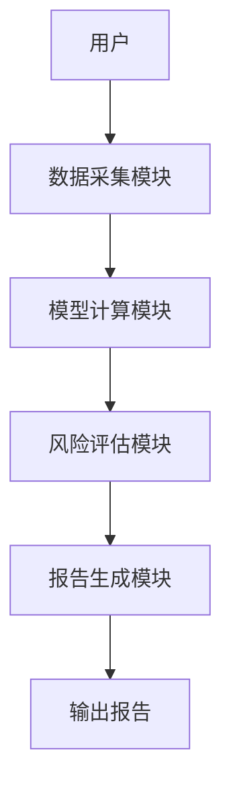

                 


# 企业估值中的实物期权法

> 关键词：企业估值，实物期权，期权定价，Black-Scholes模型，资本资产定价模型（CAPM），套利定价理论（APT）

> 摘要：本文详细探讨了实物期权法在企业估值中的应用，通过理论分析和实际案例，解释了如何利用实物期权法评估企业的内在价值和潜在风险。文章从实物期权的基本概念出发，逐步分析其数学模型、系统架构，并通过项目实战展示其应用过程。

---

## 第一部分: 实物期权法的背景与基础

### 第1章: 实物期权法概述

#### 1.1 实物期权的基本概念

- **1.1.1 什么是实物期权**
  实物期权是指企业在特定条件下，对未来资产或项目的持有权或处置权，类似于金融期权的概念。它允许企业在特定条件下行使某种权利，以实现最大化的价值。

- **1.1.2 实物期权与金融期权的区别**
  | 特性 | 实物期权 | 金融期权 |
  |------|----------|----------|
  | 标的资产 | 实体资产（如项目、技术） | 金融资产（如股票、债券） |
  | 行权方式 | 可能涉及实物资产的持有或处置 | 以货币结算或实物交割 |
  | 风险敞口 | 与企业经营风险相关 | 与市场波动相关 |

- **1.1.3 实物期权在企业估值中的作用**
  实物期权为企业提供了在不确定环境下的灵活性和选择权，帮助企业在面对市场波动和不确定性时做出更明智的决策。

#### 1.2 实物期权法的发展历程

- **1.2.1 实物期权法的起源**
  实物期权的概念可以追溯到20世纪70年代，随着金融期权模型的发展，逐渐被应用于企业估值领域。

- **1.2.2 实物期权法的发展阶段**
  - 初期阶段：主要应用于单一资产估值。
  - 发展阶段：扩展到企业整体估值和项目评估。
  - 现代阶段：结合大数据和机器学习技术，提升估值精度。

- **1.2.3 实物期权法在现代企业估值中的应用**
  随着企业面临的不确定性增加，实物期权法在战略决策、风险管理等方面发挥着越来越重要的作用。

#### 1.3 实物期权法的核心思想

- **1.3.1 期权的基本属性**
  - 时间价值：期权价值随着时间的推移而变化。
  - 内在价值：期权在行权时的理论价值。
  - 波动性：标的资产价格波动对期权价值的影响。

- **1.3.2 实物期权的内在价值与外在价值**
  - 内在价值：期权基于标的资产的当前价值。
  - 外在价值：期权基于市场参与者的预期和情绪。

- **1.3.3 实物期权的行权策略**
  - 看涨期权：企业有权在特定价格购买资产。
  - 看跌期权：企业有权在特定价格出售资产。

---

## 第2章: 实物期权法的理论基础

### 2.1 期权定价理论

#### 2.1.1 Black-Scholes模型

- **模型公式**
  $$ C = S_0 e^{\sigma \sqrt{T} \Phi(d_1)} - K e^{-rT} \Phi(d_2) $$
  其中：
  - \( S_0 \)：标的资产当前价格
  - \( K \)：行权价格
  - \( r \)：无风险利率
  - \( T \)：到期时间
  - \( \sigma \)：标的资产价格波动率
  - \( \Phi \)：标准正态分布的累积分布函数

- **模型假设**
  - 无摩擦市场
  - 股价遵循几何布朗运动
  - 可以无限分割标的资产

- **模型应用**
  使用Black-Scholes模型计算企业某项资产的期权价值，并结合企业的财务状况进行综合评估。

#### 2.1.2 Cox-Ross-Rubinstein模型

- **模型原理**
  基于二叉树模型，通过模拟标的资产价格的上行和下行概率，计算期权的期望值。

- **模型步骤**
  1. 确定标的资产的上行和下行概率。
  2. 计算期权在各个节点的值。
  3. 使用风险中性测度计算期权的期望值。

#### 2.1.3 实物期权定价的数学模型

- **数学表达**
  $$ V = e^{-rT} E[max(S_T - K, 0)] $$
  其中：
  - \( V \)：期权的现值
  - \( S_T \)：标的资产到期价格
  - \( K \)：行权价格
  - \( r \)：无风险利率
  - \( T \)：到期时间

### 2.2 资本资产定价模型（CAPM）

#### 2.2.1 CAPM的基本原理

- **CAPM公式**
  $$ E(R_i) = R_f + \beta_i (R_m - R_f) $$
  其中：
  - \( E(R_i) \)：资产i的预期收益率
  - \( R_f \)：无风险利率
  - \( \beta_i \)：资产i的贝塔系数
  - \( R_m \)：市场预期收益率

- **贝塔系数的含义**
  - \( \beta > 1 \)：资产收益波动大于市场
  - \( \beta = 1 \)：资产收益波动与市场一致
  - \( \beta < 1 \)：资产收益波动小于市场

#### 2.2.2 CAPM在期权定价中的应用

- **应用步骤**
  1. 计算标的资产的贝塔系数。
  2. 确定市场风险溢价。
  3. 计算期权的预期收益率。
  4. 结合时间价值和波动性调整期权价值。

### 2.3 套利定价理论（APT）

#### 2.3.1 APT的基本原理

- **APT假设**
  - 市场套利机会为零。
  - 资产的预期收益率由其在各个风险因子上的暴露程度决定。

#### 2.3.2 APT在期权定价中的应用

- **套利机会分析**
  - 当期权价格偏离其理论价值时，存在套利机会。
  - 利用套利定价理论调整期权的理论价值。

---

## 第3章: 实物期权法的系统分析与架构设计

### 3.1 系统功能设计

- **功能模块**
  - 数据采集模块：收集标的资产的价格数据。
  - 模型计算模块：应用Black-Scholes模型计算期权价值。
  - 风险评估模块：评估期权投资的风险敞口。
  - 报告生成模块：输出期权估值报告。

### 3.2 系统架构设计



### 3.3 接口设计

- **API接口**
  - `GET /api/v1/option-value`：获取期权的理论价值。
  - `POST /api/v1/risk-assessment`：提交风险评估请求。

---

## 第4章: 项目实战

### 4.1 环境安装

- **工具安装**
  - Python 3.x
  - NumPy、Pandas、Matplotlib
  - Scipy（用于科学计算）

### 4.2 核心代码实现

```python
import numpy as np
from scipy.stats import norm

def black_scholes(S, K, r, T, sigma):
    d1 = (np.log(S/K) + (r + sigma**2/2)*T) / (sigma*np.sqrt(T))
    d2 = d1 - sigma*np.sqrt(T)
    C = S * norm.cdf(d1) - K * np.exp(-r*T) * norm.cdf(d2)
    return C

# 示例数据
S = 100
K = 105
r = 0.01
T = 1
sigma = 0.2

value = black_scholes(S, K, r, T, sigma)
print(f"期权价值为: {value}")
```

### 4.3 案例分析

- **案例背景**
  某企业计划投资一个新项目，项目的价值受市场波动影响较大，适合使用实物期权法进行估值。

- **分析步骤**
  1. 收集项目相关的数据。
  2. 应用Black-Scholes模型计算期权价值。
  3. 评估项目的风险敞口。
  4. 输出项目估值报告。

### 4.4 结果解读

- **结果分析**
  - 期权价值为正，说明项目具有投资价值。
  - 波动率较大，需注意市场风险。

---

## 第5章: 最佳实践与小结

### 5.1 最佳实践

- **数据准确性**
  确保输入数据的准确性和完整性。
- **模型选择**
  根据具体情况选择合适的模型，避免盲目套用。
- **风险控制**
  定期监控市场变化，及时调整投资策略。

### 5.2 小结

本文详细介绍了实物期权法在企业估值中的应用，从理论基础到实际操作，为读者提供了全面的指导。实物期权法不仅帮助企业评估资产价值，还能有效管理市场风险，是现代企业估值的重要工具。

---

## 作者

作者：AI天才研究院 & 禅与计算机程序设计艺术

