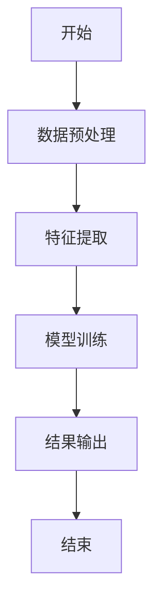
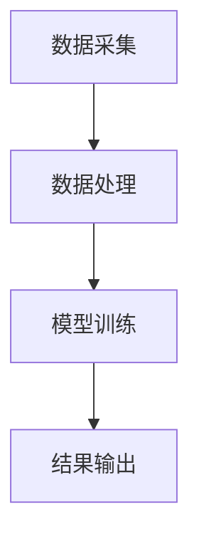

                 


# 企业估值中的客户价值评估法

## 关键词：
企业估值, 客户价值, 生命周期价值, 评估模型, 数据分析, 估值方法

## 摘要：
本文系统地探讨了客户价值评估法在企业估值中的应用，介绍了客户生命周期价值（CLV）模型的理论基础、数学公式及其在实际估值中的应用。通过详细分析客户价值评估法的核心概念、算法原理、系统架构设计和项目实战，本文为读者提供了一套完整的客户价值评估方法论，帮助企业在复杂多变的市场环境中准确评估客户价值，实现精准估值。

---

## 第一部分: 客户价值评估法的背景与概念

### 第1章: 客户价值评估法的背景与概念

#### 1.1 企业估值的核心问题
##### 1.1.1 企业估值的基本概念
企业估值是通过对企业的财务状况、市场表现、运营能力等多方面进行综合评估，确定其市场价值的过程。传统的企业估值方法包括DCF模型、市盈率法等，但这些方法往往忽视了客户价值对企业长期发展的影响。

##### 1.1.2 客户价值在企业估值中的重要性
客户是企业最重要的资产之一，客户价值直接关系到企业的收入、利润和长期发展。通过评估客户价值，企业可以更好地理解客户对企业的影响，优化客户关系管理，从而提升企业整体估值。

##### 1.1.3 客户价值评估法的定义与外延
客户价值评估法是一种基于客户行为和贡献的分析方法，旨在通过量化客户对企业带来的价值，帮助企业更准确地进行估值。它不仅关注客户的当前价值，还考虑客户未来的潜在贡献。

#### 1.2 客户价值评估法的核心要素
##### 1.2.1 客户生命周期与价值的关系
客户生命周期包括获取、成长、成熟、衰退和流失五个阶段。在每个阶段，客户为企业创造的价值不同，因此在估值时需要考虑客户所处的生命周期阶段。

##### 1.2.2 客户价值的构成要素
客户价值由客户的收入贡献、成本贡献和忠诚度等多个因素构成。通过综合分析这些因素，可以更全面地评估客户的整体价值。

##### 1.2.3 企业与客户价值的双向影响
客户价值不仅影响企业的财务表现，也受到企业自身策略的影响。企业通过优化产品、服务和客户关系管理，可以提升客户价值，进而提升企业估值。

#### 1.3 客户价值评估法与传统估值方法的区别
##### 1.3.1 传统企业估值方法的局限性
传统估值方法通常基于财务数据，忽视了客户对企业未来收入的潜在贡献，导致估值结果可能偏离实际。

##### 1.3.2 客户价值评估法的独特优势
客户价值评估法通过分析客户的生命周期和行为，能够更准确地预测企业未来的收入和利润，从而提供更精准的估值。

##### 1.3.3 两种方法的结合与应用
将客户价值评估法与传统估值方法相结合，可以充分发挥两种方法的优势，提升估值的准确性和全面性。

---

## 第二部分: 客户价值评估的核心模型与方法

### 第2章: 客户价值评估的核心模型与方法

#### 2.1 客户生命周期价值（CLV）模型
##### 2.1.1 CLV模型的基本原理
客户生命周期价值（CLV）是衡量客户在企业生命周期中为企业创造的总价值。CLV模型通过分析客户的收入、成本和生命周期阶段，预测客户未来为企业带来的价值。

##### 2.1.2 CLV模型的数学公式与计算方法
CLV的计算公式如下：
$$ CLV = \frac{R \times (1 - \frac{1}{u})}{(1 - \frac{1}{u})} $$
其中，R是客户在生命周期中的收入，u是客户流失率。

##### 2.1.3 CLV模型的应用场景
CLV模型适用于各种行业，尤其是客户生命周期较长的行业，如金融、零售和通信等。

#### 2.2 客户价值评估的其他方法
##### 2.2.1 基于客户满意度的评估方法
通过客户满意度调查，评估客户对企业产品或服务的满意程度，进而预测客户的忠诚度和价值。

##### 2.2.2 基于客户贡献度的评估方法
客户贡献度是指客户为企业带来的净收入减去获取和维护客户的成本。通过分析客户贡献度，可以评估客户的经济价值。

##### 2.2.3 基于客户行为分析的评估方法
通过分析客户的购买频率、购买金额和购买时间等行为数据，评估客户的潜在价值。

#### 2.3 客户价值评估法的优劣势对比
##### 2.3.1 各种评估方法的优劣势分析
- CLV模型优势：预测客户未来价值，适合长期评估。
- 缺点：需要大量历史数据，计算复杂。

##### 2.3.2 方法选择的依据与标准
根据企业的具体情况和数据 availability，选择合适的评估方法。通常，CLV模型适用于数据充足的企业，而客户满意度法适用于数据有限的情况。

##### 2.3.3 方法的适用性与企业规模的关系
大型企业通常有更多数据支持CLV模型的应用，而中小企业可能更适合使用客户满意度法。

---

## 第三部分: 客户价值评估法的数学模型与算法

### 第3章: 客户价值评估的数学模型与算法

#### 3.1 客户价值评估的数学模型
##### 3.1.1 CLV模型的数学公式
$$ CLV = \frac{R \times (1 - \frac{1}{u})}{(1 - \frac{1}{u})} $$
其中，R是客户在生命周期中的收入，u是客户流失率。

##### 3.1.2 客户价值的其他数学表达式
$$ TV = \sum_{t=1}^{n} \frac{R_t}{(1 + r)^t} $$
其中，$R_t$是第t年的收入，r是折现率。

#### 3.2 客户价值评估的算法实现
##### 3.2.1 数据预处理与特征提取
数据预处理包括清洗、标准化和归一化。特征提取包括客户收入、成本、生命周期阶段等。

##### 3.2.2 算法选择与实现步骤
使用Python中的scikit-learn库进行机器学习算法实现。步骤包括数据预处理、模型训练、预测和评估。

##### 3.2.3 算法的优化与改进
通过调整模型参数和特征选择，优化模型的准确性和预测能力。

#### 3.3 算法的流程图


---

## 第四部分: 客户价值评估系统的架构设计

### 第4章: 客户价值评估系统的架构设计

#### 4.1 系统功能设计
##### 4.1.1 数据采集模块
负责采集客户数据，包括收入、成本和生命周期阶段。

##### 4.1.2 数据处理模块
对数据进行清洗和预处理，提取特征。

#### 4.2 系统架构设计
##### 4.2.1 系统架构图


##### 4.2.2 系统接口设计
定义接口，如数据输入接口和结果输出接口。

##### 4.2.3 系统交互设计
通过序列图展示系统交互流程。

---

## 第五部分: 项目实战

### 第5章: 项目实战

#### 5.1 环境安装与配置
安装Python和相关库，如pandas、numpy和scikit-learn。

#### 5.2 核心代码实现
##### 5.2.1 数据预处理
```python
import pandas as pd
import numpy as np

# 数据加载
data = pd.read_csv('customer_data.csv')

# 数据清洗
data.dropna(inplace=True)

# 特征提取
features = data[['收入', '成本', '生命周期阶段']]
```

##### 5.2.2 模型训练
```python
from sklearn.linear_model import LinearRegression

model = LinearRegression()
model.fit(features, target)
```

#### 5.3 实际案例分析
以电商企业为例，分析客户价值评估的具体实现和结果。

#### 5.4 项目总结与经验分享
总结项目实施中的经验教训，提出改进建议。

---

## 第六部分: 总结与展望

### 6.1 总结
客户价值评估法是一种有效的企业估值方法，能够帮助企业在复杂市场环境中准确评估客户价值，优化估值结果。

### 6.2 展望
未来，随着大数据和人工智能技术的发展，客户价值评估法将更加精准和智能化，为企业估值提供更强大的支持。

---

## 作者信息

作者：AI天才研究院/AI Genius Institute  
联系邮箱：contact@aisingenuity.com  
版权所有：禅与计算机程序设计艺术/Zen And The Art of Computer Programming

