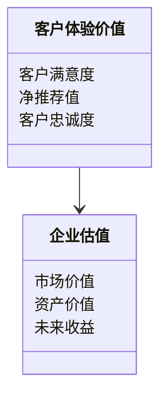
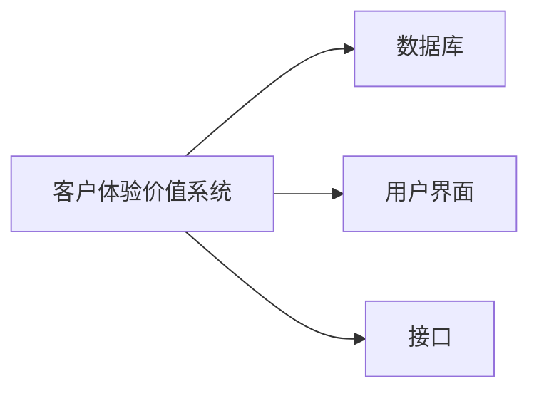
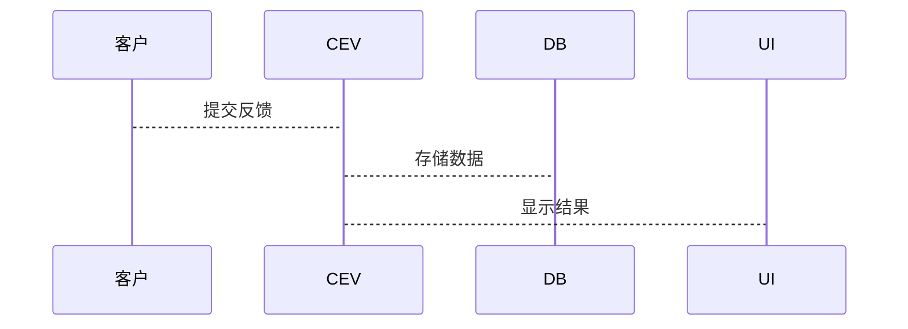

                 


# 企业估值中的客户体验价值分析

**关键词**：企业估值、客户体验、客户价值、客户忠诚度、客户满意度、品牌价值

**摘要**：在当今竞争激烈的商业环境中，客户体验已成为影响企业估值的重要因素。本文从客户体验价值的定义、量化方法、对企业估值的影响等方面展开分析，结合实际案例和数学模型，探讨如何通过客户体验价值提升企业整体估值。

---

## 第1章: 客户体验价值与企业估值的背景介绍

### 1.1 客户体验价值的定义与核心概念

客户体验价值是指客户在与企业交互过程中所感受到的价值，包括产品使用体验、服务质量、品牌认知等多个方面。它是客户对企业整体感知的核心体现，直接影响客户的忠诚度和企业的市场表现。

#### 1.1.1 客户体验价值的定义

客户体验价值（CEV，Customer Experience Value）是客户在与企业交互过程中所获得的感知价值，包括功能性价值、情感价值和社交价值。

#### 1.1.2 客户体验价值的核心要素

| 核心要素 | 描述 |
|----------|------|
| 功能性价值 | 产品或服务的实用性和功能性 |
| 情感价值 | 客户在使用过程中产生的愉悦感和满意度 |
| 社交价值 | 产品或服务在社交网络中的传播和影响力 |

#### 1.1.3 客户体验价值与企业估值的关系

客户体验价值通过提升客户忠诚度和满意度，间接影响企业的收入、成本和利润，从而影响企业的市场价值。

### 1.2 企业估值的基本概念与方法

#### 1.2.1 企业估值的定义与分类

企业估值是指对企业整体价值的评估，通常包括市场价值、资产价值和未来收益价值。

#### 1.2.2 常见的企业估值方法

| 方法 | 描述 |
|------|------|
| 市盈率法 | 通过市盈率与行业平均值进行比较 |
| 现金流折现法 | 将未来现金流折现到现值 |
| 股权自由现金流法 | 通过股权自由现金流评估企业价值 |

#### 1.2.3 客户体验价值在企业估值中的作用

客户体验价值通过提升客户忠诚度和满意度，间接影响企业的收入和成本，从而影响企业的整体估值。

### 1.3 客户体验价值对企业价值的影响

#### 1.3.1 客户忠诚度与企业价值的关系

客户忠诚度越高，企业的收入稳定性和增长潜力越大，从而提升企业估值。

#### 1.3.2 客户满意度与企业价值的关系

高客户满意度通常意味着更低的客户流失率，从而降低企业的市场推广和客户获取成本。

#### 1.3.3 客户体验对品牌价值的影响

良好的客户体验可以提升品牌的认知度和美誉度，从而增强品牌价值，间接提升企业估值。

### 1.4 本章小结

本章介绍了客户体验价值的定义和核心要素，分析了客户体验价值与企业估值的关系，并探讨了客户体验价值对企业价值的具体影响。

---

## 第2章: 客户体验价值的量化分析

### 2.1 客户体验价值的量化方法

#### 2.1.1 客户体验价值的测量指标

客户体验价值的测量指标包括客户满意度（CSAT）、净推荐值（NPS）和客户忠诚度指数（CLI）。

#### 2.1.2 客户体验价值的评分系统

客户体验价值的评分系统通常采用五级评分法（1-5分），并根据权重对各指标进行加权计算。

#### 2.1.3 客户体验价值的加权计算

客户体验价值（CEV）的计算公式如下：

$$ CEV = \sum_{i=1}^{n} w_i \cdot s_i $$

其中，$w_i$ 是第 $i$ 个指标的权重，$s_i$ 是第 $i$ 个指标的评分。

### 2.2 客户体验价值的数学模型

#### 2.2.1 客户体验价值的线性回归模型

客户体验价值的线性回归模型可以表示为：

$$ CEV = \beta_0 + \beta_1 x_1 + \beta_2 x_2 + ... + \beta_n x_n $$

其中，$x_i$ 是影响客户体验价值的各个因素，$\beta_i$ 是对应的回归系数。

#### 2.2.2 客户体验价值的评分加权公式

$$ CEV = \sum_{i=1}^{n} w_i \cdot s_i $$

### 2.3 客户体验价值的算法实现

#### 2.3.1 算法步骤

1. 收集客户体验数据，包括客户满意度、净推荐值等指标。
2. 确定各指标的权重，通常可以通过专家评分或历史数据分析确定。
3. 计算各指标的评分加权和，得到客户体验价值（CEV）。

#### 2.3.2 代码实现

```python
def calculate_cev(scores, weights):
    cev = sum(score * weight for score, weight in zip(scores, weights))
    return cev

# 示例数据
scores = [4, 3, 5]  # 各指标的评分
weights = [0.4, 0.3, 0.3]  # 各指标的权重
cev = calculate_cev(scores, weights)
print(f"客户体验价值：{cev}")
```

### 2.4 本章小结

本章详细介绍了客户体验价值的量化方法，包括测量指标、评分系统和数学模型，并通过示例代码展示了算法的实现过程。

---

## 第3章: 客户体验价值与企业估值的关系

### 3.1 客户体验价值对企业财务表现的影响

#### 3.1.1 客户体验与企业收入的关系

良好的客户体验可以提升客户的购买频率和购买金额，从而增加企业的收入。

#### 3.1.2 客户体验与企业成本的关系

通过提升客户体验，可以降低客户的投诉率和退货率，从而降低企业的运营成本。

#### 3.1.3 客户体验与企业利润的关系

客户体验的提升可以增加客户的忠诚度，从而提高企业的利润率。

### 3.2 客户体验价值对企业市场价值的影响

#### 3.2.1 客户体验与品牌价值的关系

良好的客户体验可以提升品牌的认知度和美誉度，从而增强品牌价值。

#### 3.2.2 客户体验与客户忠诚度的关系

高客户忠诚度意味着客户更愿意为企业支付溢价，从而提升企业的市场价值。

### 3.3 本章小结

本章分析了客户体验价值对企业财务表现和市场价值的影响，强调了客户体验在企业估值中的重要性。

---

## 第4章: 客户体验价值在企业估值中的系统分析

### 4.1 系统功能设计

#### 4.1.1 领域模型



#### 4.1.2 系统架构设计



#### 4.1.3 系统交互设计



### 4.2 项目实战

#### 4.2.1 环境安装

需要安装Python和相关库（如Pandas、NumPy）。

#### 4.2.2 核心代码实现

```python
import pandas as pd
import numpy as np

def calculate_cev(scores, weights):
    return np.dot(scores, weights)

# 示例数据
scores = pd.Series([4, 3, 5])
weights = pd.Series([0.4, 0.3, 0.3])
cev = calculate_cev(scores, weights)
print(f"客户体验价值：{cev}")
```

### 4.3 本章小结

本章通过系统分析和项目实战，展示了如何将客户体验价值分析应用于企业估值中。

---

## 第5章: 客户体验价值分析的总结与展望

### 5.1 本章总结

客户体验价值是影响企业估值的重要因素，通过量化分析和系统设计，可以有效提升企业的整体价值。

### 5.2 最佳实践

- 定期收集客户反馈，及时优化产品和服务。
- 建立客户体验价值分析系统，量化客户体验对企业估值的影响。
- 注重客户忠诚度和满意度的提升，增强品牌价值。

### 5.3 未来展望

未来，随着人工智能和大数据技术的发展，客户体验价值分析将更加精准和智能化，为企业估值提供更有力的支持。

---

## 作者

作者：AI天才研究院/AI Genius Institute & 禅与计算机程序设计艺术 /Zen And The Art of Computer Programming

---

通过以上内容，我们详细探讨了客户体验价值在企业估值中的重要性及其分析方法，为企业提升整体价值提供了理论和实践指导。

