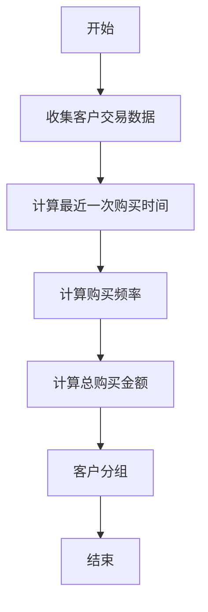
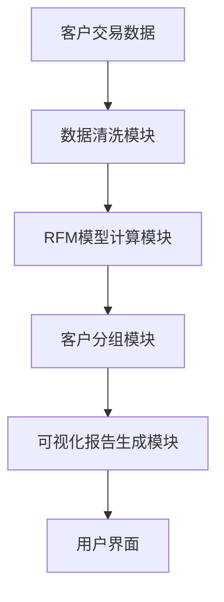
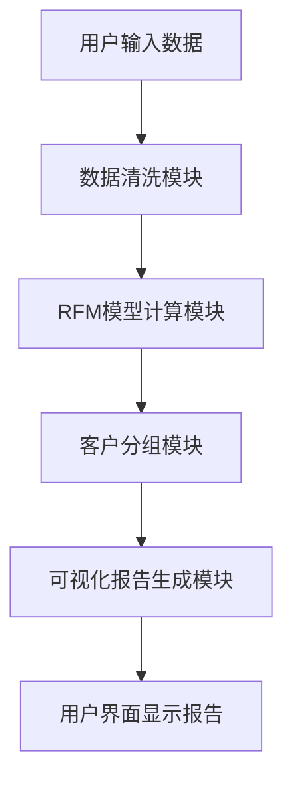

                 


# 企业估值中的客户粘性评估

**关键词**：企业估值，客户粘性，客户生命周期，客户价值分析，RFM模型，客户忠诚度

**摘要**：客户粘性是企业在市场中保持竞争优势的关键因素之一。本文深入探讨了客户粘性在企业估值中的重要性，分析了客户粘性的核心概念、评估方法以及如何通过客户生命周期和客户价值分析来提升企业估值。通过具体的数学模型和算法，本文提供了客户粘性评估的实践指导，帮助企业在数字化时代实现可持续增长。

---

## 第1章: 客户粘性评估的背景与重要性

### 1.1 什么是客户粘性

客户粘性是指客户对企业产品或服务的依赖程度，反映了客户对企业的情感、信任和习惯依赖。客户粘性越高，客户转换成本越高，客户流失的可能性越小。客户粘性可以分为以下几种类型：

- **情感粘性**：客户对企业的情感认同和品牌忠诚度。
- **习惯粘性**：客户因长期使用某产品或服务而形成的使用习惯。
- **经济粘性**：客户因经济利益或价格优惠而选择继续使用产品或服务。

客户粘性与企业估值的关系密切。高客户粘性的企业通常具有更高的客户保留率和更低的获取新客户的成本，从而能够实现更稳定的收入流和更高的利润率。

### 1.2 客户粘性评估的背景

在数字经济时代，企业估值不再仅仅依赖于财务指标，客户资产（Customer Equity）逐渐成为企业价值的重要组成部分。客户资产包括客户获取成本、客户保留成本以及客户带来的未来收入流。客户粘性是客户资产的核心驱动因素之一，直接影响企业的可持续发展能力和市场竞争力。

传统的企业估值方法主要依赖于财务指标，如收入、利润和资产。然而，在数字化时代，客户粘性成为企业估值的重要补充指标。通过评估客户粘性，企业可以更好地预测未来收入流，优化资源配置，制定更有效的市场战略。

### 1.3 问题背景与解决思路

传统的企业估值方法往往忽视了客户粘性对企业发展的影响。客户粘性低的企业可能因为客户流失而导致收入下降，而客户粘性高的企业则能够保持稳定的客户群体和收入来源。因此，如何科学评估客户粘性，将其纳入企业估值体系，成为企业面临的重大挑战。

解决这一问题的关键在于建立客户粘性评估模型，量化客户粘性对企业价值的影响。通过分析客户生命周期、客户价值和客户行为数据，企业可以更准确地评估客户粘性，从而优化估值方法。

---

## 第2章: 客户粘性评估的核心概念与联系

### 2.1 客户粘性的核心要素

客户粘性评估涉及多个核心要素，包括客户满意度、客户忠诚度和客户生命周期。

- **客户满意度**：客户对产品或服务的满意程度，直接影响客户的重复购买意愿和推荐行为。
- **客户忠诚度**：客户对企业产品或服务的忠诚程度，反映客户对企业的情感依赖和经济依赖。
- **客户生命周期**：客户从初次接触企业到最终流失的整个过程，包括获取阶段、成长阶段和衰退阶段。

### 2.2 客户粘性与企业价值的关系

客户粘性直接影响企业的市场竞争力和盈利能力。高客户粘性的企业通常具有更高的客户保留率和更低的获取新客户的成本。此外，客户粘性高的企业能够通过交叉销售和 upselling 提高客户生命周期价值，从而提升企业整体价值。

客户粘性与企业市场竞争力的关系可以通过以下公式表示：

$$
\text{企业市场竞争力} = f(\text{客户粘性}, \text{客户满意度}, \text{客户忠诚度})
$$

其中，客户粘性是影响企业市场竞争力的关键因素之一。

### 2.3 核心概念的ER实体关系图

以下是一个客户粘性评估的核心概念的ER实体关系图：

```mermaid
erDiagram
    customer {
        id
        name
        purchase_history
    }
    product {
        id
        name
        price
    }
    transaction {
        id
        customer_id
        product_id
        date
    }
    customer --> transaction : "makes"
    product --> transaction : "belongs to"
```

---

## 第3章: 客户粘性评估的数学模型与算法原理

### 3.1 客户粘性评估的数学模型

客户粘性评估可以通过客户生命周期价值（Customer Lifetime Value, CLV）模型进行量化。CLV 是企业在客户生命周期内从该客户获得的总收入减去相关成本后的净现值。

$$
\text{CLV} = \frac{\text{年度收入} \times \text{客户生命周期长度}}{1 - \text{贴现率}}
$$

其中，贴现率反映了客户流失的概率，客户生命周期长度是客户从获取到流失的时间跨度。

### 3.2 客户粘性评估的算法原理

客户粘性评估可以采用RFM模型（Recency, Frequency, Monetary）进行分析。RFM模型通过客户的购买频率、最近一次购买时间和单笔购买金额来评估客户的粘性。

**步骤如下：**

1. **数据准备**：收集客户交易数据，包括购买时间、购买金额和购买频率。
2. **计算 RFM 指标**：
   - **Recency**：最近一次购买时间，计算为当前时间减去最近一次购买时间。
   - **Frequency**：购买频率，计算为总购买次数。
   - **Monetary**：总购买金额。
3. **客户分组**：根据 RFM 指标对客户进行分组，识别高粘性客户和低粘性客户。

### 3.3 RFM模型的Python实现

以下是一个基于RFM模型的Python代码示例：

```python
import pandas as pd
from datetime import datetime, timedelta

# 假设我们有一个客户交易数据集
data = {
    'customer_id': [1, 1, 2, 2, 3, 3],
    'purchase_date': ['2023-01-01', '2023-03-15', '2023-02-10', '2023-04-20', '2023-01-15', '2023-05-01'],
    'amount': [100, 150, 80, 120, 90, 130]
}

df = pd.DataFrame(data)

# 计算最近一次购买时间（Recency）
df['purchase_date'] = pd.to_datetime(df['purchase_date'])
current_date = datetime(2023, 5, 31)
df['recency_days'] = (current_date - df['purchase_date']).dt.days

# 计算购买频率（Frequency）
frequency = df.groupby('customer_id')['purchase_date'].nunique().reset_index()
frequency.columns = ['customer_id', 'frequency']

# 计算总购买金额（Monetary）
monetary = df.groupby('customer_id')['amount'].sum().reset_index()

# 合并数据
rfm_df = frequency.merge(monetary, on='customer_id')

# 输出结果
print(rfm_df)
```

### 3.4 算法流程图

以下是RFM模型的算法流程图：



---

## 第4章: 客户粘性评估的系统架构设计

### 4.1 系统功能设计

客户粘性评估系统需要具备以下功能：

- 数据采集：收集客户交易数据、客户行为数据等。
- 数据处理：清洗和预处理数据，计算RFM指标。
- 模型构建：基于RFM模型进行客户分组和评估。
- 可视化分析：生成客户粘性分析报告和可视化图表。

### 4.2 系统架构设计

以下是客户粘性评估系统的架构图：



### 4.3 系统接口设计

系统需要以下接口：

- 数据接口：与企业CRM系统对接，获取客户交易数据。
- 计算接口：调用RFM模型计算客户粘性指标。
- 报告接口：生成客户粘性分析报告并输出可视化图表。

### 4.4 系统交互流程图

以下是系统交互流程图：



---

## 第5章: 客户粘性评估的项目实战

### 5.1 项目环境配置

需要以下工具和库：

- Python编程语言
- Pandas、NumPy数据处理库
- Matplotlib或Seaborn可视化库
- 企业CRM系统数据

### 5.2 核心代码实现

以下是基于RFM模型的客户粘性评估代码：

```python
import pandas as pd
from datetime import datetime, timedelta

# 数据准备
data = {
    'customer_id': [1, 1, 2, 2, 3, 3],
    'purchase_date': ['2023-01-01', '2023-03-15', '2023-02-10', '2023-04-20', '2023-01-15', '2023-05-01'],
    'amount': [100, 150, 80, 120, 90, 130]
}

df = pd.DataFrame(data)

# 数据处理
df['purchase_date'] = pd.to_datetime(df['purchase_date'])
current_date = datetime(2023, 5, 31)
df['recency_days'] = (current_date - df['purchase_date']).dt.days

# 计算RFM指标
frequency = df.groupby('customer_id')['purchase_date'].nunique().reset_index()
frequency.columns = ['customer_id', 'frequency']
monetary = df.groupby('customer_id')['amount'].sum().reset_index()

# 合并数据
rfm_df = frequency.merge(monetary, on='customer_id')

# 可视化分析
import matplotlib.pyplot as plt
import seaborn as sns

plt.figure(figsize=(10, 6))
sns.scatterplot(x='frequency', y='amount', data=rfm_df)
plt.title('客户粘性分析')
plt.xlabel('购买频率')
plt.ylabel('总购买金额')
plt.show()
```

### 5.3 项目案例分析

假设我们有一个电商企业，希望通过客户粘性评估优化客户管理。以下是具体步骤：

1. **数据收集**：收集客户交易数据，包括客户ID、购买日期和购买金额。
2. **数据处理**：清洗数据，计算Recency、Frequency和Monetary指标。
3. **模型计算**：使用RFM模型对客户进行分组，识别高粘性客户和低粘性客户。
4. **可视化分析**：生成客户粘性分析图表，帮助业务部门理解客户行为。
5. **策略制定**：根据客户粘性分组制定针对性的营销策略，如针对高粘性客户提供个性化推荐，针对低粘性客户提供优惠活动。

### 5.4 项目总结

通过客户粘性评估，企业可以更好地理解客户行为，优化客户管理策略，提升客户忠诚度和企业市场竞争力。RFM模型作为一种简单有效的客户粘性评估工具，能够帮助企业快速识别高价值客户，制定精准的营销策略。

---

## 第6章: 最佳实践与总结

### 6.1 本章小结

客户粘性是企业估值的重要组成部分，通过科学的客户粘性评估模型，企业可以更好地预测客户行为，优化资源配置，提升市场竞争力。RFM模型作为一种简单有效的客户粘性评估工具，能够帮助企业快速识别高价值客户，制定精准的营销策略。

### 6.2 注意事项

- 数据质量：客户粘性评估依赖于高质量的数据，企业需要确保数据的准确性和完整性。
- 模型选择：根据企业实际情况选择合适的客户粘性评估模型，如RFM模型、K-Means聚类等。
- 实施策略：结合企业实际业务场景制定客户粘性评估策略，确保评估结果能够指导业务决策。

### 6.3 拓展阅读

- 客户生命周期价值（CLV）模型
- 客户行为分析（Customer Behavior Analysis）
- 数据挖掘与客户细分（Data Mining and Customer Segmentation）

---

## 作者

**作者：AI天才研究院/AI Genius Institute & 禅与计算机程序设计艺术 /Zen And The Art of Computer Programming**

