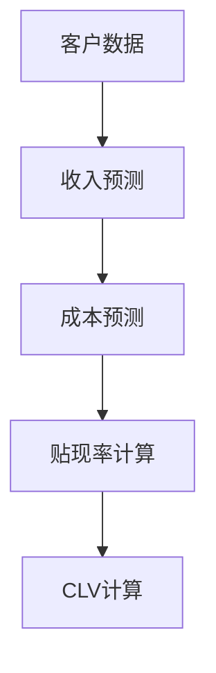
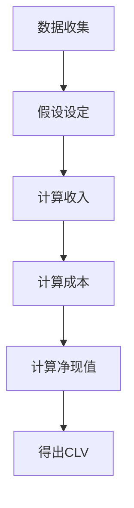
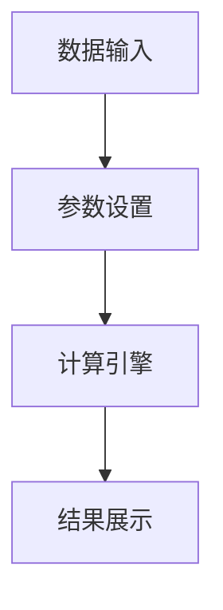
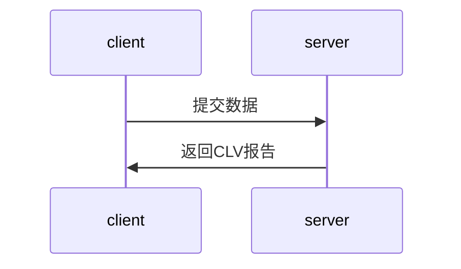

                 


# 企业估值中的客户终身价值计算

> **关键词**：客户终身价值（CLV）、企业估值、SaaS、订阅制、数据分析  
>
> **摘要**：客户终身价值（Customer Lifetime Value，CLV）是企业在评估客户价值时的重要指标，尤其在订阅制商业模式中，CLV帮助企业确定客户的长期价值，从而优化市场策略和资源分配。本文从CLV的基本概念出发，结合企业估值的核心逻辑，详细探讨CLV的计算方法、数学模型、系统架构设计及实际应用案例，为企业在客户价值评估中提供深度技术指导。

---

## 第一部分：客户终身价值（CLV）的背景与基础

### 第1章：客户终身价值（CLV）概述

#### 1.1 客户终身价值的核心概念

客户终身价值（CLV）是指一个客户在其生命周期内为企业带来的总收入减去相关成本后的净现值。它是企业评估客户长期价值的重要指标，尤其适用于订阅制、SaaS（软件即服务）等商业模式。

**1.1.1 什么是客户终身价值（CLV）**

- **定义**：CLV = （客户生命周期内的总收入 - 客户生命周期内的总成本） / 折现率  
- **核心目标**：帮助企业识别高价值客户，优化市场推广和客户维护策略。

**1.1.2 CLV在企业估值中的重要性**

- CLV帮助企业量化客户价值，指导市场预算分配。
- 通过分析客户生命周期，优化客户获取和保留成本。

**1.1.3 CLV与企业利润的关系**

- CLV是企业长期盈利能力的关键指标。
- 高CLV客户能为企业带来持续的收入和利润。

#### 1.2 客户终身价值的计算方法

- **简单计算模型**：适用于小型企业或数据不足的情况。
- **复杂计算模型**：基于客户行为数据，考虑客户流失率、收入增长等因素。

---

### 第2章：客户终身价值的核心概念与联系

#### 2.1 CLV的核心要素

- **收入（Revenue）**：客户在生命周期内为企业带来的总收入。
- **成本（Cost）**：获取和维护客户的总成本。
- **时间价值（Time Value）**：现金流的时间价值，考虑资金的时间成本。

#### 2.2 不同模型的对比分析

| 模型       | 适用场景                   | 优缺点                         |
|------------|---------------------------|----------------------------------|
| 简单模型   | 数据不足或初步估算           | 简单易用，但精度有限             |
| 复杂模型   | 数据充足且需高精度预测       | 精度高，但计算复杂               |
| 混合模型   | 综合考虑数据和计算复杂度     | 平衡精度和计算复杂度             |

#### 2.3 数据关系与流程图



---

## 第二部分：客户终身价值（CLV）的算法原理

### 第3章：CLV的计算步骤与数学模型

#### 3.1 数据收集与假设设定

- **数据收集**：收入、成本、客户流失率、贴现率等。
- **假设设定**：客户生命周期长度、收入增长率、客户流失率等。

#### 3.2 计算步骤



#### 3.3 数学模型与公式

**3.3.1 简单模型公式**

$$ CLV = \frac{ARPU \times (1 - 客户流失率)}{贴现率} $$

其中，ARPU是每用户平均收入。

**3.3.2 复杂模型公式**

$$ CLV = \sum_{t=1}^{n} \frac{ARPU_t - 成本_t}{(1 + 贴现率)^t} $$

---

## 第三部分：系统分析与架构设计

### 第4章：CLV计算系统的架构设计

#### 4.1 问题场景与系统功能设计

- **问题场景**：如何通过系统化方法计算CLV，优化企业估值。
- **系统功能设计**：
  - 数据输入模块：收集客户数据。
  - 参数设置模块：设定贴现率、客户流失率等参数。
  - 计算引擎模块：执行CLV计算。
  - 结果展示模块：输出CLV报告。

#### 4.2 系统架构设计



#### 4.3 接口设计与交互流程



---

## 第四部分：项目实战与案例分析

### 第5章：CLV计算的项目实战

#### 5.1 环境安装与数据准备

- **环境安装**：安装Python、Pandas、Numpy等工具。
- **数据准备**：收集客户交易数据、成本数据等。

#### 5.2 核心代码实现

```python
import pandas as pd
import numpy as np

def calculate_clv(revenue, cost, retention_rate, discount_rate, period):
    clv = 0
    for t in range(period):
        clv += (revenue * (retention_rate ** t) - cost * (retention_rate ** t)) / (1 + discount_rate) ** t
    return clv

revenue = 100
cost = 50
retention_rate = 0.8
discount_rate = 0.1
period = 5

clv = calculate_clv(revenue, cost, retention_rate, discount_rate, period)
print(f"CLV: {clv}")
```

#### 5.3 案例分析与解读

- **案例分析**：以一家SaaS公司为例，计算其CLV。
- **结果解读**：分析CLV对企业估值的影响。

---

## 第五部分：最佳实践与总结

### 第6章：CLV计算的最佳实践

#### 6.1 经验总结

- 数据质量是CLV计算的关键。
- 模型选择需根据企业实际情况。

#### 6.2 注意事项

- 定期更新模型参数。
- 考虑客户行为的变化。

#### 6.3 拓展阅读

- 《客户价值管理》
- 《企业估值分析》

---

## 作者：AI天才研究院/AI Genius Institute & 禅与计算机程序设计艺术/Zen And The Art of Computer Programming

---

**总结**：本文从理论到实践，详细探讨了客户终身价值（CLV）的计算方法、数学模型和系统架构设计，为企业估值提供了深度技术指导。通过案例分析和最佳实践，帮助读者更好地理解和应用CLV，提升企业价值评估的准确性。

