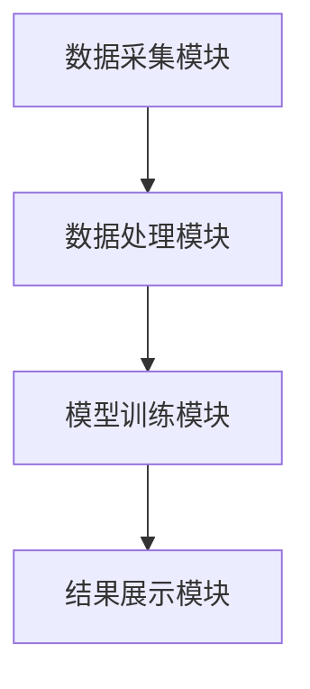

                 


# 企业估值中的客户终身价值评估

> 关键词：客户终身价值（CLV）、企业估值、数据科学、预测模型、系统架构、Python编程

> 摘要：客户终身价值（CLV）是企业在评估客户价值和制定商业策略时的重要指标。本文将详细探讨CLV的计算方法、系统架构设计、预测模型实现以及实际应用案例。通过结合数据科学和系统设计，本文旨在帮助企业更好地理解和应用CLV，提升企业估值和客户管理能力。

---

## 第一部分：客户终身价值（CLV）的基本概念

### 1.1 客户终身价值（CLV）的定义与重要性

客户终身价值（Customer Lifetime Value，CLV）是指一个客户在其与企业互动的整个生命周期中为企业带来的总收益。CLV不仅仅是一个简单的数值，它反映了客户对企业长期价值的贡献，是企业制定客户管理策略的重要依据。

- **定义**：CLV = (客户平均收入 - 客户获取成本) * 客户生命周期长度
- **重要性**：
  - 帮助企业识别高价值客户，优化资源分配。
  - 为定价策略、市场推广和客户维护提供数据支持。
  - 提供客户流失预警，降低客户获取成本。

### 1.2 客户生命周期与CLV的关系

客户生命周期（Customer Lifecycle）是指客户从初次接触企业到最终失去兴趣或终止关系的整个过程。CLV与客户生命周期密切相关，不同阶段的客户对企业的价值贡献不同。

- **客户生命周期的阶段划分**：
  1. **引入期**：客户首次接触企业，可能尚未产生购买行为。
  2. **成长期**：客户开始频繁购买，逐渐成为忠实客户。
  3. **成熟期**：客户稳定消费，成为企业的核心客户。
  4. **衰退期**：客户逐渐减少购买频率，最终可能流失。

- **CLV与客户生命周期的关系**：
  - CLV的计算需要考虑客户在各个阶段的消费行为和价值贡献。
  - 通过分析客户生命周期，企业可以识别高潜力客户，提前采取措施提升客户价值。

### 1.3 CLV与传统估值方法的对比

传统的企业估值方法通常基于财务指标（如收入、利润）进行评估，而CLV则从客户视角出发，考虑客户对企业长期价值的贡献。

- **传统估值方法的局限性**：
  - 忽视客户个体差异，无法精准评估客户价值。
  - 无法预测客户未来行为，导致估值不够准确。

- **CLV的优势与适用场景**：
  - 能够量化客户对企业的长期价值，为精准营销提供依据。
  - 适用于客户细分和个性化服务策略的制定。

---

## 第二部分：客户终身价值（CLV）的计算方法

### 2.1 CLV的核心公式与变量

CLV的计算公式可以根据客户的历史数据和预测模型进行估算。以下是CLV的核心公式：

$$ CLV = \frac{R - C}{1 - d} $$

其中：
- \( R \)：客户年收入贡献
- \( C \)：客户获取成本
- \( d \)：贴现率

### 2.2 数据收集与处理

为了准确计算CLV，企业需要收集和处理以下数据：

- **数据来源**：
  - 销售记录：客户的购买频率、金额等。
  - 客户信息：客户的基本信息、联系方式等。
  - 市场活动数据：市场推广活动、优惠券使用情况等。

- **数据清洗与预处理**：
  - 去除重复数据和异常值。
  - 填补缺失值，进行数据标准化。

### 2.3 CLV的预测模型

预测模型是CLV计算的核心部分，常用的预测方法包括回归分析和时间序列分析。

- **回归分析**：
  - 使用历史数据建立客户收入和流失概率的回归模型。
  - 预测客户在未来一段时间内的收入贡献。

- **时间序列分析**：
  - 基于客户的历史消费行为，预测未来的收入贡献。

### 2.4 系统架构设计

为了实现CLV的计算和应用，企业需要构建一个高效的系统架构。

- **系统功能设计**：
  1. 数据采集模块：负责收集客户数据。
  2. 数据处理模块：清洗和预处理数据。
  3. 模型训练模块：建立预测模型。
  4. 结果展示模块：输出CLV报告。

- **系统架构图**：
  ```mermaid
  graph TD
      A[数据采集模块] --> B[数据处理模块]
      B --> C[模型训练模块]
      C --> D[结果展示模块]
  ```

---

## 第三部分：客户终身价值（CLV）评估的系统架构

### 3.1 系统功能设计

- **数据采集模块**：
  - 从数据库、API等来源获取客户数据。
  - 支持多种数据格式的导入。

- **数据处理模块**：
  - 数据清洗：去除无效数据。
  - 数据转换：将数据标准化，便于后续处理。

- **模型训练模块**：
  - 基于历史数据训练预测模型。
  - 使用回归分析或时间序列分析进行预测。

- **结果展示模块**：
  - 生成CLV报告，展示客户价值分布。
  - 提供可视化图表，便于决策者理解。

### 3.2 系统架构图



### 3.3 接口设计与交互流程图

- **接口设计**：
  - API接口：提供CLV计算的RESTful API。
  - 数据接口：支持CSV、JSON等格式的数据导入。

- **交互流程图**：
  ```mermaid
  sequenceDiagram
      client ->>+ server: 请求CLV计算
      server ->> client: 响应CLV报告
  ```

---

## 第四部分：客户终身价值（CLV）评估的项目实战

### 4.1 环境安装与配置

- **安装Python**：
  ```bash
  python --version
  ```

- **安装依赖库**：
  ```bash
  pip install pandas numpy scikit-learn
  ```

### 4.2 核心代码实现

- **数据加载与处理**：
  ```python
  import pandas as pd

  # 加载数据
  df = pd.read_csv('customer_data.csv')

  # 数据清洗
  df.dropna(inplace=True)
  ```

- **模型训练**：
  ```python
  from sklearn.linear_model import LinearRegression

  # 训练回归模型
  model = LinearRegression()
  model.fit(X_train, y_train)
  ```

### 4.3 实际案例分析

- **案例背景**：
  某电商企业希望通过CLV评估客户价值，优化营销策略。

- **数据分析**：
  - 计算客户平均收入贡献：$R = \$100$
  - 计算客户获取成本：$C = \$50$
  - 贴现率：$d = 0.05$

- **CLV计算**：
  $$ CLV = \frac{100 - 50}{1 - 0.05} = \frac{50}{0.95} \approx \$52.63 $$

### 4.4 项目小结

- **经验总结**：
  - 数据质量对CLV计算至关重要。
  - 模型选择应根据实际业务需求调整。

- **改进建议**：
  - 引入机器学习算法提升预测精度。
  - 定期更新模型，适应市场变化。

---

## 第五部分：最佳实践与注意事项

### 5.1 数据质量的重要性

- 数据的完整性和准确性直接影响CLV计算的准确性。
- 建议企业定期清洗数据，确保数据质量。

### 5.2 模型选择与优化

- 根据业务需求选择合适的预测模型。
- 定期验证模型准确性，及时优化。

### 5.3 持续监控与反馈

- 定期评估CLV，跟踪客户行为变化。
- 根据反馈调整营销策略，提升客户价值。

### 5.4 伦理与隐私考虑

- 在数据收集和处理过程中，必须遵守相关法律法规，保护客户隐私。

---

## 结语

客户终身价值（CLV）是企业估值中的重要指标，通过科学的计算方法和系统架构设计，企业可以更精准地评估客户价值，优化资源分配。希望本文的分析和案例能够为读者提供有价值的参考。

---

**作者：AI天才研究院/AI Genius Institute & 禅与计算机程序设计艺术 /Zen And The Art of Computer Programming**

