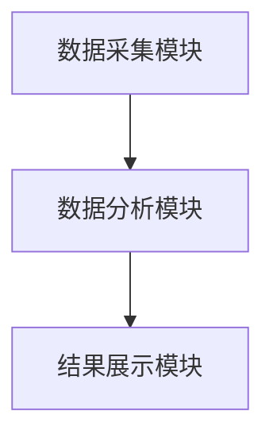

                 


# 企业估值中的客户获取成本分析

## 关键词：客户获取成本（CAC）、企业估值、数据分析、机器学习、系统架构

## 摘要：客户获取成本（CAC）是企业在吸引和保留客户过程中所花费的所有费用之和，是企业估值中的关键指标。本文详细分析了CAC的定义、计算方法、行业应用、算法实现、系统架构设计以及项目实战，旨在帮助企业更好地理解和优化CAC，提升企业估值。

---

## 第1章: 客户获取成本（CAC）的基本概念

### 1.1 CAC的定义与背景

#### 1.1.1 什么是客户获取成本
客户获取成本（Customer Acquisition Cost，CAC）是指企业为了吸引一位新客户所支付的所有直接和间接费用。这些费用包括广告支出、销售团队的薪酬、市场推广活动的成本等。CAC是企业评估市场活动效率和投资回报的重要指标。

#### 1.1.2 CAC在企业估值中的重要性
CAC的高低直接影响企业的盈利能力。如果CAC高于客户的生命周期价值（Customer Lifetime Value, CLV），企业将无法实现长期盈利。因此，合理控制CAC是企业估值和可持续发展的重要前提。

#### 1.1.3 CAC的计算公式与应用场景
CAC的计算公式为：
$$CAC = \frac{\text{营销和销售总支出}}{\text{新增客户数量}}$$

CAC的应用场景包括：评估营销活动的效果、优化市场预算分配、评估不同渠道的获客成本差异等。

### 1.2 CAC的核心要素

#### 1.2.1 CAC的构成要素
CAC的构成要素包括：
1. 营销费用：广告支出、内容营销、SEO优化等。
2. 销售费用：销售团队薪酬、客户关系管理工具费用等。
3. 其他费用：市场活动费用、客服支持费用等。

#### 1.2.2 CAC与客户生命周期的关系
客户生命周期包括获取、激活、留存、增长和流失五个阶段。CAC主要用于衡量获取阶段的成本，而客户生命周期价值（CLV）则衡量客户在企业生命周期中为企业带来的总收入。

#### 1.2.3 CAC与企业盈利能力的关联
企业净利润率与CAC的关系为：
$$\text{净利润率} = \frac{\text{总收入} - \text{总成本}}{\text{总收入}}$$
其中，CAC是总成本的重要组成部分。

---

## 第2章: CAC的分析方法与框架

### 2.1 数据收集与处理

#### 2.1.1 数据来源与采集方式
CAC的分析需要收集以下数据：
1. 营销和销售支出数据。
2. 客户获取渠道数据。
3. 客户行为数据。
4. 财务数据。

#### 2.1.2 数据清洗与预处理
数据清洗步骤包括：去除重复数据、处理缺失值、异常值剔除等。

#### 2.1.3 数据分析工具与技术
常用工具包括：Excel、SQL、Python、R等。

### 2.2 CAC的计算与模型构建

#### 2.2.1 CAC计算的数学模型
CAC的计算公式为：
$$CAC = \frac{\sum \text{营销支出} + \sum \text{销售支出}}{\text{新增客户数量}}$$

#### 2.2.2 CAC与收入、利润的关系
企业净利润率公式：
$$\text{净利润率} = \frac{\text{总收入} - \text{总成本}}{\text{总收入}}$$
其中，总成本包括CAC、运营成本等。

#### 2.2.3 CAC的动态变化分析
通过时间序列分析，可以观察CAC在不同时间段的变化趋势，帮助识别营销活动的效果和市场变化的影响。

### 2.3 CAC分析的行业案例

#### 2.3.1 不同行业的CAC特点
不同行业的CAC差异较大。例如，SaaS行业的CAC可能较低，而高端制造业的CAC可能较高。

#### 2.3.2 行业标杆企业的CAC分析
以某标杆企业为例，分析其CAC计算方法、行业对比及优化措施。

#### 2.3.3 行业趋势对CAC的影响
行业趋势如技术进步、市场需求变化等都会影响CAC的变化。

---

## 第3章: CAC的算法原理与实现

### 3.1 CAC的统计分析方法

#### 3.1.1 回归分析在CAC中的应用
线性回归模型用于分析CAC与收入、利润之间的关系。例如：
$$y = \beta_0 + \beta_1 x + \epsilon$$
其中，y为净利润率，x为CAC。

#### 3.1.2 时间序列分析与CAC预测
使用ARIMA模型预测未来CAC的变化趋势。

#### 3.1.3 聚类分析与客户分群
通过聚类分析，将客户分为不同群组，分析各群组的CAC差异。

### 3.2 基于机器学习的CAC分析

#### 3.2.1 线性回归模型
使用Python代码实现线性回归模型，预测CAC与收入的关系。

#### 3.2.2 随机森林与决策树模型
随机森林和决策树模型可用于分类问题，如区分高CAC和低CAC的客户群。

#### 3.2.3 神经网络模型的应用
使用神经网络模型对CAC进行深度学习，预测未来趋势。

### 3.3 算法实现与代码示例

#### 3.3.1 Python代码实现
```python
import pandas as pd
import numpy as np
from sklearn.linear_model import LinearRegression
from sklearn.metrics import mean_squared_error

# 数据准备
data = pd.DataFrame({
    'CAC': [100, 150, 200, 250],
    'Revenue': [500, 600, 700, 800]
})

# 模型训练
model = LinearRegression()
model.fit(data[['CAC']], data['Revenue'])

# 预测
predicted_revenue = model.predict(data[['CAC']])
print('预测收入:', predicted_revenue)
print('均方误差:', mean_squared_error(data['Revenue'], predicted_revenue))
```

#### 3.3.2 数据预处理与特征工程
数据预处理包括标准化、特征选择等步骤，以提高模型的准确性。

#### 3.3.3 模型训练与评估
通过交叉验证评估模型的性能，选择最优模型。

---

## 第4章: CAC的系统架构与设计

### 4.1 系统功能设计

#### 4.1.1 数据采集模块
负责收集营销支出、销售支出、客户数据等信息。

#### 4.1.2 数据分析模块
对数据进行清洗、建模和分析，输出CAC结果。

#### 4.1.3 结果展示模块
以可视化形式展示CAC分析结果，便于决策者理解和应用。

### 4.2 系统架构设计

#### 4.2.1 模块划分与交互流程
系统分为数据采集、数据分析、结果展示三个模块，模块之间通过API进行交互。

#### 4.2.2 系统架构图


#### 4.2.3 接口设计与数据流
接口设计包括数据输入接口、模型调用接口和结果输出接口。

### 4.3 系统实现与优化

#### 4.3.1 系统性能优化
通过分布式计算、缓存优化等技术提升系统的处理能力。

#### 4.3.2 数
---

## 第5章: 项目实战与案例分析

### 5.1 环境安装与配置

#### 5.1.1 安装Python和相关库
安装Python和Pandas、Scikit-learn等库，准备开发环境。

#### 5.1.2 数据集准备
收集并整理企业的营销支出、销售支出和客户数据，构建分析数据集。

### 5.2 核心实现与代码解读

#### 5.2.1 数据预处理
```python
import pandas as pd
import numpy as np

# 数据加载
data = pd.read_csv('customer_acquisition.csv')

# 数据清洗
data.dropna(inplace=True)
data = data[~data.duplicated('client_id')]
```

#### 5.2.2 模型训练与评估
```python
from sklearn.model_selection import train_test_split
from sklearn.linear_model import LinearRegression
from sklearn.metrics import r2_score

# 数据分割
X = data[['marketing_cost', 'sales_cost']]
y = data['CAC']

X_train, X_test, y_train, y_test = train_test_split(X, y, test_size=0.2)

# 模型训练
model = LinearRegression()
model.fit(X_train, y_train)

# 预测与评估
y_pred = model.predict(X_test)
print('R² Score:', r2_score(y_test, y_pred))
```

### 5.3 案例分析与结果解读

#### 5.3.1 案例分析
以某企业为例，分析其CAC计算结果、行业对比及优化建议。

#### 5.3.2 结果解读
通过分析模型输出的结果，帮助企业识别高成本渠道，优化营销策略。

### 5.4 项目小结

#### 5.4.1 项目总结
总结项目实施过程中的关键步骤和成果，强调系统架构和算法优化的重要性。

#### 5.4.2 项目优化建议
提出进一步优化的建议，如引入更复杂的机器学习模型、优化数据采集流程等。

---

## 第6章: 最佳实践与小结

### 6.1 最佳实践

#### 6.1.1 数据质量管理
确保数据的准确性和完整性，是CAC分析的基础。

#### 6.1.2 模型选择与优化
根据具体业务需求选择合适的模型，并不断优化模型性能。

#### 6.1.3 结果可视化与汇报
通过可视化工具将分析结果清晰地呈现给决策者，便于理解和应用。

### 6.2 小结

#### 6.2.1 CAC分析的核心要点
CAC是企业估值的重要指标，其计算和分析需要结合企业的实际情况，综合运用多种方法和技术。

#### 6.2.2 未来研究方向
未来可以研究CAC与客户忠诚度、市场趋势的关系，探索更先进的分析方法和技术。

---

## 作者：AI天才研究院/AI Genius Institute & 禅与计算机程序设计艺术 /Zen And The Art of Computer Programming

