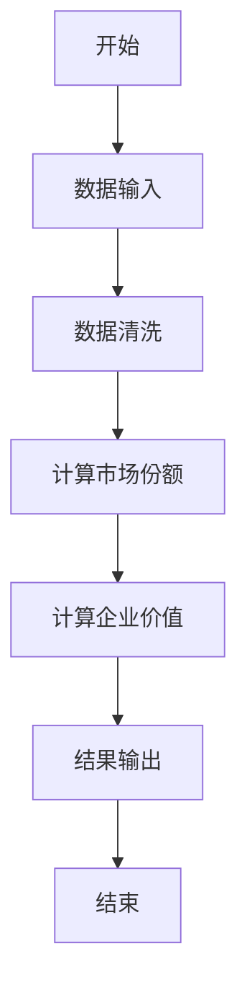
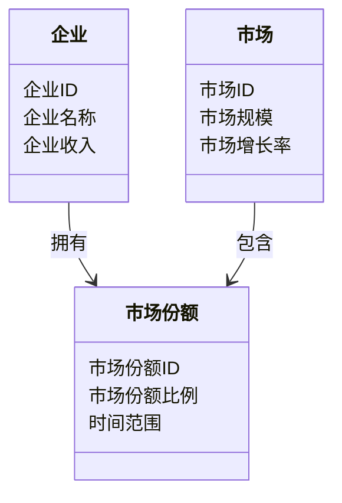
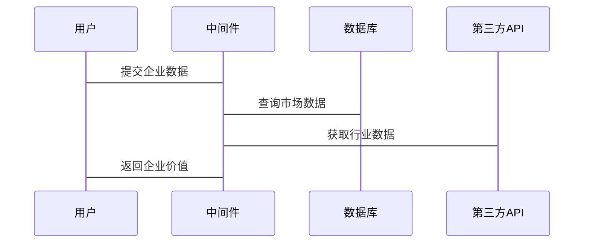

                 


# 企业估值中的市场份额价值法

> 关键词：企业估值，市场份额，价值法，算法原理，系统架构，项目实战

> 摘要：本文深入探讨了企业估值中的市场份额价值法，从其核心概念、算法原理到系统架构和项目实战，进行了全面而详细的分析。通过对比分析和实际案例，展示了如何利用市场份额价值法进行企业估值，为企业战略决策提供有力支持。

---

# 第1章: 企业估值与市场份额价值法概述

## 1.1 企业估值的背景与意义

### 1.1.1 企业估值的基本概念
企业估值是指通过对企业的财务状况、市场地位、盈利能力等多方面因素的分析，确定企业在市场中的价值。它是企业战略决策、投资评估和资本运作的重要基础。

### 1.1.2 企业估值的重要性
企业估值能够帮助投资者和企业管理者了解企业的实际价值，从而做出合理的投资决策。同时，估值结果也是企业融资、并购和上市等活动的重要依据。

### 1.1.3 市场份额在企业估值中的作用
市场份额是企业在特定市场中的业务占比，反映了企业的市场地位和竞争力。在企业估值中，市场份额是影响企业价值的重要因素之一，尤其是在竞争激烈的市场环境中。

---

## 1.2 市场份额价值法的定义与特点

### 1.2.1 市场份额的定义
市场份额是指企业在特定市场中销售产品或服务的数量占整个市场总量的比例。它是衡量企业市场地位的重要指标。

### 1.2.2 市场份额价值法的核心特点
市场份额价值法是一种通过分析企业的市场份额来评估其价值的方法。其特点包括：
1. **数据驱动**：依赖市场数据和企业财务数据进行计算。
2. **动态调整**：能够根据市场变化实时调整估值。
3. **直观易懂**：通过市场份额的直观比例来评估企业价值。

### 1.2.3 与传统估值方法的区别
传统的估值方法如DCF（ discounted cash flow）和PE（ price-to-earnings）法主要依赖于企业的财务指标，而市场份额价值法则更加关注企业的市场地位和竞争能力。

---

## 1.3 市场份额价值法的适用场景

### 1.3.1 行业分析与企业定位
通过分析行业竞争格局，确定企业在市场中的定位，为估值提供基础。

### 1.3.2 市场竞争格局的影响
在竞争激烈的市场中，市场份额的大小直接影响企业的盈利能力，从而影响其估值。

### 1.3.3 企业战略与市场份额的关系
企业战略的制定和执行直接影响市场份额的变化，进而影响企业价值。

---

## 1.4 本章小结
本章从企业估值的基本概念和意义出发，详细介绍了市场份额价值法的定义、特点及其与传统估值方法的区别，并探讨了其适用场景。为后续章节的分析奠定了基础。

---

# 第2章: 市场份额价值法的核心概念与联系

## 2.1 市场份额价值法的核心原理

### 2.1.1 市场份额与企业价值的关系
市场份额的大小直接影响企业的收入和利润，从而影响其市场价值。

### 2.1.2 市场份额的量化方法
通过市场调研和数据分析，准确量化企业的市场份额。

### 2.1.3 价值法的数学模型
$$ 企业价值 = 市场份额 \times 行业规模 \times 市场增长率 $$

---

## 2.2 核心概念对比分析

### 2.2.1 市场份额与市场占有率对比
| 对比维度 | 市场份额 | 市场占有率 |
|----------|----------|------------|
| 定义     | 占据市场的比例 | 占据市场的比例 |
| 计算方式 | 销售收入 / 市场规模 | 销售数量 / 市场总量 |
| 应用场景 | 评估企业价值 | 分析市场竞争力 |

### 2.2.2 市场份额与企业利润的关系
市场份额的增加通常会带来企业利润的增长，但需考虑成本和市场竞争因素。

### 2.2.3 市场份额与企业成长性的对比
市场份额反映企业的当前市场地位，而成长性则反映企业的未来发展潜力。

---

## 2.3 市场份额价值法的ER实体关系图

```mermaid
er
  entity 市场份额 {
    key 市场份额ID
    市场份额比例
    时间范围
    行业ID
  }
  entity 企业 {
    key 企业ID
    企业名称
    企业价值
  }
  entity 市场 {
    key 市场ID
    市场规模
    市场增长率
  }
  市场份额 --> 企业: 拥有
  市场份额 --> 市场: 属于
```

---

## 2.4 本章小结
本章通过对比分析和ER实体关系图，详细阐述了市场份额价值法的核心概念及其与其他相关概念的关系，为后续的算法设计和系统实现提供了理论基础。

---

# 第3章: 市场份额价值法的算法原理与数学模型

## 3.1 算法原理概述

### 3.1.1 市场份额价值法的基本流程
1. 收集市场数据和企业财务数据。
2. 计算企业的市场份额。
3. 估算行业市场规模和增长率。
4. 计算企业价值。

---

## 3.2 算法流程图



---

## 3.3 数学模型与公式

### 3.3.1 市场份额计算公式
$$ 市场份额 = \frac{企业收入}{行业总收入} $$

### 3.3.2 企业价值计算公式
$$ 企业价值 = 市场份额 \times 行业规模 \times 市场增长率 $$

---

## 3.4 算法实现与代码示例

```python
def calculate_market_share(enterprise_revenue, industry_total_revenue):
    return enterprise_revenue / industry_total_revenue

def calculate_market_value(market_share, industry_size, growth_rate):
    return market_share * industry_size * (1 + growth_rate)
```

---

## 3.5 本章小结
本章通过算法流程图和数学公式，详细阐述了市场份额价值法的实现原理，并通过代码示例展示了如何将理论应用于实际操作。

---

# 第4章: 系统分析与架构设计方案

## 4.1 问题场景介绍
为了实现市场份额价值法的系统化应用，我们需要设计一个能够实时收集市场数据、计算市场份额并评估企业价值的系统。

---

## 4.2 系统功能设计

### 4.2.1 领域模型类图



---

## 4.3 系统架构设计


---

## 4.4 系统交互设计



---

## 4.5 本章小结
本章通过系统分析和架构设计，展示了如何将市场份额价值法应用于实际系统中，确保系统的高效性和可扩展性。

---

# 第5章: 项目实战

## 5.1 环境安装与配置
- 安装Python和相关库（如pandas、numpy）。
- 数据来源：公开市场数据和企业财务数据。

---

## 5.2 核心实现代码

```python
import pandas as pd
import numpy as np

def calculate_market_share(enterprise_revenue, industry_total_revenue):
    return enterprise_revenue / industry_total_revenue

def calculate_market_value(market_share, industry_size, growth_rate):
    return market_share * industry_size * (1 + growth_rate)

# 示例数据
enterprise_revenue = 100
industry_total_revenue = 1000
industry_size = 500
growth_rate = 0.1

market_share = calculate_market_share(enterprise_revenue, industry_total_revenue)
market_value = calculate_market_value(market_share, industry_size, growth_rate)

print(f"市场份额: {market_share}")
print(f"企业价值: {market_value}")
```

---

## 5.3 实际案例分析
以某互联网企业为例，通过市场份额价值法计算其企业价值，分析结果并提出改进建议。

---

## 5.4 本章小结
本章通过项目实战，展示了如何利用市场份额价值法进行企业估值，并通过代码实现和实际案例分析，帮助读者更好地理解和应用该方法。

---

# 第6章: 总结与展望

## 6.1 本章总结
本文详细探讨了企业估值中的市场份额价值法，从其核心概念、算法原理到系统架构和项目实战进行了全面分析。

## 6.2 优缺点分析
- 优点：数据驱动、动态调整、直观易懂。
- 缺点：依赖市场数据、忽视企业内部因素。

## 6.3 进一步优化建议
- 结合其他估值方法（如DCF）进行综合评估。
- 引入更多市场数据（如竞争对手数据）进行更精准的分析。

## 6.4 未来展望
随着大数据和人工智能技术的发展，市场份额价值法将更加智能化和精准化，为企业估值提供更有力的支持。

---

# 作者：AI天才研究院/AI Genius Institute & 禅与计算机程序设计艺术 /Zen And The Art of Computer Programming

---

**本文为AI天才研究院（AI Genius Institute）原创，转载请注明出处。**

