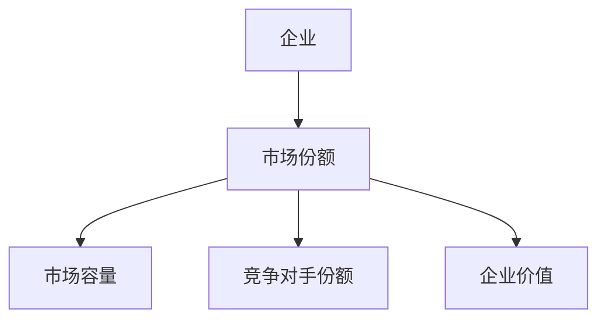
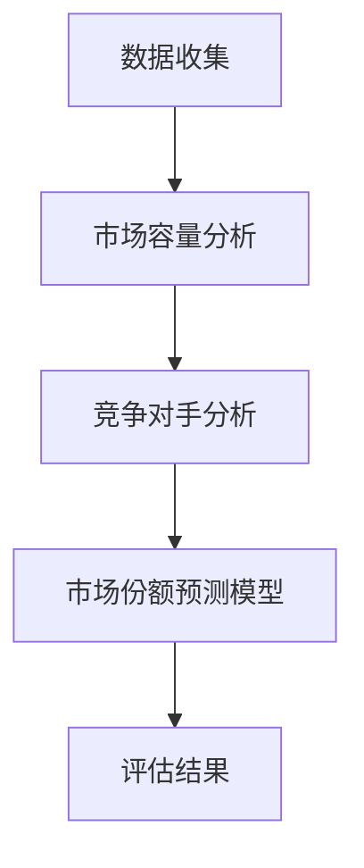

                 

# 《企业估值中的市场份额价值评估》

## 关键词：企业估值、市场份额、市场容量、竞争对手分析、市场份额预测模型、定性评估、定量评估

## 摘要：  
企业估值中的市场份额价值评估是企业在市场中占据的地位和影响力的重要衡量指标。本文将从市场份额的基本概念出发，逐步分析其在企业估值中的应用，探讨如何通过定量与定性相结合的方法进行市场份额的评估，并结合实际案例进行详细解读。通过本篇文章，读者将能够掌握如何利用市场份额信息进行企业估值，为企业战略决策提供有力支持。

---

# 第一部分: 企业估值中的市场份额价值评估基础

---

# 第1章: 市场份额价值评估的背景与概念

## 1.1 企业估值与市场份额的关系

### 1.1.1 企业估值的核心问题
企业估值是企业在市场中价值的量化过程，其核心问题在于如何准确评估企业的市场地位和盈利能力。市场份额是衡量企业市场地位的重要指标，直接影响企业的估值结果。

### 1.1.2 市场份额在企业估值中的地位
市场份额是企业估值的重要组成部分，它反映了企业在特定市场中的竞争力和影响力。通过分析市场份额的变化趋势，可以评估企业的成长潜力和竞争优势。

### 1.1.3 市场份额与企业价值的外延
市场份额不仅与企业的收入和利润相关，还与企业的品牌影响力、客户忠诚度和市场扩展能力密切相关。它是企业价值的重要组成部分，也是企业战略决策的关键依据。

## 1.2 市场份额的基本概念

### 1.2.1 市场份额的定义与计算公式
市场份额是指企业在特定市场中的业务规模占整个市场的比例。其计算公式为：
$$ \text{市场份额} = \frac{\text{企业的销售量/销售额}}{\text{市场的总销售量/销售额}} $$

### 1.2.2 市场份额的影响因素
- 市场需求：市场规模和增长趋势直接影响企业的市场份额。
- 竞争格局：竞争对手的数量、市场份额分布和竞争强度。
- 企业自身能力：产品竞争力、品牌影响力、成本优势等。

### 1.2.3 市场份额与企业价值的关系
市场份额是企业价值的重要组成部分，高市场份额意味着更强的市场地位和更高的盈利能力，从而提升企业的估值。

## 1.3 市场份额价值评估的核心要素

### 1.3.1 市场容量与企业份额的构成
市场容量是整个市场的规模，企业份额是企业在市场中的占比。两者结合可以评估企业的市场影响力。

### 1.3.2 竞争格局与企业份额的关联
竞争格局决定了市场份额的分配，企业通过优化自身竞争力可以提升市场份额。

### 1.3.3 企业份额的动态变化特征
市场份额不是固定不变的，它会随着市场环境、企业战略和竞争态势的变化而波动。

---

## 1.4 本章小结
本章从企业估值的角度介绍了市场份额的基本概念、计算方法及其在企业价值评估中的重要性。通过分析市场份额的影响因素和动态变化特征，为后续的市场份额价值评估奠定了基础。

---

# 第2章: 市场份额价值评估的核心概念与联系

## 2.1 市场份额与企业价值的实体关系图

## 2.2 市场份额预测的流程图

## 2.3 市场份额与财务指标的对比分析

### 2.3.1 行业平均对比
通过对比行业平均水平，可以评估企业的市场份额是否合理。

### 2.3.2 企业与竞争对手的对比
分析企业在行业中的相对位置，发现竞争优势和劣势。

### 2.3.3 财务指标与市场份额的相关性
市场份额与收入、利润等财务指标密切相关，是企业估值的重要参考。

---

## 2.4 本章小结
本章通过实体关系图和流程图，详细阐述了市场份额与企业价值的核心概念及其联系。通过对比分析，进一步明确了市场份额在企业估值中的重要性。

---

# 第3章: 市场份额价值评估的算法原理

## 3.1 市场份额预测的线性回归模型

### 3.1.1 线性回归原理
线性回归是一种统计分析方法，用于预测变量之间的关系。在市场份额预测中，可以利用历史数据建立线性回归模型，预测未来的市场份额变化。

### 3.1.2 模型公式
$$ y = \beta_0 + \beta_1x + \epsilon $$
其中：
- \( y \) 是预测的市场份额
- \( x \) 是影响市场份额的自变量（如市场增长率、竞争对手市场份额等）
- \( \beta_0 \) 和 \( \beta_1 \) 是回归系数
- \( \epsilon \) 是误差项

### 3.1.3 实例分析
假设某企业过去5年的市场份额数据如下：
| 年份 | 市场份额 |
|------|----------|
| 2018 | 20%      |
| 2019 | 22%      |
| 2020 | 24%      |
| 2021 | 26%      |
| 2022 | 28%      |

通过线性回归分析，可以预测2023年的市场份额约为30%。

## 3.2 市场份额的加权平均模型

### 3.2.1 模型原理
加权平均模型是一种简单有效的市场份额预测方法，通过赋予不同时间点的市场份额数据不同的权重，计算预测市场份额。

### 3.2.2 模型公式
$$ y = \frac{\sum w_i x_i}{\sum w_i} $$
其中：
- \( w_i \) 是第i个数据点的权重
- \( x_i \) 是第i个数据点的市场份额
- \( y \) 是预测的市场份额

### 3.2.3 实例分析
假设某企业过去3年的市场份额数据如下：
| 年份 | 市场份额 | 权重 |
|------|----------|------|
| 2020 | 20%      | 0.3  |
| 2021 | 22%      | 0.4  |
| 2022 | 24%      | 0.3  |

预测2023年的市场份额为：
$$ y = \frac{0.3 \times 20\% + 0.4 \times 22\% + 0.3 \times 24\%}{0.3 + 0.4 + 0.3} = 21.8\% $$

---

## 3.3 本章小结
本章介绍了两种常用的市场份额预测模型——线性回归模型和加权平均模型。通过实例分析，展示了如何利用这些模型进行市场份额的定量预测，为企业的估值提供了数据支持。

---

# 第四部分: 实际案例分析与工具应用

---

## 4.1 案例分析：科技公司市场份额评估

### 4.1.1 案例背景
某科技公司计划进行企业估值，需对其在市场中的份额进行评估。

### 4.1.2 数据收集
- 行业市场规模：2022年为100亿元。
- 企业销售额：2022年为20亿元。
- 竞争对手销售额：竞争对手A为30亿元，竞争对手B为25亿元。

### 4.1.3 市场份额计算
$$ \text{市场份额} = \frac{20}{100} = 20\% $$

### 4.1.4 市场份额预测
利用线性回归模型预测未来3年的市场份额分别为22%、24%和26%。

---

## 4.2 工具与技术应用

### 4.2.1 数据收集工具
- 使用爬虫工具（如Python的requests库）获取市场数据。
- 利用行业报告和公开数据进行补充。

### 4.2.2 分析工具
- Excel：进行基础的数据分析和图表绘制。
- Python：使用Pandas和Scikit-learn进行数据处理和建模。

### 4.2.3 建模工具
- 使用Python的Scikit-learn库进行线性回归建模。
- 使用Tableau进行数据可视化。

---

## 4.3 本章小结
通过实际案例分析和工具应用，展示了如何将理论知识应用于实际的企业估值中。数据收集、分析和建模是市场份额评估的重要环节，工具的选择和使用直接影响评估结果的准确性。

---

# 第五部分: 总结与展望

---

## 5.1 总结
本文从企业估值的角度，详细探讨了市场份额的价值评估方法。通过定量与定性的结合，利用线性回归和加权平均模型进行市场份额预测，并结合实际案例进行了分析。这些方法和工具为企业估值提供了有力支持。

## 5.2 展望
未来，随着市场的复杂化和数据技术的进步，市场份额评估将更加依赖于大数据和人工智能技术。企业需要不断优化其评估模型，以适应市场环境的变化，提升估值的准确性。

---

# 作者

**作者：AI天才研究院/AI Genius Institute & 禅与计算机程序设计艺术 /Zen And The Art of Computer Programming**

---

以上是《企业估值中的市场份额价值评估》的完整目录和内容框架。

