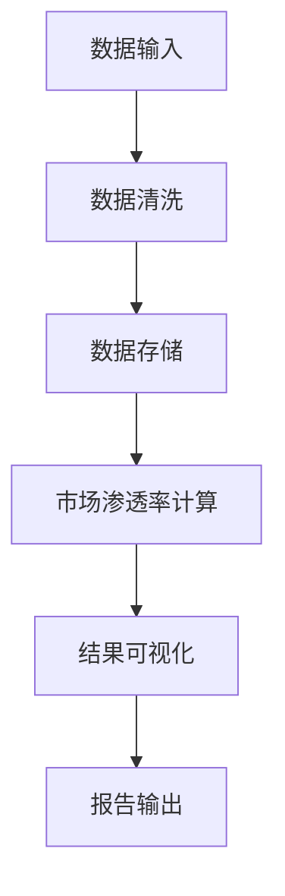

                 


# 企业估值中的市场渗透率分析

## 关键词：
市场渗透率、企业估值、市场分析、竞争分析、企业战略

## 摘要：
市场渗透率是衡量企业在一个市场中占据份额的重要指标，它不仅反映了企业的市场影响力，也揭示了企业产品的普及程度和消费者的接受度。本文将详细探讨市场渗透率的定义、计算方法、影响因素及其在企业估值中的应用。通过分析市场渗透率与企业成长性、竞争力的关系，结合实际案例，本文将为企业提供一种新的估值视角。此外，文章还将介绍市场渗透率的数学模型和系统架构，帮助读者更好地理解和应用这一概念。

---

## 第一部分：市场渗透率的基本概念

### 第1章：市场渗透率的定义与核心要素

#### 1.1 市场渗透率的定义
市场渗透率（Market Penetration Rate）是指企业产品或服务在目标市场中的普及程度，通常表示为该企业在目标市场中所占的份额比例。其计算公式为：
$$ \text{市场渗透率} = \frac{\text{企业市场份额}}{\text{市场容量}} $$

市场渗透率不仅反映了企业当前的市场地位，还预示着未来的增长潜力。一个高市场渗透率的企业通常具有较强的市场影响力和品牌优势，而低市场渗透率的企业则可能有更大的增长空间。

#### 1.2 市场渗透率的核心要素
- **企业市场份额**：企业在目标市场中的实际销售量或用户数量。
- **市场容量**：目标市场的总体规模，包括潜在和实际的消费者数量。
- **市场定位**：企业在目标市场中的定位，包括目标客户、产品定位等。
- **竞争对手情况**：市场中主要竞争对手的数量、市场份额及竞争策略。

#### 1.3 市场渗透率与企业估值的关系
市场渗透率是企业估值的重要参考指标，它直接影响企业的收入、利润和未来的增长潜力。高市场渗透率通常意味着企业已经占据了较大的市场份额，具有更强的定价能力和品牌影响力，从而可能带来更高的估值。

---

### 第2章：市场渗透率的理论模型

#### 2.1 Bass模型
Bass模型是一种常用的市场渗透率预测模型，其基本公式为：
$$ S(t) = \frac{M}{1 + e^{-kt}} $$
其中：
- \( S(t) \) 表示在时间 \( t \) 时的市场渗透率。
- \( M \) 是市场的最大渗透率（通常为100%）。
- \( k \) 是市场渗透率的增长速率常数。

Bass模型可以帮助企业预测市场渗透率的变化趋势，从而制定更科学的市场策略和估值模型。

#### 2.2 市场渗透率的影响因素
市场渗透率受多种因素影响，包括：
- **产品特性**：产品的质量和创新性直接影响消费者的接受度。
- **价格策略**：价格的高低影响目标市场的覆盖范围。
- **市场竞争**：竞争对手的数量和市场份额影响企业的市场渗透率。
- **消费者行为**：消费者的购买习惯和偏好影响市场的接受度。

#### 2.3 市场渗透率的数学公式与计算方法
市场渗透率的计算公式：
$$ \text{市场渗透率} = \frac{\text{企业市场份额}}{\text{市场容量}} $$

例如，假设某企业市场份额为1000万，市场容量为5000万，则市场渗透率为：
$$ \text{市场渗透率} = \frac{1000}{5000} = 20\% $$

---

## 第二部分：市场渗透率在企业估值中的应用

### 第3章：不同行业中的市场渗透率分析

#### 3.1 高科技行业的市场渗透率特点
高科技行业通常具有较高的市场渗透率增长速度。例如，智能手机行业从2010年的不到20%增长到2020年的超过80%。市场渗透率的快速提升反映了技术的快速普及和消费者需求的增加。

#### 3.2 消费行业的市场渗透率分析
在快消品行业，市场渗透率可能较为稳定，但在新兴市场仍有较大的增长空间。例如，某饮料品牌在成熟市场的渗透率为60%，而在新兴市场的渗透率仅为30%，这为企业提供了扩展的机会。

#### 3.3 金融行业的市场渗透率应用
金融行业市场渗透率的分析需要考虑数字化转型的影响。例如，传统银行在数字化服务上的市场渗透率可能较低，而新兴金融科技企业的市场渗透率增长迅速。

---

### 第4章：市场渗透率与企业战略的关系

#### 4.1 市场渗透率对企业战略的影响
- **市场扩张**：高市场渗透率企业可能需要巩固现有市场，而低市场渗透率企业则需要扩大市场覆盖。
- **产品定价**：市场渗透率高的企业可以通过提高价格来增加利润，而市场渗透率低的企业可能需要降低价格以扩大市场份额。

#### 4.2 市场渗透率与企业并购决策
市场渗透率是企业并购的重要考量因素。例如，一家企业可能通过并购一家具有高市场渗透率的企业来快速扩大市场份额。

#### 4.3 市场渗透率与企业创新投资
市场渗透率高的企业可能需要在现有产品的基础上进行改良，而市场渗透率低的企业则需要投入更多的资源进行产品创新。

---

## 第三部分：市场渗透率的系统分析与架构设计

### 第5章：市场渗透率分析的系统架构

#### 5.1 系统功能设计
- **数据采集模块**：收集企业市场份额和市场容量的数据。
- **分析模块**：计算市场渗透率，并使用Bass模型预测渗透率变化。
- **可视化模块**：将分析结果以图表形式展示。

#### 5.2 数据流图


#### 5.3 算法实现
使用Python代码实现Bass模型：
```python
import numpy as np
import matplotlib.pyplot as plt

def bass_model(M, k, t):
    return M / (1 + np.exp(-k*t))

M = 1  # 最大渗透率
k = 0.5  # 增长速率
t = np.arange(0, 20, 1)

penetration = bass_model(M, k, t)
plt.plot(t, penetration)
plt.xlabel('时间（年）')
plt.ylabel('市场渗透率')
plt.show()
```

---

## 第四部分：项目实战

### 第6章：市场渗透率分析的实际案例

#### 6.1 案例背景
以某科技公司为例，假设其市场份额为5000万，市场容量为2亿，市场渗透率为25%。

#### 6.2 数据分析
使用Bass模型预测未来5年的市场渗透率：
$$ S(t) = \frac{1}{1 + e^{-0.5t}} $$

#### 6.3 结果解读
根据模型预测，市场渗透率将在未来5年内逐步接近50%，为企业估值提供依据。

---

## 结论

市场渗透率是企业估值的重要指标，其分析方法和模型可以帮助企业更好地理解市场动态和竞争环境。通过结合市场渗透率的理论模型和实际案例分析，企业可以制定更科学的市场策略和估值模型。未来，随着数据分析技术的不断进步，市场渗透率的分析将更加精准和高效。

---

## 作者：AI天才研究院/AI Genius Institute & 禅与计算机程序设计艺术 /Zen And The Art of Computer Programming

