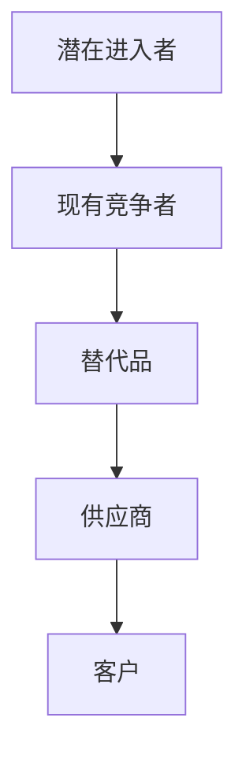
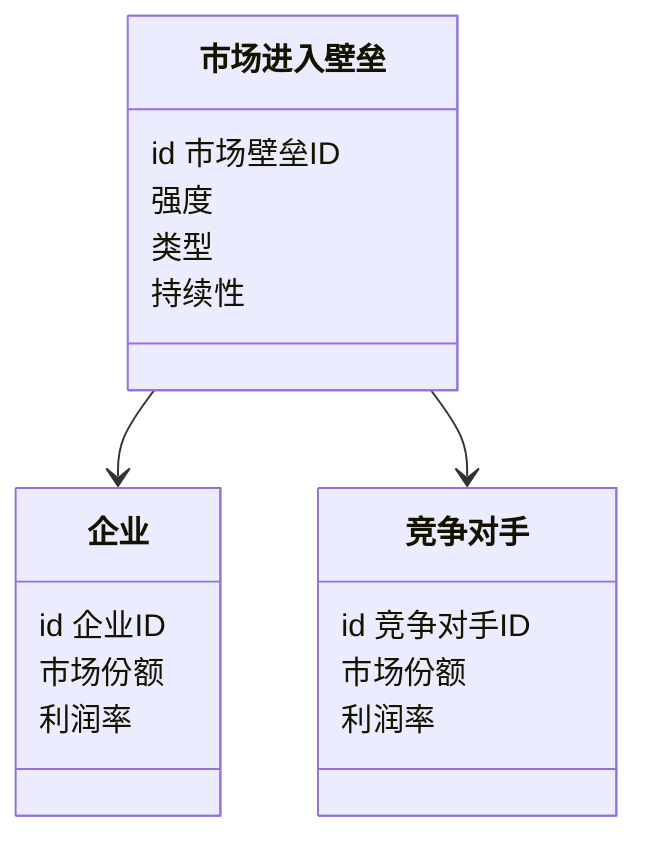
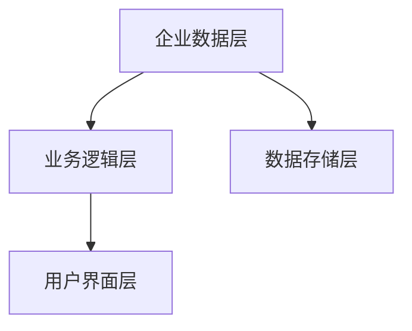

                 


# 企业估值中的市场进入壁垒分析

## 关键词：
企业估值，市场进入壁垒，竞争优势，企业价值，投资决策，商业分析

## 摘要：
市场进入壁垒是企业在特定市场中维持竞争优势的关键因素之一。本文系统地分析了市场进入壁垒的定义、类型及其对企业价值的影响。通过波特五力模型和SWOT分析，本文提供了分析市场进入壁垒的理论框架，并结合数学模型和实际案例，展示了如何将市场进入壁垒纳入企业估值过程中。最后，本文总结了最佳实践和未来研究方向，为投资者和企业管理者提供了实用的指导。

---

## 第1章：市场进入壁垒的基本概念

### 1.1 市场进入壁垒的定义与分类

#### 1.1.1 市场进入壁垒的定义
市场进入壁垒是指企业在进入某个市场时所面临的障碍。这些障碍可能来自技术、资金、法律、品牌、网络效应等多个方面，使得新进入者难以轻松进入市场。

#### 1.1.2 市场进入壁垒的主要分类
市场进入壁垒可以分为以下几类：
1. **技术壁垒**：包括专利、专有技术、复杂的生产流程等。
2. **资金壁垒**：需要大量的资金投入，如固定资产购置、研发支出等。
3. **法律壁垒**：如许可证、法规限制等。
4. **品牌壁垒**：强大的品牌知名度和忠诚度形成的市场优势。
5. **网络效应壁垒**：用户数量越多，平台价值越高，形成正反馈。

#### 1.1.3 市场进入壁垒与企业价值的关系
市场进入壁垒越强，企业面临的竞争压力越小，企业价值通常越高。然而，过高的壁垒可能会限制企业的增长空间，因此需要在壁垒强度和企业灵活性之间找到平衡。

---

### 1.2 市场进入壁垒的重要性

#### 1.2.1 市场进入壁垒对企业竞争能力的影响
市场进入壁垒能够有效防止竞争对手进入市场，从而保护企业的市场份额和利润率。

#### 1.2.2 市场进入壁垒对投资决策的影响
投资者在评估企业时，会关注企业的市场进入壁垒，因为强大的壁垒能够提高企业的防御能力和长期盈利能力。

#### 1.2.3 市场进入壁垒与企业估值的关系
市场进入壁垒是企业估值的重要考量因素。强大的市场进入壁垒能够显著提升企业的估值。

---

## 第2章：市场进入壁垒的核心概念与分析框架

### 2.1 市场进入壁垒的核心要素

#### 2.1.1 市场进入壁垒的构成要素
市场进入壁垒的构成要素包括：
- **技术优势**：企业的核心技术或专利。
- **成本优势**：规模化生产带来的成本优势。
- **品牌优势**：强大的品牌影响力。
- **客户忠诚度**：客户对企业的依赖程度。

#### 2.1.2 市场进入壁垒的属性特征对比
以下是市场进入壁垒主要属性的对比分析表：

| 属性       | 技术壁垒         | 资金壁垒         | 法律壁垒         | 品牌壁垒         | 网络效应壁垒     |
|------------|------------------|------------------|------------------|------------------|------------------|
| 强度       | 高               | 高               | 中               | 中到高           | 高               |
| 持续性     | 长期             | 长期             | 法律变更较快     | 需要长期维护     | 网络效应一旦建立，持续性强 |
| 可模仿性   | 低               | 低               | 中               | 中               | 低               |

#### 2.1.3 市场进入壁垒的ER实体关系图
以下是市场进入壁垒的ER实体关系图：

```mermaid
erd
actor 市场进入壁垒 {
  id 市场壁垒ID
  属性 强度
  属性 类型
  属性 持续性
}

actor 企业 {
  id 企业ID
  属性 市场份额
  属性 利润率
}

market 进入壁垒与企业关系 {
  市场壁垒ID
  企业ID
  关系：影响
}
```

---

### 2.2 市场进入壁垒的分析框架

#### 2.2.1 市场进入壁垒的波特五力模型
波特五力模型是一个经典的竞争分析工具，可以用来分析市场进入壁垒。以下是波特五力模型的mermaid图：



#### 2.2.2 市场进入壁垒的SWOT分析
SWOT分析是一种常用的战略分析工具，可以帮助企业识别市场进入壁垒中的优势、劣势、机会和威胁。以下是SWOT分析的表格示例：

| 维度   | 优势             | 劣势             | 机会             | 威胁             |
|--------|------------------|------------------|------------------|------------------|
| 市场进入壁垒 | 技术壁垒高       | 市场监管严格     | 行业增长潜力大   | 竞争对手强大     |

#### 2.2.3 市场进入壁垒的定量分析方法
定量分析方法包括：
1. **市场份额计算**：通过市场份额的变化率评估市场进入壁垒的影响。
2. **利润率分析**：比较有无市场进入壁垒情况下的利润率差异。

---

## 第3章：市场进入壁垒的数学模型与公式

### 3.1 市场进入壁垒的数学模型

#### 3.1.1 市场进入壁垒对企业价值的影响公式
企业价值的计算公式如下：
$$ V = V_0 \times (1 + \beta \times B) $$
其中，$V$ 表示企业价值，$V_0$ 表示无壁垒情况下的企业价值，$\beta$ 表示市场进入壁垒的影响系数，$B$ 表示市场进入壁垒的强度。

#### 3.1.2 市场进入壁垒对市场份额的影响
市场份额的计算公式为：
$$ S = \frac{B}{B + C} $$
其中，$S$ 表示市场份额，$B$ 表示市场进入壁垒强度，$C$ 表示竞争者的市场进入成本。

---

## 第4章：系统分析与架构设计

### 4.1 项目背景与目标
本项目旨在通过系统分析的方法，评估企业的市场进入壁垒，并为企业估值提供支持。

### 4.2 系统功能设计

#### 4.2.1 领域模型（mermaid类图）
以下是领域模型的mermaid类图：



#### 4.2.2 系统架构设计（mermaid架构图）
以下是系统架构设计的mermaid图：



---

## 第5章：项目实战

### 5.1 环境安装
需要安装的环境包括：
- 数据库：MySQL
- 开发工具：PyCharm
- 依赖库：pandas、numpy

### 5.2 核心实现源代码

#### 5.2.1 数据分析代码
```python
import pandas as pd
import numpy as np

# 示例数据
data = {
    '企业ID': [1, 2, 3],
    '市场壁垒强度': [0.8, 0.5, 0.7],
    '市场份额': [0.6, 0.3, 0.5]
}

df = pd.DataFrame(data)
print(df)
```

#### 5.2.2 市场进入壁垒影响计算
```python
def calculate_market_barriers_impact(enterprise_value, beta, B):
    return enterprise_value * (1 + beta * B)

enterprise_value = 100
beta = 0.2
B = 0.8
impact = calculate_market_barriers_impact(enterprise_value, beta, B)
print(f"市场进入壁垒的影响：{impact}")
```

### 5.3 案例分析

#### 5.3.1 案例背景
假设某科技公司面临较高的技术壁垒，竞争对手较少，市场增长潜力大。

#### 5.3.2 分析过程
1. 计算市场进入壁垒强度 $B = 0.8$
2. 计算企业价值影响：
   $$ V = 100 \times (1 + 0.2 \times 0.8) = 116 $$

---

## 第6章：总结与展望

### 6.1 最佳实践
- 在企业估值时，需综合考虑多种市场进入壁垒因素。
- 定期更新市场进入壁垒分析，以应对市场变化。

### 6.2 注意事项
- 市场进入壁垒的分析需结合实际情况，避免过于理想化。
- 数据的准确性和完整性对分析结果影响重大。

### 6.3 拓展阅读
- 建议阅读《竞争优势：企业战略理论》（迈克尔·波特著）。

---

## 作者：AI天才研究院 & 禅与计算机程序设计艺术

---

以上是《企业估值中的市场进入壁垒分析》的完整内容，涵盖了从理论到实践的各个方面，帮助读者全面理解市场进入壁垒在企业估值中的重要性及应用方法。

