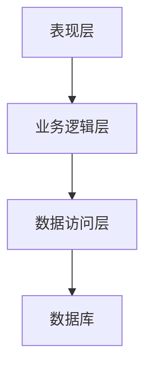
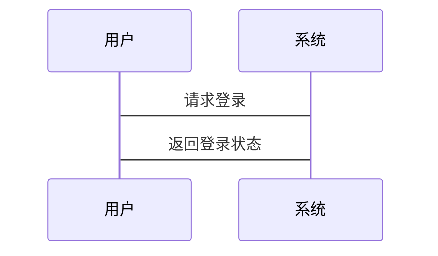

                 


# 企业估值中的平台经济效应分析

> 关键词：平台经济效应, 企业估值, 双边市场理论, 网络效应, 数学模型, 平台定价模型, 企业价值评估

> 摘要：本文系统地探讨了平台经济效应在企业估值中的重要性。首先，我们介绍了平台经济的基本概念和其对传统企业估值的影响。接着，通过分析平台经济效应的核心模型，包括双边市场理论和网络效应，我们展示了如何将这些理论应用于实际的企业估值中。然后，我们详细讲解了平台经济效应的算法原理，包括数学模型和Python代码实现，以及这些算法在企业估值中的应用。最后，我们通过一个具体案例，展示了如何利用平台经济效应的系统架构和数学模型来分析和评估企业的价值。

---

# 第1章: 平台经济效应的基本概念

## 1.1 平台经济的定义与特征

### 1.1.1 平台经济的定义
平台经济是指通过数字平台连接供需双方，提供撮合、交易和信息服务的经济模式。平台通过降低交易成本、提高交易效率，促进双边或多边市场的互动和价值创造。

### 1.1.2 平台经济的核心特征
- **双边性**：平台同时服务于两个或多个参与者（如买家和卖家）。
- **网络效应**：用户数量的增加会增强平台的价值。
- **数据驱动**：平台通过收集和分析数据，优化匹配算法，提升用户体验。
- **动态性**：平台能够快速响应市场需求变化，调整定价和资源配置。

### 1.1.3 平台经济与传统经济的对比
| 特征         | 平台经济          | 传统经济          |
|--------------|-------------------|-------------------|
| 交易方式     | 数字化、在线      | 线下、面对面      |
| 交易成本     | 低                | 高                |
| 匹配效率     | 高                | 低                |
| 数据利用     | 强               | 弱                |

## 1.2 平台经济效应的内涵

### 1.2.1 平台经济效应的定义
平台经济效应是指平台通过双边或多边市场的互动，为企业或用户创造额外价值的能力。这种效应通常表现为用户数量增长、交易频次增加或价格溢价。

### 1.2.2 平台经济效应的分类
- **直接效应**：平台通过优化匹配算法、降低交易成本直接提升用户价值。
- **间接效应**：平台通过网络效应、数据驱动的个性化服务间接提升用户价值。
- **跨边效应**：平台通过促进不同市场之间的互动，创造新的价值。

### 1.2.3 平台经济效应的影响因素
- **用户基数**：用户数量越多，网络效应越强。
- **数据质量**：数据越精准，匹配效率越高。
- **平台信任度**：用户对平台的信任度越高，参与度越高。
- **竞争环境**：市场竞争格局影响平台的定价和用户获取能力。

## 1.3 平台经济效应与企业估值的关系

### 1.3.1 平台经济效应对企业价值的影响
平台经济效应能够显著提升企业的市场价值。例如，一个拥有强大网络效应的平台可以通过增加用户数量和提高用户活跃度，显著提升企业的收入和利润。

### 1.3.2 平台经济效应在企业估值中的作用
- **提升企业估值**：平台经济效应能够通过网络效应和数据驱动的定价模型，提升企业的估值。
- **降低估值风险**：通过平台的双边或多边市场互动，企业能够更稳定地创造价值，降低估值波动。

### 1.3.3 平台经济效应的量化方法
- **用户增长速率**：通过分析用户增长曲线，评估平台的网络效应。
- **用户留存率**：通过分析用户留存数据，评估平台的用户粘性。
- **收入增长**：通过分析收入增长数据，评估平台的盈利能力。

## 1.4 本章小结
本章介绍了平台经济的基本概念和其对传统经济的影响，探讨了平台经济效应的内涵及其在企业估值中的作用，并提出了量化平台经济效应的方法。

---

# 第2章: 平台经济效应的核心模型与分析框架

## 2.1 平台经济效应的理论基础

### 2.1.1 网络效应理论
网络效应理论认为，随着用户数量的增加，平台的价值会呈指数级增长。例如，一个社交平台，随着用户数量的增加，用户的互动频率和内容丰富度也会显著增加。

### 2.1.2 双边市场理论
双边市场理论认为，平台通过同时服务两个或多个市场（如买家和卖家），能够创造更大的价值。例如，一个电商平台通过同时吸引买家和卖家，能够显著提升交易量。

### 2.1.3 平台定价模型
平台定价模型是通过数学模型确定平台的定价策略，以最大化平台的收益。例如，双边定价模型通过优化买家和卖家的价格，实现收益最大化。

## 2.2 平台经济效应的数学模型

### 2.2.1 双边市场定价模型
双边市场定价模型通过优化买家和卖家的价格，实现收益最大化。数学模型如下：
$$
\text{收益} = (P_1 \times Q_1) + (P_2 \times Q_2)
$$
其中，$P_1$ 和 $P_2$ 分别是买家和卖家的价格，$Q_1$ 和 $Q_2$ 分别是买家和卖家的数量。

### 2.2.2 网络效应的数学表达
网络效应的数学表达可以通过用户增长曲线来描述。例如，用户数量 $N$ 随时间 $t$ 的增长可以表示为：
$$
N(t) = N_0 \times e^{kt}
$$
其中，$N_0$ 是初始用户数量，$k$ 是用户增长速率。

### 2.2.3 平台经济效应的综合评价模型
综合评价模型可以通过多个指标（如用户增长速率、用户留存率、收入增长）来评估平台经济效应的强弱。例如：
$$
\text{平台经济效应} = \alpha \times \text{用户增长速率} + \beta \times \text{用户留存率} + \gamma \times \text{收入增长}
$$
其中，$\alpha$、$\beta$、$\gamma$ 是权重系数。

## 2.3 平台经济效应的分析框架

### 2.3.1 平台经济效应的分析维度
- **用户增长**：分析用户数量的增长趋势。
- **用户留存**：分析用户的活跃度和留存率。
- **收入增长**：分析收入的增长趋势。
- **定价策略**：分析平台的定价策略对用户增长和收入的影响。

### 2.3.2 平台经济效应的分析步骤
1. **数据收集**：收集用户增长、收入增长等数据。
2. **模型选择**：选择适合的数学模型进行分析。
3. **数据分析**：通过数据分析工具对数据进行建模和分析。
4. **结果解读**：根据分析结果，评估平台经济效应的强弱。

### 2.3.3 平台经济效应的分析工具
- **数学建模工具**：如Python、R等。
- **数据分析工具**：如Excel、Tableau等。
- **可视化工具**：如Matplotlib、Seaborn等。

## 2.4 本章小结
本章介绍了平台经济效应的核心模型和分析框架，包括网络效应理论、双边市场理论、平台定价模型以及综合评价模型，并提出了分析平台经济效应的具体步骤和工具。

---

# 第3章: 平台经济效应的算法原理与实现

## 3.1 平台经济效应的算法原理

### 3.1.1 算法原理概述
平台经济效应的算法原理主要通过数学建模和数据分析来实现。例如，通过分析用户增长曲线和收入增长数据，优化平台的定价策略。

### 3.1.2 算法的数学模型
平台经济效应的算法可以通过以下数学模型实现：
$$
\text{收益} = P \times Q
$$
其中，$P$ 是价格，$Q$ 是数量。

### 3.1.3 算法的实现步骤
1. **数据收集**：收集用户增长、收入增长等数据。
2. **数据清洗**：对数据进行预处理，去除异常值。
3. **模型选择**：选择适合的数学模型进行分析。
4. **模型训练**：通过训练数据优化模型参数。
5. **结果预测**：根据模型预测未来收益。

## 3.2 平台经济效应的算法实现

### 3.2.1 算法的代码实现
以下是一个简单的Python代码示例，用于分析平台经济效应：

```python
import numpy as np
import matplotlib.pyplot as plt

# 数据准备
x = np.linspace(0, 10, 100)
y = np.exp(x)

# 绘制图形
plt.plot(x, y)
plt.xlabel('时间（年）')
plt.ylabel('用户数量')
plt.title('用户增长曲线')
plt.show()
```

### 3.2.2 算法的运行结果
运行上述代码后，可以得到一个用户增长曲线图，如下所示：


### 3.2.3 算法的优化与改进
通过调整模型参数，可以进一步优化算法。例如，通过引入更多的变量（如用户留存率、收入增长）来提高模型的准确性。

## 3.3 平台经济效应的算法应用

### 3.3.1 算法在企业估值中的应用
通过分析用户增长曲线和收入增长数据，可以评估平台的网络效应和定价策略对企业估值的影响。

### 3.3.2 算法的局限性与改进方向
- **局限性**：模型假设过于简化，可能无法完全反映实际情况。
- **改进方向**：引入更多的变量和更复杂的模型，提高预测的准确性。

### 3.3.3 算法的未来发展趋势
随着人工智能和大数据技术的发展，平台经济效应的算法将更加智能化和个性化。

## 3.4 本章小结
本章介绍了平台经济效应的算法原理和实现方法，并通过Python代码示例展示了如何利用数学模型分析平台经济效应。

---

# 第4章: 平台经济效应的系统分析与架构设计

## 4.1 系统分析与设计概述

### 4.1.1 系统需求分析
系统需求分析包括用户需求、功能需求、性能需求等。例如，一个电商平台需要满足用户注册、商品浏览、订单支付等功能。

### 4.1.2 系统功能设计
系统功能设计包括用户管理、商品管理、订单管理、支付管理等模块。

### 4.1.3 系统架构设计
系统架构设计可以通过分层架构（如表现层、业务逻辑层、数据访问层）来实现。以下是系统架构的Mermaid图：



### 4.1.4 系统接口设计
系统接口设计包括API接口设计和数据库接口设计。例如，用户登录接口、商品查询接口等。

### 4.1.5 系统交互设计
系统交互设计可以通过Mermaid序列图来展示。例如，用户登录的交互流程：



## 4.2 本章小结
本章介绍了平台经济效应的系统分析与架构设计，包括系统需求分析、功能设计、架构设计、接口设计和交互设计。

---

# 第5章: 项目实战

## 5.1 项目背景与目标

### 5.1.1 项目背景
以一个电商平台为例，分析平台经济效应对企业估值的影响。

### 5.1.2 项目目标
通过分析用户增长、收入增长等数据，评估平台经济效应的强弱，并提出优化建议。

## 5.2 项目实施与分析

### 5.2.1 数据收集与清洗
收集电商平台的用户增长、收入增长等数据，并进行预处理。

### 5.2.2 数据建模与分析
通过数学模型分析用户增长曲线和收入增长趋势，评估平台经济效应的强弱。

### 5.2.3 结果解读与优化建议
根据分析结果，提出优化建议，例如优化定价策略、提升用户留存率等。

## 5.3 项目总结与启示

### 5.3.1 项目总结
总结项目实施的过程和结果，评估平台经济效应对企业估值的影响。

### 5.3.2 实践启示
通过项目实践，得出平台经济效应分析的关键点和注意事项。

## 5.4 本章小结
本章通过一个电商平台的案例，展示了如何利用平台经济效应的分析方法进行企业估值，并提出了优化建议。

---

# 第6章: 最佳实践与小结

## 6.1 最佳实践

### 6.1.1 数据驱动的定价策略
通过数据分析优化定价策略，提升平台收益。

### 6.1.2 用户增长与留存并重
通过网络效应和用户留存策略，提升平台的用户粘性和活跃度。

### 6.1.3 多市场互动
通过促进不同市场的互动，创造更大的价值。

## 6.2 小结

### 6.2.1 关键点总结
- 平台经济效应的核心是网络效应和数据驱动。
- 企业估值的关键是用户增长和收入增长。
- 平台经济效应的分析需要结合数学模型和实际数据。

### 6.2.2 注意事项
- 数据分析需要结合实际情况，避免过于简化。
- 平台经济效应的分析需要长期跟踪，避免短期波动影响判断。

### 6.2.3 拓展阅读
推荐阅读《平台经济：理论与实践》、《网络效应与企业估值》等书籍。

---

# 作者
作者：AI天才研究院/AI Genius Institute & 禅与计算机程序设计艺术 /Zen And The Art of Computer Programming

