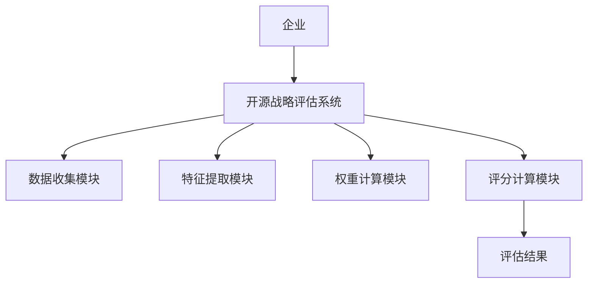

                 


# 企业估值中的开源战略价值评估

> **关键词**：企业估值、开源战略、价值评估、数学模型、Python代码

> **摘要**：本文探讨了开源战略在企业估值中的重要性，分析了开源战略的核心概念、评估方法、系统架构设计，并通过Python代码实现了一个开源价值评估模型，最后总结了最佳实践。

---

## 第一部分：背景与概述

### 第1章：开源战略与企业估值的背景

#### 1.1 开源战略的定义与核心概念

- **开源战略的定义**：开源战略是指企业利用开源技术、社区协作和开放创新来提升自身竞争力和价值的战略。
- **开源战略的核心要素**：
  - 开放性：代码和资源的开放共享。
  - 协作性：社区和合作伙伴的协作开发。
  - 创新性：基于开源的持续创新。

- **开源战略与企业估值的关系**：
  - 开源降低了企业的研发成本。
  - 开源加速了技术迭代，提升了企业市场竞争力。
  - 开源增加了企业的无形资产，如品牌影响力和社区凝聚力。

#### 1.2 开源在企业中的角色演变

- **从技术工具到战略资产的转变**：
  - 早期：开源作为开发工具，辅助企业内部研发。
  - 现阶段：开源成为企业核心竞争力的一部分，融入企业战略。
- **开源对企业核心竞争力的影响**：
  - 技术方面：加速创新，降低技术门槛。
  - 成本方面：降低研发成本，优化资源分配。
  - 市场方面：增强市场影响力，提升品牌价值。

#### 1.3 开源战略对企业价值的具体影响

- **对企业成本结构的优化**：
  - 降低研发成本，减少重复开发。
  - 利用开源社区资源，节省外包成本。
- **对企业创新速度的提升**：
  - 开源协作加速技术开发。
  - 社区反馈快速迭代产品。
- **对企业市场竞争力的增强**：
  - 提升产品透明度，增强用户信任。
  - 扩大生态合作，增强市场影响力。

---

## 第二部分：开源战略的核心概念与联系

### 第2章：开源战略的核心概念与属性

#### 2.1 开源战略的核心原理

- **开放性与协作性**：
  - 开源代码的开放共享促进了协作开发。
  - 社区协作加速了技术创新。
- **模块化与可扩展性**：
  - 开源项目的模块化设计便于企业灵活部署。
  - 可扩展性允许企业根据需求快速调整。
- **透明性与可验证性**：
  - 开源代码的透明性增加了项目的可信任度。
  - 可验证性允许企业对代码进行审查和优化。

#### 2.2 开源战略与其他战略的关系

- **开源战略与企业战略的协同**：
  - 开源战略是企业技术创新和成本优化的重要组成部分。
  - 与企业长期战略目标一致，增强企业核心竞争力。
- **开源战略与技术创新的关系**：
  - 开源战略促进了技术创新的协作和加速。
  - 开源项目为技术创新提供了丰富的资源和经验。
- **开源战略与企业文化的融合**：
  - 开源协作文化与企业文化相互促进。
  - 提升企业内部协作效率，增强员工创新意识。

#### 2.3 开源战略的核心属性对比

| 属性 | 开源 | 闭源 |
|------|------|------|
| 开发模式 | 社区协作 | 企业内部开发 |
| 成本 | 较低 | 较高 |
| 创新速度 | 快 | 较慢 |
| 可扩展性 | 高 | 中 |

---

## 第三部分：开源战略价值评估的数学模型与算法

### 第3章：开源战略价值评估的数学模型

#### 3.1 开源价值的加权公式

$$V = \sum_{i=1}^{n} w_i \cdot x_i$$

其中：
- \(V\) 是企业开源战略的总价值。
- \(w_i\) 是第i个评估维度的权重。
- \(x_i\) 是第i个评估维度的得分。

#### 3.2 开源价值的评估维度

- **技术维度**：代码质量、技术先进性。
- **经济维度**：成本节约、收益提升。
- **法律维度**：合规性、风险可控性。
- **社会维度**：品牌影响力、社区贡献度。

### 第4章：开源战略价值评估的算法原理

#### 4.1 算法流程

1. **数据收集**：收集企业的开源项目数据。
2. **特征提取**：提取技术、经济、法律、社会四个维度的特征。
3. **权重计算**：根据经验或数据分析计算各维度权重。
4. **评分计算**：计算每个维度的得分，加权求和得到总分。

#### 4.2 Python代码实现

```python
import pandas as pd
import numpy as np

# 示例数据：企业开源项目评估
data = {
    '项目名称': ['项目A', '项目B', '项目C'],
    '技术维度': [80, 70, 90],
    '经济维度': [75, 85, 65],
    '法律维度': [90, 80, 85],
    '社会维度': [60, 70, 80]
}

df = pd.DataFrame(data)

# 权重：技术(0.4)、经济(0.3)、法律(0.2)、社会(0.1)
weights = {'技术维度': 0.4, '经济维度': 0.3, '法律维度': 0.2, '社会维度': 0.1}

# 计算总分
df['总分'] = df.apply(lambda row: 
    sum(row[feature] * weights[feature] for feature in weights),
    axis=1
)

print(df)
```

#### 4.3 代码解读与分析

- **数据收集**：收集企业的开源项目数据，包括技术、经济、法律和社会四个维度的评分。
- **特征提取**：提取每个项目的四个维度的评分。
- **权重计算**：根据经验或数据分析，赋予每个维度不同的权重。
- **评分计算**：计算每个项目的加权总分，总分越高，开源战略的价值越大。

---

## 第四部分：系统分析与架构设计方案

### 第4章：系统分析与架构设计方案

#### 4.1 问题场景介绍

- **问题**：企业需要评估开源战略的价值，优化资源配置。
- **目标**：建立一个评估模型，量化开源战略的价值。

#### 4.2 系统功能设计

- **领域模型**：使用Mermaid类图描述系统功能模块。
- **系统架构设计**：使用Mermaid架构图展示系统架构。

#### 4.3 系统架构图



#### 4.4 系统接口设计

- **数据接口**：企业数据输入接口。
- **评估接口**：返回评估结果的接口。

#### 4.5 系统交互图

```mermaid
sequenceDiagram
    actor 企业用户
    system 开源战略评估系统
    企业用户 -> 开源战略评估系统: 提交开源项目数据
    开源战略评估系统 -> 数据收集模块: 收集数据
    数据收集模块 -> 特征提取模块: 提取特征
    特征提取模块 -> 权重计算模块: 计算权重
    权重计算模块 -> 评分计算模块: 计算评分
    评分计算模块 -> 企业用户: 返回评估结果
```

---

## 第五部分：项目实战

### 第5章：项目实战

#### 5.1 环境配置

- **安装Python和必要的库**：
  ```bash
  pip install pandas numpy
  ```

#### 5.2 核心实现

- **数据预处理**：
  ```python
  df = pd.read_csv('project_data.csv')
  ```

- **特征提取与权重计算**：
  ```python
  weights = {'技术维度': 0.4, '经济维度': 0.3, '法律维度': 0.2, '社会维度': 0.1}
  df['总分'] = df[weights.keys()].apply(lambda x: sum(x[i] * weights[i] for i in x.index), axis=1)
  ```

- **评估结果展示**：
  ```python
  print(df.head())
  ```

#### 5.3 案例分析

- **案例背景**：假设企业有两个开源项目，A和B。
- **数据输入**：
  ```csv
  项目名称,技术维度,经济维度,法律维度,社会维度
  项目A,80,75,90,60
  项目B,70,85,80,70
  ```
- **评估结果**：
  - 项目A：总分 = 80*0.4 + 75*0.3 + 90*0.2 + 60*0.1 = 36.5 + 22.5 + 18 + 6 = 83
  - 项目B：总分 = 70*0.4 + 85*0.3 + 80*0.2 + 70*0.1 = 28 + 25.5 + 16 + 7 = 76.5

#### 5.4 项目小结

- 开源战略的价值评估需要综合考虑多个维度。
- 通过数学模型和Python代码，企业可以量化开源战略的价值，优化资源配置。

---

## 第六部分：最佳实践

### 第6章：最佳实践

#### 6.1 小结

- 开源战略是企业估值的重要组成部分。
- 通过数学模型和系统架构设计，企业可以有效评估开源战略的价值。

#### 6.2 注意事项

- 数据质量：确保数据的准确性和完整性。
- 权重调整：根据企业实际情况调整各维度的权重。
- 风险控制：注意开源项目中的法律和合规风险。

#### 6.3 拓展阅读

- 推荐阅读《开源项目管理》和《企业估值分析》。

---

## 作者：AI天才研究院 & 禅与计算机程序设计艺术

---

以上是《企业估值中的开源战略价值评估》的完整内容，涵盖了从背景介绍到项目实战的各个部分，旨在为企业提供开源战略价值评估的理论支持和实践指导。

