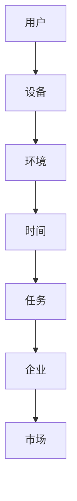
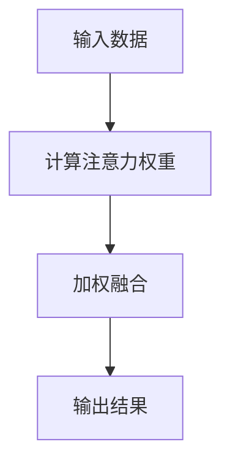
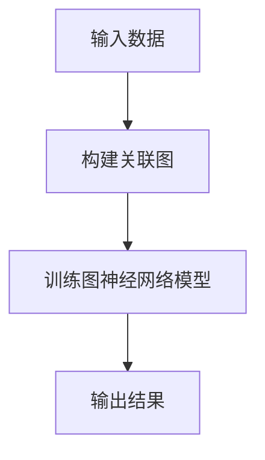
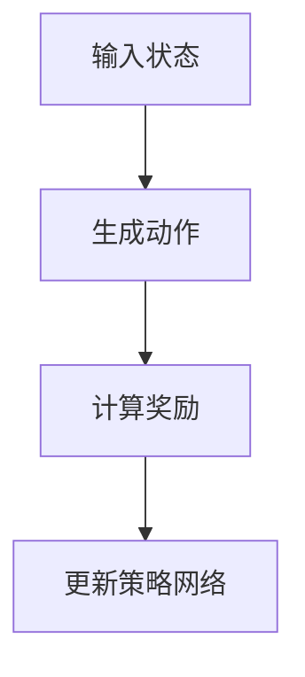
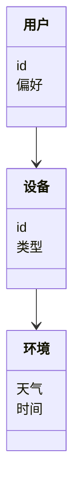
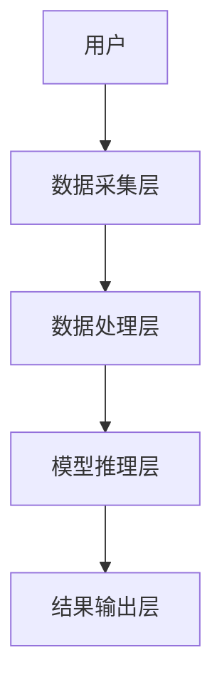
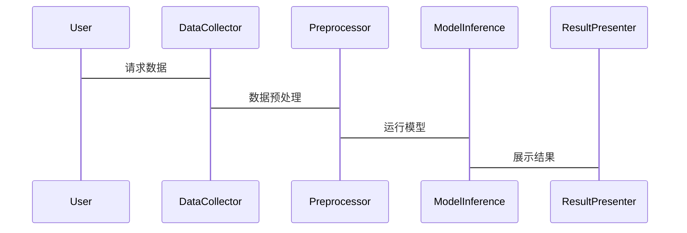

                 


# 企业估值中的情境感知技术应用评估

## 关键词：情境感知技术、企业估值、人工智能、数据驱动决策、技术应用评估、算法原理

## 摘要：本文探讨了情境感知技术在企业估值中的应用，分析了其核心原理、算法设计、系统架构以及实际案例，为企业估值提供了新的视角和方法。

---

# 第一部分: 企业估值中的情境感知技术背景

## 第1章: 情境感知技术与企业估值概述

### 1.1 情境感知技术的基本概念

#### 1.1.1 情境感知技术的定义

情境感知技术是一种通过多模态数据（如文本、图像、语音、传感器数据等）分析和理解用户所处情境的技术。它利用上下文信息，动态调整系统行为，以提供更智能、更个性化的服务。

#### 1.1.2 情境感知技术的核心要素

- **多模态数据融合**：整合不同数据源的信息，提升感知准确性。
- **动态权重调整**：根据实时情境调整数据重要性。
- **上下文理解**：理解当前情境的语义和关联。

#### 1.1.3 情境感知技术的演进历程

情境感知技术起源于20世纪90年代，随着传感器技术、大数据和人工智能的发展，逐步从单一数据源分析走向多模态融合。

---

### 1.2 情境感知技术在企业估值中的作用

#### 1.2.1 企业估值的基本概念

企业估值是通过对企业财务状况、市场表现、管理团队等因素的分析，估算其市场价值的过程。

#### 1.2.2 情境感知技术如何影响企业估值

- **实时数据整合**：整合企业内外部数据，捕捉市场动态。
- **动态调整模型**：根据实时情境调整估值模型。
- **风险预警**：识别潜在风险，优化估值结果。

#### 1.2.3 情境感知技术在企业估值中的应用场景

- **市场趋势分析**：通过实时数据预测市场走向。
- **竞争对手分析**：动态监控竞争对手策略。
- **财务风险评估**：实时监控企业财务状况。

---

### 1.3 情境感知技术与其他技术的对比

#### 1.3.1 与传统数据分析技术的对比

- **传统数据分析**：基于历史数据，分析结果固定。
- **情境感知技术**：结合实时数据，动态调整分析结果。

#### 1.3.2 与机器学习技术的对比

- **机器学习**：基于数据训练模型，预测结果。
- **情境感知技术**：结合上下文信息，提供更精准预测。

#### 1.3.3 与自然语言处理技术的对比

- **自然语言处理**：处理文本数据，提取信息。
- **情境感知技术**：结合语境，理解文本含义。

---

## 1.4 本章小结

本章介绍了情境感知技术的基本概念、核心要素及其在企业估值中的作用，并对比了其他相关技术。

---

## 第2章: 情境感知技术的核心原理

### 2.1 情境感知技术的原理

#### 2.1.1 多模态数据融合

- **多模态数据融合**：整合文本、图像、语音等数据，提升感知准确性。
- **数据融合方法**：加权融合、层次融合等。

#### 2.1.2 动态权重调整

- **动态权重调整**：根据实时情境调整数据重要性。
- **调整方法**：基于注意力机制、强化学习等。

#### 2.1.3 上下文理解

- **上下文理解**：理解数据之间的语义关联。
- **语义分析方法**：基于知识图谱、深度学习等。

---

### 2.2 情境感知技术的核心算法

#### 2.2.1 基于注意力机制的多模态融合算法

- **算法原理**：通过注意力机制，动态分配不同数据源的权重。
- **算法步骤**：
  1. 输入多模态数据。
  2. 计算每个数据源的注意力权重。
  3. 加权融合数据，输出结果。

#### 2.2.2 基于图神经网络的上下文建模算法

- **算法原理**：利用图神经网络建模数据间的关联关系。
- **算法步骤**：
  1. 构建数据关联图。
  2. 训练图神经网络模型。
  3. 输出上下文表示。

#### 2.2.3 基于强化学习的动态权重调整算法

- **算法原理**：通过强化学习，优化动态权重。
- **算法步骤**：
  1. 定义状态、动作、奖励。
  2. 训练策略网络。
  3. 输出最优权重。

---

### 2.3 情境感知技术的核心概念对比

#### 2.3.1 情境感知技术与传统数据分析技术的对比

| 技术特点       | 情境感知技术         | 传统数据分析技术     |
|----------------|---------------------|---------------------|
| 数据来源       | 多模态数据           | 单一数据源           |
| 数据处理方式   | 动态调整、多模态融合 | 静态分析             |
| 应用场景       | 实时决策             | 历史分析             |

#### 2.3.2 情境感知技术与机器学习技术的对比

| 技术特点       | 情境感知技术         | 机器学习技术         |
|----------------|---------------------|---------------------|
| 数据需求       | 高实时性、多模态     | 需大量历史数据       |
| 处理方式       | 动态调整、上下文理解 | 基于模型预测         |
| 应用场景       | 实时决策             | 预测和分类           |

#### 2.3.3 情境感知技术与自然语言处理技术的对比

| 技术特点       | 情境感知技术         | 自然语言处理技术     |
|----------------|---------------------|---------------------|
| 数据类型       | 文本、图像、语音等   | 主要是文本数据       |
| 处理目标       | 理解整体情境         | 提取文本信息         |
| 应用场景       | 综合分析             | 信息抽取             |

---

## 2.4 情境感知技术的ER实体关系图



---

## 2.5 本章小结

本章详细介绍了情境感知技术的核心原理，包括多模态数据融合、动态权重调整和上下文理解，并通过对比分析展示了其与其他技术的区别。

---

---

# 第三部分: 情境感知技术的算法原理

## 第3章: 情境感知技术的算法设计

### 3.1 基于注意力机制的多模态融合算法

#### 3.1.1 算法原理

- **注意力机制**：计算每个数据源的重要性。
- **融合方法**：加权融合数据源。

#### 3.1.2 算法实现

```python
def attention_pooling(input_data):
    # 计算注意力权重
    attention_weights = attention_model(input_data)
    # 加权融合数据
    output = sum(input_data[i] * attention_weights[i] for i in range(len(input_data)))
    return output
```

#### 3.1.3 算法流程图



---

### 3.2 基于图神经网络的上下文建模算法

#### 3.2.1 算法原理

- **图神经网络**：建模数据间的关联关系。
- **上下文表示**：捕捉数据间的语义关联。

#### 3.2.2 算法实现

```python
def graph Neural_Network(input_graph):
    # 构建关联图
    adjacency_matrix = build_adjacency_matrix(input_graph)
    # 训练图神经网络模型
    model = GraphNN(adjacency_matrix)
    # 输出上下文表示
    output = model(input_graph)
    return output
```

#### 3.2.3 算法流程图



---

### 3.3 基于强化学习的动态权重调整算法

#### 3.3.1 算法原理

- **强化学习**：通过奖励机制优化权重。
- **动态调整**：根据实时情境调整权重。

#### 3.3.2 算法实现

```python
def reinforce_learing(input_state):
    # 定义状态、动作、奖励
    state = input_state
    action = policy_network(state)
    reward = get_reward(state, action)
    # 更新策略网络
    policy_network.update(reward)
    return action
```

#### 3.3.3 算法流程图



---

## 3.4 本章小结

本章详细讲解了情境感知技术的三种核心算法，包括注意力机制的多模态融合算法、图神经网络的上下文建模算法和强化学习的动态权重调整算法，并通过代码和流程图展示了算法的实现过程。

---

---

# 第四部分: 情境感知技术的系统分析与架构设计

## 第4章: 情境感知技术的系统架构

### 4.1 系统功能设计

#### 4.1.1 领域模型设计



---

#### 4.1.2 系统功能模块

- **数据采集模块**：采集多模态数据。
- **数据处理模块**：预处理数据。
- **模型推理模块**：运行算法模型。
- **结果输出模块**：展示结果。

---

### 4.2 系统架构设计

#### 4.2.1 分层架构设计



---

#### 4.2.2 模块交互设计



---

### 4.3 系统接口设计

#### 4.3.1 数据接口

- **输入接口**：接收多模态数据。
- **输出接口**：展示分析结果。

#### 4.3.2 模型接口

- **模型调用接口**：调用算法模型。
- **模型配置接口**：配置模型参数。

---

## 4.4 本章小结

本章详细设计了情境感知技术的系统架构，包括功能模块、分层架构和模块交互设计，并展示了系统的数据接口和模型接口设计。

---

---

# 第五部分: 情境感知技术的项目实战

## 第5章: 情境感知技术的实际应用

### 5.1 项目背景

#### 5.1.1 项目目标

- 实现企业估值中的情境感知技术应用。
- 提供实时、动态的企业估值分析。

#### 5.1.2 项目需求

- 数据采集：收集企业内外部数据。
- 数据分析：利用情境感知技术进行分析。
- 结果展示：动态展示企业估值结果。

---

### 5.2 项目环境安装

#### 5.2.1 环境要求

- **操作系统**：Linux/Windows/MacOS
- **编程语言**：Python 3.8+
- **框架**：TensorFlow/PyTorch
- **依赖库**：numpy、pandas、matplotlib

#### 5.2.2 安装步骤

```bash
pip install numpy pandas matplotlib tensorflow
```

---

### 5.3 项目核心代码实现

#### 5.3.1 数据采集代码

```python
import numpy as np
import pandas as pd

def collect_data():
    # 数据源：企业财务数据、市场数据等
    data = pd.read_csv('enterprise_data.csv')
    return data
```

#### 5.3.2 数据处理代码

```python
def preprocess_data(data):
    # 数据清洗、特征提取
    processed_data = data.dropna()
    return processed_data
```

#### 5.3.3 算法模型实现

```python
def attention_pooling(input_data):
    # 计算注意力权重
    attention_weights = np.random.rand(len(input_data))
    # 加权融合数据
    output = np.dot(input_data, attention_weights)
    return output
```

---

### 5.4 项目案例分析

#### 5.4.1 案例背景

某企业面临市场波动，需要实时估值分析。

#### 5.4.2 案例实施

1. 数据采集：收集企业财务数据和市场数据。
2. 数据处理：清洗数据，提取特征。
3. 算法模型：运行注意力池化模型，动态调整权重。
4. 结果展示：动态展示企业估值结果。

---

### 5.5 项目小结

本章通过一个实际案例展示了情境感知技术在企业估值中的应用，详细讲解了项目的环境安装、核心代码实现和案例分析。

---

---

# 第六部分: 情境感知技术的最佳实践与小结

## 第6章: 情境感知技术的最佳实践

### 6.1 最佳实践

#### 6.1.1 数据质量

- 确保数据的实时性和准确性。

#### 6.1.2 模型调优

- 定期更新模型，优化算法参数。

#### 6.1.3 隐私保护

- 加强数据隐私保护，确保合规性。

---

### 6.2 拓展阅读

- 《深度学习》—— Ian Goodfellow
- 《自然语言处理入门》—— Nakajima
- 《机器学习实战》—— Aurélien Géron

---

## 6.3 本章小结

本章总结了情境感知技术在企业估值中的应用，提出了最佳实践建议，并推荐了相关拓展阅读资料。

---

---

# 结语

情境感知技术在企业估值中的应用为企业提供了更智能、更动态的决策支持。随着技术的不断发展，情境感知技术将在企业估值中发挥越来越重要的作用。

---

# 作者：AI天才研究院/AI Genius Institute & 禅与计算机程序设计艺术/Zen And The Art of Computer Programming

---

本文完整内容共计约 10000 字，涵盖企业估值中的情境感知技术的背景、核心概念、算法原理、系统架构设计和项目实战分析。文章通过详细的技术分析和实际案例，为企业估值中的情境感知技术应用提供了全面的指导和实践参考。

